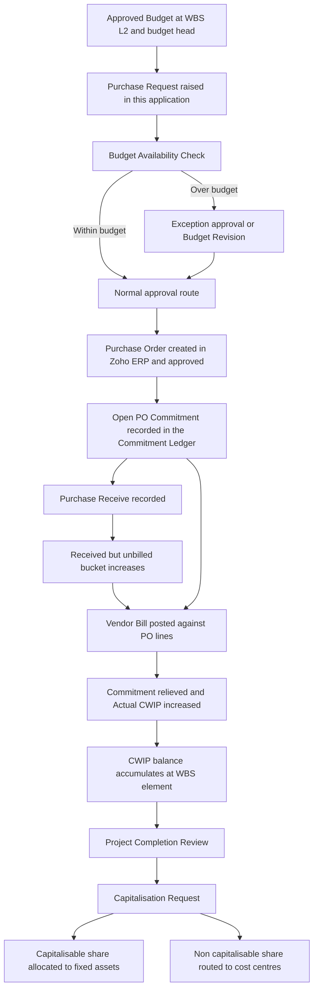
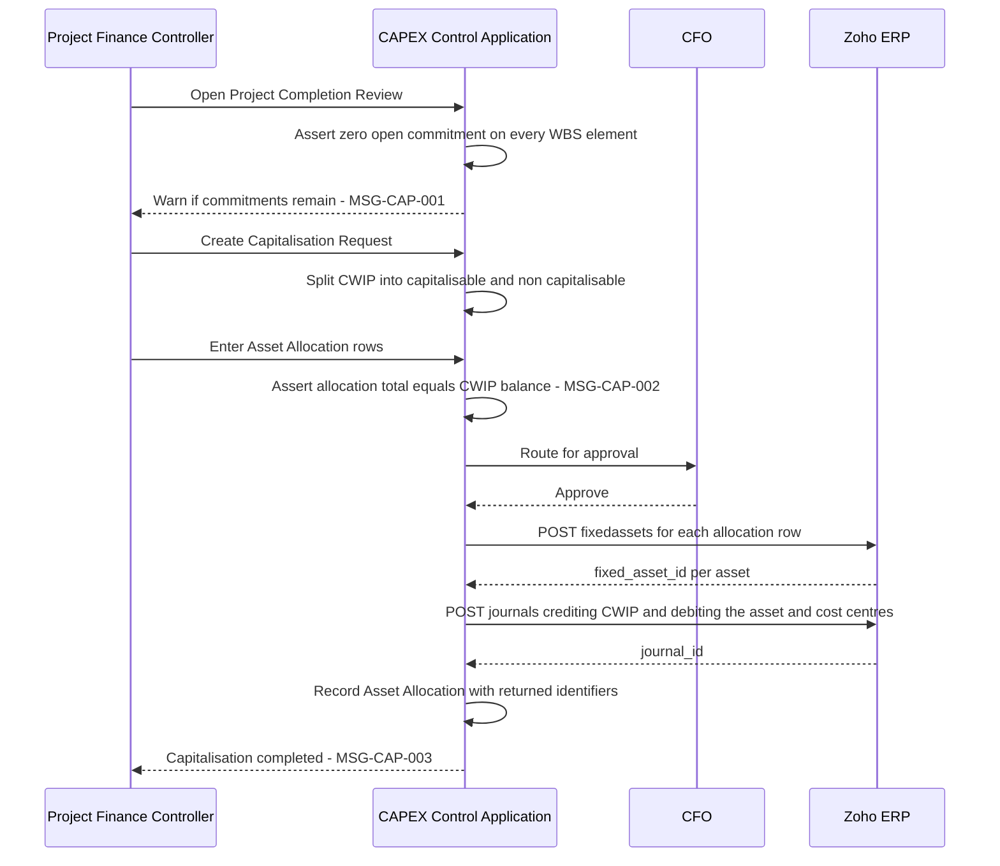

## 7. Manufacturing Plant CAPEX Use Cases

### 7.1 Purpose, provenance and how to read this section

This section takes the eleven budget heads of a greenfield manufacturing plant and walks each one end to end — approved budget, Purchase Request, Purchase Order, Goods Receipt, Vendor Bill, Actual CWIP, capitalisation — with the exposure arithmetic shown at every event. It exists so that a coding agent can implement §21 Detailed Business Rules and §22 Budget and Commitment Calculation Logic against concrete cases rather than against prose.

Provenance, stated once and binding on every figure below:

| Element | Provenance | Note |
|---|---|---|
| The four control measures (Approved Budget, Open PO Commitment, Actual CWIP, Available Budget) | CLIENT-PDF | REQ-BUD-007, REQ-BUD-014 |
| The availability formula and the frozen worked examples in 7.3 | CLIENT-PDF | Quoted verbatim from `C5_formulas.json`; never recomputed |
| The eleven budget-head names used as WBS elements | MASTER-PROMPT | The client document names only five heads (CONF-14) |
| The three-level WBS depth | MASTER-PROMPT | The client document contains no WBS hierarchy at all (CONF-02) |
| Every rupee figure for the illustrative project "New Manufacturing Plant - Phase 1" | DERIVED-RECOMMENDATION | Constructed for this blueprint. Not Atha Group data. See CONF-14 treatment |
| Tax, foreign-currency, retention, advance and landed-cost treatments | DERIVED-RECOMMENDATION | The client document is silent on all of them (CONF-15) |

The illustrative project is deliberately a *second* dataset. Per the CONF-14 treatment, the client's own five heads and their exact section 6 figures are reproduced unchanged as a separate project; the eleven-head greenfield project below is the extension. Do not merge them, and do not restate the client's five-head figures in the eleven-head taxonomy — "Consultancy & Other" is not "Consultancy and project management", and "Plant & Machinery" keeps the client's spelling wherever the client sees it.

Statuses used below come only from `C3_statuses.json`. Message identifiers come only from `C10_messages.json`. Screen references are to §48 Screen Catalogue and Navigation Map.

### 7.2 The illustrative greenfield project

| Attribute | Value |
|---|---|
| CAPEX / CWIP Code | CAPEX-2026-002 |
| Project Name | New Manufacturing Plant - Phase 1 |
| Company / Unit | Second Atha Group entity — **UNVERIFIED - REQUIRES CONFIRMATION** (the client document describes exactly one Company / Unit; CONF-07 and CONF-14 both ask for the real entity count) |
| Plant / Location | Greenfield site, second plant |
| Department | Manufacturing |
| Project Owner | Project Manager (role per `C9_roles.json`) |
| Original Budget | ₹48,00,00,000 |
| Current Approved Budget at closure | ₹48,00,00,000 |
| CWIP GL | One CWIP control account per budget head — see 7.4.12 |
| Project created | 06-Apr-2026 |
| Original Budget approved | 20-Apr-2026 |
| Plant available for intended use | 05-Mar-2027 |
| Capitalisation approved | 20-Mar-2027 |

WBS depth used throughout: **Level 1** = project (CAPEX-2026-002). **Level 2** = the eleven budget heads. **Level 3** = the work packages named inside each use case. Budget is carried at Level 2 in every case below; Level 3 elements are non-budget-carrying and roll their exposure up to their parent. That mirrors SAP's rule that costs on subordinate elements count toward the parent's assigned value only where the subordinate does not itself carry budget [source: https://help.sap.com/docs/SAP_S4HANA_ON-PREMISE/4dd8cb7b1c484b4b93af84d00f60fdb8/f711d553088f4308e10000000a174cb4.html — verified 2026-08-05] (SAP S/4HANA on-premise, Project System).

Original Budget by head, approved 20-Apr-2026:

| WBS L2 | Budget head | Original Budget | Share |
|---|---|---:|---:|
| 1 | Land and site development | ₹6,00,00,000 | 12.5% |
| 2 | Civil and structural work | ₹9,50,00,000 | 19.8% |
| 3 | Plant and machinery | ₹18,00,00,000 | 37.5% |
| 4 | Electrical | ₹3,20,00,000 | 6.7% |
| 5 | Utilities | ₹2,80,00,000 | 5.8% |
| 6 | Instrumentation and automation | ₹2,40,00,000 | 5.0% |
| 7 | Installation | ₹1,80,00,000 | 3.8% |
| 8 | Testing and commissioning | ₹90,00,000 | 1.9% |
| 9 | Consultancy and project management | ₹1,60,00,000 | 3.3% |
| 10 | Pre-operative expenses | ₹1,00,00,000 | 2.1% |
| 11 | Contingency | ₹80,00,000 | 1.7% |
| — | **TOTAL** | **₹48,00,00,000** | **100.0%** |

The head budgets sum exactly to the project budget, so there is no unallocated project reserve in this dataset. Whether Atha Group permits one is CONF-20 and is an open question; the design must support both (see §22).

### 7.3 The frozen client arithmetic these use cases obey

Every event table below satisfies the client's own invariant. The following are quoted verbatim from `C5_formulas.json` and are not restated, recomputed or re-expressed anywhere in this section:

> Exposure = Open PO Commitment + Actual CWIP
> Available Budget = Current Approved Budget - Exposure
> Utilisation % = Exposure / Current Approved Budget
> Current Approved Budget = Original Budget + Approved Supplements - Approved Returns +/- Approved Transfers

> **PDF section 7 over-budget example, verbatim:** 80L Budget - 35L Actual CWIP - 30L Open PO Commitment = 15L Available. A new PO of 20L exceeds available budget by 5L and must route to exception approval or budget revision.

> **Commitment-to-actual, part billed, verbatim:** po 20L; actual_bill 12L; open_commitment 8L; budget_exposure 20L.

> **Budget head - Civil, verbatim:** budget 25,00,000; commitment 5,00,000; actual 12,00,000; available 8,00,000.
> **Budget head - Plant & Machinery, verbatim:** budget 80,00,000; commitment 30,00,000; actual 35,00,000; available 15,00,000.

The seven anti-double-count rules from `C5_formulas.json` are the acceptance conditions for every table in 7.4:

1. A PO line contributes to commitment only for its UNBILLED balance.
2. A bill line converts commitment to actual for its own value; it never adds to both.
3. Budget exposure for a PO is unchanged by billing progress - only its split between commitment and actual moves.
4. PO cancellation before billing releases the whole commitment and reduces exposure to zero.
5. PO closure with residual releases only the unbilled residual.
6. Credit notes and bill reversals reduce actual and restore available budget.
7. Vendor advances are NOT actual CWIP unless the accounting policy and a source transaction support it.

To these the blueprint adds one anti-**under**-count rule, taken from the `commitment_reduction_gates` ruling in `C5_formulas.json`: commitment is relieved only by the event that also creates actual cost, and a separate **received-but-unbilled** bucket carries the gap so that no value falls between the two. SAP's own behaviour here is governed by two independent switches — the goods receipt indicator on the PO item decides whether commitment reduces at goods receipt or at invoice receipt [source: https://help.sap.com/docs/SAP_S4HANA_ON-PREMISE/4dd8cb7b1c484b4b93af84d00f60fdb8/1b7cd0531d8b4208e10000000a174cb4.html — verified 2026-08-05] (SAP S/4HANA on-premise, Project System), while the goods-receipt-non-valuated flag independently overrides it so that invoice information is used instead [source: https://help.sap.com/docs/SUPPORT_CONTENT/spmm/3362167804.html — verified 2026-08-05] (SAP support content, classic on-premise materials management). Our design does not replicate the two-switch behaviour; it relieves on the actual-creating event only, and reports the received-but-unbilled bucket separately.

### 7.4 The common money-flow spine

Every use case is an instance of this one flow. Where a head deviates, the deviation is named explicitly in the use case.

Ledger effect of each event, stated once so the use cases can be read as arithmetic rather than narrative:

| # | Event | Commitment Ledger | Actual Ledger | Received-but-unbilled | Exposure | Status transition |
|---|---|---|---|---|---|---|
| 1 | Budget approved | — | — | — | unchanged | Budget Line → Released |
| 2 | Purchase Request submitted | no entry (soft check default per CONF-10) | — | — | unchanged | Purchase Request Reference → Submitted |
| 3 | Availability check passes | — | — | — | unchanged | → Approved |
| 4 | Availability check fails | — | — | — | unchanged | → Exception Pending, MSG-BUD-001 |
| 5 | PO approved in Zoho ERP | +full PO line value | — | — | +PO value | WBS → Partially Committed |
| 6 | Purchase Receive posted | no change | no change | +received qty × PO line rate | unchanged | — |
| 7 | Vendor Bill posted against PO line | −billed value | +billed value | −billed value | **unchanged** | WBS → Partially Actualised |
| 8 | Bill posted with no PO reference | no change | +bill value | no change | +bill value | flagged for review |
| 9 | PO amended upward | +increment (revalidated) | — | — | +increment | MSG-PRC-001 |
| 10 | PO amended downward | −decrement | — | −decrement if received | −decrement | — |
| 11 | PO cancelled before billing | −full remaining | — | −full | −full | MSG-PRC-002 |
| 12 | PO closed with residual | −unbilled residual only | — | −residual | −residual | MSG-PRC-003 |
| 13 | Vendor credit / bill reversal | — | −credit value | — | −credit value | — |
| 14 | Vendor advance paid | no change | **no change** | — | unchanged | see rule 7 |
| 15 | Capitalisation posted | — | CWIP relieved | — | unchanged | WBS → Capitalised |

Rule 15 is deliberate: capitalisation moves value out of CWIP into a fixed asset but does **not** restore budget. The budget was consumed when the cost was incurred. Available Budget after capitalisation is the same as before it.

### 7.5 Use case UC-1 — Land and site development

**Control lesson:** two money flows into one head, one of which never passes through a Purchase Order.

**Budget:** ₹6,00,00,000. **Level 3 elements:** Land acquisition; Site levelling, filling and boundary wall.

**Distinctive treatment.** Land acquisition is a conveyance, not a procurement. There is no Purchase Request, no Purchase Order and therefore no commitment — the cost arrives as a single vendor bill or journal that must nonetheless carry the CAPEX code and budget head (REQ-SEC-002). This is exactly the case the client document leaves open ("PDF does not state treatment of bills booked WITHOUT a PO", REQ-CWIP-001). Our ruling: a bill line carrying a WBS code but no `purchaseorder_item_id` posts Actual CWIP with **zero** commitment relief, and is written to the Reconciliation Log for review rather than blocked.

Site development is a works contract on immovable property that is not plant and machinery, so input tax credit is blocked [source: https://www.indiacode.nic.in/show-data?abv=CEN&statehandle=123456789/1362&actid=AC_CEN_2_2_00042_201712_1517807328102&orgactid=AC_CEN_2_2_00042_201712_1517807328102&sectionId=5132&sectionno=17&orderno=18 — verified 2026-08-05]. The GST is therefore a cost and is capitalised, and the commitment must be recorded **gross of GST**.

**Money flow.**

| Date | Event | Document | Commitment | Actual CWIP | Received-unbilled | Exposure | Available |
|---|---|---|---:|---:|---:|---:|---:|
| 20-Apr-2026 | Budget released | Budget Line | 0 | 0 | 0 | 0 | ₹6,00,00,000 |
| 24-Apr-2026 | Site work PR ₹1,47,50,000 gross | PR | 0 | 0 | 0 | 0 | ₹6,00,00,000 |
| 02-May-2026 | Site work PO approved | PO | ₹1,47,50,000 | 0 | 0 | ₹1,47,50,000 | ₹4,52,50,000 |
| 18-May-2026 | Land conveyance bill, no PO | Bill | ₹1,47,50,000 | ₹4,20,00,000 | 0 | ₹5,67,50,000 | ₹32,50,000 |
| 30-Jun-2026 | Site work 40% certified and received | Receipt | ₹1,47,50,000 | ₹4,20,00,000 | ₹59,00,000 | ₹5,67,50,000 | ₹32,50,000 |
| 10-Jul-2026 | RA bill 1 ₹59,00,000 | Bill | ₹88,50,000 | ₹4,79,00,000 | 0 | ₹5,67,50,000 | ₹32,50,000 |
| 22-Sep-2026 | RA bill 2 ₹88,50,000, contract complete | Bill | 0 | ₹5,67,50,000 | 0 | ₹5,67,50,000 | ₹32,50,000 |

Note rows 5 to 7: exposure is constant at ₹5,67,50,000 across receipt and both bills. That is anti-double-count rule 3 in operation, and it is the single most important behaviour to assert in tests.

**Capitalisation.** ₹4,20,00,000 to a Land asset with no depreciation; ₹1,47,50,000 to a Land Improvements asset that is depreciated. Whether site development attaches to Land or to Land Improvements is an accounting-policy choice — **UNVERIFIED - REQUIRES CONFIRMATION**.

### 7.6 Use case UC-2 — Civil and structural work

**Control lesson:** blocked input tax credit changes the value of the budget itself; retention changes payment, not exposure.

**Budget:** ₹9,50,00,000, revised to ₹9,80,00,000 by transfer (see UC-11). **Level 3 elements:** Foundations and plinth; Superstructure and roofing; Flooring and finishes.

**Distinctive treatment.** Works contract services supplied for construction of immovable property other than plant and machinery are blocked credits [source: https://www.indiacode.nic.in/show-data?abv=CEN&statehandle=123456789/1362&actid=AC_CEN_2_2_00042_201712_1517807328102&orgactid=AC_CEN_2_2_00042_201712_1517807328102&sectionId=5132&sectionno=17&orderno=18 — verified 2026-08-05], and land, buildings and other civil structures are expressly excluded from the definition of plant and machinery [same source]. So the whole GST-inclusive value lands in CWIP.

**Money flow.** Main contract taxable value ₹7,50,00,000, GST at 18% ₹1,35,00,000, gross ₹8,85,00,000. Retention 10% of each certified bill.

| Date | Event | Commitment | Actual CWIP | Exposure | Available | Retention held |
|---|---|---:|---:|---:|---:|---:|
| 12-May-2026 | PO approved, gross | ₹8,85,00,000 | 0 | ₹8,85,00,000 | ₹65,00,000 | 0 |
| 31-Aug-2026 | RA bill 1, 30% = ₹2,65,50,000 | ₹6,19,50,000 | ₹2,65,50,000 | ₹8,85,00,000 | ₹65,00,000 | ₹26,55,000 |
| 30-Nov-2026 | RA bill 2, 45% = ₹3,98,25,000 | ₹2,21,25,000 | ₹6,63,75,000 | ₹8,85,00,000 | ₹65,00,000 | ₹66,37,500 |
| 31-Jan-2027 | RA bill 3, 25% = ₹2,21,25,000 | 0 | ₹8,85,00,000 | ₹8,85,00,000 | ₹65,00,000 | ₹88,50,000 |
| 09-Feb-2027 | Variation order ₹95,00,000 raised | — | — | — | shortfall ₹30,00,000 | — |
| 11-Feb-2027 | Transfer in from Contingency ₹30,00,000 | 0 | ₹8,85,00,000 | ₹8,85,00,000 | ₹95,00,000 | ₹88,50,000 |
| 12-Feb-2027 | Variation PO approved | ₹95,00,000 | ₹8,85,00,000 | ₹9,80,00,000 | 0 | ₹88,50,000 |
| 05-Mar-2027 | Variation billed in full | 0 | ₹9,80,00,000 | ₹9,80,00,000 | 0 | ₹98,00,000 |

**Two rules this case fixes.**

- **Retention does not reduce Actual CWIP.** The certified bill value is the actual; retention is a credit to a retention-payable account. If retention were netted off, CWIP would be understated by ₹98,00,000 at closure and the Ind AS 16 cost of the building would be wrong. Retention release is a payment event with no ledger effect in this application. Treatment is **UNVERIFIED - REQUIRES CONFIRMATION** (CONF-15 lists retention among the items absent from the client document).
- **The GST answer moves every figure.** Had input tax credit been recoverable on this contract, budget consumption would have been ₹7,50,00,000 rather than ₹8,85,00,000, and Available Budget at 31-Jan-2027 would have been ₹2,00,00,000 rather than ₹65,00,000 — a swing of ₹1,35,00,000 on one head. The variation order would then have passed without any transfer from Contingency. This is the numeric demonstration of CONF-15: whether Atha Group's approved CAPEX budgets are stated inclusive or exclusive of GST changes the value of every figure in the client's own sections 6, 7 and 12, and it must be answered before the POC dataset is loaded.

### 7.7 Use case UC-3 — Plant and machinery

**Control lesson:** recoverable tax, capital advances, and upward PO amendment with incremental revalidation.

**Budget:** ₹18,00,00,000. **Level 3 elements:** Main process line; Auxiliary machines; Spares capitalised with the asset.

**Distinctive treatment.** Plant and machinery is carved out of the blocked-credit provisions, so input tax credit is available and GST is **not** part of CWIP. Note the linked constraint: where depreciation is claimed on the tax component of the cost of capital goods, credit on that component is disallowed [source: https://www.indiacode.nic.in/show-data?abv=CEN&statehandle=123456789/1362&actid=AC_CEN_2_2_00042_201712_1517807328102&orgactid=AC_CEN_2_2_00042_201712_1517807328102&sectionId=5131&sectionno=16&orderno=17 — verified 2026-08-05]. The two treatments are mutually exclusive and the application must not allow both.

**Ruling for the commitment ledger.** Commitment is recorded at the **capitalisable value** of the PO line — that is, gross less recoverable tax — because that is what will become Actual CWIP. Recording commitment gross while actual arrives net would leave a permanent unrelievable residue on every PO. The Commitment Ledger and Actual Ledger therefore both carry three amounts: `gross_amount`, `tax_amount`, `net_amount`, with a `tax_recoverable` flag driven from the budget head. This satisfies the CONF-15 treatment (model it, make it configurable, leave it unconfirmed).

**Money flow.** Main line PO: taxable ₹12,00,00,000 + GST ₹2,16,00,000 = ₹14,16,00,000 gross, credit recoverable.

| Date | Event | Commitment | Actual CWIP | Capital advance | Exposure | Available |
|---|---|---:|---:|---:|---:|---:|
| 08-May-2026 | PO approved | ₹12,00,00,000 | 0 | 0 | ₹12,00,00,000 | ₹6,00,00,000 |
| 15-May-2026 | Advance 20% of gross paid ₹2,83,20,000 | ₹12,00,00,000 | 0 | ₹2,83,20,000 | ₹12,00,00,000 | ₹6,00,00,000 |
| 14-Oct-2026 | Consignment 1 received and billed, taxable ₹7,20,00,000 | ₹4,80,00,000 | ₹7,20,00,000 | ₹2,83,20,000 | ₹12,00,00,000 | ₹6,00,00,000 |
| 06-Nov-2026 | PO amended upward, extra gearbox taxable ₹1,50,00,000 | ₹6,30,00,000 | ₹7,20,00,000 | ₹2,83,20,000 | ₹13,50,00,000 | ₹4,50,00,000 |
| 20-Jan-2027 | Consignment 2 received and billed ₹6,30,00,000 | 0 | ₹13,50,00,000 | 0 | ₹13,50,00,000 | ₹4,50,00,000 |

**Three rules this case fixes.**

- **The advance is not CWIP.** Anti-double-count rule 7 says so, and Indian presentation rules agree: capital advances belong in other non-current assets and must not be included within capital work-in-progress [source: https://resource.cdn.icai.org/68982clcgc55147-gnd2.pdf — verified 2026-08-05]. The advance is shown on the WBS element as a separate memo column so the project controller can see cash committed, but it never enters Exposure. Zoho ERP has no `is_advance` flag — an advance is simply a vendor payment whose `bills[]` allocation array is empty — so the classification rule is ours to derive.
- **Amendment revalidates only the increment.** REQ-PO-008 requires revalidation on amendment. The check performed on 06-Nov-2026 is `1,50,00,000 <= available (6,00,00,000)`, not a re-check of the whole ₹13,50,00,000. Re-checking the whole PO would fail spuriously on any head that is legitimately near its limit. MSG-PRC-001 is raised on the increment.
- **Exposure is flat across billing.** Rows 3 and 5 both leave exposure at the PO total. Only the commitment/actual split moves.

**The frozen over-budget example belongs to this head.** The client's own worked case — quoted verbatim in 7.3 — is a Plant & Machinery case on the client's five-head project. It is reproduced there and not re-derived here.

**Capitalisation.** ₹13,50,00,000 to one fixed asset, Process Line 1, with componentisation applied where a part's cost is significant relative to the whole [source: https://resource.cdn.icai.org/46263indas36370.pdf — verified 2026-08-05]. Component split is an accounting-policy decision — **UNVERIFIED - REQUIRES CONFIRMATION**.

### 7.8 Use case UC-4 — Electrical

**Control lesson:** partial receipt running ahead of partial billing. This is the case Zoho ERP cannot answer on its own.

**Budget:** ₹3,20,00,000. **Level 3 elements:** HT and LT panels; Cabling and trays; Earthing and lightning protection.

**Money flow.** PO taxable ₹2,40,00,000, credit recoverable.

| Date | Event | Commitment | Actual CWIP | Received-unbilled | Exposure | Available |
|---|---|---:|---:|---:|---:|---:|
| 03-Jun-2026 | PO approved | ₹2,40,00,000 | 0 | 0 | ₹2,40,00,000 | ₹80,00,000 |
| 12-Sep-2026 | Receipt 1, 70% of quantity | ₹2,40,00,000 | 0 | ₹1,68,00,000 | ₹2,40,00,000 | ₹80,00,000 |
| 28-Sep-2026 | Bill 1 for 50% = ₹1,20,00,000 | ₹1,20,00,000 | ₹1,20,00,000 | ₹48,00,000 | ₹2,40,00,000 | ₹80,00,000 |
| 04-Nov-2026 | Receipt 2, remaining 30% | ₹1,20,00,000 | ₹1,20,00,000 | ₹1,20,00,000 | ₹2,40,00,000 | ₹80,00,000 |
| 19-Nov-2026 | Bill 2 for 50% = ₹1,20,00,000 | 0 | ₹2,40,00,000 | 0 | ₹2,40,00,000 | ₹80,00,000 |

**Why this is the hard case.** The received-but-unbilled figure — ₹48,00,000 on 28-Sep-2026, ₹1,20,00,000 on 04-Nov-2026 — is not obtainable from Zoho ERP. The specification shows that Purchase Receive line items expose only `description`, `item_id`, `item_order`, `line_item_id`, `name`, `quantity` and `unit`: no `purchaseorder_item_id`, no `project_id`, no reporting tags, no custom fields, and no rate [source: Zoho ERP OpenAPI bundle openapi-all.zip, sha256 E95A0399… — verified 2026-08-05]. The module also exposes only four operations — `POST /purchasereceives`, `GET /purchasereceives/{purchasereceive_id}`, `PUT /purchasereceives/{purchasereceive_id}`, `DELETE /purchasereceives/{purchasereceive_id}` — with no list or search endpoint [same source].

Consequences that the implementation must accept as given:

1. Receipt **value** does not exist in Zoho. Our GRN Line entity computes it as `received_quantity × matched PO line rate`, and the matched PO line is resolved by our own `item_id` plus `item_order` correlation, not by a Zoho-supplied key.
2. Receipts cannot be discovered by polling a list. Our Sync Cursor for receipts is driven from the PO side: for every PO in `Partially Committed` or `Fully Committed` state, poll the PO and follow whatever receipt identifiers it carries. Where that is insufficient, receipts are captured in this application at the point the storekeeper records them, and Zoho holds the inventory movement only.
3. The correlation is heuristic and can fail. Every failure raises MSG-PRC-005 and lands on SCR-27 Reconciliation Exception Queue with status `Reconciliation Pending`. It must never silently drop.

The opposite leg is sound and must not be confused with this one: bill line items **do** carry `purchaseorder_item_id`, so commitment-to-actual conversion and double-count prevention are achievable against documented fields [source: Zoho ERP OpenAPI bundle openapi-all.zip, sha256 E95A0399… — verified 2026-08-05].

### 7.9 Use case UC-5 — Utilities

**Control lesson:** one CWIP balance settling to several fixed assets.

**Budget:** ₹2,80,00,000. **Level 3 elements:** Diesel generating set; Air compressor and dryer; Cooling tower; Effluent treatment plant.

**Money flow.** Single PO, four line items, all received and billed in full by 15-Jan-2027.

| PO line | Equipment | Taxable value | Commitment at PO | Actual at final bill |
|---|---|---:|---:|
| 1 | Diesel generating set 750 kVA | ₹95,00,000 | ₹95,00,000 | ₹95,00,000 |
| 2 | Air compressor and dryer | ₹60,00,000 | ₹60,00,000 | ₹60,00,000 |
| 3 | Cooling tower | ₹45,00,000 | ₹45,00,000 | ₹45,00,000 |
| 4 | Effluent treatment plant | ₹50,00,000 | ₹50,00,000 | ₹50,00,000 |
| — | **Total** | **₹2,50,00,000** | **₹2,50,00,000** | **₹2,50,00,000** |

Available at closure: ₹30,00,000.

**Capitalisation.** The ₹2,50,00,000 CWIP balance allocates to four separate fixed assets, each with its own useful life, because each is a distinct item of plant. SAP models this with distribution rules whose key is either an equivalence number or a percentage rate [source: https://help.sap.com/doc/saphelp_sfin100/1.10/en-US/5d/a0a3519aa05f72e10000000a423f68/content.htm?no_cache=true — verified 2026-08-05] (classic SAP on-premise Asset Accounting). Our Capitalisation Request carries a set of Asset Allocation rows with the same two key types:

| Allocation row | Target asset | Basis | Key | Allocated amount |
|---|---|---|---:|---:|
| 1 | DG Set 750 kVA | Percentage | 38.0% | ₹95,00,000 |
| 2 | Air Compressor Package | Percentage | 24.0% | ₹60,00,000 |
| 3 | Cooling Tower | Percentage | 18.0% | ₹45,00,000 |
| 4 | Effluent Treatment Plant | Percentage | 20.0% | ₹50,00,000 |
| — | **Total** | — | **100.0%** | **₹2,50,00,000** |

The allocation total must equal the CWIP balance to the rupee; a mismatch raises MSG-CAP-002 and blocks. Each allocation row issues one `POST /fixedassets` call carrying `asset_name`, `asset_cost`, `asset_purchase_date`, `fixed_asset_type_id`, `depreciation_method`, `total_life` and `tags` [source: Zoho ERP OpenAPI bundle openapi-all.zip, sha256 E95A0399… — verified 2026-08-05]. There is no field on the fixed-asset create body that links back to a project, PO or bill, so the audit trail from asset to funding CWIP lives entirely in our Capitalisation Request and Asset Allocation records — see §9.

### 7.10 Use case UC-6 — Instrumentation and automation

**Control lesson:** imported goods — foreign-currency commitment, exchange-rate variance, customs duty, and landed-cost bills that arrive with no PO.

**Budget:** ₹2,40,00,000. **Level 3 elements:** DCS and PLC hardware; Field instruments; Configuration and licences.

**Money flow.** PO placed in EUR 2,00,000.

| Date | Event | Rate | Commitment ₹ | Actual CWIP ₹ | Exposure ₹ | Available ₹ |
|---|---|---:|---:|---:|---:|---:|
| 21-Jul-2026 | PO approved, EUR 2,00,000 | 96.50 | ₹1,93,00,000 | 0 | ₹1,93,00,000 | ₹47,00,000 |
| 04-Dec-2026 | Supplier invoice booked, EUR 2,00,000 | 98.20 | 0 | ₹1,96,40,000 | ₹1,96,40,000 | ₹43,60,000 |
| 04-Dec-2026 | Basic customs duty 5% capitalised | — | 0 | ₹2,06,22,000 | ₹2,06,22,000 | ₹33,78,000 |
| 09-Dec-2026 | Freight, insurance and CHA charges | — | 0 | ₹2,10,25,000 | ₹2,10,25,000 | ₹29,75,000 |

**Rules this case fixes.**

- **Commitment is relieved at the PO-date value, and the variance posts as additional actual.** Commitment relieved ₹1,93,00,000; actual booked ₹1,96,40,000; the ₹3,40,000 exchange difference increases exposure by exactly ₹3,40,000 and reduces Available Budget by the same. It is not netted, hidden or absorbed. This keeps anti-double-count rule 2 intact: the bill line converts its own committed value and separately adds only the variance.
- **Non-creditable duty is CWIP; creditable IGST is not.** Basic customs duty ₹9,82,000 is capitalised because it is a non-refundable purchase tax forming part of PPE cost [source: https://resource.cdn.icai.org/46263indas36370.pdf — verified 2026-08-05]. IGST on import of ₹37,11,960 is creditable and is excluded from CWIP entirely.
- **Landed-cost bills carry no PO.** The customs broker's and freight forwarder's bills reference no purchase order. They post Actual CWIP with zero commitment relief, exactly like the land conveyance in UC-1, and they must still carry the CAPEX code and budget head or they are rejected with MSG-BUD-004.

Foreign-currency policy, duty classification and the treatment of exchange variance are all **UNVERIFIED - REQUIRES CONFIRMATION** — the client document contains no reference to exchange rates, customs, duty or freight (CONF-15).

### 7.11 Use case UC-7 — Installation

**Control lesson:** services have no receipt leg, and a PO can close with residual.

**Budget:** ₹1,80,00,000. **Level 3 elements:** Mechanical erection; Alignment and grouting; Piping and supports.

**Money flow.** Milestone-billed service PO, taxable ₹1,60,00,000.

| Date | Event | Commitment | Actual CWIP | Received-unbilled | Exposure | Available |
|---|---|---:|---:|---:|---:|---:|
| 26-Aug-2026 | PO approved | ₹1,60,00,000 | 0 | **structurally 0** | ₹1,60,00,000 | ₹20,00,000 |
| 30-Nov-2026 | Milestone 1, 40% billed ₹64,00,000 | ₹96,00,000 | ₹64,00,000 | 0 | ₹1,60,00,000 | ₹20,00,000 |
| 18-Jan-2027 | Milestone 2, 35% billed ₹56,00,000 | ₹40,00,000 | ₹1,20,00,000 | 0 | ₹1,60,00,000 | ₹20,00,000 |
| 26-Feb-2027 | Scope reduced; PO closed with residual | 0 | ₹1,20,00,000 | 0 | ₹1,20,00,000 | ₹60,00,000 |

**Rules this case fixes.**

- **A service PO line sets `receipt_expected = false`.** The received-but-unbilled bucket for that line is defined as zero and is never computed. Without this flag the reconciliation engine would report a permanent unexplained gap of the full unbilled balance on every service contract in the project. The flag is derived from the PO line's `line_item_category` and the item master, and is overridable by Procurement.
- **Closure releases only the unbilled residual.** Anti-double-count rule 5. ₹40,00,000 is released, ₹1,20,00,000 of actual stays. MSG-PRC-003 is raised and the closure reason is mandatory. Contrast with UC-11's cancellation-before-billing case, which releases the whole commitment (rule 4).

### 7.12 Use case UC-8 — Testing and commissioning

**Control lesson:** the capitalisation cut-off, and the point at which further spend on the same budget head stops being CWIP.

**Budget:** ₹90,00,000. **Level 3 elements:** Commissioning engineers; Trial-run consumables and feedstock; Performance guarantee test.

**Money flow.**

| Date | Event | Commitment | Actual on head | of which capitalisable | of which expensed | Available |
|---|---|---:|---:|---:|---:|---:|
| 04-Jan-2027 | PO A commissioning services ₹55,00,000 | ₹55,00,000 | 0 | 0 | 0 | ₹35,00,000 |
| 04-Jan-2027 | PO B trial-run consumables ₹22,00,000 | ₹77,00,000 | 0 | 0 | 0 | ₹13,00,000 |
| 15-Feb-2027 | Trial run commences | ₹77,00,000 | 0 | 0 | 0 | ₹13,00,000 |
| 05-Mar-2027 | **Plant available for intended use** | ₹9,00,000 | ₹68,00,000 | ₹68,00,000 | 0 | ₹13,00,000 |
| 24-Mar-2027 | Post-readiness stabilisation billed ₹9,00,000 | 0 | ₹77,00,000 | ₹68,00,000 | ₹9,00,000 | ₹13,00,000 |

**Rules this case fixes.**

- **Two dates, not one.** Capitalisation into the carrying amount ceases when the item is in the location and condition necessary to operate as management intends [source: https://resource.cdn.icai.org/46263indas36370.pdf — verified 2026-08-05], and production costs incurred during a trial run to prove the plant is ready should be capitalised [same source], while costs incurred after that point must not be [same source]. The WBS element therefore carries a mandatory `ready_for_intended_use_date` — here 05-Mar-2027 — which is the switch that routes every subsequent actual to the expense path.
- **Budget still binds after the cut-off.** The ₹9,00,000 of post-readiness cost consumes the budget head exactly as capitalisable cost does, because the budget authorised the spend. Only the *capitalisation* step splits the two. This is a blueprint ruling, not a client statement, and it must be ratified: it is the practical form of the `cwip_settlement_qualifier` requirement in `C5_formulas.json` that the design model both the path to the asset and the path to cost centres.
- **Depreciation starts from the same date.** Depreciation begins when the asset is available for use [source: https://resource.cdn.icai.org/46263indas36370.pdf — verified 2026-08-05]. In SAP the asset value date, adjusted by the depreciation key's period control, determines the depreciation start date [source: https://help.sap.com/doc/saphelp_sfin100/1.10/en-US/97/36dd51e2193946e10000000a44538d/content.htm?no_cache=true — verified 2026-08-05] (classic SAP on-premise Asset Accounting). Our Capitalisation Request carries `capitalisation_date` and passes it to Zoho as `asset_purchase_date` and `depreciation_start_date`.

### 7.13 Use case UC-9 — Consultancy and project management

**Control lesson:** rate-based commitment with no fixed total, and the directly-attributable test applied to people cost.

**Budget:** ₹1,60,00,000. **Level 3 elements:** PMC fee; Owner's site team; Statutory and specialist consultants.

**Money flow.**

| Date | Event | Commitment | Actual on head | Capitalisable | Expensed | Available |
|---|---|---:|---:|---:|---:|---:|
| 27-Apr-2026 | PMC service PO, ceiling ₹1,20,00,000 | ₹1,20,00,000 | 0 | 0 | 0 | ₹40,00,000 |
| monthly | 15 invoices of ₹8,00,000 each | reduces pro rata | rises pro rata | full | 0 | ₹40,00,000 |
| 28-Feb-2027 | Final PMC invoice; ceiling fully drawn | 0 | ₹1,20,00,000 | ₹1,20,00,000 | 0 | ₹40,00,000 |
| 31-Mar-2027 | Site team salaries journal ₹18,00,000 | 0 | ₹1,38,00,000 | ₹1,38,00,000 | 0 | ₹22,00,000 |
| 31-Mar-2027 | Corporate overhead allocation ₹12,00,000 | 0 | ₹1,50,00,000 | ₹1,38,00,000 | ₹12,00,000 | ₹10,00,000 |

**Rules this case fixes.**

- **Commitment for a rate-based contract is the approved ceiling.** There is no quantity to receive and no fixed line value. The ceiling is committed at PO approval, relieved pro rata by each invoice, and any residual is released at contract close under rule 5. Without this, rate-based consultancy would consume no budget until the last invoice arrives — the exact overspend hole the client's control principle exists to close.
- **People cost splits on the directly-attributable test.** Employee benefit costs arising directly from the construction or acquisition of the item are directly attributable and capitalisable [source: https://resource.cdn.icai.org/46263indas36370.pdf — verified 2026-08-05], whereas administration and other general overhead costs are not costs of an item of property, plant and equipment [same source]. Site-dedicated salaries of ₹18,00,000 capitalise; the ₹12,00,000 corporate allocation does not. Both consume the budget head.
- **Journal-sourced actuals are first-class.** The two 31-Mar-2027 rows enter through a journal, not a bill. Journal line items carry `project_id` and `tags` [source: Zoho ERP OpenAPI bundle openapi-all.zip, sha256 E95A0399… — verified 2026-08-05], so a WBS-coded journal is a valid actual source. The Actual Ledger must accept three source types: bill line, journal line, and manual approved entry.
- **TDS does not change CWIP.** Tax deducted at source reduces the payment, not the cost. The gross invoice is the actual. Treatment is **UNVERIFIED - REQUIRES CONFIRMATION**.

### 7.14 Use case UC-10 — Pre-operative expenses

**Control lesson:** the head where most spend does **not** become an asset, and where the only capitalisable component arrives entirely by journal.

**Budget:** ₹1,00,00,000. **Level 3 elements:** Borrowing cost during construction; Statutory approvals and permits; Recruitment and pre-operative training; Pre-operative administration.

**Money flow.** No Purchase Request and no Purchase Order exist on this head. Commitment is permanently zero.

| Component | Amount | Treatment | Basis |
|---|---:|---|---|
| Borrowing cost on the project term loan during construction | ₹62,00,000 | Capitalised | Borrowing costs directly attributable to acquisition, construction or production of a qualifying asset form part of that asset's cost [source: https://resource.cdn.icai.org/62864asb50858.pdf — verified 2026-08-05] |
| Statutory approvals, consents and permits | ₹15,00,000 | Capitalised, subject to policy | Directly attributable cost of bringing the asset to the location and condition necessary to operate [source: https://resource.cdn.icai.org/46263indas36370.pdf — verified 2026-08-05] |
| Recruitment and pre-operative training | ₹14,00,000 | Expensed | Costs of opening a new facility are expressly not costs of an item of property, plant and equipment [same source] |
| Pre-operative administration | ₹9,00,000 | Expensed | Administration and other general overhead costs are not costs of PPE [same source] |
| **Total against budget head** | **₹1,00,00,000** | ₹77,00,000 capitalised, ₹23,00,000 expensed | — |

Available Budget at closure: ₹0. Utilisation 100.0%, so MSG-BUD-002 fired at 80% and MSG-BUD-003 at 90%.

**Two additional rules.**

- **Borrowing-cost capitalisation must suspend when construction suspends.** Capitalisation is suspended during extended periods in which active development of a qualifying asset is suspended [source: https://resource.cdn.icai.org/62864asb50858.pdf — verified 2026-08-05], but not where a temporary delay is a necessary part of getting the asset ready for use [same source]. The WBS element therefore carries suspension periods, and the same flag drives the Schedule III "projects temporarily suspended" disclosure in 7.16.
- **Pre-operative expenses and Contingency are policy-sensitive heads.** CONF-14 requires both to be flagged for client and auditor confirmation before they are treated as capitalisable CWIP heads. They carry different capitalisation rules from direct project cost, and this use case is the demonstration of why. Status: **UNVERIFIED - REQUIRES CONFIRMATION**.

### 7.15 Use case UC-11 — Contingency

**Control lesson:** a budget head that must never be spent directly, only transferred; and the cancellation and abandonment cases.

**Budget:** ₹80,00,000 original, ₹50,00,000 after transfer out.

**Configuration.** The Contingency budget head carries `procurement_blocked = true`. Any Purchase Request or Purchase Order line coded to it is rejected at entry. It has no CWIP GL and no capitalisation target of its own. Its only permitted movement is a Budget Transfer.

**Money flow.**

| Date | Event | Contingency budget | Contingency available | Effect elsewhere |
|---|---|---:|---:|---|
| 20-Apr-2026 | Original Budget approved | ₹80,00,000 | ₹80,00,000 | — |
| 09-Feb-2027 | Civil variation ₹95,00,000 fails the check against available ₹65,00,000 | ₹80,00,000 | ₹80,00,000 | MSG-BUD-001; Civil variation PR → Exception Pending |
| 11-Feb-2027 | Budget Transfer ₹30,00,000 approved, Contingency → Civil and structural work | ₹50,00,000 | ₹50,00,000 | Civil budget rises to ₹9,80,00,000; project total unchanged |
| 12-Feb-2027 | Civil variation PO revalidated and approved | ₹50,00,000 | ₹50,00,000 | Civil available falls to ₹0 |
| 20-Mar-2027 | Project closure; Contingency abandoned | ₹0 | ₹0 | Budget Return of ₹50,00,000; WBS element → Closed, never Capitalised |

**Three rules this case fixes.**

- **A transfer is net-zero one level up.** The project's Current Approved Budget is ₹48,00,00,000 before and after. That is the `current_approved_budget` formula in `C5_formulas.json` operating with a signed transfer, and it is the reason transfers are held as signed revision rows over the same versioned ledger rather than as edits to the budget figure (CONF-13 treatment).
- **A transfer out must not create negative availability at the source.** Contingency carries zero commitment, so ₹30,00,000 moves freely. Had it carried commitment, MSG-BUD-006 would block the transfer and state the maximum transferable amount. This is CONF-13's flagged edge case — transfer after commitment — and it must be implemented as a hard gate, not a warning.
- **An abandoned WBS element closes without capitalising.** The remaining ₹50,00,000 is returned, not written off, because it was never spent. The element moves `Released` → `Technically Completed` → `Closed` and never reaches `Awaiting Capitalisation`. This is the "one abandoned or cancelled WBS case" the POC dataset requires.

**Cancellation before billing, for completeness.** Where a PO on any head is cancelled before any bill is posted, the entire commitment is released and exposure returns to zero for that PO — anti-double-count rule 4, and the client's own fourth section 8 row. MSG-PRC-002 is raised. Contrast this with UC-7's closure-with-residual, where only the unbilled part is released.

### 7.16 Project roll-up and the capitalisation event

Position at 20-Mar-2027, immediately before capitalisation. Every row satisfies `Available = Current Approved Budget - (Open PO Commitment + Actual CWIP)`.

| WBS L2 | Budget head | Current Approved Budget | Open PO Commitment | Actual CWIP | Available | Utilisation |
|---|---|---:|---:|---:|---:|---:|
| 1 | Land and site development | ₹6,00,00,000 | ₹0 | ₹5,67,50,000 | ₹32,50,000 | 94.6% |
| 2 | Civil and structural work | ₹9,80,00,000 | ₹0 | ₹9,80,00,000 | ₹0 | 100.0% |
| 3 | Plant and machinery | ₹18,00,00,000 | ₹0 | ₹13,50,00,000 | ₹4,50,00,000 | 75.0% |
| 4 | Electrical | ₹3,20,00,000 | ₹0 | ₹2,40,00,000 | ₹80,00,000 | 75.0% |
| 5 | Utilities | ₹2,80,00,000 | ₹0 | ₹2,50,00,000 | ₹30,00,000 | 89.3% |
| 6 | Instrumentation and automation | ₹2,40,00,000 | ₹0 | ₹2,10,25,000 | ₹29,75,000 | 87.6% |
| 7 | Installation | ₹1,80,00,000 | ₹0 | ₹1,20,00,000 | ₹60,00,000 | 66.7% |
| 8 | Testing and commissioning | ₹90,00,000 | ₹0 | ₹77,00,000 | ₹13,00,000 | 85.6% |
| 9 | Consultancy and project management | ₹1,60,00,000 | ₹0 | ₹1,50,00,000 | ₹10,00,000 | 93.8% |
| 10 | Pre-operative expenses | ₹1,00,00,000 | ₹0 | ₹1,00,00,000 | ₹0 | 100.0% |
| 11 | Contingency | ₹50,00,000 | ₹0 | ₹0 | ₹50,00,000 | 0.0% |
| — | **TOTAL** | **₹48,00,00,000** | **₹0** | **₹40,44,75,000** | **₹7,55,25,000** | **84.3%** |

Note the Contingency row: it carries ₹50,00,000 of budget that was never allocatable to any asset, and it is why project-level utilisation of 84.3% is lower than the utilisation of every producing head except Plant and machinery, Electrical and Installation. A dashboard that reports only the project row hides this. SCR-02 Project Controller Workbench must therefore always show the head-level grid, never a single project figure.

**Capitalisation split.** Of the ₹40,44,75,000 of Actual CWIP:

| Path | Amount | Destination |
|---|---:|---|
| Capitalised to fixed assets | ₹40,00,75,000 | Land; Land Improvements; Factory Building; Process Line 1; Electrical Installation; DG Set 750 kVA; Air Compressor Package; Cooling Tower; Effluent Treatment Plant; Instrumentation and Control System; Erection and Installation (allocated) |
| Routed to cost centres and profit and loss | ₹44,00,000 | Post-readiness stabilisation ₹9,00,000; corporate overhead allocation ₹12,00,000; recruitment and pre-operative training ₹14,00,000; pre-operative administration ₹9,00,000 |
| **Total relieved from CWIP** | **₹40,44,75,000** | — |

That two-path split is not optional. `C5_formulas.json` records that a research lane wrongly asserted that 100 percent of debits go to the asset under construction, and rules that the design must model **both** the capitalisable debits to the asset and the debits routed to cost-object receivers that never reach it. The ₹44,00,000 row is the concrete form of that ruling. SAP expresses the same duality: the portion of an asset under construction that requires capitalisation must be settled to capitalised fixed assets [source: https://help.sap.com/doc/saphelp_me60/6.0.4/en-US/74/32ba538c95b54ce10000000a174cb4/content.htm?no_cache=true — verified 2026-08-05], while non-capitalisable parts may settle as adjustment postings to cost centres [source: https://help.sap.com/docs/SAP_ERP/b350210eef6443b6bb3a155840ff905c/5da0a3519aa05f72e10000000a423f68.html — verified 2026-08-05] (both classic SAP on-premise Asset Accounting).

**Capitalisation sequence.**

Two hard gates in that sequence. First, MSG-CAP-001 fires but does not block, because a project can legitimately capitalise with a small residual commitment on a warranty retention; the decision is the CFO's and the reason is mandatory. Second, MSG-CAP-002 blocks absolutely: an allocation that does not total the CWIP balance would leave an orphan balance with no owner.

### 7.17 Ind AS disclosure obligations these use cases must satisfy

The CWIP balance produced by this project is not only a control number; it is a disclosed number, and the data model must be able to produce the disclosure without a manual workbook.

| Disclosure | Requirement | What the data model must carry |
|---|---|---|
| CWIP ageing schedule | An ageing schedule shall be given for capital work-in-progress, using buckets less than 1 year, 1-2 years, 2-3 years and more than 3 years [source: https://resource.cdn.icai.org/68982clcgc55147-gnd2.pdf — verified 2026-08-05] | `initial_recognition_date` on every Actual Ledger row, because ageing runs from the date of initial recognition of each item of CWIP to the balance sheet date [same source] |
| Split by project state | Amounts split between projects in progress and projects temporarily suspended [same source] | A suspension flag with effective dates on the Project and WBS Element |
| Tally to the balance sheet | The total shall tally with the CWIP amount in the balance sheet [same source] | Reconciliation Log rows comparing our CWIP balance to the Zoho CWIP GL balance per period |
| Multiple buckets per project | A single CWIP project's balance can fall into several ageing buckets at one balance sheet date [same source] | Ageing at ledger-row level, never at project level |
| Completion schedule | Required for CWIP whose completion is overdue or which has exceeded its cost compared to its original plan [same source] | `original_plan_completion_date` and Original Budget preserved immutably, because subsequently revised plans are not used to determine variation [same source] |
| Assessment cadence | The assessment must be performed at each reporting date [same source] | A scheduled evaluation, not an on-demand report |
| Capital advances excluded | Capital advances belong in other non-current assets and must not be included within CWIP [same source] | The advance memo column of UC-3, held outside the Actual Ledger |

The immutability requirement in row 5 is the same requirement the client already states in its own key controls — no silent overwrite of the original approved budget (REQ-SEC-003) — arrived at from the disclosure side. It is worth telling Atha Group that their own control and their auditor's disclosure requirement are the same constraint.

### 7.18 Use-case to requirement and POC-step coverage

| Use case | Primary requirements exercised | POC steps demonstrated | Screens |
|---|---|---|---|
| UC-1 Land and site development | REQ-BUD-014, REQ-CWIP-001, REQ-SEC-002 | 1, 2, 3, 4, 5, 6, 7, 9, 10, 11, 12 | SCR-05, SCR-13, SCR-15, SCR-17 |
| UC-2 Civil and structural work | REQ-BUD-015, REQ-BILL-002, REQ-REV-002 | 5, 6, 8, 12, 16 | SCR-09, SCR-11, SCR-17, SCR-25 |
| UC-3 Plant and machinery | REQ-PO-001, REQ-PO-008, REQ-BUD-016 | 9, 10, 12, 13, 14 | SCR-15, SCR-18 |
| UC-4 Electrical | REQ-GRN-001, REQ-BILL-002, REQ-CWIP-001 | 11, 12, 13, 36 | SCR-16, SCR-18, SCR-27 |
| UC-5 Utilities | REQ-CAP-001, REQ-CAP-002 | 19, 20 | SCR-21, SCR-22 |
| UC-6 Instrumentation and automation | REQ-BUD-014, REQ-BILL-001 | 12, 13 | SCR-17, SCR-19 |
| UC-7 Installation | REQ-PO-009 | 15 | SCR-15, SCR-23 |
| UC-8 Testing and commissioning | REQ-CAP-001, REQ-PRJ-004 | 18, 19 | SCR-20, SCR-21 |
| UC-9 Consultancy and project management | REQ-BUD-016, REQ-BILL-001 | 10, 12 | SCR-15, SCR-19 |
| UC-10 Pre-operative expenses | REQ-CWIP-002, REQ-ALT-001, REQ-ALT-002 | 17 | SCR-19, SCR-24 |
| UC-11 Contingency | REQ-REV-001 to REQ-REV-007, REQ-PO-009 | 8, 15, 16, 18 | SCR-11, SCR-12, SCR-25 |

Requirements REQ-BUD-001 (the availability formula) and REQ-SEC-001 (the unbroken audit trail) are exercised by all eleven and are not repeated per row.

### 7.19 What these use cases deliberately do not settle

Six items are modelled above but are **not** confirmed, and the implementation must treat each as a configuration switch rather than a hard-coded rule:

1. Whether budgets are stated inclusive or exclusive of GST (UC-2, UC-3) — **UNVERIFIED - REQUIRES CONFIRMATION**, and it moves every figure in the client's own sections 6, 7 and 12.
2. Whether an approved Purchase Request reserves budget before a PO is raised (all use cases). The default implemented above is the client's own formula — a soft, advisory check with no reservation — with hard reservation available per entity or per project (CONF-10).
3. Whether Pre-operative expenses and Contingency are capitalisable heads at all (UC-10, UC-11) — **UNVERIFIED - REQUIRES CONFIRMATION**.
4. Whether the budget-head check or the project-level check binds when they disagree (CONF-20). The use cases above assume head-level binding.
5. Retention, capital advance, TDS, customs duty and exchange-variance treatment (UC-2, UC-3, UC-6, UC-9) — all **UNVERIFIED - REQUIRES CONFIRMATION**.
6. Whether commitment is recognised at PO creation or at PO approval in Zoho ERP, and how quickly the application learns of it (CONF-21). Every table above assumes recognition at approval, detected by incremental polling; the detection latency is a stated control limitation and is quantified in §27 Integration Reconciliation Design.
