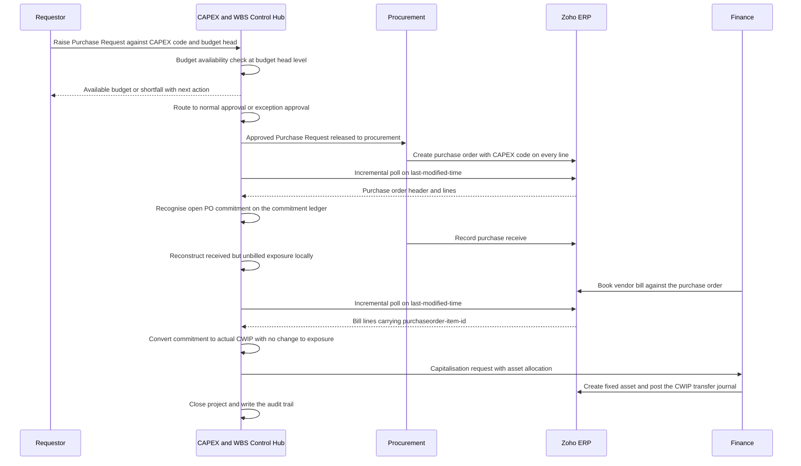

## 10. Target Operating Model

This section states who does what, in which system, at each stage of the CAPEX and CWIP lifecycle. It is the operating contract that §11 Architecture Options, §12 Recommended Architecture and §13 Source-of-Truth Matrix are built to support. Where a stage or a responsibility does not originate in the client requirement document it is tagged `provenance=MASTER-PROMPT` or `provenance=DERIVED-RECOMMENDATION` and is never presented as a confirmed client requirement.

### 10.1 The three systems in the target model

The blueprint refers to the application being designed as the **CAPEX and WBS Control Hub** (short form: **Control Hub**), following the naming used in the conflict register at CONF-01. There are three systems in the target operating model and no others.

| System | What it is | What it owns | What it must never own |
|---|---|---|---|
| CAPEX and WBS Control Hub | The independent, API-first application specified by this blueprint | CAPEX Project, WBS Element, Budget Head, Budget Version, Budget Line, Budget Revision, Approval Matrix, Approval Instance, Purchase Request, Commitment Ledger, Budget Ledger, Actual Ledger, Capitalisation Request, Asset Allocation, and every control decision | The general ledger. It posts no accounting entry of its own and holds no statutory book of account. |
| Zoho ERP | The client's accounting and procurement platform | Vendor master, item master, location master, Chart of Accounts, Purchase Order, Purchase Receive, Bill, Vendor Payment, Vendor Credit, Journal, Fixed Asset, and every accounting posting | Budget availability control, multi-level WBS, commitment arithmetic, PR approval routing. Zoho ERP computes none of these — see §10.9. |
| Zoho Analytics | The client's nominated management-reporting tier (client PDF section 10 and section 11; REQ-INT-013, REQ-INT-017) | Group-level and cross-source management reporting, if the client licenses it | Operational control reporting that must drill through to a source transaction. That stays in the Control Hub — CONF-08. |

**Binding rule, carried from CONF-05.** Zoho ERP remains the accounting and procurement system of record in every architecture option considered in §11. Nothing in this operating model moves a ledger, a purchase order or a vendor bill out of Zoho ERP.

**Binding rule, carried from OAS-02.** Purchase Request does not exist anywhere in the Zoho ERP API specification — a mechanically proven clean negative across all 78 modules, 561 paths and 163 scopes `[source: Zoho ERP OpenAPI bundle openapi-all.zip, sha256 E95A0399… — verified 2026-08-05]`. The Purchase Request is therefore owned by the Control Hub in every stage below. The client PDF's classification of Purchase Request as "Standard" (REQ-INT-001) refers to the Zoho ERP product feature, not to an API, and both statements can be true at once — CONF-01.

### 10.2 Operating principles

These five principles decide every allocation of responsibility in §10.4. A coding agent implementing the POC should treat a conflict with any principle below as a defect, not a design choice.

| # | Principle | Consequence in the design | Basis |
|---|---|---|---|
| P1 | A control decision is taken only in a system that can enforce it. | Budget availability is evaluated and enforced in the Control Hub, because Zoho ERP Projects carry only scalar `budget_amount`, `budget_type` and `cost_budget_amount` with no budget-by-head object (OAS-05). | OAS-05; REQ-BUD-004, REQ-BUD-015 |
| P2 | An accounting entry is posted only in the accounting system of record. | The Control Hub never posts to a ledger. Where CWIP-to-asset transfer requires a journal, the Control Hub composes it and Zoho ERP posts it. | CONF-05; REQ-BILL-001 |
| P3 | Every capital transaction carries the CAPEX code and the budget head at line level, not header level. | Bill headers do not carry `project_id`; bill lines and journal lines do (OAS-10). Purchase Order lines carry `project_id`, `tags`, `item_custom_fields`, `account_id` and `location_id` (OAS-04). All coding is line-level. | OAS-04, OAS-10; REQ-SEC-002 |
| P4 | Nothing is counted twice, and nothing falls between two counts. | The commitment ledger relieves commitment only on the event that also creates actual cost, and carries an explicit received-but-unbilled bucket so no value is in neither actual nor commitment. | C5 `commitment_reduction_gates`; REQ-PO-003, REQ-CWIP-001 |
| P5 | Every stage produces an audit record naming who, when, what changed and why. | Approval Instance, Audit Log and Connector Audit Log are written at every stage transition, including system-initiated ones. | REQ-SEC-001, REQ-SEC-004 |

### 10.3 Lifecycle stage model

Eighteen stages. Stages L01–L16 map onto the client document's ten-step workflow (REQ-PRJ-005); the mapping column shows exactly where each client step lands and which stages are additions.

| Stage | Name | Client workflow step | Provenance |
|---|---|---|---|
| L01 | Master data and connection readiness | Not in client workflow | MASTER-PROMPT (connector module, CONF-07) |
| L02 | CAPEX project creation | Step 1 — CAPEX Project Creation | CLIENT-PDF (REQ-PRJ-003) |
| L03 | WBS structuring | Not in client document at all | MASTER-PROMPT — **SCOPE ADDITION**, CONF-02 |
| L04 | Budget definition and approval | Step 2 — Budget Approval | CLIENT-PDF (REQ-BUD-005) |
| L05 | Budget release | Not in client document | DERIVED-RECOMMENDATION |
| L06 | Purchase Request raising | Step 3 — Purchase Request | CLIENT-PDF (REQ-PRC-001) |
| L07 | Budget availability check | Step 4 — Budget Availability Check | CLIENT-PDF (REQ-BUD-006) |
| L08 | PR approval or exception routing | Step 5 — PR / Exception Approval | CLIENT-PDF (REQ-PRC-002) |
| L09 | Purchase Order raising | Step 6 — Purchase Order | CLIENT-PDF (REQ-PO-002) |
| L10 | Commitment recognition | Step 6, second half | CLIENT-PDF (REQ-PO-001) |
| L11 | Goods receipt | Step 7 — Purchase Receive / GRN | CLIENT-PDF (REQ-GRN-001) |
| L12 | Vendor bill and actual CWIP | Step 8 — Vendor Bill / CWIP | CLIENT-PDF (REQ-BILL-001) |
| L13 | PO amendment, cancellation or closure | Not a numbered step; stated as controls in client section 13 | CLIENT-PDF (REQ-PO-008, REQ-PO-009) |
| L14 | Budget revision | Client section 9 (parallel to the main flow) | CLIENT-PDF (REQ-REV-001 to REQ-REV-007) |
| L15 | Project completion review | Step 9 — Project Completion | CLIENT-PDF (REQ-PRJ-004) |
| L16 | Capitalisation and asset allocation | Step 10 — Asset Capitalization | CLIENT-PDF (REQ-CAP-001) |
| L17 | Closure and controlled reopening | Implied by client section 13 reopening control | CLIENT-PDF (REQ-CAP-002) |
| L18 | Reconciliation, alerting and audit | Continuous; not a workflow step | CLIENT-PDF for alerts (REQ-ALT-001 to REQ-ALT-007); MASTER-PROMPT for reconciliation |

### 10.4 Stage-by-stage operating model

The master table. One row per stage. "System of action" is where the human or the scheduler does the work; "System of record" is where the resulting truth lives; "Result status" uses only the 21 permitted status labels.

| Stage | Trigger | Who acts (role) | System of action | System of record for the output | Screen | Result status | Requirement IDs | Messages |
|---|---|---|---|---|---|---|---|---|
| L01 Master data and connection readiness | Implementation, or a new Zoho organisation is onboarded | System Administrator | Control Hub setup wizard; manual configuration steps performed in the Zoho ERP UI | Zoho ERP for vendor, item, location and Chart of Accounts; Control Hub for the mapping | SCR-31, SCR-32, SCR-33, SCR-34, SCR-35 | n/a (configuration) | REQ-INT-006, REQ-INT-007 | MSG-INT-001, MSG-INT-005 |
| L02 CAPEX project creation | A capital project is approved outside the system | Project Manager creates; Project Finance Controller countersigns | Control Hub | Control Hub | SCR-04, SCR-05 | Draft then Submitted then Approved | REQ-PRJ-002, REQ-PRJ-003, REQ-PRJ-006 to REQ-PRJ-019 | MSG-GEN-002 |
| L03 WBS structuring — **SCOPE ADDITION** | Project approved and the entity has WBS enabled | Project Manager | Control Hub | Control Hub only. Zoho ERP has no equivalent — Projects are flat (OAS-05) | SCR-06, SCR-07, SCR-08 | Draft then Released | None. All WBS requirements carry source "MASTER PROMPT - NOT IN CLIENT PDF" (CONF-02) | — |
| L04 Budget definition and approval | Project approved | Project Manager prepares; Department Head, Plant Head, CAPEX Committee and CFO approve per the Approval Matrix | Control Hub | Control Hub | SCR-09, SCR-10 | Draft, Submitted, Under Review, Approved or Rejected or Returned | REQ-BUD-003, REQ-BUD-005, REQ-BUD-007 | MSG-BUD-004 |
| L05 Budget release | Budget approved | Project Finance Controller | Control Hub | Control Hub | SCR-09 | Released | DERIVED-RECOMMENDATION | — |
| L06 Purchase Request raising | A procurement need arises on a capital project | Requestor | Control Hub. **Not Zoho ERP** — there is no Purchase Request API (OAS-02) | Control Hub | SCR-14 | Draft then Submitted | REQ-PRC-001 | MSG-BUD-004 |
| L07 Budget availability check | PR submitted, and again immediately before PO raising | System (no human) | Control Hub | Control Hub Budget Ledger | SCR-13 | Unchanged, or Budget Exceeded | REQ-BUD-001, REQ-BUD-004, REQ-BUD-006, REQ-BUD-014, REQ-BUD-015, REQ-BUD-016 | MSG-BUD-001, MSG-BUD-002, MSG-BUD-003 |
| L08 PR approval or exception routing | Availability result known | Within budget: Department Head then Plant Head. Over budget: CAPEX Committee then CFO | Control Hub | Control Hub Approval Instance | SCR-03, SCR-14, SCR-25 | Approved, Rejected, Returned, or Exception Pending | REQ-PRC-002, REQ-BUD-018 | MSG-BUD-001, MSG-SEC-003 |
| L09 Purchase Order raising | PR approved | Procurement | Zoho ERP (created by the Control Hub through the API, or created by Procurement directly in Zoho ERP and matched back) | **Zoho ERP** | SCR-15 | Zoho status mirrored into the Purchase Order Reference | REQ-PO-002, REQ-INT-003 | — |
| L10 Commitment recognition | Zoho ERP purchase order status becomes approved or open | System | Control Hub Commitment Ledger | Control Hub | SCR-15 | Partially Committed or Fully Committed | REQ-PO-001, REQ-INT-009 | — |
| L11 Goods receipt | Goods or services received | Procurement records the receipt in Zoho ERP | Zoho ERP for the receipt document; **Control Hub for the received-but-unbilled exposure**, because receipt lines carry no link to a PO line and the module has no list endpoint (OAS-03) | SCR-16 | Unchanged. GRN does not release commitment (REQ-GRN-001) | REQ-GRN-001, REQ-INT-004 | MSG-PRC-005 |
| L12 Vendor bill and actual CWIP | Vendor bill booked in Zoho ERP | Finance | Zoho ERP posts; Control Hub converts commitment to actual | Zoho ERP for the posting; Control Hub for the Actual Ledger position | SCR-17, SCR-18, SCR-19 | Partially Actualised or Fully Actualised | REQ-BILL-001, REQ-BILL-002, REQ-CWIP-001, REQ-INT-005 | MSG-PRC-004 |
| L13 PO amendment, cancellation or closure | Purchase order changed in Zoho ERP | Procurement acts in Zoho ERP; System revalidates | Zoho ERP for the document; Control Hub for revalidation and release | SCR-15, SCR-18 | Recalculated commitment status; Budget Exceeded if the increment does not fit | REQ-PO-008, REQ-PO-009 | MSG-PRC-001, MSG-PRC-002, MSG-PRC-003 |
| L14 Budget revision | Budget Exceeded raised, or a planned re-baselining | Project Manager requests; CAPEX Committee and CFO approve | Control Hub | Control Hub Budget Revision and Budget Version | SCR-11, SCR-12 | Draft, Submitted, Approved or Rejected; affected transactions revalidated | REQ-REV-001 to REQ-REV-007, REQ-SEC-003, REQ-SEC-004 | MSG-BUD-005, MSG-BUD-006 |
| L15 Project completion review | Physical work complete | Project Manager proposes; Project Finance Controller and Plant Head confirm | Control Hub | Control Hub | SCR-20, SCR-23, SCR-24 | Technically Completed then Financially Completed | REQ-PRJ-004 | MSG-CAP-001 |
| L16 Capitalisation and asset allocation | Financially Completed, CWIP eligible | Project Finance Controller prepares; Finance and CFO approve; Finance executes in Zoho ERP | Control Hub for the request and the allocation; Zoho ERP for asset creation and the transfer journal | Control Hub for the Capitalisation Request and Asset Allocation; Zoho ERP for the Fixed Asset and the journal | SCR-21, SCR-22 | Awaiting Capitalisation then Capitalised | REQ-CAP-001, REQ-CAP-003 | MSG-CAP-002, MSG-CAP-003 |
| L17 Closure and controlled reopening | Capitalisation complete, or a reopening request | Project Finance Controller closes; CFO approves any reopening | Control Hub | Control Hub | SCR-05, SCR-28 | Closed, or Reopened | REQ-CAP-002 | MSG-PRC-006, MSG-SEC-003 |
| L18 Reconciliation, alerting and audit | Scheduled, and on every inbound sync | System; exceptions worked by System Administrator and Project Finance Controller; reviewed by Internal Auditor | Control Hub | Control Hub Reconciliation Log, Sync Log, Audit Log | SCR-26, SCR-27, SCR-28, SCR-38, SCR-39, SCR-40 | Integration Failed, Reconciliation Pending | REQ-SEC-001, REQ-ALT-001 to REQ-ALT-007 | MSG-INT-002, MSG-INT-003, MSG-INT-004, MSG-INT-006 |

### 10.5 Lifecycle sequence, showing every system boundary crossing

The diagram makes the two hard constraints visible. The Control Hub learns about a purchase order and a bill only by polling, because there is no webhook framework in the ERP REST API `[source: https://www.zoho.com/erp/api/v3/introduction/ — verified 2026-08-05]`; and the received-but-unbilled position is computed inside the Control Hub rather than read from Zoho, because receipt lines carry no purchase-order link (OAS-03).

### 10.6 Role-to-stage responsibility matrix

All thirteen roles from the frozen role registry. `A` = accountable (single owner of the outcome), `R` = responsible (does the work), `C` = consulted, `I` = informed. A blank cell means the role has no part in that stage.

| Role | L02 | L03 | L04 | L05 | L06 | L07 | L08 | L09 | L10 | L11 | L12 | L13 | L14 | L15 | L16 | L17 | L18 |
|---|---|---|---|---|---|---|---|---|---|---|---|---|---|---|---|---|---|
| Requestor | | | | | A/R | I | I | I | | | | | C | | | | |
| Project Manager | A/R | A/R | R | C | C | | C | | I | | | C | A/R | A/R | C | C | I |
| Plant Head | C | C | A | C | | | A | | I | | | I | C | A | C | I | I |
| Department Head | C | | R | | C | | R | | | | | | C | C | | | |
| Procurement | | | | | C | | I | A/R | I | A/R | C | A/R | | I | | I | I |
| Finance | | | C | | | | | | | | A/R | C | C | C | R | C | I |
| Project Finance Controller | R | C | C | A/R | | C | C | C | A | C | A | A | R | A | A/R | A/R | R |
| CAPEX Committee | C | | A | | | | A | | | | | | A | | C | | I |
| CFO | I | | A | | | | A | | | | | I | A | I | A | A | I |
| Management Approver | I | | C | | | | C | | | | | | C | I | I | I | I |
| System Administrator | | | | | | | | | C | | | | | | | | A/R |
| Internal Auditor | I | I | I | I | I | I | I | I | I | I | I | I | I | I | I | I | C |
| Read-only Management User | I | I | I | I | | | | | I | | I | I | I | I | I | I | I |

**Segregation-of-duties rules implied by this matrix.** These are control assertions, and §32 Security and Internal Controls carries their enforcement design.

| # | Rule | Why |
|---|---|---|
| SOD-1 | The Requestor who raises a Purchase Request may not approve it at any level. | Prevents self-authorised commitment. |
| SOD-2 | The role that approves a budget revision may not be the role that requested it. | REQ-SEC-004 requires requestor and approver to be separately recorded, which is meaningless if they can be the same person. |
| SOD-3 | Procurement raises purchase orders but never approves budget or budget revisions. | Keeps the commitment-creating role outside the budget-granting role. |
| SOD-4 | The System Administrator has no approval authority at any stage and cannot alter a Budget Ledger, Commitment Ledger or Actual Ledger row. | The connector operator must not be able to move control values. |
| SOD-5 | The Internal Auditor is read-only at every stage, including the audit trail itself. | Audit records must not be alterable by the auditor. |

### 10.7 Decision rights: which system decides what

| Decision | Decided in | Never decided in | Enforcement point | Basis |
|---|---|---|---|---|
| Is this Purchase Request within budget? | Control Hub | Zoho ERP | PR submission and PR approval | REQ-BUD-006; OAS-05 |
| Who approves this Purchase Request? | Control Hub Approval Matrix | Zoho ERP | PR approval routing | REQ-PRC-002 |
| Is this purchase order allowed to exist? | Control Hub, before the PO is raised | Zoho ERP | Pre-PO revalidation at L09 | REQ-BUD-004; CONF-21 |
| What is the open PO commitment? | Control Hub Commitment Ledger, derived from Zoho purchase order lines | Zoho ERP — it computes no commitment | Continuous | Glossary: "Not computed by Zoho — derived by this application from purchase order lines" |
| What is actual CWIP? | Zoho ERP posting; the Control Hub mirrors it | Control Hub does not decide it | On bill sync | REQ-BILL-001 |
| Is the vendor bill correctly matched to a PO line? | Control Hub, using `purchaseorder_item_id` on the bill line | — | On bill sync | OAS-03 |
| How much has been received but not billed? | Control Hub, reconstructed locally | Zoho ERP cannot answer this | Continuous | OAS-03 |
| Which fixed asset does CWIP settle to? | Control Hub Capitalisation Request and Asset Allocation | Zoho ERP holds no link from asset to source project (OAS-09) | At L16 | OAS-09; REQ-CAP-001 |
| What is the accounting entry? | Zoho ERP | Control Hub | At L12 and L16 | Principle P2 |
| Which Zoho organisation does this project belong to? | Control Hub Zoho Organisation Mapping | — | At L02 | CONF-07 |

### 10.8 The control window: what the operating model cannot promise

CONF-21 is an unresolved ambiguity and this operating model surfaces it rather than hiding it. Commitment is recognised when the Zoho ERP purchase order reaches approved or open status. The Control Hub detects that by incremental polling, because `GET /purchaseorders` accepts a `last_modified_time` query parameter `[source: Zoho ERP OpenAPI bundle openapi-all.zip, sha256 E95A0399… — verified 2026-08-05]` and because the ERP REST API exposes no webhook framework `[source: https://www.zoho.com/erp/api/v3/introduction/ — verified 2026-08-05]`.

| Property | Value | Note |
|---|---|---|
| Detection mechanism | Incremental poll of `GET /purchaseorders` filtered on `last_modified_time`, with a look-back window | Only mechanism evidenced in the specification |
| Optional accelerator | A workflow-action webhook configured manually in the Zoho ERP user interface, which can call the Control Hub on a purchase order event | Zoho ERP documents webhooks as a workflow action configured through Settings, with method PUT, POST or DELETE and POST as the default, and an optional secret token of 12 to 50 alphanumeric characters `[source: https://www.zoho.com/en-in/erp/help/automation/workflow-actions/webhooks.html — verified 2026-08-05]`. There is no API to create or manage them. |
| Exposure window, POC | One polling interval | Recommended POC interval: 15 minutes, manual trigger also available |
| Exposure window, production | One polling interval, or near-zero where a workflow webhook is configured and delivered | Webhook delivery is not guaranteed, so polling remains the system of truth |
| What can happen inside the window | A purchase order can be approved in Zoho ERP and consume budget that the Control Hub has not yet seen | This is a stated control limitation, not a defect |
| Compensating control | The pre-PO revalidation at L09 runs against the Control Hub ledger immediately before the purchase order is raised; and the reconciliation job at L18 detects any purchase order that appeared without a matching approved Purchase Request | REQ-PO-008 revalidation; §27 Integration Reconciliation Design |

**Open question carried forward.** Whether a draft purchase order should consume budget is a client decision, not a research finding — CONF-21. The default in this operating model is that it does not.

### 10.9 What Zoho ERP does not do in this model, and why

Stated plainly so that the client's own proposal (build inside Zoho ERP, client PDF cover and section 10) is answered on facts rather than preference — CONF-05.

| Capability the operating model needs | Available in Zoho ERP? | Evidence |
|---|---|---|
| A Purchase Request that can be created, approved and read through an API | No. Zero matching paths, modules and scopes across the whole specification | OAS-02 `[source: Zoho ERP OpenAPI bundle openapi-all.zip, sha256 E95A0399… — verified 2026-08-05]` |
| Multi-level WBS carrying budget | No. Projects are flat; nesting exists only under Tasks via `parent_id`, and Project carries only scalar budget fields | OAS-05 |
| Budget by budget head within a project | No. `budget_amount`, `budget_type` and `cost_budget_amount` are scalars with no budget-by-head object | OAS-05 |
| Open PO commitment as a computed value | No. The commitment figure is derived by this application from purchase order lines | C2 glossary, Open PO Commitment |
| Received-but-unbilled exposure | No. Purchase receive lines expose only description, item id, item order, line item id, name, quantity and unit — no purchase order line link, no project or tag coding — and the module has no list or search endpoint | OAS-03 |
| Provisioning the CAPEX and WBS custom fields as code | No. Custom-field endpoints set values on an existing record; there is no endpoint that creates a field definition | OAS-06 |
| A link from a fixed asset back to the project or bill that funded it | No. The create body carries no source linkage field, and the list endpoint offers no last-modified filter | OAS-09 |
| Line-level CAPEX coding on purchase orders | **Yes.** PO lines carry `project_id`, `tags`, `item_custom_fields`, `account_id` and `location_id` | OAS-04 |
| Line-level matching from bill back to purchase order | **Yes.** Bill lines carry `purchaseorder_item_id` | OAS-03 |
| Line-level CAPEX coding on journals | **Yes.** Journal lines carry `project_id` and `tags` | OAS-10 |
| Approval actions on purchase orders and bills | **Yes.** `POST /purchaseorders/{purchaseorder_id}/approve`, `POST /purchaseorders/{purchaseorder_id}/submit`, `POST /purchaseorders/{purchaseorder_id}/reject`, `POST /bills/{bill_id}/approve`, `POST /bills/{bill_id}/submit` | `[source: Zoho ERP OpenAPI bundle openapi-all.zip, sha256 E95A0399… — verified 2026-08-05]` |

### 10.10 The availability check, stated once for the whole operating model

Every stage that consults budget uses one calculation and one frozen worked example. The formulas are reproduced from the frozen registry and are not restated in other numbers anywhere in this blueprint.

- Exposure = Open PO Commitment + Actual CWIP
- Available Budget = Current Approved Budget - Exposure
- Utilisation % = Exposure / Current Approved Budget
- Current Approved Budget = Original Budget + Approved Supplements - Approved Returns +/- Approved Transfers

Frozen worked example, quoted verbatim from the client document via the formula registry:

> 80L Budget - 35L Actual CWIP - 30L Open PO Commitment = 15L Available. A new PO of 20L exceeds available budget by 5L and must route to exception approval or budget revision.

That case is exactly stage L07 producing a Budget Exceeded result and stage L08 routing to the CAPEX Committee, with MSG-BUD-001 shown to the Requestor. §22 Budget and Commitment Calculation Logic carries the full arithmetic including the seventeen commitment-to-actual positions.

**Binding level of the check.** Budget-head availability is the binding check; the project-level check becomes meaningful only where an unallocated project reserve exists. The client document leaves this ambiguous, and CONF-20 records it as an open question rather than a settled rule.

**PR reservation.** Whether an approved Purchase Request reserves budget before a purchase order exists is a configurable control, defaulting to the client's stated behaviour: advisory check at PR with no reservation. CONF-10 records this as a client decision and §21 Detailed Business Rules models both variants.

### 10.11 Degraded-mode operating model

The operating model must keep working when Zoho ERP is unreachable, rate-limited or mid-incident. Zoho ERP publishes 100 requests per minute per organization `[source: https://www.zoho.com/erp/api/v3/introduction/ — verified 2026-08-05]`, a concurrent limiter described as the maximum number of API calls that can be simultaneously active for an organization at any given point in time, with 10 concurrent calls as a soft limit on all plans and 5 on trial plans, and a daily plan quota of 2,000 requests per day on Standard and 10,000 on Premium for the India offering `[source: https://www.zoho.com/erp/api/v3/introduction/ — verified 2026-08-05]`.

| Condition | What still works | What stops | Who is told | Recovery |
|---|---|---|---|---|
| Zoho ERP unreachable | L02 to L08 and L14 in full. Budget control, PR raising, approvals and revisions are entirely local. | L09 purchase order creation; inbound sync of purchase orders, receipts and bills | System Administrator via SCR-38; Project Finance Controller via SCR-26 | Queue outbound calls; resume incremental poll from the stored Sync Cursor with a look-back window |
| Rate limit reached (HTTP 429, body code 1070 or code 44) | Everything local; sync continues at reduced rate | Nothing is lost; pending records queue | MSG-INT-003 to System Administrator | Exponential backoff with jitter; concurrency capped below the soft limit |
| Daily quota exhausted (HTTP 429) | Everything local | All Zoho traffic until the quota window resets | MSG-INT-003 | Defer non-critical sync classes; prioritise purchase order and bill polling over master-data refresh |
| Token can no longer refresh | Everything local | All Zoho traffic | MSG-INT-002 to System Administrator | Re-authorise through SCR-32 |
| Reconciliation difference beyond tolerance | Everything | Affected reports are marked Reconciliation Pending | MSG-INT-006 to Project Finance Controller | Worked through SCR-27 |

**Consequence to state to the client.** Because the Control Hub owns the Purchase Request and the budget check, a Zoho ERP outage never blocks capital-request governance. It only defers purchase order creation. This is a direct benefit of the independent-application direction and is one of the justifications carried into §12 Recommended Architecture.

### 10.12 Handoff contracts at each system boundary

Each row is a contract a coding agent can implement against. Field-level payloads are in §19 Field, Custom-Field and Reporting-Tag Mapping and §18 Bidirectional Data-Flow Matrix.

| # | Boundary crossing | Direction | Carried | Method | Frequency | Idempotency key |
|---|---|---|---|---|---|---|
| H1 | Vendor, item, location, Chart of Accounts, tax, currency master into the Control Hub | Zoho ERP to Control Hub | Master records for selection lists and validation | `GET /contacts`, `GET /items`, `GET /locations`, `GET /chartofaccounts`, `GET /settings/taxes`, `GET /settings/currencies` | Scheduled full or incremental refresh; `chartofaccounts` supports `last_modified_time`, `contacts` and `items` do not | Zoho record id |
| H2 | Approved Purchase Request to procurement | Control Hub to Procurement, then to Zoho ERP | PR number, CAPEX code, budget head, WBS code, lines, approved value | `POST /purchaseorders` with CAPEX coding on every line, or manual creation in Zoho ERP followed by match-back | On PR approval | Control Hub PR line id, written to a purchase order line custom field |
| H3 | Purchase order into the Control Hub | Zoho ERP to Control Hub | Header, lines, status, `project_id`, `tags`, `item_custom_fields` | `GET /purchaseorders` filtered on `last_modified_time`, then `GET /purchaseorders/{purchaseorder_id}` for lines | Every polling interval | `purchaseorder_id` plus line id |
| H4 | Purchase receive into the Control Hub | Zoho ERP to Control Hub | Receipt header and lines | `GET /purchasereceives/{purchasereceive_id}` only. **There is no list endpoint** (OAS-03), so receipt ids must be discovered from the purchase order or captured at creation time | Event-driven on discovery | `purchasereceive_id` |
| H5 | Vendor bill into the Control Hub | Zoho ERP to Control Hub | Header, lines including `purchaseorder_item_id`, `project_id`, `tags` | `GET /bills` filtered on `last_modified_time`, `purchaseorder_id` or `project_id`, then `GET /bills/{bill_id}` | Every polling interval | `bill_id` plus `line_item_id` |
| H6 | CAPEX and WBS reference onto a Zoho transaction | Control Hub to Zoho ERP | CAPEX code, WBS code, budget head, on the line | `PUT /purchaseorders/{purchaseorder_id}`, or `PUT /purchaseorder/{purchaseorder_id}/customfields` | On PR-to-PO conversion, and on correction | Control Hub outbound event id |
| H7 | Capitalisation into Zoho ERP | Control Hub to Zoho ERP | Asset name, cost, asset account, type, depreciation attributes; then the CWIP transfer journal WBS-coded at line level | `POST /fixedassets`; `POST /journals` with `project_id` and `tags` on each line | On capitalisation approval | Capitalisation Request id plus Asset Allocation id |
| H8 | Control data to Zoho Analytics — **optional tier** | Control Hub to Zoho Analytics | Budget, commitment, actual, available by project, plant, department and budget head | **UNVERIFIED - REQUIRES ZOHO CONFIRMATION** — no Zoho Analytics ingestion path was verified in this engagement's evidence base | On schedule | To be defined once the tier is confirmed |

### 10.13 What this operating model deliberately excludes

| Excluded | Why | Where it is recorded |
|---|---|---|
| Scheduling, networks and activities | This is a financial control system, not a scheduling tool | C2 glossary, "Network / Activity — Not implemented" |
| Posting accounting entries from the Control Hub | Principle P2 | §23 Accounting Design |
| A tax policy | The client document contains no reference to GST, input tax credit, TDS, TCS, duty, freight, exchange rate, advance or retention, and does not state whether budgets are tax-inclusive | CONF-15 — blocking clarification |
| A statement of how many legal entities and plants exist | The client document describes exactly one Company / Unit and one Plant / Location; the POC data set requires two of each | CONF-14, CONF-07 |
| Replacing Zoho Analytics | The client nominated it; the blueprint adds an operational reporting tier rather than replacing the management tier | CONF-08 |
| Any claim that Atha Group users have SAP experience | The string SAP does not appear anywhere in the client document | CONF-06 — the SAP-familiar interface is a master-prompt design direction, not a client requirement |
