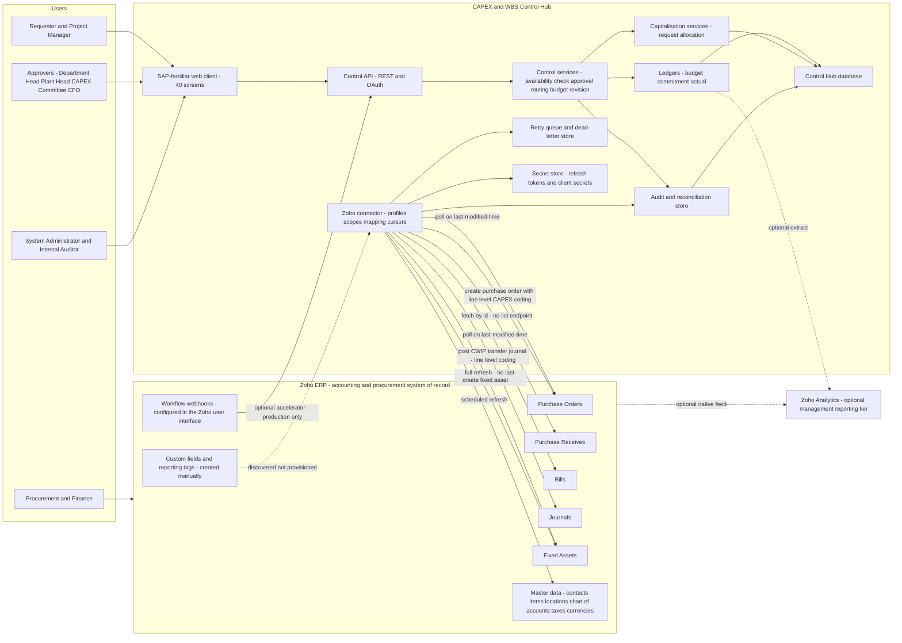

## 12. Recommended Architecture

### 12.1 The recommendation

| | POC | Production |
|---|---|---|
| **Recommended option** | **Option A — Standalone custom web application integrated with Zoho ERP** | **Option C — Hybrid architecture** |
| Weighted score from §11 Architecture Options | 450 of 500 (90.0%) | 445 of 500 (89.0%) |
| What it is in one sentence | The CAPEX and WBS Control Hub owns the budget register, the WBS, the Purchase Request and every control decision; Zoho ERP is reached only over its REST API by polling | The same Control Hub core, plus a small set of Zoho-native components configured in the Zoho ERP user interface to reduce detection latency and give procurement staff visibility in their own tool |
| What changes between them | Nothing in the control core. Production adds four Zoho-side components and hardens operations. | See §12.7 |
| What is deliberately unchanged in both | Zoho ERP remains the accounting and procurement system of record | CONF-05 |

This is a recommendation, not a confirmed client requirement. The client's own document proposed Option D, configuration and controlled customization inside Zoho ERP (CONF-05). §12.2 states the specific verified facts that lead away from it.

### 12.2 Justification, tied to evidence

Each row is a design decision, the evidence that forces it, and the consequence if the decision were made the other way. No row rests on preference.

| # | Decision | Evidence | Consequence of deciding otherwise |
|---|---|---|---|
| J1 | The Purchase Request is owned by the Control Hub, not by Zoho ERP | Purchase Request does not exist anywhere in the official ERP API specification. Zero matching paths, zero matching modules, zero matching scopes, searched across all 78 modules, 561 paths and 163 scopes (OAS-02) `[source: Zoho ERP OpenAPI bundle openapi-all.zip, sha256 E95A0399… — verified 2026-08-05]` | The record that the entire control cycle hangs from would be programmatically unreachable. Budget checking at PR, approval routing, exception routing and PR-level reporting would all be confined to the product user interface. |
| J2 | The budget register — project, WBS, budget head, versions, revisions — is owned by the Control Hub | Zoho ERP Projects are flat and carry only scalar `budget_amount`, `budget_type` and `cost_budget_amount`, with no budget-by-head object; nesting exists only under Tasks via `parent_id` (OAS-05) `[source: Zoho ERP OpenAPI bundle openapi-all.zip, sha256 E95A0399… — verified 2026-08-05]` | Budget at budget-head level — the client's own section 6 requirement, REQ-BUD-003 and REQ-BUD-007 — would have to be rebuilt by hand inside Zoho custom modules and custom functions, and multi-level WBS would be impossible. |
| J3 | CAPEX code, WBS code and budget head are carried at **line** level on every Zoho transaction | Purchase order lines carry `project_id`, `tags`, `item_custom_fields`, `account_id` and `location_id` (OAS-04). Bill headers do **not** carry `project_id`; bill lines do, and journal lines carry `project_id` and `tags` (OAS-10) `[source: Zoho ERP OpenAPI bundle openapi-all.zip, sha256 E95A0399… — verified 2026-08-05]` | Header-level coding would lose the ability to split one purchase order or one bill across budget heads, which the client's five-head structure makes routine. |
| J4 | Commitment-to-actual conversion is matched on `purchaseorder_item_id` carried on the bill line | Bill lines carry `purchaseorder_item_id`; the PO-to-bill leg of line-level matching is intact (OAS-03) `[source: Zoho ERP OpenAPI bundle openapi-all.zip, sha256 E95A0399… — verified 2026-08-05]` | Matching would fall back to header totals, and REQ-PO-003, no double counting, could not be demonstrated at line level. |
| J5 | Received-but-unbilled exposure is reconstructed inside the Control Hub and carried as an explicit bucket | Purchase receive lines expose only description, item id, item order, line item id, name, quantity and unit — no purchase order line link and no project, tag or custom-field coding — and the module has no list or search endpoint (OAS-03) `[source: Zoho ERP OpenAPI bundle openapi-all.zip, sha256 E95A0399… — verified 2026-08-05]` | The anti-under-count control would fail. Value could sit in neither commitment nor actual, which is the dangerous case named in the frozen formula registry. |
| J6 | Custom-field definitions are a documented manual prerequisite, discovered by the connector, never provisioned by it | There is no API to create a custom field definition; the custom-field paths set values on existing records only (OAS-06) `[source: Zoho ERP OpenAPI bundle openapi-all.zip, sha256 E95A0399… — verified 2026-08-05]` | A setup wizard that promises to provision fields would fail at the first organisation. |
| J7 | The connection profile resolves the API base path **per module**, not per connection | The ERP API is not uniformly `/erp/v3`. 14 of 78 modules are served from `/erp/v1`, including `departments` and `receipts` (OAS-01) `[source: Zoho ERP OpenAPI bundle openapi-all.zip, sha256 E95A0399… — verified 2026-08-05]` | Every call to a v1 module would 404, and the failure would look like a permissions problem rather than a routing problem. |
| J8 | Inbound ingestion is polling on `last_modified_time` with a stored cursor and a look-back window; webhooks are a conditional accelerator only | No webhook framework is exposed in the ERP REST API `[source: https://www.zoho.com/erp/api/v3/introduction/ — verified 2026-08-05]`. Webhooks exist as a workflow action configured in the user interface, with PUT, POST or DELETE and POST as the default, and an optional secret token of 12 to 50 alphanumeric characters `[source: https://www.zoho.com/en-in/erp/help/automation/workflow-actions/webhooks.html — verified 2026-08-05]` | An event-driven design would have no delivery guarantee and no replay, and would silently miss changes. |
| J9 | Capitalisation reconciliation is anchored on the Control Hub's own Capitalisation Request and Asset Allocation; asset sync is full-refresh | Fixed assets carry no link to a source project, purchase order or bill, and the list endpoint offers no `last_modified_time` filter (OAS-09) `[source: Zoho ERP OpenAPI bundle openapi-all.zip, sha256 E95A0399… — verified 2026-08-05]` | The last step of the client's own ten-step workflow would be untraceable, and REQ-SEC-001's unbroken trail through to final capitalisation would break. |
| J10 | Sync design is written against published quotas, and the plan is treated as a design constraint | 100 requests per minute per organization; the concurrent rate limiter is described as the maximum number of API calls that can be simultaneously active for an organization at any given point in time, with 10 concurrent calls as a soft limit on all plans and 5 on trial plans; the India offering has Standard at 2,000 requests per day and Premium at 10,000 `[source: https://www.zoho.com/erp/api/v3/introduction/ — verified 2026-08-05]` | A naive poll-everything design would exhaust a Standard-plan daily quota and take the connector down for the rest of the day. |
| J11 | Production adopts the hybrid form rather than staying pure standalone | The webhook accelerator is the only evidenced mechanism that reduces the CONF-21 detection window, and it is configured in the Zoho ERP user interface `[source: https://www.zoho.com/en-in/erp/help/automation/workflow-actions/webhooks.html — verified 2026-08-05]`. It also solves receipt-id discovery, which the missing purchase-receive list endpoint otherwise leaves unsolved. | Production would carry a full polling-interval exposure window on commitment recognition with no available mitigation. |
| J12 | Zoho Analytics is retained as an optional management-reporting tier | The client's own document nominates it (REQ-INT-013, REQ-INT-017). The blueprint adds an operational control tier; it does not replace the client's tool (CONF-08) | Removing the client's nominated reporting platform without being asked. |

### 12.3 Architecture diagram

Reading the diagram: solid arrows are runtime data paths, dotted arrows are optional or configuration-time paths. The four asymmetries that the evidence forces are all visible — purchase receives are fetched by id because there is no list endpoint, fixed assets are full-refreshed because there is no last-modified filter, custom fields are discovered rather than provisioned, and the workflow webhook path is an accelerator that enters the Control API rather than a primary ingestion route.

### 12.4 Component inventory

| Component | Responsibility | POC | Production | Notes |
|---|---|---|---|---|
| Web client | 40 screens, SAP-familiar information density, keyboard-first navigation | In scope, reduced screen set per §35 POC Scope | Full 40 screens | Design tokens from the frozen token registry only; no SAP branding, marks or theme values |
| Control API | Authenticated REST surface for the web client and for the optional inbound webhook | Yes | Yes | The webhook receiver enters here, with signature verification against the Zoho secret token |
| Control services | Availability check, approval routing, exception routing, budget revision, PR lifecycle | Yes | Yes | Availability check runs against a serialised budget ledger with pessimistic locking, per CONF-10 |
| Ledgers | Budget Ledger, Commitment Ledger, Actual Ledger | Yes | Yes | Append-only; every row carries its source document reference |
| Capitalisation services | Capitalisation Request, Asset Allocation, CWIP transfer journal composition | Yes, one case | Yes | Anchored locally because OAS-09 gives no asset-to-source linkage |
| Zoho connector | Connection profiles, OAuth, scope validation, organisation mapping, field mapping, sync cursors, pagination, rate limiting | Yes, POC-minimal profile | Yes, full profile | POC-minimal per CONF-07: single connection profile, single organisation, manual sync trigger, encrypted-at-rest secrets, no dead-letter user interface |
| Retry queue and dead-letter store | Backoff, replay, poison-message quarantine | Retry yes, dead-letter store yes, dead-letter user interface no | Both, with user interface | MSG-INT-004 |
| Audit and reconciliation store | Audit Log, Connector Audit Log, Sync Log, Reconciliation Log, API Usage Record | Yes | Yes | Append-only, exportable |
| Secret store | Refresh tokens, client secrets, webhook secret tokens | Encrypted at rest in the application database | Dedicated secret manager | §26 Integration Security and Secret Management |
| Zoho custom fields and reporting tags | Carry CAPEX code, WBS code and budget head on Zoho documents | Manual, minimal set | Manual, full set | **Cannot be provisioned by API** (OAS-06) |
| Zoho workflow webhooks | Reduce commitment-detection latency; notify on purchase receive creation | Not used | Used | UI-configured; secret token 12 to 50 alphanumeric characters |
| Zoho custom module mirroring approved Purchase Requests | Gives procurement staff PR visibility inside Zoho ERP | Not used | Optional | `POST /settings/modules` and `GET /settings/modules` exist, so the module shell can be created by API; its **fields cannot** (OAS-06) |
| Zoho Analytics | Group-level management reporting | Not used | Optional, client decision | **UNVERIFIED - REQUIRES ZOHO CONFIRMATION** — no ingestion path was verified in this engagement |

### 12.5 Manual prerequisites the architecture cannot provision

These are configuration steps a human must perform in the Zoho ERP user interface, once per Zoho organisation, before the connector can work. They belong in the setup wizard as a checklist with a discovery-based verification step, and in §51 Handover Instructions for the Coding Agent.

| # | Prerequisite | Why it is manual | How the connector verifies it |
|---|---|---|---|
| M1 | Create the CAPEX code, WBS code and budget head custom fields on Purchase Order, Bill and Journal | No API creates a custom field definition (OAS-06) | Discover via the record custom-field payloads and fail the setup step with MSG-INT-001 style guidance if absent |
| M2 | Create reporting tags for CAPEX code and budget head, if reporting tags are the chosen carrier | `POST /reportingtags` exists, so this one **can** be automated `[source: Zoho ERP OpenAPI bundle openapi-all.zip, sha256 E95A0399… — verified 2026-08-05]`; it is listed here because the choice between custom fields and reporting tags is a client decision | `GET /reportingtags` |
| M3 | Create the dedicated CWIP ledger accounts | Client accounting-policy decision, not a technical limit. `POST /chartofaccounts` exists if the client wants it automated | `GET /chartofaccounts` |
| M4 | Register the self-client or web application and grant the required scopes | OAuth registration is a console activity | Scope validation screen SCR-34 |
| M5 | Configure workflow webhooks — production only | Webhooks are configured through Settings, Automation, Workflow Actions; no API creates or lists them `[source: https://www.zoho.com/en-in/erp/help/automation/workflow-actions/webhooks.html — verified 2026-08-05]` | Receipt of a signed test event at the Control API |

### 12.6 What the recommended architecture deliberately does not do

| Not done | Why |
|---|---|
| Post any accounting entry from the Control Hub | Zoho ERP is the accounting system of record (CONF-05). The Control Hub composes journals; Zoho posts them. |
| Rely on webhooks as the primary ingestion mechanism | No webhook framework exists in the ERP REST API, and UI-configured webhooks carry no documented delivery guarantee or replay |
| Attempt to read received-but-unbilled from Zoho | Structurally impossible against documented fields (OAS-03) |
| Provision custom fields programmatically | Structurally impossible (OAS-06) |
| Incrementally sync fixed assets | No `last_modified_time` on the list endpoint (OAS-09) |
| Assume a single API base path | 14 of 78 modules are on `/erp/v1` (OAS-01) |
| Replace Zoho Analytics | The client nominated it (CONF-08) |
| Treat WBS as a client requirement | The client document contains no WBS hierarchy at all (CONF-02). WBS is optional depth: a project with zero WBS elements must behave exactly as the client document describes. |
| Decide the tax policy | The client document is silent on GST, input tax credit, TDS, TCS, duty, freight, exchange rate, advances and retention, and never states whether budgets are tax-inclusive (CONF-15). The ledgers carry gross, tax and net separately so either policy is configurable without a schema change. |

### 12.7 Migration path from the POC architecture to the production architecture

Nothing in the control core is thrown away. The production step is additive.

| Step | Change | Effect | Reversible? |
|---|---|---|---|
| P1 | Move secrets from encrypted-at-rest application storage to a dedicated secret manager | Meets §26 Integration Security and Secret Management | Yes |
| P2 | Enable the second Zoho organisation and the second connection profile | Supports the multi-entity design CONF-07 requires and the two entities the POC data set requires | Yes |
| P3 | Replace the manual sync trigger with a scheduler, per-object sync classes and priority ordering under the daily quota | Keeps Standard-plan quota headroom | Yes |
| P4 | Configure workflow webhooks on purchase order status change and purchase receive creation, with secret-token verification at the Control API | Reduces the CONF-21 detection window and solves receipt-id discovery | Yes — polling remains the system of truth, so removing the webhook degrades latency and nothing else |
| P5 | Add the dead-letter user interface and replay | Operability | Yes |
| P6 | Optionally create the Zoho custom module mirroring approved Purchase Requests | Procurement visibility inside Zoho ERP | Yes |
| P7 | Optionally stand up the Zoho Analytics feed | Client-decision reporting tier | Yes |

**Design rule that makes this reversible.** The webhook receiver writes an Integration Event with the same shape the poller writes, deduplicated on the same idempotency key. A webhook is therefore never a second code path — it is an early arrival of an event that polling would have produced anyway. This also answers CONF-16, which flags that the master prompt both forbids assuming webhooks and requires webhook security design: the webhook module is conditional and activates only where webhooks are confirmed and configured.

### 12.8 What would change this recommendation

Stated so the client can see the recommendation is falsifiable rather than fixed.

| Trigger | New recommendation | Why |
|---|---|---|
| Zoho publishes a Purchase Request API with create, read, update, approve and status | Re-score Option D. It would still fail on WBS (OAS-05) and received-but-unbilled (OAS-03), so the likely outcome is Option C with the PR moved to Zoho | Removes D's single largest deficit |
| The client declines multi-level WBS entirely | No change. Re-running the rubric without criterion C2 leaves Option A at 88.2% and Option D at 42.4% | The other constraints are independent of WBS |
| The client declines the Purchase Request stage and starts control at the purchase order | Option D becomes viable for a reduced control model, but received-but-unbilled and asset traceability remain unanswered | Two constraints survive |
| A verification pass establishes Zoho Creator's hierarchy, transaction, audit and quota behaviour | Re-score Option B on evidence rather than on assumption | Option B currently scores against an evidence vacuum, not against a known weakness |
| The client's Zoho ERP plan is Standard and sync volume exceeds 2,000 requests per day | No architecture change; a sync-class and batching redesign, or a plan change | `[source: https://www.zoho.com/erp/api/v3/introduction/ — verified 2026-08-05]` |

### 12.9 Conflicts carried forward, not resolved here

| Conflict | Status after this section |
|---|---|
| CONF-01 Purchase Request classification versus API availability | Resolved as far as research can resolve it: the module exists at product level, no public API exists. The fallback selected is the recommended default from the conflict register — the Purchase Request is owned by the Control Hub and the approved request becomes a Zoho ERP purchase order. Remains an open question and a risk. |
| CONF-02 WBS is a scope addition | Unresolved by design. The architecture supports WBS as optional depth. Highest-priority client clarification. |
| CONF-05 Solution locus | The client proposed Option D; this section recommends A then C, justified against named constraints. Recorded as a departure from the client's stated approach, not as a correction of it. |
| CONF-07 Connector module is master-prompt scope | POC-minimal versus production profiles are specified in §12.4 so the client can see and decline the additional scope. |
| CONF-08 Reporting platform | Both tiers retained. |
| CONF-10 PR reservation | Configurable, defaulting to the client's stated behaviour. The architecture's serialised budget ledger makes either setting safe. |
| CONF-16 Webhook availability | Resolved conditionally: polling primary, webhooks a UI-configured accelerator that produces the same Integration Event shape. |
| CONF-21 Commitment recognition timing and detection latency | Surfaced with a quantified exposure window in §10.8, mitigated in production by P4, and left as a client decision on whether a draft purchase order consumes budget. |
