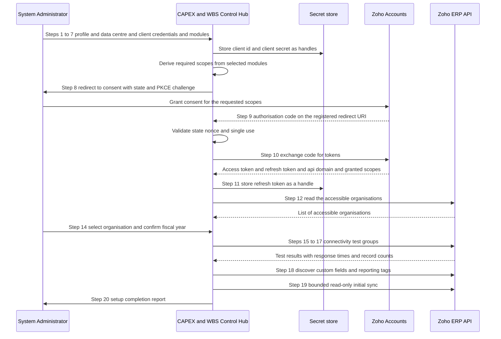
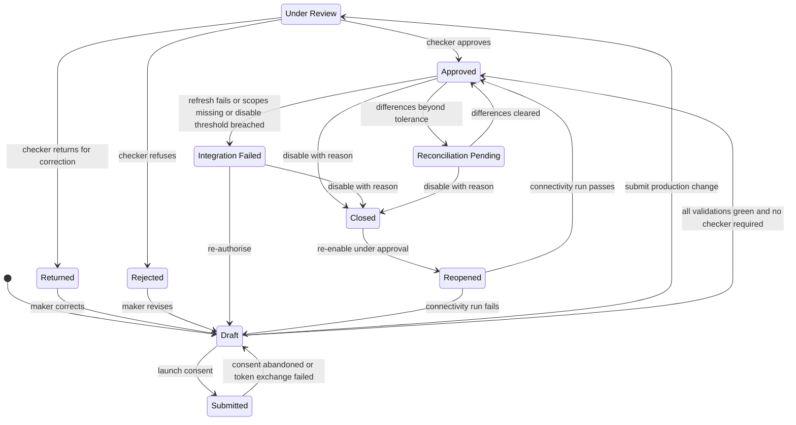

## 14. Zoho ERP Connector Setup Module

### 14.1 What this module is, and whose requirement it is

This section specifies an administrator-only setup module through which an authorised implementation administrator connects the CAPEX & WBS Control Hub to one or more Zoho ERP organisations **without changing application code**. It covers connection-profile mastering, data-centre configuration, the guided OAuth setup wizard, organisation discovery and mapping, module connectivity testing, sync configuration and the connector health dashboard.

**Provenance warning — read before sizing this module.** The connector setup module is `provenance=MASTER-PROMPT`. It is registered as **CONF-07**: the client requirement document contains one sentence on integration mechanics — the architecture line naming "API / Workflow / Custom Function" as the coupling between Zoho ERP and the budget control layer (`REQ-INT-015`) — and it names exactly one Company/Unit. Everything in this section beyond that single line originates in the engagement brief or is derived. It must not be presented to Atha Group as a client-stated requirement. It is nevertheless technically necessary: an API-first architecture that cannot be configured without a code change is not deployable, and §12 Recommended Architecture selects an API-first design. §41 Implementation Roadmap sizes this module separately so the client can see its cost, and §14.16 below splits it into a POC-minimal profile and a production profile so the additional scope is optional rather than embedded.

Client-stated requirements this module serves, indirectly: `REQ-INT-015` (bidirectional API/workflow/custom-function coupling), `REQ-INT-006` (CAPEX/CWIP identification via project code, custom fields and dimensions), `REQ-INT-021` (Phase 4 — connect PO/GRN/Bill events with the budget-control layer), `REQ-SEC-001` (audit trail from budget approval through capitalisation).

**What this module is not.** It is not a general-purpose iPaaS, not a Zoho administration console, and not a place where business rules live. Budget arithmetic, availability control and approval routing are specified in §21 Detailed Business Rules and §22 Budget and Commitment Calculation Logic and are unaffected by connector configuration. A mis-configured connector must degrade the application to a *stale-data* state, never to a *wrong-arithmetic* state.

### 14.2 Screens, entities and sections that make up this module

| Screen | Name (verbatim from the screen registry) | Role in this module | Specified in full |
|---|---|---|---|
| SCR-31 | Zoho ERP Connection Setup Wizard | Hosts wizard steps 1–20 (§14.8) | §48 Screen Catalogue and Navigation Map |
| SCR-32 | Zoho OAuth Authorisation and Consent Screen | Wizard steps 8–11; consent hand-off and callback landing | §48 |
| SCR-33 | Zoho Organisation Selection and Mapping | Wizard steps 12–14; standalone re-mapping (§14.9) | §48 |
| SCR-34 | API Scope and Permission Validation | Scope grid, missing-scope detection | §15 OAuth, Credential and Scope Management |
| SCR-35 | Master Data Mapping Workbench | Wizard step 18 (master-data half) | §19 Field, Custom-Field and Reporting-Tag Mapping |
| SCR-36 | Transaction Field Mapping Workbench | Wizard step 18 (transaction half) | §19 |
| SCR-37 | Sync Direction and Scheduling Configuration | §14.11 | §48 |
| SCR-38 | Integration Health and API Usage Dashboard | §14.12 connector health dashboard | §48 |
| SCR-39 | Failed Sync and Retry Queue | Retry and dead-letter operation | §25 API and Event Architecture |
| SCR-40 | Connector Audit and Credential Activity Log | Connector audit trail | §26 Integration Security and Secret Management |

**Design decision — the module connectivity test console has no separate screen ID.** The screen registry contains 40 screens and none of them is a test console. Rather than invent an identifier outside the registry, the console is specified as a named panel — the **Connectivity Test Console** — rendered inside SCR-31 during wizard steps 15–17 and re-runnable on demand from a toolbar action on SCR-38. Its full behaviour is specified in §14.10 and its column set is binding on both hosts.

Entities owned or written by this module (names taken exactly from the entity registry in §28 Data Model):

| Entity | Owner | Written by |
|---|---|---|
| Zoho Connection Profile | This module | SCR-31, SCR-37 |
| OAuth Credential Secret Reference | This module | SCR-31 (wizard step 11), rotation runbook §15.11 |
| OAuth Scope Requirement | This module | Seeded from the endpoint catalogue; read on SCR-34 |
| Zoho Organisation Mapping | This module | SCR-33 |
| API Endpoint Catalogue | This module (seed data) | §17 Zoho ERP Endpoint Inventory |
| Field Mapping | Shared with §19 | SCR-35, SCR-36 |
| Transformation Rule | Shared with §19 | SCR-35, SCR-36 |
| Sync Configuration | This module | SCR-37 |
| Sync Cursor | Runtime | Sync engine |
| API Usage Record | Runtime | HTTP client middleware |
| Connector Audit Log | This module | Every mutating action in this section |

### 14.3 The connection profile master

One row per (legal entity × Zoho organisation × environment). The field list below is the full master; every field named in the brief is present, plus the derived fields the design requires. Types are given in a database-neutral form; §28 Data Model carries the physical column types.

Secret handling column values: **NEVER-STORED** (the value never lands in our database in any form), **REF-ONLY** (the profile stores a reference/handle, the ciphertext lives in the secret store — see §26 Integration Security and Secret Management), **MASKED** (stored in clear but displayed truncated), **CLEAR** (ordinary configuration data).

| # | Field | Type | Mandatory | Key | Source | Secret handling | Validation | Illustrative value |
|---|---|---|---|---|---|---|---|---|
| 1 | `connection_profile_id` | UUID | Yes | Primary key | System | CLEAR | Immutable after create | `9f2a…c31b` |
| 2 | `connection_name` | String(80) | Yes | Unique per tenant | Administrator | CLEAR | 3–80 chars; no leading/trailing space | `Atha ERP — Entity A — Production` |
| 3 | `legal_entity_id` | FK → Organisation | Yes | Part of natural key | Master data | CLEAR | Must be an active Organisation | `ORG-ATHA-01` |
| 4 | `plant_or_business_unit_id` | FK → Plant | No | — | Master data | CLEAR | Must belong to `legal_entity_id`; null = entity-wide | `PLNT-GREENFIELD-01` |
| 5 | `environment` | Enum {`Development`, `Test`, `Production`} | Yes | Part of natural key | Administrator | CLEAR | Immutable after first successful token exchange | `Production` |
| 6 | `zoho_data_centre` | Enum (see §14.6) | Yes | — | Administrator | CLEAR | Must exist in the data-centre matrix | `IN` |
| 7 | `accounts_domain` | URL | Yes | — | Derived from field 6, overridable | CLEAR | HTTPS only; host must be on the allow-list in §14.6 | `https://accounts.zoho.in` |
| 8 | `api_domain` | URL | Yes | — | **Written from the token response**, not typed | CLEAR | HTTPS only; must match the `api_domain` returned at step 10 | `https://www.zohoapis.in` |
| 9 | `api_version_default` | Enum {`v3`, `v1`} | Yes | — | System, default `v3` | CLEAR | See OAS-01: this is a **default**, not the resolved path | `v3` |
| 10 | `api_version_overrides` | JSON map module→version | Yes | — | System seed (14 modules) | CLEAR | Keys must exist in the API Endpoint Catalogue | `{"departments":"v1"}` |
| 11 | `client_id_ref` | Secret handle | Yes | — | Administrator (entered once) | REF-ONLY | Handle resolves in the configured secret store | `sm://atha/erp/prod/client_id` |
| 12 | `client_secret_ref` | Secret handle | Yes | — | Administrator (entered once) | REF-ONLY | Write-only field; never returned by any read API | `sm://atha/erp/prod/client_secret` |
| 13 | `redirect_uri` | URL | Yes | — | Administrator | CLEAR | Must exactly equal one entry of the redirect allow-list (§26.8) | `https://capex.atha.example/connector/oauth/callback` |
| 14 | `oauth_grant_status` | Enum {`Not started`, `Consent pending`, `Granted`, `Refresh failing`, `Revoked`} | Yes | — | System | CLEAR | Machine-set only; no manual edit | `Granted` |
| 15 | `refresh_token_ref` | Secret handle | No | — | System (wizard step 11) | REF-ONLY | Null until step 10 succeeds | `sm://atha/erp/prod/refresh_token` |
| 16 | `access_token_expiry` | Timestamp (UTC) | No | — | System | CLEAR | Set to `now + 3600s` on each refresh (see §15.9) | `2026-08-06T11:42:07Z` |
| 17 | `token_last_refreshed_at` | Timestamp (UTC) | No | — | System | CLEAR | — | `2026-08-06T10:42:07Z` |
| 18 | `zoho_organisation_id` | String(20) | No | Part of natural key | `GET /organizations` selection | CLEAR | Must appear in the discovered list; change requires §14.9 control | `10234695` |
| 19 | `zoho_organisation_name` | String(120) | No | — | `GET /organizations` | CLEAR | Snapshot; refreshed on every health check | `Zylker Inc` |
| 20 | `base_currency` | String(3) | No | — | `GET /organizations` | CLEAR | ISO-4217; mismatch with entity currency raises a wizard warning | `INR` |
| 21 | `time_zone` | IANA zone | No | — | `GET /organizations` | CLEAR | Used to label every audit timestamp | `Asia/Kolkata` |
| 22 | `fiscal_year_start` | Month enum | No | — | `GET /organizations` (`fiscal_year_start_month`) | CLEAR | Mismatch with entity fiscal year is a blocking wizard error | `April` |
| 23 | `granted_scopes` | String array | No | — | Token response `scope` claim | CLEAR | Normalised to lower-case-insensitive compare | see §15.5 |
| 24 | `required_scopes` | String array | Yes | — | Derived from selected modules (wizard step 7) | CLEAR | Every element must exist in the 163-scope inventory | see §15.5 |
| 25 | `missing_scopes` | String array (derived) | Yes | — | `required_scopes` − `granted_scopes` | CLEAR | Non-empty ⇒ connector cannot leave `Draft` | `[]` |
| 26 | `connection_status` | Enum (see §14.13) | Yes | — | System | CLEAR | State machine in §14.13 | `Approved` |
| 27 | `last_successful_api_call_at` | Timestamp (UTC) | No | — | HTTP middleware | CLEAR | — | `2026-08-06T10:59:12Z` |
| 28 | `last_failed_api_call_at` | Timestamp (UTC) | No | — | HTTP middleware | CLEAR | Paired with `last_failure_code` | `2026-08-05T22:04:41Z` |
| 29 | `last_full_sync_at` | Timestamp (UTC) | No | — | Sync engine | CLEAR | — | `2026-08-01T02:00:00Z` |
| 30 | `last_incremental_sync_at` | Timestamp (UTC) | No | — | Sync engine | CLEAR | Per-object cursors live in Sync Cursor | `2026-08-06T10:45:00Z` |
| 31 | `connector_version` | Semver string | Yes | — | Build metadata | CLEAR | Recorded on every Connector Audit Log row | `1.0.0` |
| 32 | `created_by` | FK → User | Yes | — | System | CLEAR | — | `r.iyer` |
| 33 | `created_at` | Timestamp (UTC) | Yes | — | System | CLEAR | — | `2026-07-28T09:12:00Z` |
| 34 | `updated_by` | FK → User | Yes | — | System | CLEAR | — | `r.iyer` |
| 35 | `updated_at` | Timestamp (UTC) | Yes | — | System | CLEAR | — | `2026-08-06T10:42:07Z` |
| 36 | `credential_rotated_at` | Timestamp (UTC) | No | — | Rotation runbook §15.11 | CLEAR | Drives the rotation-due alert on SCR-38 | `2026-08-06T10:42:07Z` |
| 37 | `disabled_at` | Timestamp (UTC) | No | — | Disable action | CLEAR | Set together with field 38 | `null` |
| 38 | `disable_reason` | Text(500) | Conditional | — | Administrator | CLEAR | Mandatory when `disabled_at` is set | `null` |

Derived and operational fields added by this design, beyond the brief's list, because the wizard and the health dashboard cannot function without them:

| Field | Type | Purpose |
|---|---|---|
| `selected_modules` | String array | Wizard step 6 selection; the input to scope generation (step 7) |
| `last_failure_code` | String(16) | Zoho `code` from the last failed call (e.g. `44`, `45`, `1070`) — see §14.10 |
| `daily_call_budget` | Integer | Plan-derived ceiling used by the rate governor; see §14.11 |
| `plan_tier` | Enum {`Standard`, `Premium`, `Unknown`} | Administrator-declared; **not discoverable by API** |
| `maker_checker_state` | Enum {`Not required`, `Pending checker`, `Approved`, `Rejected`} | Production change control, §26.11 |
| `secret_store_backend` | Enum {`Envelope-AES-GCM`, `Cloud secret manager`, `HSM-backed KMS`} | Which storage design is in force; §26.3 |

Two rules are binding on implementers:

1. **No plain-text secret ever enters this table.** Fields 11, 12 and 15 hold handles. The rule and its enforcement are specified in §26 Integration Security and Secret Management.
2. **Fields 8, 18–23 are never typed by a human.** They are written from Zoho responses. A profile whose `api_domain` was typed rather than read from the token response fails the wizard's step-10 validation.

### 14.4 Connection profile granularity — recommendation

The brief asks whether a profile should be maintained per organisation, per legal entity or per environment. All three axes matter, and the answer is that the profile key is the product of all three.

| Option | Key | Consequence | Verdict |
|---|---|---|---|
| Per legal entity only | `legal_entity` | Breaks as soon as one entity has two Zoho organisations; forces organisation re-mapping, which is exactly the change §14.9 restricts | Rejected |
| Per Zoho organisation only | `zoho_organisation_id` | Cannot separate Production from Test, because Zoho ERP has **no sandbox** — the isolation primitive is a separate organisation, not a separate environment of one organisation | Rejected |
| Per environment only | `environment` | Cannot address multi-entity, which the brief requires and which the client's own entity/plant count is unconfirmed for (CONF-14) | Rejected |
| **Per (legal entity × Zoho organisation × environment)** | composite | One credential set, one scope grant, one rate-limit budget and one audit stream per real connection. Matches Zoho's own tenancy model. | **Recommended** |

The recommendation rests on a vendor-documented fact: *"Each organization is an independent Zoho ERP organization with its own organization ID, base currency, time zone, language, contacts, reports, etc."* `[source: https://www.zoho.com/erp/api/v3/introduction/ — verified 2026-08-05]`. Because the rate limit is *"100 requests per minute per organization"* `[source: https://www.zoho.com/erp/api/v3/introduction/ — verified 2026-08-05]`, the rate governor must also be keyed on `zoho_organisation_id`, not on the profile — two profiles pointed at the same organisation would each believe they own 100 calls per minute and would collectively exceed it. The design therefore enforces a uniqueness constraint on (`zoho_organisation_id`, `environment`) and a shared token-bucket keyed on `zoho_organisation_id`.

**Environment separation and the absence of a sandbox.** Zoho ERP has no sandbox: enumeration of the 84-page ERP API documentation index found no sandbox page, and no occurrence of "sandbox" on the introduction or OAuth pages; the only isolation primitives documented are separate organisations and a Trial plan `[source: https://www.zoho.com/erp/api/v3/introduction/ — verified 2026-08-05]`. Non-production testing therefore requires a **separate Zoho ERP organisation**, with **separate OAuth client credentials**, on a **separate connection profile**. Whether Atha Group is willing to license a second organisation for testing is an open question for §44 Open Questions and a line item in §45 Client Clarification Questionnaire.

### 14.5 The manual prerequisites the wizard cannot automate

Three prerequisites must be completed by a human in the Zoho ERP web UI before the wizard can succeed. They are stated here, at the front of the module, because discovering them at step 18 wastes a setup session.

| # | Prerequisite | Why it cannot be automated | Blocking? | Verified by |
|---|---|---|---|---|
| P1 | Register the OAuth client and obtain Client ID and Client Secret in Zoho's developer console | Client registration is not an ERP API operation; the registration URL and client-type options are **UNVERIFIED - REQUIRES ZOHO CONFIRMATION** — no citable evidence for the console URL or for a "Self Client" grant type was found in this engagement's evidence set | Yes — wizard step 3 cannot proceed | Administrator confirms in wizard step 3 |
| P2 | Create the CAPEX/WBS custom-field **definitions** on Purchase Order, Bill and Item in each Zoho organisation | **OAS-06**: the specification exposes custom-field endpoints only for setting values on an existing record (`PUT /purchaseorder/{purchaseorder_id}/customfields`, `PUT /bill/{bill_id}/customfields`, `PUT /item/{item_id}/customfields`); there is no operation anywhere in the 869 that creates a custom-field *definition* `[source: Zoho ERP OpenAPI bundle openapi-all.zip, sha256 E95A0399… — verified 2026-08-05]` | Yes — wizard step 18 fails | Wizard step 18 discovery probe |
| P3 | Create the reporting tags used as the WBS / budget-head dimension, if the reporting-tag carrier is chosen in §19 | `POST /reportingtags` exists under `ERP.settings.CREATE`, but granting the connector settings-write in order to create tags contradicts least privilege (§15.6). Recommended: create tags manually, grant `ERP.settings.READ` only | No — degrades to header-only coding | Wizard step 18 |

Wizard step 1 shows this list as a pre-flight checklist with a mandatory acknowledgement. Each item links to the exact field names §19 requires.

### 14.6 Data-centre configuration

**The rule.** The connector must not hardcode one global domain, and must not *guess* one either. Two mechanisms exist and they are used in this order:

1. **Accounts domain** is chosen by the administrator from the matrix below and is required *before* the authorisation request, because the authorisation URL must be built against it.
2. **API domain is never chosen by a human.** It is read from the token response: *"Use the value in the api_domain key to make API calls to Zoho ERP"* `[source: https://www.zoho.com/erp/api/v3/oauth/ — verified 2026-08-05]`. Field 8 of the connection profile is written from that value at wizard step 10 and is read-only in the UI.

This split matters: it means a wrong regional API host is impossible by construction, and a wrong accounts host fails loudly at consent rather than silently at runtime.

#### 14.6.1 The data-centre matrix

| Region | Zoho Accounts domain | Zoho API domain | ERP API root | Evidence status |
|---|---|---|---|---|
| India (IN) | `https://accounts.zoho.in` | `https://www.zohoapis.in` | `/erp/v3` and `/erp/v1` | **ERP-documented.** *"For Zoho ERP (India), use https://accounts.zoho.in as {Accounts_URL} when generating tokens."* `[source: https://www.zoho.com/erp/api/v3/oauth/ — verified 2026-08-05]`. All 78 module specifications declare a `zohoapis.in` server and no other host `[source: Zoho ERP OpenAPI bundle openapi-all.zip, sha256 E95A0399… — verified 2026-08-05]` |
| United States (US) | `https://accounts.zoho.com` | **UNVERIFIED - REQUIRES ZOHO CONFIRMATION** | **UNVERIFIED - REQUIRES ZOHO CONFIRMATION** | Accounts host appears in **Zoho CRM v8** multi-DC documentation, not in any Zoho ERP page. No matching API host is printed there. |
| Europe (EU) | `https://accounts.zoho.eu` | `https://www.zohoapis.eu` — **CRM example only** | **UNVERIFIED - REQUIRES ZOHO CONFIRMATION** | Both hosts appear on the Zoho CRM v8 multi-DC page as CRM examples; neither is stated for Zoho ERP. |
| Australia (AU) | `https://accounts.zoho.com.au` | **UNVERIFIED - REQUIRES ZOHO CONFIRMATION** | **UNVERIFIED - REQUIRES ZOHO CONFIRMATION** | CRM-sourced accounts host only. |
| China (CN) | `https://accounts.zoho.com.cn` | `https://www.zohoapis.com.cn` — **CRM example only** | **UNVERIFIED - REQUIRES ZOHO CONFIRMATION** | CRM-sourced. |
| Japan (JP) | `https://accounts.zoho.jp` | **UNVERIFIED - REQUIRES ZOHO CONFIRMATION** | **UNVERIFIED - REQUIRES ZOHO CONFIRMATION** | CRM-sourced accounts host only. |
| Canada (CA) | `https://accounts.zohocloud.ca` | **UNVERIFIED - REQUIRES ZOHO CONFIRMATION** | **UNVERIFIED - REQUIRES ZOHO CONFIRMATION** | CRM-sourced accounts host only. |

Reading rules for this table, which implementers must not soften:

- **Only the India row is Zoho ERP evidence.** The six non-India rows are transcribed from Zoho CRM v8 multi-data-centre documentation, which does not mention Zoho ERP anywhere. That research record was verified and **downgraded to OVERSTATED and marked not citable**, precisely because it had been used as though it were ERP evidence. The accounts hosts are reproduced here as *leads for confirmation*, labelled as such, and no API host for US, AU, JP or CA is stated at all — those five API hosts were never printed on the source page.
- **A live contradiction exists between the two products' guidance and must not be resolved silently.** The Zoho ERP OAuth page instructs India customers to use `https://accounts.zoho.in`. The Zoho CRM multi-DC page instructs that the authorization request be made from `https://accounts.zoho.com` for the EU, AU and IN domains, with automatic redirection afterwards. These cannot both be the operating rule for Zoho ERP in India. **The ERP instruction governs this design**, because it is the ERP-documented one; the CRM instruction is recorded as an open question for Zoho in §44 Open Questions.
- Atha Group is an Indian manufacturing group and the POC targets the India data centre. The other six rows exist so that the matrix is a configuration table rather than a hardcoded constant, satisfying the "must not hardcode one global domain" rule. They are not a claim that the connector works in those regions today.

#### 14.6.2 Data-centre matrix record shape

Each row of the configurable matrix carries exactly these fields, so a new region can be added by data change rather than code change:

| Field | Example (India) | Notes |
|---|---|---|
| `region_code` | `IN` | Enum value used by connection-profile field 6 |
| `region_name` | `India` | Display |
| `accounts_domain` | `https://accounts.zoho.in` | Used to build `/oauth/v2/auth` and `/oauth/v2/token` |
| `api_domain_expected` | `https://www.zohoapis.in` | **Advisory only.** The runtime value comes from the token response |
| `erp_web_domain` | **UNVERIFIED - REQUIRES ZOHO CONFIRMATION** | The customer-facing ERP web host is not stated on any evidenced page; used only to build "open in Zoho" deep links, which degrade gracefully if absent |
| `redirect_uri_allowed` | `https://capex.atha.example/connector/oauth/callback` | Per-environment allow-list; see §26.8 |
| `data_residency_note` | `Data resident in the Zoho India data centre. Confirm against Atha Group's data-residency policy and the DPDP position in §32.` | Displayed on SCR-31 step 2 |
| `connection_test_endpoint` | `GET /organizations` | The only ERP endpoint that requires no `organization_id` and no query parameters — the correct first probe |
| `evidence_status` | `ERP-documented` \| `CRM-sourced — unconfirmed for ERP` \| `Unevidenced` | Rendered as a badge on the region picker so the administrator sees the confidence level |

#### 14.6.3 Base-path resolution per module (OAS-01)

The Zoho ERP API is **not** uniformly `/erp/v3`. Of 78 modules, 64 declare `https://www.zohoapis.in/erp/v3` and 14 declare `https://www.zohoapis.in/erp/v1`; across 869 operations the split is 776 on v3 and 93 on v1 `[source: Zoho ERP OpenAPI bundle openapi-all.zip, sha256 E95A0399… — verified 2026-08-05]`.

The 14 v1 modules: `departments`, `designations`, `employee-salary`, `employee-statutory`, `employees`, `expense-categories`, `expense-claims`, `expense-reports`, `income-tax-details`, `payruns`, `receipts`, `salary-revisions`, `trips`, `work-center-timings`.

Consequence for this module, stated plainly: **the connection profile cannot hold a single API base path.** Field 9 is a default and field 10 is the override map. The resolver is:

```
function resolve_base_url(profile, module_key):
    version = profile.api_version_overrides[module_key]        # explicit wins
              or catalogue_lookup(module_key).api_version      # seeded from the spec
              or profile.api_version_default                   # "v3"
    return profile.api_domain + "/erp/" + version              # api_domain from token response

# Seeded override map for the modules this application touches:
#   departments -> v1        (all other CAPEX-path modules -> v3)
```

Only one module in this application's call surface is on v1: **Departments**. A further trap: the Departments *documentation* page sits under a `/erp/api/v3/departments/` URL while the operations themselves are served from `/erp/v1` `[source: Zoho ERP OpenAPI bundle openapi-all.zip, sha256 E95A0399… — verified 2026-08-05]`. An implementer who infers the base path from the documentation URL will build a broken call. The API Endpoint Catalogue entity is the single source of truth for base path and must be seeded from the endpoint inventory in §17 Zoho ERP Endpoint Inventory, never from a documentation URL.

The Connectivity Test Console (§14.10) includes a dedicated **base-path resolution** test that calls one v3 endpoint and one v1 endpoint and fails if either resolves to the wrong root.

### 14.7 Authorisation, transport and response conventions the wizard depends on

| Convention | Value | Evidence |
|---|---|---|
| Authorization header | `Authorization: Zoho-oauthtoken <access_token>` — the scheme token is `Zoho-oauthtoken`, never `Bearer` | `[source: https://www.zoho.com/erp/api/v3/introduction/ — verified 2026-08-05]` |
| Organisation identification | *"The parameter organization_id along with the organization ID should be sent in with every API request to identify the organization."* Both documented curl samples send it in the query string as `?organization_id=10234695`; no header form is documented | `[source: https://www.zoho.com/erp/api/v3/http-methods/ — verified 2026-08-05]` |
| Response envelope | `{ "code": 0, "message": "success", "<resource>": { … } }`; `code` is zero on success and non-zero on error | `[source: https://www.zoho.com/erp/api/v3/response/ — verified 2026-08-05]` |
| Timestamps | ISO 8601, `YYYY-MM-DDThh:mm:ssTZD`, e.g. `2016-06-11T17:38:06+0530` | `[source: https://www.zoho.com/erp/api/v3/response/ — verified 2026-08-05]` |
| HTTP status codes documented | Exactly 200, 201, 400, 401, 404, 405, 429, 500. **`403`, `409`, `422` and `Retry-After` do not appear** on the errors page | `[source: https://www.zoho.com/erp/api/v3/errors/ — verified 2026-08-05]` |
| 401 semantics | The errors page prints 401 as *Unauthorized (Invalid AuthToken)*. **No "insufficient scope" status is documented** — the design consequence is worked through in §15.8 | `[source: https://www.zoho.com/erp/api/v3/errors/ — verified 2026-08-05]` |
| Pagination | `?page=2&per_page=25`; first page by default; `page_context` returns exactly `page`, `per_page`, `has_more_page` — **there is no total count** | `[source: https://www.zoho.com/erp/api/v3/pagination/ — verified 2026-08-05]` |
| `per_page` default and ceiling | Default 200; the specification records a documented maximum of 200 | `[source: Zoho ERP OpenAPI bundle openapi-all.zip, sha256 E95A0399… — verified 2026-08-05]` |

The absence of a total count is a wizard-visible design constraint: progress on the initial sync (step 19) is reported as "pages fetched / records loaded so far", never as a percentage, because the denominator is not available.

### 14.8 The 20-step OAuth setup wizard

The wizard is linear with backward navigation. Steps 1–7 are reversible and persist a `Draft` profile. Step 10 is the point of no return for `environment` (field 5). No step may be skipped; a step that cannot succeed offers a documented **deferral** only where the table says so.

| Step | Title | Screen | Actor | Input / action | Zoho call | Persisted | Blocking validation | Failure behaviour |
|---|---|---|---|---|---|---|---|---|
| 1 | Create connection profile | SCR-31 | System Administrator | `connection_name`, `legal_entity_id`, `plant_or_business_unit_id`, `environment`; acknowledge prerequisites P1–P3 (§14.5) | — | Profile row, `connection_status = Draft` | Name unique per tenant; entity active; prerequisites acknowledged | Inline field errors; nothing persisted until valid |
| 2 | Select Zoho data centre | SCR-31 | System Administrator | Pick `region_code` from the matrix (§14.6) | — | Fields 6, 7 | Region must exist; badge shows `ERP-documented` / `CRM-sourced — unconfirmed for ERP` | Selecting a non-`ERP-documented` region raises a page-level warning that must be acknowledged with a reason, stored in Connector Audit Log |
| 3 | Enter or reference the OAuth Client ID | SCR-31 | System Administrator | Paste Client ID, or select an existing secret handle | — | Field 11 (handle) | Non-empty; stored via secret store, never in the profile row | If the secret store is unreachable the wizard halts — it never falls back to plain text |
| 4 | Enter or reference the OAuth Client Secret | SCR-31 | System Administrator | Paste Client Secret, or select an existing handle | — | Field 12 (handle) | Write-only input; after save the field renders as `••••••••` with a **Replace** action and no reveal action | As step 3 |
| 5 | Confirm the registered Redirect URI | SCR-31 | System Administrator | Confirm the URI to register in Zoho | — | Field 13 | Must exactly equal an entry on the environment's redirect allow-list (§26.8); HTTPS; no wildcard; no fragment; no query string | Mismatch is a hard stop with the exact expected string shown for copying |
| 6 | Select required functional modules | SCR-31 | System Administrator | Tick the Zoho modules this connection uses (vendors, items, locations, departments, projects, taxes, currencies, chart of accounts, purchase orders, purchase receives, bills, vendor credits, vendor payments, journals, fixed assets, reporting tags) | — | `selected_modules` | At least one module; the CAPEX baseline set is pre-ticked and cannot be emptied | — |
| 7 | Generate the required OAuth scope list | SCR-31 → SCR-34 | System | Derive `required_scopes` from `selected_modules` via the API Endpoint Catalogue | — | Field 24 | Every derived scope must exist in the 163-scope inventory; the generator refuses to emit an `ALL` scope where a narrower one exists (§15.6) | Any scope not in the inventory is a build-time defect, surfaced as a blocking system error |
| 8 | Redirect the administrator to Zoho consent | SCR-32 | System Administrator | Launch consent | `GET {accounts_domain}/oauth/v2/auth` with `client_id`, `response_type=code`, `redirect_uri`, `scope`, plus the offline/consent controls `access_type` and `prompt` | `state` nonce, PKCE verifier (§26.6); `oauth_grant_status = Consent pending` | `state` generated with a CSPRNG, single-use, TTL 10 minutes | If consent is abandoned the nonce expires and the profile stays `Draft` |
| 9 | Receive the authorisation code securely | SCR-32 | System | Handle the callback | — | Authorisation code held **in memory only** | `state` must match and be unconsumed; `code` must be exchanged within its validity — *"this code will be valid for 2 minutes"* `[source: https://www.zoho.com/erp/api/v3/oauth/ — verified 2026-08-05]` | `state` mismatch ⇒ reject, log a security event, never retry automatically (§26.6) |
| 10 | Exchange the authorisation code for access and refresh tokens | — | System | Token exchange | `POST {accounts_domain}/oauth/v2/token` with `grant_type=authorization_code` | Field 8 `api_domain` from the response, field 16 expiry, field 17, field 23 `granted_scopes` | The 2-minute code window forces a synchronous exchange; response must carry `api_domain` | On failure the profile stays `Draft`; the code is discarded, never re-presented |
| 11 | Store only encrypted secret references | — | System | Persist secrets | — | Field 15 `refresh_token_ref`; access token in the encrypted short-lived cache only | Refresh token written **only** as a handle; a write path that would place it in the profile row is a build-blocking defect | Storage failure ⇒ immediate revocation attempt and `Draft` |
| 12 | Call `GET /organizations` | — | System | Organisation discovery | `GET {api_domain}/erp/v3/organizations` — scope `ERP.settings.READ`, no `organization_id`, no query parameters `[source: Zoho ERP OpenAPI bundle openapi-all.zip, sha256 E95A0399… — verified 2026-08-05]` | Discovery result cached for the session | HTTP 200 and envelope `code = 0` | 401 ⇒ token problem, route to §15.8; empty list ⇒ the authorising user has no organisation access |
| 13 | Display the accessible Zoho ERP organisations | SCR-33 | System Administrator | Review the list | — | — | At least one organisation | Empty state message names the authorising user and tells the administrator to grant organisation access in Zoho |
| 14 | Select and map the intended organisation | SCR-33 | System Administrator | Choose one organisation | — | Fields 18–22; Zoho Organisation Mapping row | `fiscal_year_start` must equal the legal entity's fiscal year — **blocking**; `base_currency` mismatch — **warning**; `is_org_active` false — **blocking** | See §14.9 for the re-mapping control that applies after this point |
| 15 | Test master-data APIs | SCR-31 (Connectivity Test Console) | System | Run the master-data test group | See §14.10 | Test result rows | Every **Required** test must pass | Optional-test failure is recorded and the wizard continues |
| 16 | Test procurement APIs | SCR-31 (Console) | System | Run the procurement test group | See §14.10 | Test result rows | Purchase Order read must pass | Purchase Receive has **no list endpoint**; the test is a probe of a known receive id or is skipped with reason `OAS-03 — no list endpoint` |
| 17 | Test finance and fixed-asset APIs | SCR-31 (Console) | System | Run the finance test group | See §14.10 | Test result rows | Bills read and Chart of Accounts read must pass | Fixed-asset read failure downgrades capitalisation to manual and is recorded |
| 18 | Validate required custom fields and mappings | SCR-35, SCR-36 | System + System Administrator | Discover custom fields present on Purchase Order, Bill and Item; discover reporting tags; bind them to application fields | `GET /purchaseorders` (custom field discovery via a sample record), `GET /reportingtags` (`ERP.settings.READ`) `[source: Zoho ERP OpenAPI bundle openapi-all.zip, sha256 E95A0399… — verified 2026-08-05]` | Field Mapping rows | Every mandatory CAPEX/WBS carrier field in §19 must be bound | Missing definition ⇒ the wizard names the exact field to create manually in Zoho (OAS-06) and offers **Re-check**, never **Create** |
| 19 | Run a controlled initial sync | SCR-31 → SCR-37 | System Administrator | Start the bounded first sync | Read-only calls per §14.11 | Sync Cursor rows, Sync Log | Bounded by `initial_sync_max_pages` and by the daily call budget; read-only — **no writes to Zoho during setup** | Rate-limit response pauses and resumes with backoff; the sync is resumable from the cursor |
| 20 | Display a setup completion report | SCR-31 | System Administrator | Review and finish | — | Connector Audit Log entry; `connection_status` transition | All blocking validations green; `missing_scopes` empty | Any red item leaves the profile in `Draft` and the report lists each with its remediation |

**The manual-token rule.** The administrator is never asked to paste a short-lived access token during normal setup. A **Diagnostic token entry** panel exists, is visible only in `Development` and `Test` environments, is labelled *Diagnostic use only — not for production setup*, writes a Connector Audit Log entry naming the operator, and is hard-disabled when `environment = Production`.

#### 14.8.1 Setup sequence



#### 14.8.2 Setup completion report

The step-20 report is a persisted artefact, exportable to PDF, and is the evidence a reviewer needs. It carries:

| Block | Contents |
|---|---|
| Identity | Profile name, legal entity, plant, environment, connector version, completed by, completed at (organisation time zone, labelled) |
| Connection | Region, accounts domain, API domain **as returned by Zoho**, resolved base paths for v3 and v1 |
| Organisation | `organization_id`, organisation name, base currency, time zone, fiscal year start, active flag |
| Scopes | Required, granted, missing, and every scope granted but **not** required (over-grant list — see §15.6) |
| Connectivity | Every test from §14.10 with result, response time, record count and correlation ID |
| Mappings | Count of bound mappings by object; every unbound mandatory field named |
| Initial sync | Object, pages fetched, records loaded, records rejected, cursor position, elapsed time |
| Outstanding | Every deferred item with its reason code and owner |
| Signature block | Maker and, in `Production`, checker (§26.11) |

### 14.9 Organisation discovery and mapping

#### 14.9.1 Discovery call and response

`GET /organizations` is the only ERP operation in the inventory that requires neither `organization_id` nor any query parameter, which makes it the correct first probe after token exchange. Scope: `ERP.settings.READ` `[source: Zoho ERP OpenAPI bundle openapi-all.zip, sha256 E95A0399… — verified 2026-08-05]`; the same scope is printed against this operation in the vendor's own introduction page `[source: https://www.zoho.com/erp/api/v3/introduction/ — verified 2026-08-05]`.

Request:

```http
GET https://www.zohoapis.in/erp/v3/organizations HTTP/1.1
Authorization: Zoho-oauthtoken {access_token}
X-Correlation-Id: 5c1f9e0a-2f74-4a1e-9a3d-8f0f5f2f7c21
```

Response, showing the documented field set (values are the vendor's own sample; `organization_id` 10234695 and name "Zylker Inc" are documentation values, not Atha Group data):

```json
{
  "code": 0,
  "message": "success",
  "organizations": [
    {
      "organization_id": "10234695",
      "name": "Zylker Inc",
      "contact_name": "...",
      "email": "...",
      "is_default_org": false,
      "language_code": "en",
      "fiscal_year_start_month": "april",
      "account_created_date": "2026-01-04",
      "time_zone": "Asia/Kolkata",
      "is_org_active": true,
      "currency_id": "...",
      "currency_code": "INR",
      "currency_symbol": "₹",
      "currency_format": "###,##,###.##",
      "price_precision": 2
    }
  ]
}
```

`[source: https://www.zoho.com/erp/api/v3/introduction/ — verified 2026-08-05]`

An alternative, non-API route exists and is documented — the organisation ID can also be read from the Manage Organizations page in the admin console `[source: https://www.zoho.com/erp/api/v3/introduction/ — verified 2026-08-05]`. The wizard offers it only as a fallback for step 13 and never as the primary path, because a manually typed identifier defeats the mismatch checks below.

#### 14.9.2 Selection screen (SCR-33) column set

| Column | Source | Why it is shown |
|---|---|---|
| Organisation name | `name` | Human selection |
| `organization_id` | `organization_id` | The value that is persisted and that every later call carries |
| Default organisation | `is_default_org` | An administrator authorising with a personal account often lands on a default that is not the CAPEX organisation |
| Active | `is_org_active` | Inactive organisation is a blocking selection error |
| Base currency | `currency_code` | Compared with the legal entity's currency |
| Fiscal year start | `fiscal_year_start_month` | Compared with the legal entity's fiscal year — a mismatch silently corrupts every period-based report |
| Time zone | `time_zone` | Every audit timestamp is labelled with this zone |
| Currency format / price precision | `currency_format`, `price_precision` | Feeds the amount-parsing rules; Indian grouping is expected (`###,##,###.##`) |
| Already mapped | Local | An organisation already bound to another profile in the same environment cannot be selected twice |

Validation decision table at selection:

| Condition | Severity | Behaviour |
|---|---|---|
| `is_org_active = false` | Error | Selection blocked |
| `fiscal_year_start_month` ≠ legal entity fiscal year | Error | Selection blocked; the wizard names both values |
| `currency_code` ≠ legal entity base currency | Warning | Selection allowed with a mandatory acknowledgement; recorded in Connector Audit Log; §23 Accounting Design governs the conversion treatment |
| `organization_id` already mapped in this environment | Error | Selection blocked; the conflicting profile is named |
| `time_zone` ≠ application organisation time zone | Warning | Allowed; audit timestamps are labelled with both |
| Exactly one organisation returned and it is not default | Information | Allowed; no friction |

#### 14.9.3 Re-mapping control

Once an organisation is mapped and any transaction reference has been created against it, the mapping is effectively a data-lineage key. Changing it re-points every synced record. The control:

1. Re-mapping is not available inline on SCR-33. It is a distinct **Change mapped organisation** action, permitted to `System Administrator` only.
2. The action raises `MSG-INT-005` (warning): *"Changing the mapped Zoho organisation from {current} to {proposed} will re-point every synced record. This requires {approver_role} approval and is recorded in the connector audit trail."* — `{approver_role}` resolves to a second `System Administrator` in `Production` (maker-checker per §26.11) and to `Management Approver` where the change also alters the legal entity binding.
3. The requester must supply a reason. `MSG-SEC-003` applies: *"You are overriding {control} for {object}. A reason is mandatory and will be stored in the audit trail with your name and the current time."*
4. The change is blocked outright when open Integration Events reference the current organisation. The administrator must drain or dead-letter them first (SCR-39).
5. On approval the connector writes a Connector Audit Log row with before/after `organization_id`, the reason, maker, checker and timestamps; sets `connection_status` to `Draft`; clears every Sync Cursor; and requires a fresh step-19 initial sync. **No silent re-point exists in any code path.**

#### 14.9.4 Multi-organisation topologies supported

| Topology | Profiles | Notes |
|---|---|---|
| One tenant → one Zoho organisation | 1 | The client document describes exactly one Company/Unit (CONF-07, CONF-14); this is the minimum |
| One tenant → multiple Zoho organisations | n | Each with its own token, scope grant, rate-limit budget and audit stream |
| One tenant → multiple legal entities | n | Entity is part of the profile key; a project belongs to exactly one entity and therefore to exactly one profile |
| One tenant → multiple plants/locations | 1 per entity | Plant is a *within-organisation* dimension carried on `location_id`; it does not require its own profile |

The POC design carries **two** connection profiles pointing at two Zoho organisations, in line with the brief's acceptance criterion 12 and with the two-entity, two-plant sample dataset in §38 Sample Data. Whether Atha Group actually operates two Zoho ERP organisations is unconfirmed and is a §45 Client Clarification Questionnaire item.

### 14.10 Module connectivity test console

#### 14.10.1 Result record

Every test emits one row with exactly these fields, on both hosts (wizard step 15–17 and SCR-38):

`test_id`, `test_name`, `test_group`, `endpoint`, `http_method`, `api_version_resolved`, `required_scope`, `result` (`Pass` / `Fail` / `Skipped` / `Degraded`), `response_time_ms`, `record_count`, `error_code`, `error_message`, `correlation_id`, `tested_at` (ISO 8601), `tested_by`.

Binding display rules: `error_message` renders Zoho's `message` verbatim and adds the plain-language consequence beneath it; **no secret, no access token, no authorisation header and no client secret ever appears in a test row, a log line or an export.** Redaction is specified in §26.10.

#### 14.10.2 The test catalogue

Every endpoint, method and scope below is taken from the endpoint inventory generated from the vendor's OpenAPI bundle `[source: Zoho ERP OpenAPI bundle openapi-all.zip, sha256 E95A0399… — verified 2026-08-05]`.

| # | Test | Group | Endpoint | Method | Base | Scope | Pass criterion | Required | Verified |
|---|---|---|---|---|---|---|---|---|---|
| T01 | Authentication | Foundation | `/organizations` | GET | v3 | `ERP.settings.READ` | HTTP 200 and envelope `code = 0` | Yes | 2026-08-05 |
| T02 | Organisation access | Foundation | `/organizations` | GET | v3 | `ERP.settings.READ` | Mapped `organization_id` present in the returned list | Yes | 2026-08-05 |
| T03 | API base URL resolution | Foundation | `/users/me` (v3) and `/departments` (v1) | GET | both | `ERP.settings.READ`, `ERP.department.READ` | Both resolve to the correct root; a v1 call issued against `/erp/v3` must fail the test, not be silently retried | Yes | 2026-08-05 |
| T04 | Required scopes | Foundation | — | — | — | — | `missing_scopes` is empty (§15.8) | Yes | 2026-08-05 |
| T05 | Rate-limit response | Foundation | `/organizations` | GET | v3 | `ERP.settings.READ` | Deliberate burst; the governor must observe the documented per-minute ceiling and back off without data loss. Recognised bodies: `code 44` (account or organisation blocked), `code 45`, `code 1070` (concurrency) | Yes | 2026-08-05 |
| T06 | Pagination | Foundation | `/contacts?page=1&per_page=200` | GET | v3 | `ERP.contacts.READ` | `page_context` returns `page`, `per_page`, `has_more_page`; the reader must not depend on a total count, which is not returned | Yes | 2026-08-05 |
| T07 | Contacts / vendors | Master data | `/contacts` | GET | v3 | `ERP.contacts.READ` | HTTP 200; `contact_type` filter usable to isolate vendors | Yes | 2026-08-05 |
| T08 | Users | Master data | `/users` | GET | v3 | `ERP.settings.READ` | HTTP 200 | Yes | 2026-08-05 |
| T09 | Departments | Master data | `/departments` | GET | **v1** | `ERP.department.READ` | HTTP 200 **and** the resolved base path ends `/erp/v1` | Yes | 2026-08-05 |
| T10 | Items | Master data | `/items` | GET | v3 | `ERP.settings.READ` | HTTP 200. **No `page`/`per_page` parameters are declared for this operation** — the sync must not assume pagination | Yes | 2026-08-05 |
| T11 | Locations | Master data | `/locations` | GET | v3 | `ERP.settings.READ` | HTTP 200. Only `organization_id` is accepted; no pagination, no filter | Yes | 2026-08-05 |
| T12 | Projects | Master data | `/projects` | GET | v3 | `ERP.projects.READ` | HTTP 200 | Yes | 2026-08-05 |
| T13 | Taxes | Master data | `/settings/taxes` | GET | v3 | `ERP.settings.READ` | HTTP 200; `last_modified_time` accepted | Yes | 2026-08-05 |
| T14 | Currencies | Master data | `/settings/currencies` | GET | v3 | `ERP.settings.READ` | HTTP 200 | Yes | 2026-08-05 |
| T15 | Chart of Accounts | Master data | `/chartofaccounts` | GET | v3 | `ERP.accountants.READ` | HTTP 200; the configured CWIP account is present | Yes | 2026-08-05 |
| T16 | Reporting Tags | Master data | `/reportingtags` | GET | v3 | `ERP.settings.READ` | HTTP 200; the WBS/budget-head tag exists if the tag carrier was chosen in §19 | Conditional | 2026-08-05 |
| T17 | Purchase Orders (list) | Procurement | `/purchaseorders` | GET | v3 | `ERP.purchaseorders.READ` | HTTP 200; `last_modified_time` and `status` filters accepted | Yes | 2026-08-05 |
| T18 | Purchase Order (detail) | Procurement | `/purchaseorders/{purchaseorder_id}` | GET | v3 | `ERP.purchaseorders.READ` | Line items returned with `project_id`, `tags`, `item_custom_fields`, `account_id`, `location_id` (OAS-04) | Yes | 2026-08-05 |
| T19 | Purchase Receives | Procurement | `/purchasereceives/{purchasereceive_id}` | GET | v3 | `ERP.purchasereceives.READ` | Probe of a known receive id. **There is no list endpoint** — only POST, GET-by-id, PUT and DELETE exist (OAS-03). Result `Degraded` with reason `OAS-03` where no id is available | Degraded-allowed | 2026-08-05 |
| T20 | Bills | Actuals | `/bills` | GET | v3 | `ERP.bills.READ` | HTTP 200; `purchaseorder_id` and `last_modified_time` filters accepted | Yes | 2026-08-05 |
| T21 | Vendor Credits | Actuals | `/vendorcredits` | GET | v3 | **`ERP.debitnotes.READ`** | HTTP 200. Note the module/scope naming mismatch — path `/vendorcredits`, scope family `debitnotes` (§15.4) | Conditional | 2026-08-05 |
| T22 | Vendor Payments | Actuals | `/vendorpayments` | GET | v3 | `ERP.vendorpayments.READ` | HTTP 200 | Conditional | 2026-08-05 |
| T23 | Journals | Actuals | `/journals` | GET | v3 | **`ERP.accountants.READ`** | HTTP 200; line-level `project_id` and `tags` present (OAS-10) | Yes | 2026-08-05 |
| T24 | Fixed Assets | Capitalisation | `/fixedassets` | GET | v3 | **`ERP.fixedasset.READ`** (singular) | HTTP 200. **No `last_modified_time` parameter is declared** — asset sync is full-refresh only (OAS-09) | Conditional | 2026-08-05 |
| T25 | CAPEX/WBS custom fields | Mapping | Sample record read on Purchase Order, Bill, Item | GET | v3 | per module | Every mandatory carrier field named in §19 is present in the returned payload | Yes | 2026-08-05 |

Three tests deserve emphasis because they encode hard negatives rather than optimism:

- **T19** cannot be a list-and-count test. The specification exposes only `POST /purchasereceives`, `GET /purchasereceives/{purchasereceive_id}`, `PUT /purchasereceives/{purchasereceive_id}` and `DELETE /purchasereceives/{purchasereceive_id}`; receive lines carry no `purchaseorder_item_id` and no project, tag or custom-field coding `[source: Zoho ERP OpenAPI bundle openapi-all.zip, sha256 E95A0399… — verified 2026-08-05]`. Received-but-unbilled exposure is therefore reconstructed by this application, as specified in §27 Integration Reconciliation Design. A `Degraded` result on T19 is expected, not a defect.
- **T24** must not be wired to an incremental cursor. `GET /fixedassets` declares only `organization_id`, `filter_by`, `sort_column`, `sort_order`, `page`, `per_page` — there is no last-modified filter, and the create body carries no link to a source project, purchase order or bill (OAS-09).
- **T18** is the enabling positive. Purchase-order **line** items carry `project_id`, `tags`, `item_custom_fields`, `account_id` and `location_id`, which is what makes line-level CAPEX/WBS commitment control possible at all (OAS-04). If T18 fails, the architecture does not degrade gracefully — it stops.

#### 14.10.3 Console behaviour

- Tests run in group order; a Foundation failure aborts the remaining groups, because a scope or base-path fault makes every later result meaningless.
- Each run is stamped with one `run_id` and one `correlation_id` per test, propagated as a request header and stored on the Integration Request / Integration Response entities.
- Total calls per full run are bounded and displayed before starting, because the daily plan quota is finite (§14.11). A full 25-test run is a single-digit fraction of the Standard-plan daily allowance, but repeated runs during a setup workshop are not.
- Results are exportable to CSV and PDF with the redaction rules of §26.10 applied at serialisation time, not at render time.

### 14.11 Sync configuration (SCR-37)

#### 14.11.1 Per-object sync capability

Sync mode is not a free choice — it is dictated by what each endpoint actually supports. This table is the binding input to SCR-37 and to §25 API and Event Architecture. All endpoint facts are from the specification `[source: Zoho ERP OpenAPI bundle openapi-all.zip, sha256 E95A0399… — verified 2026-08-05]`.

| Object | List endpoint | Pagination | `last_modified_time` filter | Feasible sync mode | Default frequency | Verified |
|---|---|---|---|---|---|---|
| Organisations | `GET /organizations` | No | No | On-demand only | On health check | 2026-08-05 |
| Users | `GET /users` | Yes | No | Full refresh | Daily | 2026-08-05 |
| Contacts (vendors) | `GET /contacts` | Yes | **No** | Full refresh with change detection by content hash | Daily | 2026-08-05 |
| Items | `GET /items` | **No** | No | Full refresh, single call | Daily | 2026-08-05 |
| Locations | `GET /locations` | **No** | No | Full refresh, single call | Daily | 2026-08-05 |
| Departments | `GET /departments` (**v1**) | Yes | No | Full refresh | Daily | 2026-08-05 |
| Projects | `GET /projects` | Yes | No | Full refresh | Daily | 2026-08-05 |
| Taxes | `GET /settings/taxes` | Yes | **Yes** | Incremental | Daily | 2026-08-05 |
| Currencies | `GET /settings/currencies` | Yes | No | Full refresh | Weekly | 2026-08-05 |
| Chart of Accounts | `GET /chartofaccounts` | Yes | **Yes** | Incremental | Daily | 2026-08-05 |
| Reporting Tags | `GET /reportingtags` | No | No | Full refresh, single call | Daily | 2026-08-05 |
| Purchase Orders | `GET /purchaseorders` | Yes | **Yes** | **Incremental — primary transaction feed** | Every 15 minutes | 2026-08-05 |
| Purchase Receives | **None** | — | — | **Reconstructed** — see §27 | Derived from PO detail reads | 2026-08-05 |
| Bills | `GET /bills` | Yes | **Yes** | **Incremental — primary actuals feed** | Every 15 minutes | 2026-08-05 |
| Vendor Credits | `GET /vendorcredits` | Yes | **Yes** | Incremental | Hourly | 2026-08-05 |
| Vendor Payments | `GET /vendorpayments` | Yes | **Yes** | Incremental | Hourly | 2026-08-05 |
| Journals | `GET /journals` | Yes | **Yes** | Incremental | Hourly | 2026-08-05 |
| Fixed Assets | `GET /fixedassets` | Yes | **No** | **Full refresh only** (OAS-09) | Daily | 2026-08-05 |

Two consequences the administrator sees on SCR-37: the incremental toggle is **disabled** for every object whose row says "No" in the `last_modified_time` column, with the reason shown inline; and Purchase Receives is presented as a derived object with no schedule of its own.

#### 14.11.2 Configuration parameters

| Parameter | Type | POC default | Production default | Constraint |
|---|---|---|---|---|
| `direction` | Enum {`Inbound`, `Outbound`, `Bidirectional`} | `Inbound` | `Bidirectional` | Outbound is disabled until §19 mappings are complete |
| `full_sync_enabled` | Boolean | Yes | Yes | Full sync of transaction objects requires `System Administrator` and a confirmation dialog |
| `incremental_sync_enabled` | Boolean | Yes | Yes | Only selectable where §14.11.1 permits |
| `manual_sync_enabled` | Boolean | Yes | Yes | Rate-limited to one manual run per object per 5 minutes |
| `scheduled_sync_enabled` | Boolean | **No** (manual trigger only in POC) | Yes | — |
| `polling_frequency` | Duration per object | Per §14.11.1 | Per §14.11.1 | Minimum 5 minutes; the governor rejects a schedule whose worst-case call count exceeds `daily_call_budget` |
| `look_back_window` | Duration | 24 hours | 2 hours | Compensates for clock skew and for records modified during a run; **mandatory** because there is no change-feed |
| `pagination_size` | Integer | 200 | 200 | Ceiling 200 per the specification |
| `date_filter` | Date range | Last 90 days | Configurable | Applied on `last_modified_time` where supported |
| `status_filter` | String set | PO: open, billed, cancelled, closed | Same | Draft POs are excluded by default — CONF-21 is unresolved and the default must match the answer to "does a draft PO consume budget?" |
| `batch_size` | Integer | 200 | 200 | Records processed per transaction on our side |
| `retry_count` | Integer | 3 | 5 | Per §25 |
| `retry_delay` | Duration | 30 s | 30 s | Base delay |
| `exponential_backoff` | Boolean + factor | Yes, ×2, cap 15 min | Yes, ×2, cap 15 min | Jittered |
| `dead_letter_threshold` | Integer | 3 | 5 | On breach raises `MSG-INT-004` |
| `reconciliation_frequency` | Duration | Manual | Daily 02:00 organisation time | Per §27 |
| `notification_recipients` | User/role list | `System Administrator` | `System Administrator`, `Project Finance Controller` | Role-based, not individual e-mail strings |
| `automatic_disable_threshold` | Integer consecutive failures | 20 | 50 | On breach: `connection_status = Integration Failed`, scheduler paused, `MSG-INT-002` raised |
| `maintenance_window` | Time range | None | 22:00–23:00 organisation time | Scheduler suppressed; manual sync still permitted |

#### 14.11.3 Rate and quota governance

| Limit | Documented value | Design response |
|---|---|---|
| Per-minute, per organisation | *"You can make 100 requests per minute per organization."* `[source: https://www.zoho.com/erp/api/v3/introduction/ — verified 2026-08-05]` | Token bucket keyed on `zoho_organisation_id`, refilled per minute, sized at 80 % of the ceiling to leave headroom for interactive calls |
| Daily, Standard plan | *"Standard plan — 2,000 requests/day"* `[source: https://www.zoho.com/erp/api/v3/introduction/ — verified 2026-08-05]` | `daily_call_budget` seeded from `plan_tier`; the scheduler refuses a configuration whose projected daily call count exceeds 70 % of it and shows the arithmetic |
| Daily, Premium plan | *"Premium plan — 10,000 requests/day"* `[source: https://www.zoho.com/erp/api/v3/introduction/ — verified 2026-08-05]` | As above |
| Plans available in India | *"Zoho ERP (India) offers Standard and Premium plans only."* `[source: https://www.zoho.com/erp/api/v3/introduction/ — verified 2026-08-05]` | The `plan_tier` picker offers only these two plus `Unknown` |
| Concurrency | *"Trial plans — 5 concurrent calls (soft limit)"*, *"All plans — 10 concurrent calls (soft limit)"* `[source: https://www.zoho.com/erp/api/v3/introduction/ — verified 2026-08-05]` | Semaphore of 8 per organisation |
| Quota-exceeded status | HTTP 429 for plan quota and for concurrency | Recognised; backoff and requeue, never discard |
| Error bodies | `code 44` — account blocked and organisation blocked variants; `code 1070` — *"You have reached the maximum number of in process requests allowed. Kindly try again after some time."* | Mapped in the error-handling matrix in §25 |

**`plan_tier` is administrator-declared, not discovered.** No plan-tier endpoint exists in the inventory. The dashboard therefore shows *calls used against a declared budget*, and labels it as such. Treating a declared budget as a measured one would be a false assurance.

An important operational note for the setup workshop: at Standard-plan volumes, a full initial sync plus repeated connectivity runs can consume a material share of the day's allowance. Step 19 therefore displays the projected call count before it starts and requires confirmation when it exceeds 25 % of `daily_call_budget`. `MSG-INT-003` is the message shown when a rate-limit response is actually met: *"Zoho returned a rate-limit response for {organisation_name}. {pending} records are queued and will retry with backoff. No data has been lost."*

### 14.12 Connector health dashboard (SCR-38)

One dashboard per connection profile, with a group-level roll-up when more than one profile exists.

| Tile / panel | Value shown | Source | Alert condition | Message |
|---|---|---|---|---|
| Connection status | `connection_status` with icon and text | Field 26 | Any state other than `Approved` | — |
| Token status | `Valid` / `Expiring in n min` / `Refresh failing` / `Revoked` | Fields 14, 16 | `oauth_grant_status ∈ {Refresh failing, Revoked}` | `MSG-INT-002` |
| Last token refresh | Timestamp, organisation time zone, labelled | Field 17 | Older than 24 h **and** calls are failing | — |
| Granted scopes | Count granted / count required, drill to SCR-34 | Fields 23–25 | `missing_scopes` non-empty | `MSG-INT-001` |
| Over-granted scopes | Count granted but not required | Derived | Any | Advisory; §15.6 |
| Connected organisation | Name, `organization_id`, currency, fiscal year start | Fields 18–22 | Metadata drift since setup | `MSG-INT-005` |
| API calls used | Calls today / `daily_call_budget`, and calls this minute / 100 | API Usage Record | > 70 % of daily budget | — |
| Rate-limit warnings | Count of `429` in the last 24 h, split by `code 44` / `45` / `1070` | API Usage Record | Any in the last hour | `MSG-INT-003` |
| Last successful sync | Per object, timestamp and record count | Sync Log | Older than 3× the configured interval | — |
| Last failed sync | Per object, timestamp, error code | Sync Log | Any in the last hour | — |
| Records received | Last 24 h, by object | Sync Log | — | — |
| Records sent | Last 24 h, by object | Sync Log | — | — |
| Records rejected | Last 24 h, by object and reason | Sync Log | > 0 | — |
| Records pending | Retry Queue depth by object | Retry Queue | Depth > `batch_size` | — |
| Dead-letter count | Open Dead-Letter Records | Dead-Letter Record | > 0 | `MSG-INT-004` |
| Reconciliation differences | Count and total value beyond tolerance | Reconciliation Log | > 0 | `MSG-INT-006` |
| API response-time trend | p50 / p95 by module, 24 h sparkline | API Usage Record | p95 > 5 s for 15 min | — |
| Module-wise errors | Error count by Zoho module and error code | Integration Response | — | — |
| Credential expiry / revocation alerts | Rotation due, revocation detected | Fields 36, 14 | Rotation older than policy (§15.11) | — |
| Configuration-change alerts | Connector configuration changes in the last 7 days, with actor | Connector Audit Log | Any change in `Production` without a checker | §26.11 |

Amount and count formatting follows the document convention: counts unformatted, monetary values in full Indian grouping with the rupee symbol prefixed, percentages to one decimal place, negatives in parentheses. Lakh/Crore abbreviation is permitted on dashboard tiles only.

Every tile drills to a filtered list: token status → SCR-40, scopes → SCR-34, pending/dead-letter → SCR-39, reconciliation → SCR-27 Reconciliation Exception Queue, response time and errors → SCR-26 Integration Event Monitor.

### 14.13 Connector lifecycle

Connection status uses the frozen 21-status vocabulary. No connector-specific labels exist in the status registry, so the nearest permitted labels are used and their connector meaning is fixed here. This mapping is binding; implementers must not introduce "Connected", "Disabled" or "Token expired" as new labels.

| Status | Connector meaning |
|---|---|
| `Draft` | Profile exists; no valid grant, or a blocking validation is open. No calls are made. |
| `Submitted` | Consent launched; awaiting callback and token exchange. |
| `Under Review` | Maker-checker: a checker has opened a production connection change. |
| `Approved` | Authorised and operating. Scheduled and manual sync permitted. This is the normal running state. |
| `Rejected` | A checker refused the change; the prior configuration remains in force. |
| `Returned` | Sent back to the maker for correction. |
| `Integration Failed` | Token dead, scopes missing, or the automatic-disable threshold was breached. Scheduler paused; queued work retained. |
| `Reconciliation Pending` | Operating, but reconciliation differences beyond tolerance are open (§27). Reads continue; outbound writes are suspended. |
| `Closed` | Deliberately disabled. Historical data retained; no calls made. |
| `Reopened` | Re-enabled after `Closed`, under recorded approval. Requires a fresh connectivity run before returning to `Approved`. |



Disable is never a delete. `Closed` retains every Sync Cursor, Sync Log, Integration Event and Connector Audit Log row, satisfying the brief's acceptance criterion that "the connector can be disabled without deleting historical data". Deletion of a connection profile is not offered in the UI at all.

### 14.14 Who may do what

Roles are taken from the frozen role registry. All connector actions are restricted to `System Administrator` except where stated; `Internal Auditor` has read-only visibility everywhere in this module.

| Action | Permitted role | Second approval required in `Production` | Audit record |
|---|---|---|---|
| Create a connection profile | System Administrator | No | Connector Audit Log |
| Authorise Zoho access (run consent) | System Administrator | Yes (§26.11) | Connector Audit Log + security event |
| View the `organization_id` | System Administrator, Internal Auditor, Project Finance Controller (read-only) | No | Read access logged |
| View a secret value | **Nobody.** No role, including System Administrator, can reveal a stored secret through the UI or any API | — | Attempted reveal is logged as a security event |
| Rotate credentials | System Administrator | Yes | Connector Audit Log |
| Deactivate a connector | System Administrator | Yes | Connector Audit Log, with mandatory `disable_reason` |
| Modify field or dimension mappings | System Administrator | Yes | Connector Audit Log with before/after |
| Change the mapped organisation | System Administrator | Yes (§14.9.3) | Connector Audit Log with before/after, reason |
| Force a full resync | System Administrator | No | Sync Log, with projected call count recorded |
| Replay a failed event | System Administrator | No | Sync Log + Dead-Letter Record disposition |
| Export connector logs | System Administrator, Internal Auditor | No | Export logged with row count and filter criteria |
| Run connectivity tests | System Administrator | No | Test result rows |
| Change sync schedule | System Administrator | Yes | Connector Audit Log |

Attempted access by any other role raises `MSG-SEC-001`: *"Your role ({role}) cannot {action} for {entity}. Contact {approver_role} if you need this access."*

### 14.15 Failure, empty and loading behaviour for this module

| Condition | Where | Behaviour |
|---|---|---|
| Secret store unreachable | Wizard steps 3, 4, 11 | Hard stop. **Never** fall back to storing a secret in the application database. Message names the store and the operation. |
| Zoho consent abandoned | Step 8/9 | `state` nonce expires after 10 minutes; profile stays `Draft`; audit row records the abandonment. |
| `state` mismatch on callback | Step 9 | Reject, log a security event, show a page-level error, do not auto-retry (§26.6). |
| Authorisation code expired | Step 10 | The 2-minute window has lapsed. Offer **Restart consent**, not **Retry exchange**. |
| Token exchange returns no `api_domain` | Step 10 | Blocking. The design refuses to guess a regional API host. |
| Organisation list empty | Step 13 | Empty state naming the authorising Zoho user and instructing that organisation access be granted in Zoho. |
| Fiscal-year mismatch | Step 14 | Blocking error showing both values. |
| Custom-field definition missing | Step 18 | Not an error the connector can fix. Names the exact field and module to create manually in Zoho (OAS-06), offers **Re-check**. |
| Rate limit hit mid-sync | Step 19, scheduled sync | Pause, backoff, resume from cursor. `MSG-INT-003`. No partial-write corruption: each page is committed atomically with its cursor. |
| Refresh token invalid | Any | `connection_status = Integration Failed`, scheduler paused, `MSG-INT-002`. |
| Loading state | All console and dashboard tables | Skeleton rows preserving column widths; no layout shift. Long-running console runs stream results row by row. |
| Empty filtered list | SCR-38, SCR-39, SCR-40 | `MSG-GEN-002`: *"No {object_type} match the current filters. Clear filters, or adjust the {primary_filter} to widen the search."* |

### 14.16 POC-minimal versus production connector profile

CONF-07 requires that the additional scope be visible and optional. This table is the sizing boundary.

| Capability | POC-minimal | Production | Rationale |
|---|---|---|---|
| Connection profiles | 2 (two organisations, satisfying acceptance criterion 12) | n | Multi-entity is real but unconfirmed (CONF-14) |
| Secret storage | Application-level envelope encryption (§26.4) | Cloud secret manager or HSM-backed KMS (§26.3) | Envelope encryption is the stated minimum fallback, adequate for a time-boxed POC |
| OAuth flow | Full guided wizard, live where credentials exist, controlled mock otherwise | Full guided wizard, live only | The POC step list explicitly permits a controlled mock where live credentials are unavailable |
| Sync trigger | Manual only | Scheduled + manual | Removes scheduler operations from POC scope |
| Objects synced | Vendors, items, locations, chart of accounts, purchase orders, bills, journals | Full table of §14.11.1 | Matches the POC step list |
| Dead-letter handling | Recorded and visible on SCR-39, replay by administrator | Full retry policy, alerting, automatic disable | — |
| Maker-checker | Not enforced (single administrator) | Enforced on every action marked Yes in §14.14 | — |
| Reconciliation | On-demand run | Scheduled daily | — |
| Outbound writes | Simulated / single controlled reference push | Bidirectional per §18 | The POC step list asks for a controlled outbound push |
| Health dashboard | Status, token, scopes, calls used, last sync, dead-letter count | Full tile set of §14.12 | — |

### 14.17 Acceptance criteria for this module

These are the brief's twelve criteria, restated as testable statements with their test location. §37 Acceptance Criteria carries the full acceptance set for the application; these are the connector subset and must not be weakened there.

| # | Criterion | Test |
|---|---|---|
| 1 | An authorised administrator can connect a Zoho ERP organisation without changing source code | Wizard steps 1–20 completed with no deployment |
| 2 | OAuth consent and token exchange are completed through a guided flow | Steps 8–10 |
| 3 | The application can discover available Zoho organisations and store the selected `organization_id` | Steps 12–14; field 18 populated from the response |
| 4 | Secrets are encrypted and never displayed after saving | §26 test set; attempted reveal returns no value and logs a security event |
| 5 | The application can test every required API module | §14.10 test catalogue, all Required tests |
| 6 | Missing scopes are clearly identified | SCR-34; `MSG-INT-001` |
| 7 | Master-data and transaction mappings can be configured from the UI | SCR-35, SCR-36 |
| 8 | A full and incremental sync can be initiated | SCR-37, respecting the feasibility table of §14.11.1 |
| 9 | Failed records are visible with retry options | SCR-39 |
| 10 | All connection and mapping changes are auditable | SCR-40; Connector Audit Log |
| 11 | The connector can be disabled without deleting historical data | `Closed` transition in §14.13 |
| 12 | The setup supports at least two Zoho ERP organisations in the POC design | Two profiles in §14.16 |

### 14.18 Items this module carries as unverified

| Item | Statement |
|---|---|
| OAuth client registration console | **UNVERIFIED - REQUIRES ZOHO CONFIRMATION** — no citable evidence for the developer-console URL, the client-type options, or whether a "Self Client" grant is available for Zoho ERP. Prerequisite P1 is therefore described procedurally and not linked. |
| Non-India accounts and API domains | **UNVERIFIED - REQUIRES ZOHO CONFIRMATION** for Zoho ERP — see §14.6.1. Six of the seven accounts hosts and all but the India API host are CRM-sourced or unevidenced. |
| Zoho ERP web domain | **UNVERIFIED - REQUIRES ZOHO CONFIRMATION** — not stated on any evidenced page; deep links degrade gracefully. |
| Plan tier discovery | **UNVERIFIED - REQUIRES ZOHO CONFIRMATION** — no endpoint in the inventory returns the subscription plan; `plan_tier` is declared by the administrator. |
| `Retry-After` header on 429 | **UNVERIFIED - REQUIRES ZOHO CONFIRMATION** — the string does not appear on the errors page; backoff is computed by the client, not read from a header. |
| Webhooks as a setup option | Not offered by this module. No webhook, event, notification or subscription path exists anywhere in the 561 paths, and webhooks are configurable only through the Zoho ERP web UI as a workflow action. Polling is the primary ingestion mechanism (CONF-16); §25 specifies webhook handling as a conditional module. |
| Sandbox | Does not exist in Zoho ERP. Non-production testing requires a separate organisation and separate credentials (§14.4). |
| Number of Zoho organisations at Atha Group | **UNVERIFIED - REQUIRES CONFIRMATION** — the client document names exactly one Company/Unit (CONF-07, CONF-14). Raised in §45 Client Clarification Questionnaire. |
