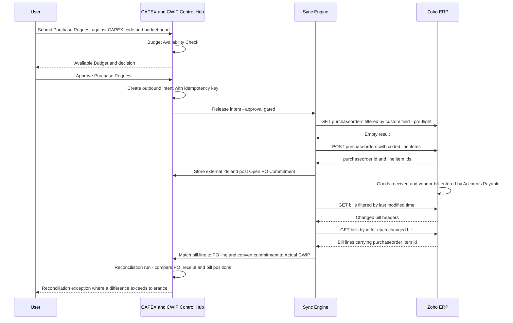

## 18. Bidirectional Data-Flow Matrix

This section is the contract between the CAPEX and CWIP Control Hub (referred to below as "the Hub") and Zoho ERP. It states, for every business object, which system owns each of create, update and delete, what triggers movement, which endpoint carries it, how the two records are tied together, how a repeated call is made safe, and who is accountable when it fails.

A coding agent implementing the integration layer should be able to build the entire sync engine from §18.4 through §18.9 without asking a business question.

Every endpoint, method and OAuth scope in this section is taken from the machine-generated endpoint inventory derived from Zoho's own OpenAPI bundle. Nothing here is written from memory. `[source: Zoho ERP OpenAPI bundle openapi-all.zip, sha256 E95A0399… — verified 2026-08-05]`

### 18.1 Base path resolution

All 17 Zoho ERP modules referenced in this section are served from the v3 root. Throughout §18 Bidirectional Data-Flow Matrix, §19 Field, Custom-Field and Reporting-Tag Mapping and §27 Integration Reconciliation Design:

- `{BASE_V3}` = `https://www.zohoapis.in/erp/v3`
- `{BASE_V1}` = `https://www.zohoapis.in/erp/v1`

The base path resolves **per module, not per connection**: 64 of 78 modules are on v3 and 14 are on v1 (`departments`, `designations`, `employee-salary`, `employee-statutory`, `employees`, `expense-categories`, `expense-claims`, `expense-reports`, `income-tax-details`, `payruns`, `receipts`, `salary-revisions`, `trips`, `work-center-timings`). `[source: Zoho ERP OpenAPI bundle openapi-all.zip, sha256 E95A0399… — verified 2026-08-05]`

> **Implementation warning.** The v1 module named `receipts` is **not** Purchase Receive. Goods receipt lives in the v3 module `purchasereceives`. A connector that resolves "receipt" by string match will call the wrong module. The API Endpoint Catalogue entity must store the base path against the module, never against the connection profile. See §14 Zoho ERP Connector Setup Module.

The host shown above is the host declared in the specification's `servers` block. Per-data-centre host substitution is specified in §15 OAuth, Credential and Scope Management.

### 18.2 Legend

**Direction codes**

| Code | Meaning |
|---|---|
| IN | Zoho ERP is the producer; the Hub reads and stores a reference copy |
| OUT | The Hub is the producer; Zoho ERP receives the write |
| BI | Both systems write different fields of the same object; field-level ownership is defined in §19 |
| NONE | No API path exists in either direction; the object is Hub-only or manual |

**Authority codes** — applied separately to Create, Update and Delete, written as a `C/U/D` triple.

| Code | Meaning |
|---|---|
| Z | Zoho ERP is the system of record for this operation. The Hub must never perform it. |
| H | The Hub is the system of record. Zoho ERP holds no copy, or holds a projection only. |
| H→Z | The Hub originates the operation and pushes it to Zoho ERP under the automation class in §18.7. |
| — | The operation is not permitted by either system for this object in this design. |

**Automation classes** — every OUT or BI row carries exactly one.

| Class | Meaning | Human involvement |
|---|---|---|
| AUTO | Executed by the sync engine with no human step once the upstream approval has completed | None at call time |
| APPROVAL-GATED | Queued as an outbound intent; released only when the named role approves the release in the Hub | One explicit release |
| MANUAL | A user presses an action button on a named screen; never scheduled | Every occurrence |
| POC-ONLY | Demonstrated in the proof of concept against a mock or a sandbox organisation; **not** proposed for production | Demonstration only |
| NOT-RECOMMENDED | Technically possible against a documented endpoint, but the design advises against it, with the reason stated in the row | Should not be built |

**Sync-status field.** Every synced record carries `sync_status`. Its failure values are the frozen labels `Integration Failed` and `Reconciliation Pending`. Its non-failure values belong to the Integration Event lifecycle specified in §30 State Diagrams.

> **Contract gap.** `C3_statuses.json` supplies `INTEGRATION_FAILED` and `RECONCILIATION_PENDING` but no positive or in-flight sync label (no equivalent of Queued, In Progress or Synced). Rather than invent labels, §18 names only the two frozen failure statuses and defers the in-flight vocabulary to §30 State Diagrams. This is recorded as a contract gap, not resolved here.

### 18.3 Header versus line ownership

Definition of Done item 18 requires flows defined at both header and line level. The two levels are **not** symmetric in Zoho ERP, and the asymmetry drives the whole design:

| Object | Header carries CAPEX/WBS coding? | Line carries CAPEX/WBS coding? | Consequence |
|---|---|---|---|
| Purchase Order | Partly — `tags`, `custom_fields`, `location_id` | Yes — `project_id`, `tags`, `item_custom_fields`, `account_id`, `location_id` | Line is the control level |
| Bill | **No `project_id` at header** | Yes — `project_id`, `tags`, `item_custom_fields`, `account_id`, `location_id`, plus `purchaseorder_item_id` | Line is the only usable level |
| Purchase Receive | Header carries `purchaseorder_id` and `custom_fields` | **No** — line fields are only `line_item_id`, `item_id`, `name`, `description`, `item_order`, `quantity`, `unit` | Coding must be reconstructed by the Hub |
| Journal | `tags`, `custom_fields`, `location_id` | Yes — `project_id`, `tags`, `account_id`, `location_id`; **no custom fields of any kind** | Reporting tag or `project_id` only |
| Fixed Asset | `tags`, `custom_fields` | No lines | No link to source project, PO or bill |

`[source: Zoho ERP OpenAPI bundle openapi-all.zip, sha256 E95A0399… — verified 2026-08-05]`

**Binding rule for the whole blueprint:** every WBS-to-transaction mapping is defined at **line** level. A header-level mapping is invalid because the bill header has no `project_id` and would silently lose the coding on the one document that creates Actual CWIP. Field-by-field carriers are specified in §19 Field, Custom-Field and Reporting-Tag Mapping.

### 18.4 Master-data flow matrix

All rows below are inbound reference data. The Hub never becomes the master for vendor, item, location or account data — that would create two sources of truth for the finance ledger.

| Object | Source | Target | Direction | C/U/D authority | Trigger | Endpoint and scope | External ID stored by the Hub | Idempotency key | Sync status on failure | Reconciliation | Error owner |
|---|---|---|---|---|---|---|---|---|---|---|---|
| Zoho Organisation | Zoho ERP | Hub `Zoho Organisation Mapping` | IN | Z/Z/Z | Setup wizard step; manual refresh from SCR-33 | `GET {BASE_V3}/organizations` and `GET {BASE_V3}/organizations/{organization_id}`, scope `ERP.settings.READ` | `zoho_organization_id` | `organization_id` | Integration Failed | Full refresh; count and name compare | System Administrator |
| Vendor (Contact, `contact_type=vendor`) | Zoho ERP | Hub `Purchase Order Reference` vendor attributes | IN | Z/Z/Z | Initial sync; scheduled refresh; on-demand from SCR-35 | `GET {BASE_V3}/contacts`, scope `ERP.contacts.READ`; detail `GET {BASE_V3}/contacts/{contact_id}` | `contact_id` | `contact_id` | Integration Failed | **Full refresh** — see limitation below | Procurement |
| Item | Zoho ERP | Hub item reference | IN | Z/Z/Z | Initial sync; scheduled refresh | `GET {BASE_V3}/items`, scope `ERP.settings.READ`; detail `GET {BASE_V3}/items/{item_id}` | `item_id` | `item_id` | Integration Failed | **Full refresh** — see limitation below | Procurement |
| Location (maps to Hub `Plant`) | Zoho ERP | Hub `Plant` mapping | IN | Z/Z/Z | Setup wizard; manual refresh | `GET {BASE_V3}/locations`, scope `ERP.settings.READ` | `location_id` | `location_id` | Integration Failed | Full refresh; the list accepts only `organization_id` | System Administrator |
| Chart of Accounts | Zoho ERP | Hub `Budget Head` mapping and CWIP account | IN | Z/Z/Z | Initial sync; nightly delta | `GET {BASE_V3}/chartofaccounts`, scope `ERP.accountants.READ` | `account_id`, `account_code` | `account_id` | Integration Failed | **Delta** on `last_modified_time`; monthly full refresh | Finance |
| Reporting Tag and tag options | Zoho ERP | Hub `Field Mapping` carrier registry | IN | Z/Z/Z | Setup wizard; on every mapping change | `GET {BASE_V3}/reportingtags`, `GET {BASE_V3}/reportingtags/options`, scope `ERP.settings.READ` | `tag_id`, `tag_option_id` | `tag_id` plus `tag_option_id` | Integration Failed | Full refresh; option-set diff against the Hub WBS register | System Administrator |
| Currency and exchange rate | Zoho ERP | Hub currency reference | IN | Z/Z/Z | Setup wizard; daily | `GET {BASE_V3}/settings/currencies` and `GET {BASE_V3}/settings/currencies/{currency_id}/exchangerates`, scope `ERP.settings.READ` | `currency_id`, `exchange_rate_id` | `currency_id` plus effective date | Integration Failed | Full refresh; rate-date compare | Finance |
| User | Zoho ERP | Hub connector diagnostics only | IN | Z/Z/Z | Setup wizard; scope validation | `GET {BASE_V3}/users` and `GET {BASE_V3}/users/me`, scope `ERP.settings.READ` | `user_id` | `user_id` | Integration Failed | Full refresh | System Administrator |
| Zoho Project (coding carrier for CAPEX code) | Hub | Zoho ERP | BI | H→Z / H→Z / — | CAPEX Project reaches Released in the Hub | `POST {BASE_V3}/projects` scope `ERP.projects.CREATE`; `PUT {BASE_V3}/projects/{project_id}` scope `ERP.projects.UPDATE`; read back `GET {BASE_V3}/projects` scope `ERP.projects.READ` | `project_id` on Hub `Project` | `X-Unique-Identifier-Key` = CAPEX-code custom field, `X-Unique-Identifier-Value` = CAPEX code, `X-Upsert` on `PUT {BASE_V3}/projects` | Integration Failed | Full refresh; name and code compare | Project Finance Controller |

**Evidenced limitations that shape the master-data rows**

1. `GET {BASE_V3}/contacts` accepts `organization_id`, `contact_type`, `contact_name`, `company_name`, `first_name`, `last_name`, `address`, `email`, `phone`, `filter_by`, `search_text`, `sort_column`, `zcrm_contact_id`, `zcrm_account_id`, `zcrm_vendor_id`, `page`, `per_page`. It does **not** accept `last_modified_time`. Vendor sync is therefore full-refresh. Whether `sort_column` accepts a last-modified column that would permit an early-exit incremental read is **UNVERIFIED - REQUIRES ZOHO CONFIRMATION**. `[source: Zoho ERP OpenAPI bundle openapi-all.zip, sha256 E95A0399… — verified 2026-08-05]`
2. `GET {BASE_V3}/items` accepts `organization_id`, `name`, `description`, `rate`, `tax_id`, `tax_name`, `is_taxable`, `tax_exemption_id`, `account_id`, `filter_by`, `search_text`, `sort_column` — and declares no `page` or `per_page`, and no `last_modified_time`. Item sync is full-refresh, and the behaviour of the endpoint on an item master larger than one page is **UNVERIFIED - REQUIRES ZOHO CONFIRMATION**. `[source: Zoho ERP OpenAPI bundle openapi-all.zip, sha256 E95A0399… — verified 2026-08-05]`
3. `POST {BASE_V3}/projects` requires `customer_id` and `billing_type`. A capital project with no external customer must still be pinned to a Contact. The design uses a single internal Contact record per legal entity for this purpose; the Contact to be used is an entry in the Master Data Configuration screen (SCR-30), never hard-coded. `[source: https://www.zoho.com/erp/api/v3/projects/ — verified 2026-08-05]`
4. Zoho ERP Projects are flat. `parent_id` exists only on Tasks, and a Project carries only scalar budget fields (`budget_amount`, `budget_type`, `cost_budget_amount`) with no budget-by-head structure. The multi-level WBS and the budget register therefore remain owned by the Hub. `[source: Zoho ERP OpenAPI bundle openapi-all.zip, sha256 E95A0399… — verified 2026-08-05]`

### 18.5 Transaction flow matrix

| Object | Source | Target | Direction | C/U/D authority | Trigger | Endpoint and scope | External ID stored by the Hub | Idempotency key | Sync status on failure | Reconciliation | Error owner |
|---|---|---|---|---|---|---|---|---|---|---|---|
| Purchase Request (Hub-owned) | Hub | — | NONE | H/H/H | User submits on SCR-14 | **No endpoint exists anywhere in the Zoho ERP specification.** See §24.3 | none | Hub `purchase_request_id` | not applicable | Hub-internal only; never reconciled to Zoho | Requestor |
| Purchase Order header | Zoho ERP | Hub `Purchase Order Reference` | IN | Z/Z/Z | Poll on `last_modified_time`; also on demand from SCR-15 | `GET {BASE_V3}/purchaseorders`, scope `ERP.purchaseorders.READ` | `purchaseorder_id`, `purchaseorder_number` | `purchaseorder_id` plus `last_modified_time` | Integration Failed | Delta on `last_modified_time`; nightly status sweep on `status` | Procurement |
| Purchase Order line | Zoho ERP | Hub `PO Line` | IN | Z/Z/Z | For each PO whose `last_modified_time` advanced | `GET {BASE_V3}/purchaseorders/{purchaseorder_id}`, scope `ERP.purchaseorders.READ` | `line_item_id` on the PO detail response | `purchaseorder_id` plus `item_order` | Integration Failed | Line-count and line-total compare against header total | Procurement |
| Purchase Order (create from an approved Purchase Request) | Hub | Zoho ERP | OUT | H→Z / — / — | Purchase Request reaches Approved **and** Budget Availability Check passes | `POST {BASE_V3}/purchaseorders`, scope `ERP.purchaseorders.CREATE` | `purchaseorder_id` returned | Pre-flight `GET {BASE_V3}/purchaseorders?custom_field=<PR reference>`; outbound-intent unique key in the Hub | Integration Failed | Read-back of the created PO before the commitment is posted | Procurement |
| Purchase Order coding correction (line `project_id`, `tags`, `item_custom_fields`) | Hub | Zoho ERP | OUT | — / H→Z / — | Mapping repair action on SCR-36 | `PUT {BASE_V3}/purchaseorders/{purchaseorder_id}`, scope `ERP.purchaseorders.UPDATE` | `purchaseorder_id` | `X-Unique-Identifier-Key` and `X-Unique-Identifier-Value` with `X-Upsert` on `PUT {BASE_V3}/purchaseorders` | Integration Failed | Read-back and field-level diff | Procurement |
| Purchase Order approve | Hub | Zoho ERP | OUT | — / H→Z / — | Demonstration of the end-to-end flow only | `POST {BASE_V3}/purchaseorders/{purchaseorder_id}/approve`, scope `ERP.purchaseorders.CREATE` | `purchaseorder_id` | `purchaseorder_id` plus target status | Integration Failed | Status read-back | Procurement |
| Purchase Order cancel | Hub | Zoho ERP | OUT | — / H→Z / — | Commitment release approved on SCR-15 | `POST {BASE_V3}/purchaseorders/{purchaseorder_id}/status/cancelled`, scope `ERP.purchaseorders.CREATE` | `purchaseorder_id` | `purchaseorder_id` plus target status | Integration Failed | Status read-back; commitment release posted only after read-back confirms | Procurement |
| Goods Receipt header | Zoho ERP | Hub `GRN Reference` | IN | Z/Z/Z | **No list endpoint. Discovery is impossible by polling.** Retrieval only once an identifier is known | `GET {BASE_V3}/purchasereceives/{purchasereceive_id}`, scope `ERP.purchasereceives.READ` | `purchasereceive_id`, `purchaseorder_id` from the header | `purchasereceive_id` | Integration Failed | Reconstructed; see §24.5 | Project Manager |
| Goods Receipt line | Zoho ERP | Hub `GRN Line` | IN | Z/Z/Z | With the header | Same call as above | `line_item_id` on the receipt line | `purchasereceive_id` plus `item_order` | Integration Failed | Quantity-based allocation to PO lines; see §24.5 | Project Manager |
| Goods Receipt (Hub-captured fallback) | Hub | — | NONE | H/H/H | User records receipt on SCR-16 when the Zoho record is not retrievable | none | none | Hub `grn_id` | not applicable | Flagged Reconciliation Pending until a Zoho receipt is matched | Project Manager |
| Vendor Bill header | Zoho ERP | Hub `Vendor Bill Reference` | IN | Z/Z/Z | Poll on `last_modified_time`; also filterable by `purchaseorder_id` and `project_id` | `GET {BASE_V3}/bills`, scope `ERP.bills.READ` | `bill_id`, `bill_number` | `bill_id` plus `last_modified_time` | Integration Failed | Delta on `last_modified_time`; header total versus sum of lines | Finance |
| Vendor Bill line | Zoho ERP | Hub `Bill Line` | IN | Z/Z/Z | For each bill whose `last_modified_time` advanced | `GET {BASE_V3}/bills/{bill_id}`, scope `ERP.bills.READ` | `line_item_id`, and **`purchaseorder_item_id`** | `bill_id` plus `line_item_id` | Integration Failed | Matched to `PO Line` on `purchaseorder_item_id`; this is the commitment-relief key | Finance |
| Vendor Bill create | Hub | Zoho ERP | OUT | H→Z / — / — | Not proposed | `POST {BASE_V3}/bills`, scope `ERP.bills.CREATE` | `bill_id` | `X-Upsert` on `PUT {BASE_V3}/bills` | not applicable | not applicable | Finance |
| Vendor Credit (credit note against a bill) | Zoho ERP | Hub `Actual Ledger` reversal entry | IN | Z/Z/Z | Poll on `last_modified_time` | `GET {BASE_V3}/vendorcredits`, scope `ERP.debitnotes.READ`; detail `GET {BASE_V3}/vendorcredits/{vendor_credit_id}`; applied bills `GET {BASE_V3}/vendorcredits/{vendor_credit_id}/bills` | `vendor_credit_id` | `vendor_credit_id` plus `last_modified_time` | Integration Failed | Delta on `last_modified_time`; applied-amount compare against the credited bill | Finance |
| Vendor Payment and capital advance | Zoho ERP | Hub advance exposure register | IN | Z/Z/Z | Poll on `last_modified_time` | `GET {BASE_V3}/vendorpayments`, scope `ERP.vendorpayments.READ`; detail `GET {BASE_V3}/vendorpayments/{payment_id}` | `payment_id` | `payment_id` plus `last_modified_time` | Integration Failed | Delta; an advance is derived as a payment whose bill allocation array is empty | Finance |
| CWIP-transfer Journal | Hub | Zoho ERP | OUT | H→Z / H→Z / — | Capitalisation Request approved on SCR-21 | `POST {BASE_V3}/journals` scope `ERP.accountants.CREATE`; then `POST {BASE_V3}/journals/{journal_id}/submit` and `POST {BASE_V3}/journals/{journal_id}/approve`, same scope | `journal_id` | Pre-flight `GET {BASE_V3}/journals?reference_number=<capitalisation request number>`; outbound-intent unique key | Integration Failed | Read-back of published journal; line-level `project_id` and `tags` compare | Project Finance Controller |
| Journal (inbound, any CWIP-account posting not raised by the Hub) | Zoho ERP | Hub `Actual Ledger` | IN | Z/Z/Z | Poll on `last_modified_time`, filtered by `project_id` and by CWIP `account_id` | `GET {BASE_V3}/journals`, scope `ERP.accountants.READ` | `journal_id`, `line_id` | `journal_id` plus `last_modified_time` | Integration Failed | Delta; unmatched CWIP postings raise a reconciliation exception | Finance |
| Fixed Asset | Hub | Zoho ERP | OUT | H→Z / H→Z / — | Asset Allocation approved on SCR-22 | `POST {BASE_V3}/fixedassets`, scope `ERP.fixedasset.CREATE`; `PUT {BASE_V3}/fixedassets/{fixed_asset_id}`, scope `ERP.fixedasset.UPDATE` | `fixed_asset_id` on Hub `Asset Allocation` | Outbound-intent unique key only; no upsert-by-custom-field header on this module | Integration Failed | **Full refresh only** — no `last_modified_time`; see §27.4 | Finance |
| Fixed Asset (inbound verification read) | Zoho ERP | Hub `Asset Allocation` | IN | Z/Z/Z | After each outbound create; and on every full reconciliation run | `GET {BASE_V3}/fixedassets`, scope `ERP.fixedasset.READ`; detail `GET {BASE_V3}/fixedassets/{fixed_asset_id}` | `fixed_asset_id` | `fixed_asset_id` | Reconciliation Pending | Full refresh; matched on asset naming convention and `tags` | Finance |
| Reporting Tag option (new WBS element published as a tag option) | Hub | Zoho ERP | OUT | H→Z / H→Z / — | WBS element released and mapped on SCR-36 | `POST {BASE_V3}/reportingtags` and `PUT {BASE_V3}/reportingtags/{tag_id}/options`, scope `ERP.settings.CREATE` and `ERP.settings.UPDATE` | `tag_id`, `tag_option_id` | Pre-flight `GET {BASE_V3}/reportingtags/options`; option label is the natural key | Integration Failed | Option-set diff on every run | System Administrator |
| Custom field **definition** | — | — | NONE | —/—/— | Manual prerequisite before first sync | **No endpoint exists.** Only value-setting endpoints exist, e.g. `PUT {BASE_V3}/purchaseorder/{purchaseorder_id}/customfields` | `customfield_id` discovered after manual creation | not applicable | not applicable | Presence check at connection test; missing definition blocks the mapping | System Administrator |

`[source: Zoho ERP OpenAPI bundle openapi-all.zip, sha256 E95A0399… — verified 2026-08-05]`

### 18.6 Objects with no API path in either direction

| Object | Why it has no flow | Where it lives instead |
|---|---|---|
| Purchase Request | Zero paths, zero modules and zero scopes match across all 78 modules, 561 paths and 163 scopes | Hub-owned entity `Purchase Request Reference`; see §24.3 and §24.4 |
| WBS Element | Zoho ERP Projects are flat; nesting exists only under Tasks via `parent_id`, and a Task carries no budget-by-head structure | Hub-owned entity `WBS Element`, projected into Zoho ERP only as a reporting-tag option (§19.5) |
| Budget Version, Budget Line, Budget Revision | A Zoho ERP Project exposes only scalar `budget_amount`, `budget_type` and `cost_budget_amount` | Hub-owned; never pushed |
| Commitment Ledger | Zoho ERP does not compute open commitment | Hub-derived from `PO Line` less matched `Bill Line`; see §22 Budget and Commitment Calculation Logic |
| Approval Matrix, Approval Instance | Out of scope for the connector by design — approval authority must not be split across two systems | Hub-owned |
| Custom field definition | No definition endpoint exists in the specification | Manual UI prerequisite; see §19.4 |

`[source: Zoho ERP OpenAPI bundle openapi-all.zip, sha256 E95A0399… — verified 2026-08-05]`

### 18.7 Outbound action register — automation classification

Every write the Hub is capable of making is listed here with its class. A write that is not in this table must not be built.

| # | Outbound action | Endpoint | Class | Releasing role | Reason for the classification |
|---|---|---|---|---|---|
| 1 | Create Zoho Project as the CAPEX code carrier | `POST {BASE_V3}/projects` | AUTO | none (fires on CAPEX Project reaching Released) | Deterministic, idempotent via `X-Upsert`, and required before any line can be coded |
| 2 | Update Zoho Project name or status | `PUT {BASE_V3}/projects/{project_id}` | AUTO | none | Field-scoped update; no financial effect |
| 3 | Create or update a reporting tag option for a released WBS element | `POST {BASE_V3}/reportingtags`, `PUT {BASE_V3}/reportingtags/{tag_id}/options` | APPROVAL-GATED | System Administrator | A reporting tag is a tenant-wide dimension. Uncontrolled option creation pollutes every Zoho report, not only CAPEX reports |
| 4 | Create a Purchase Order from an approved Purchase Request | `POST {BASE_V3}/purchaseorders` | APPROVAL-GATED | Procurement | This is the moment budget is committed. A release step gives Procurement a last look at vendor, rate and coding before the PO exists |
| 5 | Correct coding on an existing PO line | `PUT {BASE_V3}/purchaseorders/{purchaseorder_id}` | MANUAL | Procurement | The update replaces the `line_items` array wholesale. A partial-payload mistake silently deletes lines. See the warning below |
| 6 | Cancel a Purchase Order | `POST {BASE_V3}/purchaseorders/{purchaseorder_id}/status/cancelled` | APPROVAL-GATED | Procurement | Releases commitment and changes Available Budget |
| 7 | Submit a Purchase Order for approval | `POST {BASE_V3}/purchaseorders/{purchaseorder_id}/submit` | POC-ONLY | none | Included in the proof of concept to show the full lifecycle. In production the Zoho approval chain is driven by Zoho users |
| 8 | Approve a Purchase Order | `POST {BASE_V3}/purchaseorders/{purchaseorder_id}/approve` | NOT-RECOMMENDED | none | Approval authority must exist in exactly one place. If the Hub can approve in Zoho, the Zoho approval log stops being evidence of who approved. This breaks REQ-SEC-001 (audit trail from budget approval through procurement, accounting and final capitalisation) |
| 9 | Create the CWIP-transfer journal on capitalisation | `POST {BASE_V3}/journals` | APPROVAL-GATED | Project Finance Controller | Creates a general-ledger posting |
| 10 | Submit and approve that journal | `POST {BASE_V3}/journals/{journal_id}/submit`, `/approve` | APPROVAL-GATED | Finance | Same release step as #9; the Hub must not self-approve its own posting. Where the client's segregation-of-duties policy forbids it, downgrade #10 to MANUAL |
| 11 | Publish that journal | `POST {BASE_V3}/journals/{journal_id}/status/publish` | MANUAL | Finance | Terminal accounting act |
| 12 | Reverse a published journal | `POST {BASE_V3}/journals/{journal_id}/reverse` | MANUAL | Finance | Correction path only |
| 13 | Create a Fixed Asset from an approved Asset Allocation | `POST {BASE_V3}/fixedassets` | APPROVAL-GATED | Finance | Creates a depreciable asset. No idempotency header is available on this module, so a duplicate is expensive to unwind |
| 14 | Create or update a Vendor (Contact) | `POST {BASE_V3}/contacts`, `PUT {BASE_V3}/contacts/{contact_id}` | NOT-RECOMMENDED | none | Vendor master is owned by Procurement inside Zoho ERP. A second writer creates duplicate vendors and breaks AP matching |
| 15 | Create or update an Item | `POST {BASE_V3}/items`, `PUT {BASE_V3}/items/{item_id}` | NOT-RECOMMENDED | none | Same reason as #14 |
| 16 | Create a Chart of Accounts entry | `POST {BASE_V3}/chartofaccounts` | NOT-RECOMMENDED | none | The chart of accounts is a controlled finance artefact |
| 17 | Create a Vendor Bill | `POST {BASE_V3}/bills` | NOT-RECOMMENDED | none | Accounts Payable owns bill entry. If the Hub creates bills, Actual CWIP becomes self-asserted rather than independently posted, and the whole control loses its independence |
| 18 | Create a Purchase Receive | `POST {BASE_V3}/purchasereceives` | POC-ONLY | none | Used in the proof of concept only, to generate a receipt whose identifier the Hub already knows, so that the retrieval-by-id path can be demonstrated despite the absence of a list endpoint |
| 19 | Delete anything in Zoho ERP | any `DELETE` | NOT-RECOMMENDED | none | The Hub never deletes in Zoho ERP. Reversal is by cancel, void, credit note or reversing journal, all of which leave an audit trail |
| 20 | Create a custom field definition | — | NONE | — | No endpoint exists. Manual prerequisite |

> **Implementation warning on action #5.** `PUT {BASE_V3}/purchaseorders/{purchaseorder_id}` takes a `line_items` array. The specification does not document a merge semantic for that array, so the safe assumption is full replacement. The connector must therefore (a) `GET` the current PO, (b) mutate only the coding fields on the retrieved lines, (c) `PUT` the complete array back, and (d) read back and compare line count and total before treating the update as successful. Whether the API merges or replaces is **UNVERIFIED - REQUIRES ZOHO CONFIRMATION**.

### 18.8 Idempotency design

Three mechanisms are available, in descending order of strength. The connector selects per endpoint, and the choice is recorded in the `API Endpoint Catalogue` entity.

**Mechanism A — vendor-supplied upsert by custom field (strongest).** Fourteen modules expose a collection-level `PUT` that accepts the request headers `X-Unique-Identifier-Key`, `X-Unique-Identifier-Value` and `X-Upsert`. Of these, four matter to this design: `PUT {BASE_V3}/purchaseorders`, `PUT {BASE_V3}/bills`, `PUT {BASE_V3}/projects` and `PUT {BASE_V3}/contacts`. `X-Unique-Identifier-Key` and `X-Unique-Identifier-Value` are **required parameters** on these operations. `[source: Zoho ERP OpenAPI bundle openapi-all.zip, sha256 E95A0399… — verified 2026-08-05]`

The unique identifier key is a custom field on the Zoho record holding the Hub's own primary key. Because no API can create a custom field definition, this mechanism is unavailable until the manual prerequisite in §19.4 is complete. A connector that has not discovered the custom field must fall back to Mechanism B and must say so on SCR-38.

**Mechanism B — pre-flight lookup by natural key.** Before any `POST`, query for an existing record carrying the Hub reference:

| Target | Pre-flight query |
|---|---|
| Purchase Order | `GET {BASE_V3}/purchaseorders?custom_field=<hub PR reference>` — `custom_field` is a documented query parameter on this list operation |
| Bill | `GET {BASE_V3}/bills?reference_number=<hub reference>` |
| Journal | `GET {BASE_V3}/journals?reference_number=<hub capitalisation request number>` |
| Vendor Credit | `GET {BASE_V3}/vendorcredits?reference_number=<hub reference>` |
| Fixed Asset | No reference filter exists. Fall back to Mechanism C plus a full-refresh scan on asset name |

`[source: Zoho ERP OpenAPI bundle openapi-all.zip, sha256 E95A0399… — verified 2026-08-05]`

**Mechanism C — Hub-side outbound intent (always applied, in addition to A or B).** Every outbound write is first persisted as an `Integration Event` row with a deterministic `idempotency_key`:

```
idempotency_key = sha256(
    connection_profile_id + "|" +
    zoho_organization_id  + "|" +
    target_object         + "|" +
    hub_record_id         + "|" +
    hub_record_version    + "|" +
    intent_type
)
```

Rules:
- The key is unique-indexed. A second attempt to enqueue the same intent is a no-op, not an error.
- The key is recorded against the Zoho identifier once the call returns, closing the loop.
- A call that times out without a response leaves the intent in an unresolved state; the next run performs the Mechanism B pre-flight before retrying, and never blind-retries a `POST`.
- `hub_record_version` is included so that a legitimate second push after a genuine change produces a different key.

**Inbound idempotency.** Inbound records are upserted on `(zoho_organization_id, object_type, zoho_id)`. A record whose `last_modified_time` is not greater than the stored value is skipped without a write, so a replayed page is harmless.

### 18.9 Trigger and frequency design

Polling is the primary ingestion mechanism. Webhooks are treated as unproven throughout — see §24.6.

| Flow | Trigger | Frequency (recommendation, configurable on SCR-37) | Watermark | Look-back |
|---|---|---|---|---|
| Purchase Order delta | Scheduled | Every 15 minutes | `last_modified_time` per organisation | 24 hours |
| Bill delta | Scheduled | Every 15 minutes | `last_modified_time` per organisation | 24 hours |
| Journal delta (CWIP accounts) | Scheduled | Hourly | `last_modified_time` per organisation | 48 hours |
| Vendor Credit delta | Scheduled | Hourly | `last_modified_time` | 24 hours |
| Vendor Payment delta | Scheduled | Hourly | `last_modified_time` | 24 hours |
| Chart of Accounts delta | Scheduled | Nightly | `last_modified_time` | 7 days |
| Vendor full refresh | Scheduled | Nightly | none — no last-modified filter exists | not applicable |
| Item full refresh | Scheduled | Nightly | none — no last-modified filter exists | not applicable |
| Location, Currency, Reporting Tag full refresh | Scheduled | Nightly | none | not applicable |
| Fixed Asset full refresh | Scheduled | Nightly and before every capitalisation reconciliation | none — no last-modified field exists | not applicable |
| Goods Receipt retrieval | Event-driven only, by identifier | On demand | not applicable | not applicable |
| Any outbound write | Event-driven, on release of an outbound intent | Immediate, with backoff | not applicable | not applicable |

The look-back window exists because `last_modified_time` filtering is a server-side clock comparison and the Hub's clock may drift. Each run queries from `watermark − look_back` and relies on inbound idempotency to discard what it has already seen. This is a DERIVED-RECOMMENDATION; the client has stated no sync-frequency requirement.

**Rate-limit budget.** Zoho ERP documents 100 requests per minute per organisation `[source: https://www.zoho.com/erp/api/v3/introduction/ — verified 2026-08-05]`, and a separate concurrent limiter defined as the maximum number of API calls simultaneously active for an organisation at any point in time `[source: https://www.zoho.com/erp/api/v3/introduction/ — verified 2026-08-05]`. Lists are paginated to 200 items by default `[source: https://www.zoho.com/erp/api/v3/pagination/ — verified 2026-08-05]`, and the first page is returned by default `[source: https://www.zoho.com/erp/api/v3/pagination/ — verified 2026-08-05]`. The specification declares a `per_page` default of 200 on 64 operations and an explicit maximum of 200 on 2 operations; a global maximum is not stated, so the connector must not request more than 200. `[source: Zoho ERP OpenAPI bundle openapi-all.zip, sha256 E95A0399… — verified 2026-08-05]`

A 15-minute Purchase Order and Bill cycle costs, per organisation, 2 list calls plus one detail call per changed document. The scheduler must hold a token bucket sized below 100 per minute per organisation and must serialise organisations, because the limit is per organisation and the Hub may hold two entities. Behaviour of the connector when the limit is hit is specified in §25 API and Event Architecture; the user-facing message is `MSG-INT-003`.

### 18.10 Error ownership

The error owner is the role who is notified and who is accountable for clearing the condition. It is not the role who caused it.

| Failure class | Detection | Sync status | User-facing message | Error owner | Escalation if unresolved |
|---|---|---|---|---|---|
| Missing OAuth scope | Connection test or a 4xx naming the scope | Integration Failed | `MSG-INT-001` | System Administrator | CFO after 1 business day |
| Refresh token revoked or expired | Refresh attempt fails | Integration Failed | `MSG-INT-002` | System Administrator | CFO after 4 hours; all outbound writes pause |
| Rate limit reached | 429 or the documented rate-limit error body | no status change; queue grows | `MSG-INT-003` | System Administrator | none; self-clearing with backoff |
| Repeated failure, record dead-lettered | Attempt count exceeds the configured maximum | Integration Failed | `MSG-INT-004` | System Administrator, with a functional co-owner from the row's Error owner column in §18.4 and §18.5 | Project Finance Controller after 1 business day |
| Organisation mapping change attempted | User action on SCR-33 | not applicable | `MSG-INT-005` | System Administrator | requires CFO approval before it proceeds |
| Value difference beyond tolerance | Reconciliation run; see §27 | Reconciliation Pending | `MSG-INT-006` | The correction owner named in the §27.2 matrix | Project Finance Controller after 2 business days |
| Missing custom field definition | Discovery call at connection test finds no matching `customfield_id` | Integration Failed on the affected mapping only | `MSG-INT-001` variant naming the field rather than the scope | System Administrator | blocks go-live; see §19.4 |
| Goods receipt cannot be retrieved | No identifier available and no list endpoint | Reconciliation Pending on the affected PO | `MSG-PRC-005` | Project Manager | Procurement after 5 days of ageing |

### 18.11 End-to-end sequence



### 18.12 What this matrix does not cover

- **Purchase Request in Zoho ERP.** There is no flow because there is no API. The three-column treatment demanded by CONF-01 and the seven compared fallbacks are in §24.3 and §24.4.
- **Received-but-unbilled discovery.** The receipt module has no list endpoint and its lines carry no PO-line link, so the flow in §18.5 can only retrieve a receipt whose identifier is already known. The reconstruction design is in §24.5 and the reconciliation treatment in §27.7.
- **Webhook-driven triggers.** Excluded by design until proven; see §24.6.
- **Field-level mapping.** Which Hub field lands in which Zoho field, and which carrier holds the CAPEX code, the WBS code and the budget head, is specified in §19 Field, Custom-Field and Reporting-Tag Mapping.
