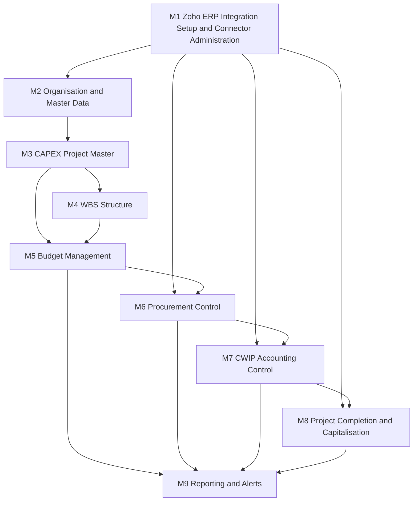

## 20. Functional Modules

### 20.1 How this section is organised, and what it is not

The application is analysed under the nine modules named in the master prompt. Each module below carries five fixed parts, in this order:

1. **Scope** — what the module owns, and what it explicitly does not own.
2. **Capability checklist** — the master prompt's own capability list for that module, verbatim as list items, with a POC / Production / Excluded disposition against each so nothing is silently dropped.
3. **Key screens** — screen identifiers from `C8_screens.json`. Full 24-attribute specifications live in §48 Screen Catalogue and Navigation Map; this section states only which screens belong to which module and why.
4. **Key entities** — entity names from `C4_entities.json`. Field-level definitions live in §28 Data Model.
5. **Key rules** — the binding rules, each pointing to a rule identifier defined in §21 Detailed Business Rules or to the arithmetic in §22 Budget and Commitment Calculation Logic.

Each module also states its requirement coverage (`C1_req_ids.json`), the statuses it drives (`C3_statuses.json`), the messages it raises (`C10_messages.json`), its Zoho ERP dependency, and the conflicts it inherits (`C13_conflicts.json`).

**What this section is not.** It is not a screen specification, not a data model and not an integration design. Where a module's substance lives elsewhere, this section says so and does not repeat it. Module 1 in particular is specified in full in §14 Zoho ERP Connector Setup Module and §15 OAuth, Credential and Scope Management; only its boundary is restated here.

**Provenance warning, applied throughout.** Module 4 (WBS Structure) has no basis in the client document. The client PDF contains no WBS hierarchy at all — its budget structure is strictly project plus budget head (CONF-02). Module 1 is likewise a master-prompt construct; the client document's complete statement on integration mechanics is a single architecture line (CONF-07). Both are tagged `provenance=MASTER-PROMPT` below and must never be presented to Atha Group as confirmed client requirements.

### 20.2 The nine modules at a glance

| # | Module | Provenance | Primary screens | Primary entities | Owns | POC |
|---|---|---|---|---|---|---|
| M1 | Zoho ERP Integration Setup and Connector Administration | MASTER-PROMPT (CONF-07) | SCR-31 to SCR-40 | 18 | The boundary to Zoho ERP | Reduced profile |
| M2 | Organisation and Master Data | CLIENT-PDF (partial) + DERIVED | SCR-29, SCR-30 | 6 | The dimensions everything is coded to | IN |
| M3 | CAPEX Project Master | CLIENT-PDF | SCR-04, SCR-05 | 1 | The CAPEX / CWIP code | IN |
| M4 | WBS Structure | MASTER-PROMPT (CONF-02) | SCR-06, SCR-07, SCR-08 | 1 | Optional budget depth below the project | IN, as scope addition |
| M5 | Budget Management | CLIENT-PDF | SCR-09 to SCR-13 | 4 | The budget register and its versions | IN |
| M6 | Procurement Control | CLIENT-PDF | SCR-14, SCR-15, SCR-16 | 6 | The Purchase Request and the commitment ledger | IN |
| M7 | CWIP Accounting Control | CLIENT-PDF | SCR-17, SCR-18, SCR-19 | 3 | The actual ledger and the CWIP balance | IN |
| M8 | Project Completion and Capitalisation | CLIENT-PDF | SCR-20, SCR-21, SCR-22 | 2 | The exit from CWIP | CONDITIONAL |
| M9 | Reporting and Alerts | CLIENT-PDF | SCR-01, SCR-02, SCR-23 to SCR-28 | 3 | Every derived view and every threshold | IN |

Entity counts total 44, matching `C4_entities.json` exactly. Screen assignments cover all 40 screens exactly once as a primary owner; five screens are shared and are listed as secondary in the module that consumes but does not own them.

### 20.3 Module dependency map

Read the arrows as "must exist before". M1 feeds M2, M6, M7 and M8 because master data, purchase orders, bills and fixed assets all cross the Zoho ERP boundary. M5 feeds M6 because no commitment may be created without an available-budget answer. M9 depends on everything because it derives nothing of its own.

**The one cycle that is deliberately absent.** M9 does not feed back into M5 or M6. Alerts and dashboards observe; they never adjust a budget or release a commitment. Every value change originates in M5, M6, M7 or M8 through an audited transaction.

---

### 20.4 M1 — Zoho ERP Integration Setup and Connector Administration

`provenance=MASTER-PROMPT` (CONF-07). The client document's only statement on integration mechanics is one architecture line naming API, workflow and custom function as the coupling. Everything in this module is blueprint scope and must be sized separately in the roadmap so Atha Group can see its cost.

#### Scope

**Owns.** The entire boundary between the CAPEX and WBS Control Hub and Zoho ERP: connection profiles, OAuth authorisation and token lifecycle, data-centre and organisation resolution, scope validation, field and reporting-tag mapping, sync scheduling and cursors, retry and dead-letter handling, API usage accounting, connector audit and the reconciliation engine's mechanical half.

**Does not own.** Any business decision. This module never evaluates a budget, never approves anything and never decides whether a value is capitalisable. It moves records and records what it moved.

**Base-path rule, binding on the whole module.** The connection profile cannot hold a single API base path. The ERP API is not uniformly `/erp/v3` — 14 of 78 modules are served from `/erp/v1`, including `departments` and `receipts` (OAS-01) `[source: Zoho ERP OpenAPI bundle openapi-all.zip, sha256 E95A0399… — verified 2026-08-05]`. The API Version field is per-module, not per-connection.

#### Capability checklist

| Capability (master prompt, verbatim) | POC | Production | Note |
|---|---|---|---|
| Connection-profile master | Yes | Yes | §14.3 |
| Multi-organisation support | Design only, one live | Yes | CONF-07: the client names exactly one unit |
| Multi-environment support | No | Yes | Sandbox/production separation |
| Zoho data-centre selection | Yes | Yes | §14.6 |
| OAuth Client ID reference | Yes | Yes | Reference only; never the value |
| OAuth Client Secret reference | Yes | Yes | Secret held by reference (§26) |
| Redirect URI | Yes | Yes | §14.8 |
| OAuth consent | Yes, or controlled mock | Yes | POC step 24 permits a controlled mock |
| Access and refresh token management | Yes | Yes | §15.9 to §15.11 |
| Organisation discovery | Yes | Yes | §14.9 |
| Organisation selection | Yes | Yes | MSG-INT-005 guards re-pointing |
| Scope validation | Yes | Yes | §15.8; MSG-INT-001 |
| API connectivity tests | Yes | Yes | §14.10 |
| Module-level connectivity tests | Yes | Yes | Per-module because of the v1/v3 split |
| Secret rotation | No | Yes | §15.11 |
| Connector enable and disable | Yes | Yes | §14.13 |
| Initial sync | Yes | Yes | POC step 29 |
| Incremental sync | Yes | Yes | Cursor on `last_modified_time` where offered |
| Manual resync | Yes | Yes | Required where no last-modified filter exists |
| Sync scheduling | Manual trigger only | Yes | POC-minimal profile, §14.16 |
| Polling configuration | Yes | Yes | Primary ingestion mechanism (CONF-16) |
| Field mapping | Yes | Yes | SCR-36 |
| Custom-field mapping | Yes | Yes | Definitions are a manual prerequisite (OAS-06) |
| Reporting-tag mapping | Yes | Yes | SCR-35 |
| External-ID mapping | Yes | Yes | Idempotency depends on it |
| Data-direction configuration | Yes | Yes | SCR-37 |
| API usage monitoring | Yes | Yes | SCR-38 |
| Rate-limit monitoring | Yes | Yes | MSG-INT-003 |
| Retry queue | Yes | Yes | SCR-39 |
| Dead-letter queue | Engine yes, no UI | Yes | §14.16 |
| Reconciliation | Yes | Yes | SCR-27; POC step 36 |
| Connection audit trail | Yes | Yes | SCR-40 |
| Configuration versioning | No | Yes | Production profile |

#### Key screens

Primary: SCR-31 Zoho ERP Connection Setup Wizard, SCR-32 Zoho OAuth Authorisation and Consent Screen, SCR-33 Zoho Organisation Selection and Mapping, SCR-34 API Scope and Permission Validation, SCR-35 Master Data Mapping Workbench, SCR-36 Transaction Field Mapping Workbench, SCR-37 Sync Direction and Scheduling Configuration, SCR-38 Integration Health and API Usage Dashboard, SCR-39 Failed Sync and Retry Queue, SCR-40 Connector Audit and Credential Activity Log.

Secondary, shared with M9: SCR-26 Integration Event Monitor, SCR-27 Reconciliation Exception Queue.

#### Key entities

Zoho Connection Profile, OAuth Credential Secret Reference, OAuth Scope Requirement, Zoho Organisation Mapping, API Endpoint Catalogue, Field Mapping, Transformation Rule, Sync Configuration, Sync Cursor, Integration Event, Integration Request, Integration Response, Sync Log, Retry Queue, Dead-Letter Record, API Usage Record, Reconciliation Log, Connector Audit Log. Eighteen entities — 41 percent of the data model sits in a module the client never asked for, which is the sizing fact CONF-07 requires be made visible.

#### Key rules

| Rule | Statement | Where |
|---|---|---|
| M1-R1 | Every WBS-to-transaction mapping is defined at **line** level, never header. Bill headers do not carry `project_id`; bill lines and journal lines do (OAS-10) `[source: Zoho ERP OpenAPI bundle openapi-all.zip, sha256 E95A0399… — verified 2026-08-05]` | §19 |
| M1-R2 | Custom-field **definitions** are created manually in the Zoho ERP user interface per organisation and then discovered. There is no API to create a definition (OAS-06) `[source: Zoho ERP OpenAPI bundle openapi-all.zip, sha256 E95A0399… — verified 2026-08-05]` | §14.5 |
| M1-R3 | Ingestion is polling with a stored cursor and a look-back window. Webhooks are a conditional accelerator only, activated only if confirmed (CONF-16) | §25 |
| M1-R4 | Purchase receive identifiers must be captured at creation or discovered from the purchase order. The module exposes no list or search endpoint (OAS-03) `[source: Zoho ERP OpenAPI bundle openapi-all.zip, sha256 E95A0399… — verified 2026-08-05]` | §18 |
| M1-R5 | Fixed-asset synchronisation is full-refresh. The list endpoint offers no last-modified filter (OAS-09) `[source: Zoho ERP OpenAPI bundle openapi-all.zip, sha256 E95A0399… — verified 2026-08-05]` | §27 |
| M1-R6 | An integration failure never blocks a local control decision. Budget checking, PR raising and approval are entirely local (§10.11) | §33 |

Requirements: REQ-INT-014, REQ-INT-015, REQ-INT-016, REQ-INT-019, REQ-INT-021. Statuses driven: Integration Failed, Reconciliation Pending. Messages: MSG-INT-001 to MSG-INT-006. POC steps: 23 to 36.

---

### 20.5 M2 — Organisation and Master Data

`provenance=CLIENT-PDF` for entity, plant, department, budget head and approval matrix as concepts; `provenance=DERIVED-RECOMMENDATION` for cost centre, profit centre and project type, which the client document does not name.

#### Scope

**Owns.** The reference dimensions every transaction is coded to, and the approval matrix that routes every decision. Master data that also exists in Zoho ERP — vendors, items, locations, Chart of Accounts, taxes, currencies — is **mirrored, not owned**: Zoho ERP is the system of record and the Control Hub holds a read-only copy for selection lists and validation (§13).

**Does not own.** Budget values, project records or any transaction.

#### Capability checklist

| Capability (master prompt, verbatim) | Disposition | Note |
|---|---|---|
| Legal entity | Control-owned | Maps to Organisation; the client PDF names exactly one Company / Unit (CONF-07) |
| Plant | Control-owned | REQ-PRJ-010; an Analytics drill-down dimension |
| Department | Control-owned | REQ-PRJ-011 |
| Cost centre | Control-owned, POC-optional | Not named in the client PDF. Needed as a settlement receiver for non-capitalisable cost (§22.6) |
| Profit centre | Deferred to production | Not named in the client PDF |
| Project type | Control-owned | Drives approval thresholds |
| Asset category | Control-owned | REQ-PRJ-018; present in workflow step 1 but absent from the client's own field table |
| Budget head | Control-owned | REQ-BUD-007. The client names five heads; the POC dataset extends to ten (CONF-14) |
| Approval matrix | Control-owned | REQ-PRC-002; the client defers the matrix to Discovery |
| Currency | Mirrored from Zoho ERP | Base currency INR |
| Tax treatment | Mirrored from Zoho ERP; policy unconfirmed | CONF-15 is blocking |
| User and role | Control-owned | 13 roles, `C9_roles.json` |

#### Key screens

Primary: SCR-30 Master Data Configuration, SCR-29 Approval Matrix Configuration.
Secondary: SCR-35 Master Data Mapping Workbench (owned by M1; consumed here to bind a Control Hub budget head to a Zoho ERP Chart of Accounts entry or reporting tag).

#### Key entities

Organisation, Plant, Department, Budget Head, Approval Matrix, Approval Instance.

#### Key rules

| Rule | Statement | Where |
|---|---|---|
| M2-R1 | A budget head is a global master list with a per-project activation flag. The client document shows heads for one project and never states whether they are global or per-project; the global-with-activation model satisfies both readings | §28 |
| M2-R2 | The client's five head names are preserved character-for-character in anything Atha Group sees. `Consultancy & Other` is not `Consultancy and project management`, and `Plant & Machinery` keeps the ampersand (CONF-14) | §38 |
| M2-R3 | `Pre-operative expenses` and `Contingency` are flagged as accounting-policy heads requiring client and auditor confirmation before being treated as capitalisable CWIP heads (CONF-14) | §43 |
| M2-R4 | Every budget head carries a CWIP control account reference. The client's CWIP GL field is single-valued at project level while heads span five categories; the design permits a per-head override defaulting to the project value | BR-61 |
| M2-R5 | The approval matrix is evaluated on amount, plant, entity, department and exception type. No hard-coded approver appears anywhere in the application | §31 |

Requirements: REQ-PRJ-009, REQ-PRJ-010, REQ-PRJ-011, REQ-PRJ-018, REQ-BUD-007, REQ-PRC-002, REQ-INT-006, REQ-INT-018. Messages: MSG-SEC-001. POC steps: 28, 29.

---

### 20.6 M3 — CAPEX Project Master

`provenance=CLIENT-PDF`. This is the client's own section 5 and it is the spine of the whole design.

#### Scope

**Owns.** The CAPEX / CWIP project code and every attribute the client's field table names, plus the project lifecycle state machine and the project-level roll-up of budget, commitment, actual, exposure and availability.

**Does not own.** Budget values (M5), commitment (M6) or actual (M7). The project record displays those; it does not store them as editable fields.

#### Capability checklist

| Capability (master prompt, verbatim) | Source | Note |
|---|---|---|
| Project code | CLIENT-PDF, REQ-PRJ-007 | Illustrative format `CAPEX-2026-001`; the client does not mandate a numbering rule |
| Project name | CLIENT-PDF, REQ-PRJ-008 | |
| Description | DERIVED | Not in the client field table |
| Entity | CLIENT-PDF, REQ-PRJ-009 | Company / Unit |
| Plant | CLIENT-PDF, REQ-PRJ-010 | |
| Department | CLIENT-PDF, REQ-PRJ-011 | |
| Project sponsor | DERIVED | Not in the client field table |
| Project owner | CLIENT-PDF, REQ-PRJ-012 | The client does not state whether the owner approves anything |
| Start date | DERIVED from `Timeline` | REQ-PRJ-019; the client says `timeline` without splitting it |
| Planned completion date | DERIVED from `Timeline` | Basis for the overdue-CWIP-project alert |
| Project type | DERIVED | Drives approval thresholds |
| Asset category | CLIENT-PDF workflow step 1 only | REQ-PRJ-018; absent from the client's field table |
| CWIP GL | CLIENT-PDF, REQ-PRJ-015 | Single-valued at project level in the client document |
| Project status | CLIENT-PDF, REQ-PRJ-016 / REQ-PRJ-017 | Four client values, superset of 21 (CONF-11) |
| Original budget | CLIENT-PDF, REQ-PRJ-013 | Immutable |
| Current approved budget | CLIENT-PDF, REQ-PRJ-014 | Derived, never keyed |
| Zoho ERP reference | MASTER-PROMPT | `project_id` from `POST /projects` |

#### Key screens

Primary: SCR-04 CAPEX Project List, SCR-05 CAPEX Project Object Page.
Secondary: SCR-02 Project Controller Workbench (owned by M9).

#### Key entities

Project.

#### Key rules

| Rule | Statement | Where |
|---|---|---|
| M3-R1 | The CAPEX code is mandatory on every applicable capital procurement document and is propagated to every downstream procurement and accounting transaction (REQ-SEC-002, REQ-PRJ-006). MSG-BUD-004 fires when it is missing | BR-02 |
| M3-R2 | Original Budget is written once and never overwritten. Every later change is a separately recorded revision (REQ-SEC-003) | BR-51 |
| M3-R3 | Current Approved Budget is **derived**, never keyed: Current Approved Budget = Original Budget + Approved Supplements - Approved Returns +/- Approved Transfers | §22.2 |
| M3-R4 | Project status is a strict superset of the client's four values. Active, Completed, Capitalized and Closed are preserved as the client's own vocabulary; the remaining states are marked additions (CONF-11) | §30 |
| M3-R5 | A project in status Capitalised or Closed blocks all procurement. Reopening requires approval and a recorded reason, and raises status Reopened (REQ-CAP-002). MSG-PRC-006 states the block | BR-58 |
| M3-R6 | A project with zero WBS Elements must behave exactly as the client document describes — control at project plus budget head only. WBS is optional depth, not a precondition (CONF-02) | §20.7 |

Requirements: REQ-PRJ-001 to REQ-PRJ-019, REQ-PRJ-004, REQ-CAP-002. Statuses: Draft, Submitted, Under Review, Approved, Rejected, Returned, Released, Partially Committed, Fully Committed, Partially Actualised, Fully Actualised, Budget Exceeded, Exception Pending, Technically Completed, Financially Completed, Awaiting Capitalisation, Capitalised, Closed, Reopened. Messages: MSG-BUD-004, MSG-PRC-006. POC steps: 1, 17, 18.

---

### 20.7 M4 — WBS Structure

`provenance=MASTER-PROMPT`. **SCOPE ADDITION.** The client PDF contains no WBS hierarchy anywhere. The strings for hierarchy, level, parent and child do not appear in any structural sense; the deepest structural level in the document is the budget head (CONF-02). This module must be presented to Atha Group as an addition with a cost, and its first clarification question is whether budget control below budget-head level is wanted at all.

#### Scope

**Owns.** The optional hierarchy between the project and the budget head: parent-child structure, WBS coding, budget-carrying flags, procurement and posting permission flags, settlement receiver assignment, and roll-up of every financial measure to the parent.

**Does not own.** Scheduling. There is no network, activity or resource layer. This is a financial control system, not a scheduling tool (`C2_glossary.json`: Network / Activity — Not implemented).

**Zoho ERP position.** Zoho ERP Projects are flat and carry only scalar budget fields; nesting exists only under Tasks via `parent_id` (OAS-05) `[source: Zoho ERP OpenAPI bundle openapi-all.zip, sha256 E95A0399… — verified 2026-08-05]`. The WBS therefore lives entirely in the Control Hub and is carried onto Zoho transactions as a coded reference on the line, never as a Zoho structure.

#### Capability checklist

| Capability (master prompt, verbatim) | Disposition | Note |
|---|---|---|
| Unlimited or configurable hierarchy | Configurable, default maximum depth 5 | POC demonstrates 3 levels |
| Parent-child relationship | Yes | Single parent; no matrix structures |
| WBS code | Yes | Derived from the parent code plus a segment, e.g. `CAPEX-2026-001.03.02` |
| WBS description | Yes | |
| WBS type | Yes | Distinguishes budget-carrying from collector nodes |
| Responsible owner | Yes | Role from `C9_roles.json` |
| Budget head | Yes | A WBS element is coded to exactly one budget head |
| Planned dates | Yes | |
| Actual dates | Yes | |
| Progress percentage | Manual entry only | No earned-value computation |
| Status | Yes | Same 21-status vocabulary |
| Asset category | Yes | Drives the capitalisation target |
| Settlement receiver | Yes | Fixed asset or cost centre; both paths modelled (§22.6) |
| Allow procurement flag | Yes | Blocks new commitment on this node |
| Allow posting flag | Yes | Blocks new actual on this node |

#### Key screens

Primary: SCR-06 WBS Hierarchy Explorer, SCR-07 WBS Tree Table, SCR-08 WBS Element Detail Page.

#### Key entities

WBS Element.

#### Key rules

| Rule | Statement | Where |
|---|---|---|
| M4-R1 | WBS is **optional depth**. A project with zero WBS elements controls at project plus budget head exactly as the client document specifies. A WBS-enabled project must roll every WBS-level figure up to the same project plus budget-head totals the client's section 6 table shows (CONF-02) | §28 |
| M4-R2 | Only elements flagged budget-carrying hold a budget. Costs and commitments on a non-budget-carrying child count toward the nearest budget-carrying ancestor. This mirrors SAP, where actual costs and commitments of subordinate elements roll into the parent's assigned value only when the subordinates do not themselves carry budget `[source: https://help.sap.com/docs/SAP_S4HANA_ON-PREMISE/4dd8cb7b1c484b4b93af84d00f60fdb8/f711d553088f4308e10000000a174cb4.html — verified 2026-08-05]` (SAP S/4HANA on-premise, Project System) | BR-01 |
| M4-R3 | The sum of child budgets may not exceed the parent budget. Any remainder is displayed as an explicit `Unallocated` line so it cannot be spent invisibly (CONF-20) | BR-04 |
| M4-R4 | `Allow procurement` false blocks new Purchase Requests and new commitment against the element and its descendants. `Allow posting` false blocks new actual. The two flags are independent, which is what permits Technically Completed to precede Financially Completed | BR-46 |
| M4-R5 | Reclassifying a transaction from one WBS element to another revalidates availability on the receiving element and never on the sending one | BR-56 |
| M4-R6 | Every WBS-only requirement carries source `MASTER PROMPT - NOT IN CLIENT PDF` in the traceability matrix | §4 |

Requirements: none from `C1_req_ids.json` — all 107 client requirements are project-and-head level. This module's requirement coverage is `MASTER-PROMPT` only, which is itself the finding. POC steps: 2, 17.

---

### 20.8 M5 — Budget Management

`provenance=CLIENT-PDF` for original budget, budget by head, revision, versioning, approval and available budget; `provenance=MASTER-PROMPT` for budget by WBS, return, transfer, release, freeze and forecast at completion (CONF-13).

#### Scope

**Owns.** The budget register: original budget, every approved change to it, the version history, the release state, and the single authoritative answer to "how much is available". This module is the only place a budget value may change.

**Does not own.** The consumption side. Commitment comes from M6 and actual from M7; M5 reads them.

#### Capability checklist

| Capability (master prompt, verbatim) | Provenance | Note |
|---|---|---|
| Original budget | CLIENT-PDF | Immutable, REQ-PRJ-013 |
| Budget by WBS | MASTER-PROMPT | Scope addition, CONF-02 |
| Budget by budget head | CLIENT-PDF | REQ-BUD-003, REQ-BUD-007 |
| Budget period | DERIVED | Year-independent total values by default; annual values are a configuration fork |
| Revision | CLIENT-PDF | REQ-REV-001 to REQ-REV-007 |
| Supplement | CLIENT-PDF as "Approved Revision (increase)" | |
| Return | MASTER-PROMPT | The client formula cannot express a decrease (CONF-13) |
| Transfer | MASTER-PROMPT | SCR-12; net-zero at the level above |
| Release | MASTER-PROMPT | Status Released |
| Freeze | MASTER-PROMPT | Blocks further revision without CFO approval |
| Versioning | CLIENT-PDF | REQ-REV-005: the original stays unchanged |
| Approval | CLIENT-PDF | REQ-REV-004 |
| Available budget | CLIENT-PDF | REQ-BUD-001, the core control principle |
| Forecast at completion | MASTER-PROMPT | Production only; excluded from POC |

#### Key screens

Primary: SCR-09 Budget Planning Grid, SCR-10 Budget Version Comparison, SCR-11 Budget Revision Request, SCR-12 Budget Transfer Screen, SCR-13 Budget Availability Check.

#### Key entities

Budget Version, Budget Line, Budget Revision, Budget Ledger.

#### Key rules

| Rule | Statement | Where |
|---|---|---|
| M5-R1 | Available Budget = Current Approved Budget - Exposure. This is the client's own core control principle and it governs every check in the application | §22.2 |
| M5-R2 | Supplement, return and transfer are three **signed** revision types over one versioned ledger, so the client's formula still holds with returns and transfers-out negative (CONF-13). SAP does the same: current budget is the original budget together with supplements, returns and transfers `[source: https://learning.sap.com/courses/project-financials-control-in-sap-s-4hana/performing-budgeting-functions — verified 2026-08-05]` (SAP S/4HANA, vendor learning) | BR-51 |
| M5-R3 | Every revision retains requestor, approver, date, reason and approval reference (REQ-SEC-004). MSG-BUD-005 confirms it and restates that the original is unchanged | BR-52 |
| M5-R4 | A transfer out of a head that already carries commitment may not drive availability negative. MSG-BUD-006 states the maximum transferable amount | BR-53 |
| M5-R5 | Budget-head availability is the **binding** check; the project-level check becomes meaningful only where an unallocated project reserve exists (CONF-20) | BR-04 |
| M5-R6 | After any approved revision, every derived value is recomputed from the current budget and never from the frozen original, and every affected in-flight transaction is revalidated (REQ-REV-007). SAP behaves the same way after supplements, returns or transfers `[source: https://help.sap.com/doc/acd8b65334e6b54ce10000000a174cb4/3.6/en-US/0213d553088f4308e10000000a174cb4.html — verified 2026-08-05]` (SAP classic on-premise Project System documentation) | BR-05 |
| M5-R7 | Exposure thresholds default to the client's own 80 percent and 90 percent values, evaluated at both project and budget-head level, one-shot on crossing, re-armed on budget revision (CONF-18) | BR-15 |

Requirements: REQ-BUD-001 to REQ-BUD-019, REQ-REV-001 to REQ-REV-007, REQ-PRJ-013, REQ-PRJ-014, REQ-SEC-003, REQ-SEC-004. Statuses: Draft, Submitted, Under Review, Approved, Rejected, Returned, Released, Budget Exceeded, Exception Pending. Messages: MSG-BUD-001 to MSG-BUD-006. POC steps: 3, 4, 6, 16.

---

### 20.9 M6 — Procurement Control

`provenance=CLIENT-PDF` for PR, PR validation, PO validation, PO commitment, amendment revalidation, cancellation release, partial receipt and partial billing; `provenance=MASTER-PROMPT` for PR reservation, closure release, contract and work order, retention and advance, and change order.

#### Scope

**Owns.** The Purchase Request end to end, the budget availability check at the point of approval, and the commitment ledger. This module is the reason the application exists.

**Does not own.** The purchase order itself. Zoho ERP remains the procurement system of record; the Control Hub holds a Purchase Order Reference and PO Lines mirrored from it, and never edits a value Zoho owns except the CAPEX and WBS coding fields.

**Why the Purchase Request is ours.** Purchase Request does not exist anywhere in the official ERP API specification — zero matching paths, zero matching modules, zero matching scopes, searched across all 78 modules, 561 paths and 163 scopes (OAS-02) `[source: Zoho ERP OpenAPI bundle openapi-all.zip, sha256 E95A0399… — verified 2026-08-05]`. This is a mechanically proven clean negative. The client PDF's classification of Purchase Request as "Standard" refers to the product feature, not to an API, and both statements can be true at once (CONF-01).

#### Capability checklist

| Capability (master prompt, verbatim) | Disposition | Note |
|---|---|---|
| PR validation | POC | Advisory by default (CONF-10) |
| PR reservation, if adopted | Configurable, default off | The client's own formula reserves nothing at PR |
| PO validation | POC | Binding check before the PO is raised |
| PO commitment | POC | REQ-PO-001; §22 |
| Amendment revalidation | POC | REQ-PO-008; only the incremental value is revalidated |
| Cancellation release | POC | REQ-PO-009 |
| Closure release | POC | Releases only the unbilled residual not covered by receipts |
| Partial receipt | POC | Reconstructed locally (OAS-03) |
| Partial billing | POC | Matched on `purchaseorder_item_id` (OAS-03) |
| Service procurement | POC | Value-based, not quantity-based |
| Material procurement | POC | Quantity-based |
| Contract and work order | Production | Not in the client document |
| Retention and advance | Modelled, policy unconfirmed | CONF-15 |
| Change order | Production | Treated as a PO amendment in the POC |

#### Key screens

Primary: SCR-14 Purchase Request Control View, SCR-15 Purchase Order Commitment View, SCR-16 GRN and Unbilled Receipt View.
Secondary: SCR-13 Budget Availability Check (owned by M5), SCR-03 My Approval Inbox (owned by M9).

#### Key entities

Purchase Request Reference, Purchase Order Reference, PO Line, GRN Reference, GRN Line, Commitment Ledger.

#### Key rules

| Rule | Statement | Where |
|---|---|---|
| M6-R1 | A PO line contributes to commitment only for its **unbilled** balance. Open commitment for a line is `max(0, commitment base − billed value)` where the base is the ordered value on a live line and the received value on a closed or cancelled line | §22.7 |
| M6-R2 | Commitment is relieved **only** by the event that also creates actual cost — the vendor bill. A goods receipt never relieves commitment. This is the anti-under-count control and the mirror of the anti-double-count control | §22.5 |
| M6-R3 | Received-but-unbilled is a **decomposition** of open commitment, not an addition to exposure. Open PO Commitment = Received-but-unbilled + Ordered-not-received | §22.4 |
| M6-R4 | Commitment is recognised when the Zoho ERP purchase order status becomes approved or open, detected by incremental polling. The detection latency is a stated control limitation, not a defect (CONF-21) | BR-21 |
| M6-R5 | An over-budget transaction routes to exception approval or budget revision; it is never silently approved. MSG-BUD-001 states the shortfall and both next actions | BR-03 |
| M6-R6 | Material lines are monitored on quantity, service lines on value. SAP draws the same distinction: purchase orders for services are monitored on the basis of value, not quantity `[source: https://help.sap.com/docs/SAP_S4HANA_ON-PREMISE/4dd8cb7b1c484b4b93af84d00f60fdb8/1b7cd0531d8b4208e10000000a174cb4.html — verified 2026-08-05]` (SAP S/4HANA on-premise, Project System) | BR-23 |
| M6-R7 | Freight and other landed-cost lines on the purchase order are part of the commitment. SAP includes anticipated delivery costs in the purchase order commitment and displays them individually by origin such as freight, duty and packaging `[source: https://help.sap.com/docs/SAP_S4HANA_ON-PREMISE/4dd8cb7b1c484b4b93af84d00f60fdb8/157cd0531d8b4208e10000000a174cb4.html — verified 2026-08-05]` (SAP S/4HANA on-premise, Project System) | BR-24 |
| M6-R8 | A vendor advance is not actual CWIP unless accounting policy and a source transaction support it. Zoho ERP has no advance flag; an advance is a vendor payment whose allocation array is empty (OAS-11) `[source: Zoho ERP OpenAPI bundle openapi-all.zip, sha256 E95A0399… — verified 2026-08-05]` | BR-36 |

Requirements: REQ-PRC-001, REQ-PRC-002, REQ-PO-001 to REQ-PO-009, REQ-GRN-001, REQ-BUD-004, REQ-BUD-015, REQ-BUD-016, REQ-INT-001 to REQ-INT-004. Statuses: Draft, Submitted, Under Review, Approved, Rejected, Returned, Partially Committed, Fully Committed, Budget Exceeded, Exception Pending. Messages: MSG-BUD-001, MSG-BUD-004, MSG-PRC-001 to MSG-PRC-006. POC steps: 5 to 15, 30, 31, 36.

---

### 20.10 M7 — CWIP Accounting Control

`provenance=CLIENT-PDF` for the actual CWIP feed from vendor bills and the CWIP GL; `provenance=MASTER-PROMPT` for labour cost, material consumption, freight and duty, non-creditable tax, journal adjustment, reversal, credit note, currency variance, allocation of common cost and reconciliation to the CWIP GL.

#### Scope

**Owns.** The actual ledger — every value that has become real project cost — and the reconciliation of that ledger to the CWIP general ledger balance in Zoho ERP.

**Does not own.** The general ledger itself. Zoho ERP posts; the Control Hub mirrors and reconciles. The Control Hub raises no accounting entry except the CWIP-to-asset transfer journal at capitalisation, and that is M8.

#### Capability checklist

| Capability (master prompt, verbatim) | Disposition | Note |
|---|---|---|
| Actual CWIP feed from vendor bills | POC | REQ-BILL-001; matched on `purchaseorder_item_id` |
| Labour cost | Production | Internal labour is out of POC scope |
| Material consumption | Production | Issue from stores to a project |
| Freight and duty | POC | Landed cost on the same PO, or a separate coded bill |
| Non-creditable tax | POC, policy unconfirmed | CONF-15 is blocking |
| Journal adjustment | POC | `POST /journals`, WBS-coded at line level (OAS-10) |
| Reversal | POC | Bill void restores commitment on a live PO |
| Credit note | POC | Vendor credit reduces actual |
| Currency variance | POC | §22.9 case T14 |
| Allocation of common cost | Production | Driver-based allocation across heads |
| Reconciliation to CWIP GL | POC | Three-way: our ledger, Zoho bill lines, CWIP GL balance |

#### Key screens

Primary: SCR-17 Vendor Bill and Actual CWIP View, SCR-18 Commitment-to-Actual Reconciliation, SCR-19 CWIP Ledger.

#### Key entities

Vendor Bill Reference, Bill Line, Actual Ledger.

#### Key rules

| Rule | Statement | Where |
|---|---|---|
| M7-R1 | A bill line converts commitment to actual for its own value; it never adds to both. Budget exposure for a purchase order is unchanged by billing progress — only its split between commitment and actual moves | §22.7 |
| M7-R2 | Actual CWIP is recognised at the **net capitalisable** value: net of recoverable input tax, inclusive of non-creditable tax and landed cost, per the configured tax policy. The policy itself is unconfirmed and changes the value of every figure in the client's own sections 6, 7 and 12 (CONF-15) | BR-25 |
| M7-R3 | A bill posted with no purchase order reference increases actual with no commitment to relieve, so exposure rises by the full amount. It is flagged for review because the client document never states the treatment of direct CWIP bills | BR-12 |
| M7-R4 | Credit notes and bill reversals reduce actual and restore available budget | BR-48 |
| M7-R5 | Reconciliation runs three ways — Control Hub actual ledger, Zoho ERP bill lines, Zoho ERP CWIP account balance — and a difference beyond tolerance sets Reconciliation Pending and raises MSG-INT-006 | BR-68 |
| M7-R6 | Commitment must never be relieved without a matching actual arising. Where SAP's goods-receipt indicator is set but goods receipt is non-valuated, value falls into neither actual nor commitment; our design forecloses that case by construction | §22.5 |

Requirements: REQ-BILL-001, REQ-BILL-002, REQ-CWIP-001, REQ-CWIP-002, REQ-INT-005, REQ-INT-007, REQ-PRJ-015. Statuses: Partially Actualised, Fully Actualised, Reconciliation Pending, Integration Failed. Messages: MSG-PRC-004, MSG-PRC-005, MSG-INT-006. POC steps: 12, 13, 31, 36.

---

### 20.11 M8 — Project Completion and Capitalisation

`provenance=CLIENT-PDF` for project completion, open commitment and pending bill review, transfer from CWIP, project close and reopen control; `provenance=MASTER-PROMPT` for technical versus financial completion, settlement proposal, componentisation and capitalisation approval. The client's own solution-mapping table has **no row** for capitalisation, project completion or settlement, although both are steps in its own workflow (CONF-09) — this module fills that gap explicitly.

#### Scope

**Owns.** The exit from CWIP: the completion review, the capitalisation request, the allocation of the CWIP balance across one or more fixed assets and any non-capitalisable remainder, and the controlled reopening of a closed project.

**Does not own.** Depreciation. The fixed asset, once created in Zoho ERP, is Zoho's.

#### Capability checklist

| Capability (master prompt, verbatim) | Disposition | Note |
|---|---|---|
| Technical completion | POC | Blocks procurement, permits posting |
| Financial completion | POC | Blocks posting |
| Open commitment review | POC | MSG-CAP-001 lists what is still open |
| Pending bill review | POC | Includes the received-but-unbilled bucket |
| Settlement proposal | POC | Both settlement paths modelled (§22.6) |
| Asset creation request | POC | `POST /fixedassets` |
| Componentisation | Production | One CWIP balance to many assets is supported; component-level depreciation is not |
| Allocation | POC | MSG-CAP-002 enforces that allocation totals the balance |
| Capitalisation approval | POC | Approval matrix, CFO band |
| Transfer from CWIP | POC | `POST /journals`, WBS-coded at line level |
| Project close | POC | Status Closed |
| Reopen control | POC | Status Reopened; approval and reason mandatory |

#### Key screens

Primary: SCR-20 Project Completion Review, SCR-21 Capitalisation Workbench, SCR-22 Asset Allocation Screen.

#### Key entities

Capitalisation Request, Asset Allocation.

#### Key rules

| Rule | Statement | Where |
|---|---|---|
| M8-R1 | Settlement models **both** paths: capitalisable debits to the asset, and debits routed to cost-centre receivers by a prior rule which never reach the asset. Treating CWIP as a total-cost sink would erase the non-capitalisable and pre-operative-expense write-off path | §22.6 |
| M8-R2 | Capitalisation does **not** restore budget. The budget was consumed when the cost was incurred; available budget after capitalisation equals available budget before it | BR-62 |
| M8-R3 | The allocation must total the CWIP balance exactly. Any remainder must be recorded as an explicit write-off with a reason. MSG-CAP-002 states the difference | BR-63 |
| M8-R4 | Capitalisation traceability is anchored on the Control Hub's own Capitalisation Request and Asset Allocation. Fixed assets carry no link to a source project, purchase order or bill and the list endpoint offers no last-modified filter, so asset sync is full-refresh (OAS-09) `[source: Zoho ERP OpenAPI bundle openapi-all.zip, sha256 E95A0399… — verified 2026-08-05]` | M1-R5 |
| M8-R5 | Capitalisation while commitments remain open is permitted but warned. MSG-CAP-001 states the open commitment and the received-but-unbilled amount and warns that the asset value will be understated | BR-64 |
| M8-R6 | An abandoned project never capitalises. Open commitments are cancelled, the CWIP balance is written off to profit and loss with approval, and the residual budget is returned | BR-65 |

Requirements: REQ-PRJ-004, REQ-CAP-001, REQ-CAP-002, REQ-CAP-003. Statuses: Technically Completed, Financially Completed, Awaiting Capitalisation, Capitalised, Closed, Reopened. Messages: MSG-CAP-001, MSG-CAP-002, MSG-CAP-003, MSG-PRC-006. POC steps: 18, 19, 20.

---

### 20.12 M9 — Reporting and Alerts

`provenance=CLIENT-PDF` for every measure and every recommended alert; `provenance=MASTER-PROMPT` for the WBS-level view, the reconciliation report and the data sync exception report.

#### Scope

**Owns.** Every derived view, every threshold evaluation and the audit trail viewer. It stores nothing that is not derivable from M5, M6, M7 and M8 except alert state — specifically which thresholds have already fired, so that a one-shot alert stays one-shot.

**Reporting platform position.** The client document assigns management dashboards to Zoho Analytics. The blueprint **adds** in-application operational and control reporting rather than replacing that tier, because those views must drill down to the source records (CONF-08). Whether Atha Group already licenses Zoho Analytics is an open question.

#### Capability checklist

| Capability (master prompt, verbatim) | Screen | Note |
|---|---|---|
| Budget versus commitment versus actual versus available | SCR-01, SCR-02 | REQ-RPT-001, the client's four measures |
| Original versus revised budget | SCR-10 | |
| Exposure percentage | SCR-01 | Utilisation % = Exposure / Current Approved Budget |
| Project-level view | SCR-01 | |
| WBS-level view | SCR-07 | Scope addition |
| Plant-level view | SCR-01 | |
| Department-level view | SCR-01 | |
| Budget-head-level view | SCR-09 | The client's section 6 table |
| Open PO ageing | SCR-23 | REQ-ALT-004 |
| Pending GRN | SCR-16 | REQ-ALT-005 |
| Pending invoice | SCR-16 | Received-but-unbilled ageing; MSG-PRC-005 |
| CWIP ageing | SCR-24 | REQ-ALT-006 |
| Projects awaiting capitalisation | SCR-25 | REQ-ALT-007 |
| Budget exception | SCR-25 | REQ-ALT-003 |
| Budget revision history | SCR-10 | |
| Audit trail | SCR-28 | REQ-SEC-001 |
| Reconciliation report | SCR-27 | |
| Data sync exception report | SCR-26 | |

#### Key screens

Primary: SCR-01 Executive CAPEX Dashboard, SCR-02 Project Controller Workbench, SCR-03 My Approval Inbox, SCR-23 Open Commitment Ageing, SCR-24 CWIP Ageing, SCR-25 Exception and Overrun Monitor, SCR-28 Audit Trail Viewer.
Shared with M1: SCR-26 Integration Event Monitor, SCR-27 Reconciliation Exception Queue.

#### Key entities

Audit Log, Attachment, Comment.

#### Key rules

| Rule | Statement | Where |
|---|---|---|
| M9-R1 | Utilisation % = Exposure / Current Approved Budget, rounded half-up to one decimal place. A spend-only measure, if needed, is named distinctly as Actual Utilisation % and never presented under the same label (CONF-19) | BR-16 |
| M9-R2 | Alert thresholds default to the client's own 80 percent and 90 percent, are configurable per entity, are evaluated at both project and budget-head level, fire once on crossing and re-arm on budget revision (CONF-18) | BR-15 |
| M9-R3 | Every dashboard figure drills down to the source records — Purchase Request, purchase order, receipt and vendor bill (REQ-RPT-007). A figure that cannot be drilled is not shipped | §34 |
| M9-R4 | The audit trail is unbroken from budget approval through procurement, accounting and final capitalisation (REQ-SEC-001) | §32 |
| M9-R5 | This module never writes a financial value. It reads, aggregates, thresholds and records that it alerted | §20.3 |
| M9-R6 | Reporting shows an `other assigned value` line alongside exposure wherever the SAP-broader components are non-zero, so the client formula's understatement is visible rather than silent | §22.3 |

Requirements: REQ-RPT-001 to REQ-RPT-008, REQ-ALT-001 to REQ-ALT-007, REQ-SEC-001, REQ-SEC-005, REQ-INT-013, REQ-INT-017, REQ-INT-022. Statuses: all 21 are rendered here with icon plus text, never colour alone. Messages: MSG-BUD-002, MSG-BUD-003, MSG-PRC-005, MSG-GEN-002. POC steps: 17, 21, 22.

---

### 20.13 Module-to-POC-step coverage

Every one of the 36 POC steps is owned by exactly one module. A step with no owner is a gap; there are none.

| POC step | Step (verbatim) | Module |
|---|---|---|
| 1 | Create a manufacturing CAPEX project. | M3 |
| 2 | Create a three-level WBS. | M4 |
| 3 | Define budget heads and approved budgets. | M5 |
| 4 | Upload or create an original budget. | M5 |
| 5 | Submit a Purchase Request. | M6 |
| 6 | Perform a budget availability check. | M5 |
| 7 | Approve a within-budget transaction. | M6 |
| 8 | Route an over-budget transaction for exception or revision. | M6 |
| 9 | Create or simulate a Zoho ERP Purchase Order. | M6 |
| 10 | Record PO commitment. | M6 |
| 11 | Process partial GRN. | M6 |
| 12 | Process partial vendor bill. | M7 |
| 13 | Reduce commitment and increase actual without double counting. | M7 |
| 14 | Amend a PO upward and revalidate budget. | M6 |
| 15 | Cancel or close a PO and release unused commitment. | M6 |
| 16 | Process a budget revision with version history. | M5 |
| 17 | Show project, WBS and budget-head dashboards. | M9 |
| 18 | Demonstrate project completion review. | M8 |
| 19 | Create a capitalisation request. | M8 |
| 20 | Allocate CWIP to one or more fixed assets. | M8 |
| 21 | Show the audit trail. | M9 |
| 22 | Show Zoho integration and reconciliation logs. | M9 |
| 23 | Configure a Zoho ERP connection profile through the setup wizard. | M1 |
| 24 | Complete OAuth authorisation or demonstrate the full flow using a controlled mock where live credentials are unavailable. | M1 |
| 25 | Discover and select a Zoho ERP organisation. | M1 |
| 26 | Validate required scopes and display missing scopes. | M1 |
| 27 | Run module-level connectivity tests. | M1 |
| 28 | Configure at least one master-data mapping and one transaction-line mapping. | M1 |
| 29 | Perform an initial vendor, item, location and Chart of Accounts sync. | M1 |
| 30 | Pull or simulate an approved Purchase Order from Zoho ERP. | M6 |
| 31 | Pull or simulate a Purchase Receive and Vendor Bill. | M7 |
| 32 | Push or simulate a controlled outbound CAPEX/WBS reference. | M1 |
| 33 | Demonstrate token refresh. | M1 |
| 34 | Demonstrate rate-limit handling. | M1 |
| 35 | Demonstrate retry and dead-letter processing. | M1 |
| 36 | Demonstrate line-level reconciliation between PO, receipt and bill. | M7 |

### 20.14 What the modules deliberately exclude

| Excluded | Module it would have belonged to | Why | Where recorded |
|---|---|---|---|
| Scheduling, networks, activities, resources | M4 | This is a financial control system. `C2_glossary.json` records Network / Activity as "Not implemented" | §20.7 |
| Depreciation calculation and the asset register | M8 | Zoho ERP owns the fixed asset once created | §20.11 |
| Posting to the general ledger, other than the CWIP transfer journal | M7 | Zoho ERP stays the accounting system of record | §12 |
| Earned value and progress-based cost | M4 | Progress percentage is manual entry only | §20.7 |
| Vendor performance and sourcing | M6 | Not in the client document and not a budget control | §43 |
| Zoho Analytics content build | M9 | Retained as the client's optional group-level tier, not replaced (CONF-08) | §34 |
| Forecast at completion | M5 | Production scope; excluded from the POC | §35 |
| Multi-currency budget register | M5 | Budgets are held in INR; foreign-currency purchase orders are translated (§22.9 case T14) | §21 BR-29 |
