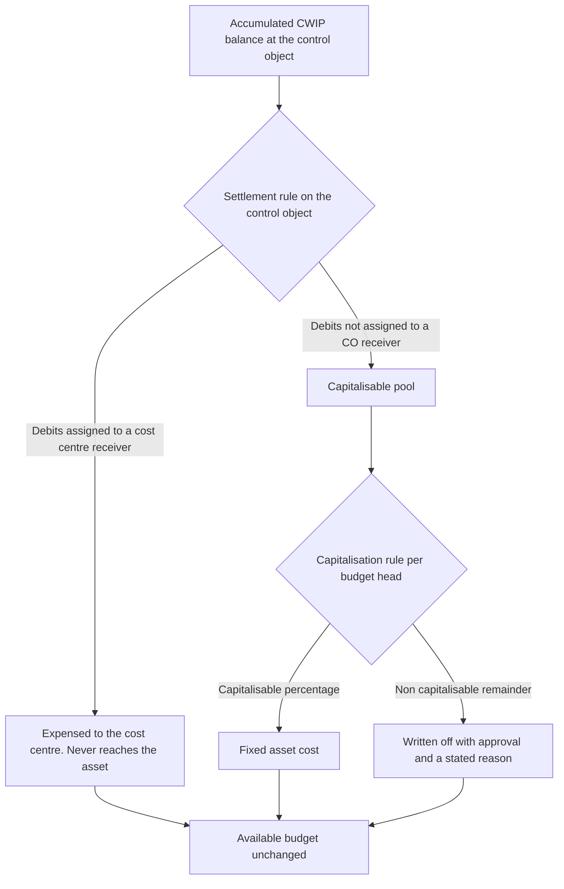
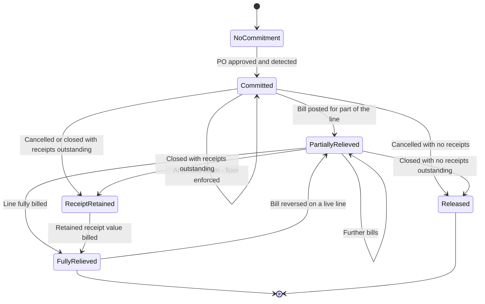

## 22. Budget and Commitment Calculation Logic

### 22.1 What this section is

This is the arithmetic the whole application rests on. Every screen figure, every approval decision, every alert threshold and every reconciliation assertion resolves to something defined here. A coding agent implementing this application should be able to build the entire calculation engine from this section alone, without reading a business requirement anywhere else.

It has five jobs, in this order:

1. **Reproduce the client's own invariant in full**, with all six frozen worked examples quoted verbatim (§22.2).
2. **State the divergence between the client's formula and SAP's authoritative definition of the same concept**, quantify the consequence, and give the ruling that makes the difference visible rather than silent (§22.3).
3. **Close the gap the client's formula leaves between a goods receipt and a vendor bill**, including the specific SAP configuration case where value falls into neither actual nor commitment (§22.4, §22.5).
4. **State the anti-double-count and anti-under-count rules as implementable assertions with tests** (§22.7, §22.8).
5. **Work every transaction position through, step by step, with numbers** (§22.9).

Nothing here is recomputed from the frozen registry. Where a figure comes from `C5_formulas.json` it is quoted verbatim and marked as such. Where a figure is a blueprint illustration it is marked as such and is derived from the formulas, never asserted independently.

---

### 22.2 The client invariant

#### 22.2.1 The four formulas

These are quoted verbatim from `C5_formulas.json`, which took them from the Atha Group CWIP & CAPEX Budget Control document, sections 6, 7, 8 and 12. They are not restated in other terms anywhere in this blueprint.

> Exposure = Open PO Commitment + Actual CWIP
> Available Budget = Current Approved Budget - Exposure
> Utilisation % = Exposure / Current Approved Budget
> Current Approved Budget = Original Budget + Approved Supplements - Approved Returns +/- Approved Transfers

The client's own statement of the availability rule is algebraically identical to the second and first combined: Available Budget = Current Approved Budget − Actual CWIP − Open PO Commitments.

**Verification status, from the frozen registry:** *"Verified against all 13 numeric rows in the client document. No row fails. No arithmetic error exists anywhere in the source."* That is an unusually strong position to start from. The client's arithmetic is not the problem; its **coverage** is (CONF-12), and its **definition of consumption** is narrower than SAP's (§22.3).

#### 22.2.2 The six frozen worked examples, quoted verbatim

Each of these is reproduced exactly as frozen. None is recomputed, rounded differently, converted between notations or restated with substituted numbers.

**1. Budget head - Civil**

> budget 25,00,000; commitment 5,00,000; actual 12,00,000; available 8,00,000

**2. Budget head - Plant & Machinery**

> budget 80,00,000; commitment 30,00,000; actual 35,00,000; available 15,00,000

**3. PDF section 7 over-budget example**

> 80L Budget - 35L Actual CWIP - 30L Open PO Commitment = 15L Available. A new PO of 20L exceeds available budget by 5L and must route to exception approval or budget revision.

**4. Commitment-to-actual, part billed**

> po 20L; actual_bill 12L; open_commitment 8L; budget_exposure 20L

**5. Dashboard - Production Line**

> budget 1.50 Cr; commitment 30L; actual 85L; available 35L; utilisation 76.7%

**6. Dashboard - Warehouse Expansion**

> budget 80L; commitment 15L; actual 48L; available 17L; utilisation 78.8%

**Two implementation facts that fall out of these six examples.**

- Example 6 is the reason the rounding rule is stated explicitly. The unrounded utilisation is 78.75%. Only round-half-up reproduces the client's printed 78.8%. Round-half-even would print 78.8% as well only if the implementation rounds away from zero, so the rule must be stated rather than assumed: **round half away from zero, one decimal place**.
- Examples 3 and 2 describe the same budget head at the same instant. Example 3 is the arithmetic proof of the availability rule; example 2 is the register row it was taken from. A coding agent can use the pair as a unit test that reads directly from the source document.

#### 22.2.3 The client's own commitment-to-actual table, reproduced verbatim

Four positions, exactly as the client states them. The client's table has no budget column, so Available Budget and Utilisation % cannot be tested on it; only the exposure limb of the invariant applies. This is stated rather than filled in.

| Transaction Position | PO Value | Actual Bill | Open Commitment | Budget Exposure |
|---|---:|---:|---:|---:|
| PO approved | ₹20L | ₹0 | ₹20L | ₹20L |
| Part billed | ₹20L | ₹12L | ₹8L | ₹20L |
| Fully billed | ₹20L | ₹20L | ₹0 | ₹20L |
| PO cancelled before billing | ₹20L | ₹0 | ₹0 | ₹0 |

All four rows satisfy `Budget Exposure = Open Commitment + Actual Bill`, and the three live rows also satisfy `Open Commitment = PO Value − Actual Bill`. This table is the client's own arithmetic proof of no double counting, and it is the anchor for the seventeen-position matrix in §22.9.

#### 22.2.4 Current Approved Budget

`Current Approved Budget` is derived, never keyed. The Original Budget is written once at first approval and never overwritten; every later change is a separately recorded, separately approved revision.

```
current_approved_budget(control_object, as_at) =
      original_budget
    + Σ approved supplements  effective on or before as_at
    − Σ approved returns      effective on or before as_at
    + Σ approved transfers in effective on or before as_at
    − Σ approved transfers out effective on or before as_at
```

The `as_at` parameter is not decoration. Every figure in this application is reproducible for any past date, because the budget ledger is versioned and effective-dated. A dashboard from three months ago must still foot.

**SAP composes the same value the same way**, which is a useful corroboration rather than a requirement: current budget is the original budget together with budget supplements, budget returns and budget transfers `[source: https://learning.sap.com/courses/project-financials-control-in-sap-s-4hana/performing-budgeting-functions — verified 2026-08-05]` (SAP S/4HANA, vendor learning), and after supplements, returns or transfers all derived display values are recomputed from the current budget, never from the frozen original budget `[source: https://help.sap.com/doc/acd8b65334e6b54ce10000000a174cb4/3.6/en-US/0213d553088f4308e10000000a174cb4.html — verified 2026-08-05]` (SAP classic on-premise Project System documentation).

**Scope note.** Returns and transfers are `MASTER-PROMPT` additions. The client document describes revision in one direction only — additional budget with justification — and its formula as written cannot express a decrease unless revisions may be negative, which it never states (CONF-13).

---

### 22.3 The SAP assigned-value divergence, and what it costs

This subsection is the single most consequential finding in the blueprint's calculation logic. It is reproduced in full from `C5_formulas.json` and expanded with the underlying evidence.

#### 22.3.1 Two non-equivalent definitions of the same concept

SAP's `Assigned Value` is the concept the client calls `Exposure`. SAP's own documentation gives it two definitions that are not equivalent.

**The compact definition**, from SAP's budget value display: the total of commitment and actual postings, shown only when availability control is active `[source: https://help.sap.com/doc/acd8b65334e6b54ce10000000a174cb4/3.6/en-US/0213d553088f4308e10000000a174cb4.html — verified 2026-08-05]` (SAP classic on-premise Project System documentation). SAP's commitment reports present the same two-component view: three columns headed Actual, Commitments and Assigned, with Assigned defined as actual plus commitment `[source: https://help.sap.com/docs/SAP_S4HANA_ON-PREMISE/5e23dc8fe9be4fd496f8ab556667ea05/2a7cd0531d8b4208e10000000a174cb4.html — verified 2026-08-05]` (SAP S/4HANA on-premise, Project System).

**The authoritative definition**, from SAP's dedicated assigned-values page, is a nine-component aggregate. It is a calculated aggregate, not a single stored field, and the page enumerates the exact contributing components `[source: https://help.sap.com/docs/SAP_S4HANA_ON-PREMISE/4dd8cb7b1c484b4b93af84d00f60fdb8/f711d553088f4308e10000000a174cb4.html — verified 2026-08-05]` (SAP S/4HANA on-premise, Project System).

| # | Component of SAP assigned value | In the compact definition? | Evidence |
|---|---|---|---|
| 1 | Actual costs posted on the budget-carrying element itself | Yes | `[source: https://help.sap.com/docs/SAP_S4HANA_ON-PREMISE/4dd8cb7b1c484b4b93af84d00f60fdb8/f711d553088f4308e10000000a174cb4.html — verified 2026-08-05]` |
| 2 | **Statistical** actual costs on the budget-carrying element | No | same page, verified 2026-08-05 |
| 3 | Actual costs of subordinate elements that do **not** themselves carry budget | No | same page, verified 2026-08-05 |
| 4 | Statistical actual costs of subordinate elements that do not carry budget | No | same page, verified 2026-08-05 |
| 5 | Commitments on the budget-carrying element | Yes | same page, verified 2026-08-05 |
| 6 | Commitments of subordinate elements that do not carry their own budget | No | same page, verified 2026-08-05 |
| 7 | For assigned networks or orders, the **maximum** of plan versus actual-plus-commitment — not the sum | No | same page, verified 2026-08-05 |
| 8 | Settlement **debits** posted to the element, which increase assigned value | No | same page, verified 2026-08-05 |
| 9 | Settlement **credits**, which reduce assigned value only where the receiving object is itself budget-controlled | No | same page, verified 2026-08-05 |

SAP's exclusion list is normative rather than incidental, and three exclusions matter to this design:

| Excluded from SAP assigned value | Consequence for us |
|---|---|
| Cost elements flagged exempt in availability-control Customizing | Gives a configurable carve-out mechanism. Our equivalent is a per-budget-head `exempt_from_availability_control` flag, default false |
| Costs from business transactions outside the valid transaction groups of availability control | Our equivalent is the transaction-class list in §22.8 |
| Settlement credits to a **non**-budget-controlled object such as a cost centre — settling to a cost centre does **not** free budget | Directly relevant: routing non-capitalisable cost to a cost centre must not restore available budget |
| Revenues entirely — budget consumption in SAP Project System is a cost-side concept only | We never net any credit against exposure except the credit-note and reversal cases in §22.9 |

All rows above: `[source: https://help.sap.com/docs/SAP_S4HANA_ON-PREMISE/4dd8cb7b1c484b4b93af84d00f60fdb8/f711d553088f4308e10000000a174cb4.html — verified 2026-08-05]` (SAP S/4HANA on-premise, Project System).

#### 22.3.2 The consequence, stated plainly

The client formula resembles the **compact** definition — components 1 and 5 only. Building availability control on it would systematically **understate consumption** and permit overspend relative to SAP behaviour. That is the frozen registry's own wording and this blueprint does not soften it.

#### 22.3.3 The ruling

Implement the client formula as the primary control, and expose the additional components as an explicit, separately-reported **`Other Assigned Value`** line so the understatement is visible rather than silent. Record as an open question for Atha Group to ratify.

**How `Other Assigned Value` is composed in this application.**

| SAP component | Our treatment | Contributes to `Other Assigned Value`? |
|---|---|---|
| 1 Actual on the element | Actual CWIP | No — already in Exposure |
| 2 Statistical actual on the element | Memo cost recorded for information, not posted to CWIP — for example an allocated share of shared site services carried for reporting only | **Yes** |
| 3 Actual of non-budget-carrying descendants | Already rolled up by BR-01, which climbs to the nearest budget-carrying ancestor | No — zero by construction |
| 4 Statistical actual of non-budget-carrying descendants | Rolled up with component 2 | **Yes**, inside component 2 |
| 5 Commitment on the element | Open PO Commitment | No — already in Exposure |
| 6 Commitment of non-budget-carrying descendants | Already rolled up by BR-01 | No — zero by construction |
| 7 Maximum of plan versus actual-plus-commitment for assigned networks or orders | **No equivalent.** This application has no network, order or activity layer (`C2_glossary.json`: Network / Activity — Not implemented) | Not applicable; reported as `n/a`, never as zero |
| 8 Settlement debits into the element | Cost settled in from another project or a shared-services collector | **Yes** |
| 9 Settlement credits out to a budget-controlled receiver | Cost settled out to another budget-carrying WBS element or project | **Yes**, negative |

```
other_assigned_value(control_object) =
      Σ memo_and_statistical_cost
    + Σ settlement_debits_in
    − Σ settlement_credits_out_to_budget_controlled_receivers
    + Σ approved_but_unposted_internal_cost_accruals

assigned_value_broad = exposure + other_assigned_value
available_budget_broad = current_approved_budget − assigned_value_broad
```

Settlement credits to a **cost centre** are deliberately absent from that expression. Under SAP's own rule they do not reduce assigned value, and if we let them reduce ours, routing non-capitalisable cost to a cost centre would silently free budget.

**Which basis blocks a transaction** is a configuration, `availability_check_basis`:

| Value | Behaviour | Default |
|---|---|---|
| `CLIENT_EXPOSURE` | The block decision uses Exposure. `Other Assigned Value` and `Available Budget (broad)` are displayed alongside on SCR-13, SCR-09 and SCR-01, and MSG-BUD-002 / MSG-BUD-003 name both figures where they differ | **Yes** |
| `BROAD_ASSIGNED_VALUE` | The block decision uses `assigned_value_broad` | No |

#### 22.3.4 What the understatement costs, worked

Demonstration budget head D1, Current Approved Budget ₹1,00,00,000.

| Measure | Value |
|---|---:|
| Open PO Commitment | ₹60,00,000 |
| Actual CWIP | ₹25,00,000 |
| **Exposure (client formula)** | **₹85,00,000** |
| Available Budget (client formula) | ₹15,00,000 |
| Utilisation % (client formula) | 85.0% |
| Memo / statistical cost carried for reporting | ₹2,00,000 |
| Settlement debits in from the shared-services collector | ₹5,00,000 |
| Settlement credits out to a budget-controlled receiver | ₹0 |
| **Other Assigned Value** | **₹7,00,000** |
| **Assigned Value (broad)** | **₹92,00,000** |
| Available Budget (broad) | ₹8,00,000 |
| Utilisation % (broad) | 92.0% |

A new purchase order of ₹12,00,000 is proposed.

| Basis | Comparison | Outcome |
|---|---|---|
| `CLIENT_EXPOSURE` | ₹12,00,000 ≤ ₹15,00,000 | `PASS`, with MSG-BUD-002 already showing at 85.0% |
| `BROAD_ASSIGNED_VALUE` | ₹12,00,000 > ₹8,00,000, shortfall ₹4,00,000 | `FAIL`, MSG-BUD-001 |

**₹4,00,000 of overspend is permitted by the client formula and blocked by SAP's.** That is the whole finding in one number, and it is exactly why the `Other Assigned Value` line is not optional decoration: with it on the screen, the approver can see that the transaction passes on a narrower basis than the one SAP would apply.

Recorded as an open question. This blueprint does not change the client's formula; it makes the difference visible.

---

### 22.4 The commitment decomposition, and why received-but-unbilled is not an extra term

The client's invariant has exactly two consumption terms. A naive attempt to add received-but-unbilled as a third would double count, because the goods received against a purchase order are already inside that purchase order's open commitment.

**The decomposition, not an addition:**

```
open_commitment(line) = received_but_unbilled(line) + ordered_not_received(line)

received_but_unbilled(line) = max(0, min(received_value, commitment_base) − billed_value)
ordered_not_received(line)  = open_commitment(line) − received_but_unbilled(line)
```

so that

```
Exposure = Open PO Commitment + Actual CWIP        ← unchanged, exactly as frozen
```

Received-but-unbilled is therefore a **reported subdivision** of a number that already exists, shown on SCR-16, aged on SCR-23 and messaged by MSG-PRC-005. It never appears in the availability arithmetic as its own term.

**Why the bucket has to exist at all**, given that it changes no total: because the two events it sits between are handled by different systems with different reliability. The purchase order and the bill are both fully linked in Zoho ERP — bill lines carry `purchaseorder_item_id` (OAS-03) `[source: Zoho ERP OpenAPI bundle openapi-all.zip, sha256 E95A0399… — verified 2026-08-05]`. The receipt is not: purchase receive lines expose only description, item id, item order, line item id, name, quantity and unit, carry no purchase order line link and no project, tag or custom-field coding, and the module has no list or search endpoint (OAS-03) `[source: Zoho ERP OpenAPI bundle openapi-all.zip, sha256 E95A0399… — verified 2026-08-05]`. The bucket is where the reconstruction lives, and where its uncertainty is disclosed rather than buried inside a control figure.

**Match confidence is shown, never assumed.** SCR-16 and SCR-27 label every reconstructed receipt-to-order match `EXACT`, `INFERRED` or `AMBIGUOUS — MANUAL ASSIGNMENT REQUIRED`. Where one purchase order carries two lines for the same `item_id`, the match is ambiguous and is never silently resolved.

---

### 22.5 The two-gate commitment-reduction finding

#### 22.5.1 The finding

`C5_formulas.json` records this as **two gates, not one**, carried as a flagged design assumption.

**Gate 1.** The goods receipt indicator on the purchase order item determines whether commitment reduces at goods receipt or at invoice receipt. Tier-1 evidence: the goods receipt indicator on the purchase order item decides whether commitment reduction and actual cost arise at goods receipt or at invoice receipt, and with the indicator set the commitment is reduced when goods are received `[source: https://help.sap.com/docs/SAP_S4HANA_ON-PREMISE/4dd8cb7b1c484b4b93af84d00f60fdb8/1b7cd0531d8b4208e10000000a174cb4.html — verified 2026-08-05]` (SAP S/4HANA on-premise, Project System).

**Gate 2.** The goods-receipt-non-valuated flag independently overrides gate 1: when it is set, invoice information is used to reduce commitment. Tier-2 evidence only: the goods-receipt-non-valuated flag controls whether the commitment decreases at goods receipt or only when an invoice is posted `[source: https://help.sap.com/docs/SUPPORT_CONTENT/spmm/3362167804.html — verified 2026-08-05]` (SAP support content, classic on-premise materials management). The tier is stated because it is weaker than the gate-1 evidence and a reader should know that.

#### 22.5.2 The four combinations, and the dangerous one

| Case | GR indicator | GR non-valuated | Commitment relieved at | Actual cost arises at | Is there a gap? |
|---|---|---|---|---|---|
| A | Not set | — | Invoice receipt | Invoice receipt | No |
| B | Set | Not set | Goods receipt | Goods receipt | No |
| **C** | **Set** | **Set** | **Goods receipt** | **Invoice receipt** | **Yes — value is in neither** |
| D | Not set | Set | Invoice receipt | Invoice receipt | No |

Case C is the dangerous one. `C5_formulas.json` states it as: commitment is relieved at receipt while actual cost arrives only at invoice, so the item is counted in **neither** actual **nor** commitment, understating assigned value.

#### 22.5.3 What case C costs, worked

Demonstration head D1, Current Approved Budget ₹1,00,00,000. One purchase order of ₹20,00,000. Goods fully received on 14-Sep-2026. The vendor bills on 08-Nov-2026, 55 days later.

| Date | Event | Case C behaviour: commitment | Case C: actual | Case C: assigned value | Case C: available shown |
|---|---|---:|---:|---:|---:|
| 01-Sep-2026 | PO approved | ₹20,00,000 | ₹0 | ₹20,00,000 | ₹80,00,000 |
| 14-Sep-2026 | Goods fully received, non-valuated | **₹0** | **₹0** | **₹0** | **₹1,00,00,000** |
| 08-Nov-2026 | Vendor bill posted | ₹0 | ₹20,00,000 | ₹20,00,000 | ₹80,00,000 |

For 55 days the system reports ₹1,00,00,000 available while ₹20,00,000 of plant sits on site, received and unpaid. A purchase order for the full ₹1,00,00,000 would pass the availability check on 15-Sep-2026 and the head would be ₹20,00,000 over budget the moment the bill posted.

**Our design, same events:**

| Date | Event | Open commitment | of which RBU | Actual CWIP | Exposure | Available |
|---|---|---:|---:|---:|---:|---:|
| 01-Sep-2026 | PO approved | ₹20,00,000 | ₹0 | ₹0 | ₹20,00,000 | ₹80,00,000 |
| 14-Sep-2026 | Goods fully received | ₹20,00,000 | ₹20,00,000 | ₹0 | ₹20,00,000 | ₹80,00,000 |
| 08-Nov-2026 | Vendor bill posted | ₹0 | ₹0 | ₹20,00,000 | ₹20,00,000 | ₹80,00,000 |

Available budget never moves. That is the point of the ruling.

#### 22.5.4 The ruling

From `C5_formulas.json`, and binding: our commitment ledger must relieve commitment **only** on the event that also creates actual cost, and must carry an explicit received-not-billed exposure bucket so nothing falls between the two. This is the **anti-under-count control** and it is the mirror of the anti-double-count control.

Concretely, in this application:

1. There is **one** relief event: the vendor bill.
2. A goods receipt never writes a Commitment Ledger row. It writes a GRN Line and moves value between the two sub-buckets of an unchanged open commitment.
3. There is no configurable equivalent of gate 1 or gate 2. The two-switch behaviour is deliberately not replicated, and this is stated as a departure from SAP rather than presented as parity.
4. The received-but-unbilled bucket is aged and reported (MSG-PRC-005) so that a long gap between receipt and bill is visible as an operational problem, which is what it is.

**Also consistent with the client's own document.** Its step 7 states that commitment remains for the unbilled purchase order balance (REQ-GRN-001), and its step 8 that the bill becomes actual project expenditure (REQ-BILL-001). Our ruling and the client's workflow agree; it is SAP's configurable behaviour that diverges.

---

### 22.6 The CWIP settlement qualifier, and both settlement paths

`C5_formulas.json` carries a correction that must not be lost, because dropping it changes the whole capitalisation model.

**The correct statement:** with no capitalisation key, the system settles all debits **not assigned to CO receivers** to the asset under construction during periodic settlement.

**The error that was caught:** a research lane dropped the qualifier and asserted that 100 percent of debits go to the asset under construction. That would model CWIP as a total-cost sink and erase the non-capitalisable and pre-operative-expense write-off path to cost centres entirely.

**The ruling:** the settlement design must model **both** paths — capitalisable debits to the asset, and debits routed to CO receivers by a prior settlement rule which never reach the asset.

#### 22.6.1 Both paths, as implemented



The final node is BR-62 restated: none of these three destinations restores budget. The budget was consumed when the cost was incurred.

#### 22.6.2 Worked settlement split

Project CAPEX-2026-001 reaching capitalisation with an accumulated CWIP balance of ₹1,42,00,000.

| Path | Driver | Amount | Destination | Restores budget? |
|---|---|---:|---|---|
| Routed to a CO receiver by a prior settlement rule | Shared site-services cost pre-assigned to the Manufacturing cost centre | ₹4,50,000 | Cost centre expense | No |
| Capitalisable, building | Capitalisation rule on Civil and structural work | ₹38,00,000 | Fixed asset — Factory building | No |
| Capitalisable, plant | Capitalisation rule on Plant and machinery | ₹86,00,000 | Fixed asset — Production line | No |
| Capitalisable, electrical | Capitalisation rule on Electrical | ₹11,50,000 | Fixed asset — Electrical installations | No |
| Non-capitalisable remainder | Pre-operative expenses head, flagged as policy-sensitive (CONF-14) | ₹2,00,000 | Written off, CFO approved | No |
| **Total** | | **₹1,42,00,000** | | |

MSG-CAP-002 enforces that these lines total the balance exactly (BR-63). Had the ₹4,50,000 CO-receiver path been omitted from the model, that value would have been forced into the asset and the building would have been overstated by that amount and depreciated on it for its whole life.

#### 22.6.3 Corroborating SAP behaviour

- The capitalisable percentage of each cost element or activity type is specified in a capitalisation key `[source: https://help.sap.com/doc/saphelp_me60/6.0.4/en-US/56/a1c6535e601e4be10000000a174cb4/content.htm?no_cache=true — verified 2026-08-05]`, defined at company code level `[source: https://help.sap.com/doc/saphelp_me60/6.0.4/en-US/56/a1c6535e601e4be10000000a174cb4/content.htm?no_cache=true — verified 2026-08-05]` (SAP classic on-premise Investment Management).
- Settlement credits reduce assigned value only where the receiving object is itself budget-controlled `[source: https://help.sap.com/docs/SAP_S4HANA_ON-PREMISE/4dd8cb7b1c484b4b93af84d00f60fdb8/f711d553088f4308e10000000a174cb4.html — verified 2026-08-05]`, and settlement credits to a non-budget-controlled object such as a cost centre do **not** reduce assigned value `[source: https://help.sap.com/docs/SAP_S4HANA_ON-PREMISE/4dd8cb7b1c484b4b93af84d00f60fdb8/f711d553088f4308e10000000a174cb4.html — verified 2026-08-05]` (SAP S/4HANA on-premise, Project System).
- SAP settles investment measures in two modes: periodic settlement at period close, and full settlement or partial capitalisation at completion `[source: https://help.sap.com/doc/saphelp_me60/6.0.4/en-US/9b/e4cd51f30df73ae10000000a44176d/content.htm?no_cache=true — verified 2026-08-05]` (SAP classic on-premise Investment Management). This application implements the second mode only; periodic settlement is production scope.

**Zoho constraint.** The CWIP transfer is posted as a journal, WBS-coded at line level, because journal lines carry `project_id` and `tags` (OAS-10) `[source: Zoho ERP OpenAPI bundle openapi-all.zip, sha256 E95A0399… — verified 2026-08-05]`. Traceability from the asset back to the CWIP that funded it is anchored on our own Capitalisation Request and Asset Allocation records, because fixed assets carry no link to a source project, purchase order or bill (OAS-09) `[source: Zoho ERP OpenAPI bundle openapi-all.zip, sha256 E95A0399… — verified 2026-08-05]`.

---

### 22.7 The anti-double-count and anti-under-count rules, as testable assertions

#### 22.7.1 The seven anti-double-count rules, quoted verbatim from `C5_formulas.json`

1. A PO line contributes to commitment only for its UNBILLED balance.
2. A bill line converts commitment to actual for its own value; it never adds to both.
3. Budget exposure for a PO is unchanged by billing progress - only its split between commitment and actual moves.
4. PO cancellation before billing releases the whole commitment and reduces exposure to zero.
5. PO closure with residual releases only the unbilled residual.
6. Credit notes and bill reversals reduce actual and restore available budget.
7. Vendor advances are NOT actual CWIP unless the accounting policy and a source transaction support it.

#### 22.7.2 Each rule as an implementable assertion with its test

| # | Assertion, machine-checkable | Test case in §22.9 | Where it can break |
|---|---|---|---|
| 1 | `open_commitment(line) == max(0, commitment_base(line) − billed_value(line))` for every line, always | T01, T02, T03 | Adding received value to commitment |
| 2 | For every bill posting event: `Δ open_commitment == −Δ actual_cwip` while the line is live | T02, T03 | Writing the actual before relieving the commitment, and crashing between the two |
| 3 | For every bill posting event on a live line: `Δ exposure == 0` | T02, T03 | Recomputing commitment from ordered value while actual accumulates |
| 4 | Cancellation with zero receipts and zero bills: `open_commitment == 0` and `exposure_contribution == 0` | T08 | — |
| 5 | Closure: `released == max(0, ordered_value − max(billed_value, received_value))` | T09, T09b | Releasing the full unbilled amount and dropping received goods out of exposure |
| 6 | Credit or reversal: `Δ actual_cwip < 0` and `Δ available_budget > 0` unless commitment restores by the same amount | T11, T12, T13 | Restoring commitment on a price adjustment that will never be re-billed |
| 7 | A vendor payment with no allocated bill writes **no** Actual Ledger row | §21 BR-36 | Classifying a payment as cost because cash moved |

#### 22.7.3 The anti-under-count rule, its mirror

From the `commitment_reduction_gates` ruling, and stated as an eighth assertion of equal standing:

> 8. Commitment is relieved only by the event that also creates actual cost, and a separate received-but-unbilled bucket carries the gap, so that no value falls between the two.

Machine-checkable form, asserted on every control object after every event:

```
received_but_unbilled + ordered_not_received == open_commitment      (exact, no tolerance)
open_commitment + billed_value == commitment_base                    (exact, no tolerance)
exposure == open_commitment + actual_cwip                            (exact, no tolerance)
available_budget == current_approved_budget − exposure               (exact, no tolerance)
```

A breach of any of these four is a defect in our own arithmetic, not a data difference with Zoho, and raises a system alert rather than a reconciliation exception (BR-69).

---

### 22.8 The canonical computation

Everything above reduces to one function. This pseudocode is the specification; it is not application code and is not intended to be pasted.

```
FUNCTION control_figures(control_object, as_at):

    # ---- 1. Budget side -------------------------------------------------
    original      = budget_ledger.original(control_object, as_at)
    supplements   = budget_ledger.sum(control_object, 'SUPPLEMENT',    as_at)
    returns       = budget_ledger.sum(control_object, 'RETURN',        as_at)
    transfers_in  = budget_ledger.sum(control_object, 'TRANSFER_IN',   as_at)
    transfers_out = budget_ledger.sum(control_object, 'TRANSFER_OUT',  as_at)

    current_approved_budget = original + supplements - returns
                                       + transfers_in - transfers_out

    # ---- 2. Commitment side, line by line -------------------------------
    open_commitment = 0
    received_but_unbilled = 0

    FOR EACH line IN po_lines(control_object, as_at):

        ordered  = control_value(line.ordered)      # per BR-25 tax basis
        received = control_value(line.received)
        billed   = control_value(line.billed)       # net of vendor credits
                                                    # of type RETURN only

        IF line.status IN {CANCELLED, CLOSED}:
            base = received
        ELSE IF line.no_further_billing:            # set by a PRICE_ADJUSTMENT credit
            base = billed
        ELSE:
            base = ordered

        line_open = MAX(0, base - billed)
        line_rbu  = MAX(0, MIN(received, base) - billed)

        open_commitment       += line_open
        received_but_unbilled += line_rbu

    IF pr_reservation_mode == 'HARD':
        open_commitment += reservation_ledger.open(control_object, as_at)

    ordered_not_received = open_commitment - received_but_unbilled

    # ---- 3. Actual side --------------------------------------------------
    actual_cwip = actual_ledger.sum(control_object, as_at)
                  # bill lines + approved journals
                  # − vendor credits − reversed bills
                  # excludes: vendor payments, advances, POs, PRs, receipts

    # ---- 4. The client invariant, untouched ------------------------------
    exposure         = open_commitment + actual_cwip
    available_budget = current_approved_budget - exposure
    utilisation_pct  = ROUND_HALF_UP(exposure / current_approved_budget * 100, 1)

    # ---- 5. The SAP-broader disclosure line ------------------------------
    other_assigned_value = memo_and_statistical_cost(control_object, as_at)
                         + settlement_debits_in(control_object, as_at)
                         - settlement_credits_out_to_budget_controlled(control_object, as_at)
                         + approved_unposted_internal_accruals(control_object, as_at)

    assigned_value_broad   = exposure + other_assigned_value
    available_budget_broad = current_approved_budget - assigned_value_broad

    # ---- 6. Assertions, evaluated every time -----------------------------
    ASSERT received_but_unbilled + ordered_not_received == open_commitment
    ASSERT exposure == open_commitment + actual_cwip
    ASSERT available_budget == current_approved_budget - exposure

    RETURN all of the above
```

**Roll-up.** A project figure is the sum of its budget-carrying descendants' figures plus any figure held directly at the project. A non-budget-carrying element contributes to its nearest budget-carrying ancestor and holds no figures of its own (BR-01). A project with no WBS elements rolls up its budget heads directly, which is exactly the client's own two-level structure.

**Transaction classes that consume budget.** Purchase order commitment; vendor bill actual; approved journal adjustment to a CWIP account; approved cost allocation; Purchase Request reservation where `pr_reservation_mode = HARD`. **Everything else does not**: vendor payments, vendor advances, goods receipts, purchase requests under `SOFT`, quotations, and any revenue line.

---

### 22.9 The full state-by-state matrix

#### 22.9.1 The demonstration scenario

The client's own four positions have no budget column, so the availability limb of the invariant cannot be tested on them (§22.2.3). To show all seven columns the blueprint constructs one controlled scenario. This is a blueprint illustration, clearly marked as such; the seeded POC dataset is §38 Sample Data and reproduces the client's own section 6 figures.

| Attribute | Value |
|---|---|
| Control object | Demonstration budget head **D1** |
| Current Approved Budget | ₹1,00,00,000 |
| Baseline commitment, actual and exposure | ₹0 |
| Reference purchase order | ₹20,00,000 — ten units at ₹2,00,000, matching the purchase order value in the client's own table |
| Tax basis | `NET_OF_RECOVERABLE_TAX` unless a row states otherwise |
| Currency | INR unless a row states otherwise |

#### 22.9.2 The seventeen positions

Each row is a **terminal state**, reached from the base state named in the last column. `RBU` is received-but-unbilled, which is a subdivision of Open commitment and is shown for disclosure only — it is never added to Exposure.

| # | Transaction position | PO value | Received | Billed | Open commitment | of which RBU | Actual CWIP | Exposure | Available budget | Reached from |
|---|---|---:|---:|---:|---:|---:|---:|---:|---:|---|
| T01 | PO approved, not billed | ₹20,00,000 | ₹0 | ₹0 | ₹20,00,000 | ₹0 | ₹0 | ₹20,00,000 | ₹80,00,000 | baseline |
| T02 | Partially billed | ₹20,00,000 | ₹12,00,000 | ₹12,00,000 | ₹8,00,000 | ₹0 | ₹12,00,000 | ₹20,00,000 | ₹80,00,000 | T01 |
| T03 | Fully billed | ₹20,00,000 | ₹20,00,000 | ₹20,00,000 | ₹0 | ₹0 | ₹20,00,000 | ₹20,00,000 | ₹80,00,000 | T02 |
| T04 | Partially received, not billed | ₹20,00,000 | ₹12,00,000 | ₹0 | ₹20,00,000 | ₹12,00,000 | ₹0 | ₹20,00,000 | ₹80,00,000 | T01 |
| T05 | Fully received, not billed | ₹20,00,000 | ₹20,00,000 | ₹0 | ₹20,00,000 | ₹20,00,000 | ₹0 | ₹20,00,000 | ₹80,00,000 | T04 |
| T06 | PO amended upward to ₹26,00,000 | ₹26,00,000 | ₹0 | ₹0 | ₹26,00,000 | ₹0 | ₹0 | ₹26,00,000 | ₹74,00,000 | T01 |
| T07 | PO amended downward to ₹14,00,000 | ₹14,00,000 | ₹0 | ₹0 | ₹14,00,000 | ₹0 | ₹0 | ₹14,00,000 | ₹86,00,000 | T01 |
| T08 | PO cancelled before billing | ₹20,00,000 | ₹0 | ₹0 | ₹0 | ₹0 | ₹0 | ₹0 | ₹1,00,00,000 | T01 |
| T09 | PO closed with residual | ₹20,00,000 | ₹12,00,000 | ₹12,00,000 | ₹0 | ₹0 | ₹12,00,000 | ₹12,00,000 | ₹88,00,000 | T02 |
| T10 | Bill exceeding the PO line | ₹20,00,000 | ₹20,00,000 | ₹22,00,000 | ₹0 | ₹0 | ₹22,00,000 | ₹22,00,000 | ₹78,00,000 | T05 |
| T11 | Vendor credit note, price adjustment ₹3,00,000 | ₹20,00,000 | ₹20,00,000 | ₹17,00,000 | ₹0 | ₹0 | ₹17,00,000 | ₹17,00,000 | ₹83,00,000 | T03 |
| T12 | Debit note on the vendor, ₹1,50,000 short supply | ₹20,00,000 | ₹18,50,000 | ₹18,50,000 | ₹0 | ₹0 | ₹18,50,000 | ₹18,50,000 | ₹81,50,000 | T03 |
| T13 | Bill reversal, full void, line still live | ₹20,00,000 | ₹20,00,000 | ₹0 | ₹20,00,000 | ₹20,00,000 | ₹0 | ₹20,00,000 | ₹80,00,000 | T03 |
| T14 | GRN reversal of the ₹12,00,000 receipt | ₹20,00,000 | ₹0 | ₹0 | ₹20,00,000 | ₹0 | ₹0 | ₹20,00,000 | ₹80,00,000 | T04 |
| T15 | Foreign-currency PO with rate variance | ₹21,00,000 | ₹12,60,000 | ₹12,60,000 | ₹8,40,000 | ₹0 | ₹12,60,000 | ₹21,00,000 | ₹79,00,000 | baseline |
| T16 | Non-creditable tax, 18% fully blocked | ₹23,60,000 | ₹23,60,000 | ₹23,60,000 | ₹0 | ₹0 | ₹23,60,000 | ₹23,60,000 | ₹76,40,000 | baseline |
| T17 | Freight and landed cost on the same PO | ₹21,50,000 | ₹21,50,000 | ₹21,50,000 | ₹0 | ₹0 | ₹21,50,000 | ₹21,50,000 | ₹78,50,000 | baseline |

**Every row satisfies both limbs of the frozen invariant.** `Exposure = Open commitment + Actual CWIP` at all seventeen rows, and `Available budget = ₹1,00,00,000 − Exposure` at all seventeen rows. Rows T01, T02, T03 and T08 reproduce the client's own four positions exactly, scaled into the same rupee notation.

#### 22.9.3 Position-by-position walk-throughs

Each walk-through shows the step ledger, the message raised and the rule that governs it.

---

**T01 — PO approved, not billed.** `CLIENT-PDF`, REQ-PO-004.

| Step | Event | Open commitment | Actual | Exposure | Available |
|---|---|---:|---:|---:|---:|
| 0 | Baseline | ₹0 | ₹0 | ₹0 | ₹1,00,00,000 |
| 1 | Availability check on ₹20,00,000 against ₹1,00,00,000 → `PASS` | ₹0 | ₹0 | ₹0 | ₹1,00,00,000 |
| 2 | PO approved in Zoho ERP; detected on the next poll | ₹20,00,000 | ₹0 | ₹20,00,000 | ₹80,00,000 |

`commitment_base = ordered = ₹20,00,000`; `billed = ₹0`; `open = max(0, 20,00,000 − 0) = ₹20,00,000`. Governed by BR-07, BR-21.

---

**T02 — Partially billed.** `CLIENT-PDF`, REQ-PO-005. This is the position the frozen registry states as: *po 20L; actual_bill 12L; open_commitment 8L; budget_exposure 20L*.

| Step | Event | Open commitment | RBU | Actual | Exposure | Available |
|---|---|---:|---:|---:|---:|---:|
| 0 | From T01 | ₹20,00,000 | ₹0 | ₹0 | ₹20,00,000 | ₹80,00,000 |
| 1 | Six units received (₹12,00,000) | ₹20,00,000 | ₹12,00,000 | ₹0 | ₹20,00,000 | ₹80,00,000 |
| 2 | Vendor bills the six units, ₹12,00,000, matched on `purchaseorder_item_id` | ₹8,00,000 | ₹0 | ₹12,00,000 | ₹20,00,000 | ₹80,00,000 |

**Available budget did not move at any step.** That is anti-double-count rule 3 in action, and it is the single most important property of the whole design.

---

**T03 — Fully billed.** `CLIENT-PDF`, REQ-PO-006.

| Step | Event | Open commitment | Actual | Exposure | Available |
|---|---|---:|---:|---:|---:|
| 0 | From T02 | ₹8,00,000 | ₹12,00,000 | ₹20,00,000 | ₹80,00,000 |
| 1 | Remaining four units received and billed, ₹8,00,000 | ₹0 | ₹20,00,000 | ₹20,00,000 | ₹80,00,000 |

Status on the WBS element moves to Fully Actualised. Exposure is unchanged from T01 through T03 — three states, one exposure figure.

---

**T04 — Partially received, not billed.** `MASTER-PROMPT`; the client's table has no such row (CONF-12).

| Step | Event | Open commitment | RBU | Ordered not received | Actual | Exposure | Available |
|---|---|---:|---:|---:|---:|---:|---:|
| 0 | From T01 | ₹20,00,000 | ₹0 | ₹20,00,000 | ₹0 | ₹20,00,000 | ₹80,00,000 |
| 1 | Six of ten units received | ₹20,00,000 | ₹12,00,000 | ₹8,00,000 | ₹0 | ₹20,00,000 | ₹80,00,000 |

Nothing moved except the decomposition. MSG-PRC-005 ages the ₹12,00,000 bucket. This is the state that SAP case C would have reported as ₹0 exposure and ₹1,00,00,000 available (§22.5.3).

---

**T05 — Fully received, not billed.** `MASTER-PROMPT`.

| Step | Event | Open commitment | RBU | Actual | Exposure | Available |
|---|---|---:|---:|---:|---:|---:|
| 0 | From T04 | ₹20,00,000 | ₹12,00,000 | ₹0 | ₹20,00,000 | ₹80,00,000 |
| 1 | Remaining four units received | ₹20,00,000 | ₹20,00,000 | ₹0 | ₹20,00,000 | ₹80,00,000 |

The whole open commitment is now received-but-unbilled. MSG-PRC-005: *"D1 has ₹20,00,000 received but not yet billed, the oldest for 41 days. This is included in exposure and will convert to actual CWIP when the vendor bills."*

---

**T06 — PO amended upward.** `CLIENT-PDF` control (REQ-PO-008); the arithmetic is a blueprint addition (CONF-12).

| Step | Event | PO value | Open commitment | Exposure | Available |
|---|---|---:|---:|---:|---:|
| 0 | From T01 | ₹20,00,000 | ₹20,00,000 | ₹20,00,000 | ₹80,00,000 |
| 1 | Amendment to ₹26,00,000 submitted; **delta ₹6,00,000 only** revalidated against ₹80,00,000 → `PASS` | ₹20,00,000 | ₹20,00,000 | ₹20,00,000 | ₹80,00,000 |
| 2 | Amendment approved and detected | ₹26,00,000 | ₹26,00,000 | ₹26,00,000 | ₹74,00,000 |

MSG-PRC-001: *"PO-2026-0114 has increased from ₹20,00,000 to ₹26,00,000. The additional ₹6,00,000 has been revalidated against D1, where ₹80,00,000 is available."* Only the delta is checked — checking the whole ₹26,00,000 against ₹80,00,000 would happen to pass here, but on a tighter head it would falsely fail an amendment whose original ₹20,00,000 was already approved and already inside exposure.

---

**T07 — PO amended downward.** `MASTER-PROMPT`.

| Step | Event | PO value | Open commitment | Exposure | Available |
|---|---|---:|---:|---:|---:|
| 0 | From T01 | ₹20,00,000 | ₹20,00,000 | ₹20,00,000 | ₹80,00,000 |
| 1 | Amendment to ₹14,00,000. No availability check; floor `max(billed ₹0, received ₹0) = ₹0` is satisfied | ₹14,00,000 | ₹14,00,000 | ₹14,00,000 | ₹86,00,000 |

**The floor rule matters.** Had the line already been billed ₹12,00,000 and received ₹20,00,000, an amendment below ₹20,00,000 would be rejected, because reducing the order below the received value would drop received goods out of exposure. The user's next action is a vendor credit or a receipt reversal, then the amendment.

---

**T08 — PO cancelled before billing.** `CLIENT-PDF`, REQ-PO-007, REQ-PO-009.

| Step | Event | Open commitment | Actual | Exposure | Available |
|---|---|---:|---:|---:|---:|
| 0 | From T01 | ₹20,00,000 | ₹0 | ₹20,00,000 | ₹80,00,000 |
| 1 | Cancelled. `commitment_base` switches to `received = ₹0` | ₹0 | ₹0 | ₹0 | ₹1,00,00,000 |

MSG-PRC-002: *"PO-2026-0114 has been cancelled. Commitment of ₹20,00,000 has been released back to D1. Available budget is now ₹1,00,00,000."*

**T08b — cancellation where goods have been received.** From T04 (received ₹12,00,000, billed ₹0):

| Step | Event | Open commitment | RBU | Exposure | Available |
|---|---|---:|---:|---:|---:|
| 0 | From T04 | ₹20,00,000 | ₹12,00,000 | ₹20,00,000 | ₹80,00,000 |
| 1 | Cancelled. `commitment_base = received = ₹12,00,000` | ₹12,00,000 | ₹12,00,000 | ₹12,00,000 | ₹88,00,000 |

Only the ₹8,00,000 never received is released. The ₹12,00,000 of goods already on site stays in exposure until it is billed or the receipt is reversed. Releasing the full ₹20,00,000 — the naive reading of "cancellation releases the commitment" — would hide ₹12,00,000 of real obligation.

---

**T09 — PO closed with residual.** `CLIENT-PDF` control (REQ-PO-009); arithmetic is a blueprint addition.

`released_on_closure = max(0, ordered − max(billed, received))`

| Step | Event | Open commitment | Actual | Exposure | Available |
|---|---|---:|---:|---:|---:|
| 0 | From T02 (received ₹12,00,000, billed ₹12,00,000) | ₹8,00,000 | ₹12,00,000 | ₹20,00,000 | ₹80,00,000 |
| 1 | Closed short. Released = `max(0, 20,00,000 − max(12,00,000, 12,00,000)) = ₹8,00,000` | ₹0 | ₹12,00,000 | ₹12,00,000 | ₹88,00,000 |

MSG-PRC-003: *"PO-2026-0114 has been closed with ₹12,00,000 billed against an ordered value of ₹20,00,000. The unbilled residual of ₹8,00,000 has been released back to D1."*

**T09b — closure with receipts outstanding.** From a state where received is ₹20,00,000 but billed is only ₹12,00,000:

| Step | Event | Open commitment | RBU | Actual | Exposure | Available |
|---|---|---:|---:|---:|---:|---:|
| 0 | Received ₹20,00,000, billed ₹12,00,000 | ₹8,00,000 | ₹8,00,000 | ₹12,00,000 | ₹20,00,000 | ₹80,00,000 |
| 1 | Closed. Released = `max(0, 20,00,000 − max(12,00,000, 20,00,000)) = ₹0` | ₹8,00,000 | ₹8,00,000 | ₹12,00,000 | ₹20,00,000 | ₹80,00,000 |
| 2 | Vendor eventually bills the remaining ₹8,00,000 | ₹0 | ₹0 | ₹20,00,000 | ₹20,00,000 | ₹80,00,000 |

Closure released nothing, because nothing was releasable. Exposure never moves across the whole sequence.

---

**T10 — Vendor bill exceeding the PO line.** `MASTER-PROMPT`; two defensible treatments, presented rather than chosen (CONF-12).

| Step | Event | Open commitment | Actual | Exposure | Available |
|---|---|---:|---:|---:|---:|
| 0 | From T05 (received ₹20,00,000, nothing billed) | ₹20,00,000 | ₹0 | ₹20,00,000 | ₹80,00,000 |
| 1 | Bill posts for ₹22,00,000. `open = max(0, 20,00,000 − 22,00,000) = ₹0`. Excess ₹2,00,000 becomes actual with no commitment to relieve | ₹0 | ₹22,00,000 | ₹22,00,000 | ₹78,00,000 |

MSG-PRC-004: *"Bill BILL-2026-0331 line 1 is ₹22,00,000 against purchase order line PO-2026-0114/1 of ₹20,00,000, an excess of ₹2,00,000. Confirm this is intended, or correct the bill before it is posted to CWIP."*

| Treatment | Behaviour | Recommended? |
|---|---|---|
| (a) Accept and let exposure rise | The arithmetic above. Preserves the invariant. The excess is revalidated against available budget and appears on SCR-25 if it breaches | **Yes** — the bill already exists in Zoho ERP and the Control Hub cannot un-post it |
| (b) Block until the purchase order is amended upward | Forces the incremental ₹2,00,000 through BR-22 before the bill is accepted into the control ledger | Available where the client wants amendment discipline enforced |

Marked for client and auditor confirmation.

---

**T11 — Vendor credit note.** `MASTER-PROMPT`; the frozen anti-double-count rule 6 governs. Two sub-types, and the distinction is load-bearing.

| Sub-type | What it means | Effect on `commitment_base` | Re-billable? |
|---|---|---|---|
| `PRICE_ADJUSTMENT` (default) | Rate correction, discount, quality allowance. Quantity unchanged | `no_further_billing` is set; base drops to the billed value | No |
| `RETURN` | Goods returned or short supply; quantity reversed | Received and billed both reduce; base stays at ordered | Yes |

**T11 as tabulated — `PRICE_ADJUSTMENT` of ₹3,00,000, from T03:**

| Step | Event | Open commitment | Actual | Exposure | Available |
|---|---|---:|---:|---:|---:|
| 0 | From T03 | ₹0 | ₹20,00,000 | ₹20,00,000 | ₹80,00,000 |
| 1 | Vendor credit ₹3,00,000, price adjustment. Billed net ₹17,00,000; base = billed | ₹0 | ₹17,00,000 | ₹17,00,000 | ₹83,00,000 |

**T11b — the `RETURN` variant, same ₹3,00,000, from T03:**

| Step | Event | Open commitment | RBU | Actual | Exposure | Available |
|---|---|---:|---:|---:|---:|---:|
| 0 | From T03 | ₹0 | ₹0 | ₹20,00,000 | ₹20,00,000 | ₹80,00,000 |
| 1 | Goods worth ₹3,00,000 returned. Received ₹17,00,000, billed ₹17,00,000, base stays ₹20,00,000 | ₹3,00,000 | ₹0 | ₹17,00,000 | ₹20,00,000 | ₹80,00,000 |

The difference is ₹3,00,000 of available budget, and it turns on one question: *will the vendor bill this value again?* Defaulting to `PRICE_ADJUSTMENT` is the conservative choice for availability (it frees budget only when the obligation genuinely ends) but the optimistic choice for exposure; the user selects the sub-type on SCR-17 and it is recorded in the audit trail.

**Zoho note.** The vendor-side credit document is `vendorcredits` and its scope family is `ERP.debitnotes`: `GET /vendorcredits` requires `ERP.debitnotes.READ`, `POST /vendorcredits` requires `ERP.debitnotes.CREATE` `[source: Zoho ERP OpenAPI bundle openapi-all.zip, sha256 E95A0399… — verified 2026-08-05]`. The path name and the scope name do not match; a coding agent must not infer one from the other.

---

**T12 — Debit note raised on the vendor.** `MASTER-PROMPT`.

| Step | Event | Open commitment | Actual | Exposure | Available |
|---|---|---:|---:|---:|---:|
| 0 | From T03 | ₹0 | ₹20,00,000 | ₹20,00,000 | ₹80,00,000 |
| 1 | Debit note ₹1,50,000 for short supply. Received and billed both correct to ₹18,50,000; base = billed | ₹0 | ₹18,50,000 | ₹18,50,000 | ₹81,50,000 |

| What the debit note recovers | Effect on Actual CWIP | Status |
|---|---|---|
| Overcharge, short supply, rejected material, rate correction | Reduces Actual CWIP | Settled |
| Liquidated damages or delay penalty | Reduces Actual CWIP, or is recognised as other income | **UNVERIFIED - REQUIRES CONFIRMATION**; configured by `debit_note_penalty_treatment`, default `REDUCE_CWIP` |
| Recovery of a cost the vendor incurred on Atha Group's behalf and re-billed | Reduces Actual CWIP | Settled |

---

**T13 — Bill reversal.** `MASTER-PROMPT`; anti-double-count rule 6.

| Step | Event | Open commitment | RBU | Actual | Exposure | Available |
|---|---|---:|---:|---:|---:|---:|
| 0 | From T03 | ₹0 | ₹0 | ₹20,00,000 | ₹20,00,000 | ₹80,00,000 |
| 1 | Bill voided. Billed returns to ₹0; the line is still live so `base = ordered = ₹20,00,000` | ₹20,00,000 | ₹20,00,000 | ₹0 | ₹20,00,000 | ₹80,00,000 |

Commitment restores **automatically**, with no special-case code, because the single commitment expression recomputes from a lower billed value. Exposure is unchanged. The state after the void is exactly T05, which is what it should be: the goods are still received, they are simply unbilled again.

**Where restoration does not happen.** If the line had been closed or cancelled before the void, `base = received`, so commitment restores only up to the received value. If the reversed bill had no purchase order reference at all, there is no commitment to restore and exposure falls by the full amount.

---

**T14 — GRN reversal.** `MASTER-PROMPT`.

| Step | Event | Open commitment | RBU | Ordered not received | Actual | Exposure | Available |
|---|---|---:|---:|---:|---:|---:|---:|
| 0 | From T04 | ₹20,00,000 | ₹12,00,000 | ₹8,00,000 | ₹0 | ₹20,00,000 | ₹80,00,000 |
| 1 | Receipt reversed | ₹20,00,000 | ₹0 | ₹20,00,000 | ₹0 | ₹20,00,000 | ₹80,00,000 |

**Nothing financial changes.** A goods receipt never touched commitment, actual, exposure or availability on the way in, so reversing it cannot touch them on the way out. Only the disclosure decomposition moves. This is the clearest single demonstration that the design has removed the goods receipt from the control path entirely.

**Ordering rule.** A receipt may not be reversed below the billed quantity. Reverse the bill first (T13), then the receipt. The reverse order is rejected with the billed value named.

---

**T15 — Foreign-currency PO with exchange-rate variance.** `MASTER-PROMPT`; the client PDF never mentions currency other than the rupee symbol (CONF-15).

Purchase order for USD 25,000, approved at ₹80.00 per USD. Basis `fx_commitment_revaluation = LATEST_RATE`.

| Step | Event | Foreign | Rate | INR | Open commitment | Actual | Exposure | Available |
|---|---|---|---:|---:|---:|---:|---:|---:|
| 0 | Baseline | — | — | — | ₹0 | ₹0 | ₹0 | ₹1,00,00,000 |
| 1 | PO approved, USD 25,000 | USD 25,000 | 80.00 | ₹20,00,000 | ₹20,00,000 | ₹0 | ₹20,00,000 | ₹80,00,000 |
| 2 | Bill for USD 15,000 at 84.00; remaining USD 10,000 revalued at 84.00 | USD 15,000 | 84.00 | ₹12,60,000 | ₹8,40,000 | ₹12,60,000 | ₹21,00,000 | ₹79,00,000 |

Exchange variance = ₹21,00,000 − ₹20,00,000 = **₹1,00,000**, reported as its own line on SCR-15 and SCR-25, never folded into the commitment column.

Under `PO_RATE` the remaining commitment would stay at ₹8,00,000, exposure at ₹20,60,000 and available at ₹79,40,000 — the ₹40,000 of unrecognised exposure on the unbilled portion stays invisible until the second bill posts. `LATEST_RATE` is the recommended default for that reason.

Whether the exchange difference is capitalised into asset cost or expensed is an accounting-policy determination: **UNVERIFIED - REQUIRES CONFIRMATION**. No tax or accounting conclusion is drawn here.

---

**T16 — Tax and non-creditable tax.** `MASTER-PROMPT`; the tax basis itself is a blocking clarification (CONF-15).

Line net ₹20,00,000, tax at 18% = ₹3,60,000, gross ₹23,60,000.

| Recoverability | Non-creditable tax | Control value under `NET_OF_RECOVERABLE_TAX` | Exposure | Available | Control value under `GROSS_OF_TAX` | Available |
|---|---:|---:|---:|---:|---:|---:|
| Fully recoverable | ₹0 | ₹20,00,000 | ₹20,00,000 | ₹80,00,000 | ₹23,60,000 | ₹76,40,000 |
| 50% blocked | ₹1,80,000 | ₹21,80,000 | ₹21,80,000 | ₹78,20,000 | ₹23,60,000 | ₹76,40,000 |
| **Fully blocked (tabulated as T16)** | **₹3,60,000** | **₹23,60,000** | **₹23,60,000** | **₹76,40,000** | ₹23,60,000 | ₹76,40,000 |

**The spread is ₹3,60,000 of available budget on a single ₹20,00,000 purchase order.** Across a ₹48,00,00,000 project the same question moves availability by crores. That is why CONF-15 is recorded as blocking and why the ledger carries gross, tax, net and non-creditable tax as four separate columns (BR-26): the answer changes the value of every figure in the client's own sections 6, 7 and 12, and it must be a configuration switch rather than a rebuild.

Tax withheld from payment does **not** reduce cost (BR-28): a bill of ₹12,00,000 with ₹24,000 withheld still books ₹12,00,000 of Actual CWIP.

---

**T17 — Freight and other landed costs.** `MASTER-PROMPT`.

Purchase order with a goods line of ₹20,00,000 and a freight line of ₹1,50,000, both coded to D1.

| Step | Event | PO value | Open commitment | Actual | Exposure | Available |
|---|---|---:|---:|---:|---:|---:|
| 0 | Baseline | — | ₹0 | ₹0 | ₹0 | ₹1,00,00,000 |
| 1 | PO approved, goods ₹20,00,000 + freight ₹1,50,000 | ₹21,50,000 | ₹21,50,000 | ₹0 | ₹21,50,000 | ₹78,50,000 |
| 2 | Both lines received and billed | ₹21,50,000 | ₹0 | ₹21,50,000 | ₹21,50,000 | ₹78,50,000 |

SAP includes anticipated delivery costs in the purchase order commitment and displays them individually by origin such as freight, duty and packaging `[source: https://help.sap.com/docs/SAP_S4HANA_ON-PREMISE/4dd8cb7b1c484b4b93af84d00f60fdb8/157cd0531d8b4208e10000000a174cb4.html — verified 2026-08-05]`, and its own worked example commits 3 pieces at 1500.00 plus 150.00 freight as 4650.00 `[source: https://help.sap.com/docs/SAP_S4HANA_ON-PREMISE/5e23dc8fe9be4fd496f8ab556667ea05/2a7cd0531d8b4208e10000000a174cb4.html — verified 2026-08-05]` (both SAP S/4HANA on-premise, Project System).

**T17b — the harder case: freight billed separately with no purchase order.** From step 1 above, with only the goods line on the order:

| Step | Event | Open commitment | Actual | Exposure | Available |
|---|---|---:|---:|---:|---:|
| 0 | Goods-only PO approved, ₹20,00,000 | ₹20,00,000 | ₹0 | ₹20,00,000 | ₹80,00,000 |
| 1 | Forwarder's bill for ₹1,50,000 coded to D1, no purchase order reference | ₹20,00,000 | ₹1,50,000 | ₹21,50,000 | ₹78,50,000 |

Exposure rises by the full ₹1,50,000 at posting, with no pre-approval check having taken place, because none was possible — there was no purchase order to check. The row is written `match_state = UNMATCHED` and appears on SCR-18. The recommended control is a Zoho ERP-side restriction that capital-coded bills require a purchase order reference, with a named exception list; that is an Atha Group policy decision, not a blueprint ruling.

---

#### 22.9.4 Commitment lifecycle, as a state machine



Every transition is produced by the same expression, `open_commitment = max(0, commitment_base − billed_value)`. `ReceiptRetained` is the state that exists only because of the anti-under-count ruling; without it, the `Cancelled` and `Closed` transitions would go straight to `Released` and take received goods out of exposure with them.

---

### 22.10 Roll-up arithmetic

| Level | How its figures are produced |
|---|---|
| Budget head on a WBS element (the leaf control object) | Computed directly by §22.8 |
| Non-budget-carrying WBS element | Holds no figures. Its transactions are attributed to the nearest budget-carrying ancestor (BR-01) |
| Budget-carrying WBS element | Its own figures plus the figures of all non-budget-carrying descendants |
| Project | Sum over all budget-carrying descendants, plus any figure held directly at project level, plus the `Unallocated` line where a project reserve exists (BR-04) |
| Plant, department, entity | Sum over projects. These are reporting dimensions only; no availability check is ever evaluated at these levels |

**Two roll-up invariants**, asserted nightly:

```
Σ head_budgets(project)  ≤  project_budget                     # remainder shows as Unallocated
Σ head_exposure(project) ==  project_exposure                  # exact, no tolerance
```

The first is an inequality by design, so that an unallocated project reserve is possible. The second is an equality with no tolerance, because a project figure that does not equal the sum of its parts is a defect.

---

### 22.11 Verification against the client's own numbers

The formulas above reproduce every numeric row in the client document. The following table restates the client's budget-head control register and adds the utilisation column the client does not print, computed by §22.8. The budget, commitment, actual and available figures are the client's own; the utilisation figures are **derived by this blueprint** and are marked as such because the source table states none.

| Budget Head | Approved Budget | PO Commitment | Actual CWIP | Available (client-stated) | Exposure (derived) | Utilisation % (derived) |
|---|---:|---:|---:|---:|---:|---:|
| Civil | ₹25,00,000 | ₹5,00,000 | ₹12,00,000 | ₹8,00,000 | ₹17,00,000 | 68.0% |
| Plant & Machinery | ₹80,00,000 | ₹30,00,000 | ₹35,00,000 | ₹15,00,000 | ₹65,00,000 | 81.3% |
| Electrical | ₹20,00,000 | ₹6,00,000 | ₹8,00,000 | ₹6,00,000 | ₹14,00,000 | 70.0% |
| Installation | ₹15,00,000 | ₹4,00,000 | ₹5,00,000 | ₹6,00,000 | ₹9,00,000 | 60.0% |
| Consultancy & Other | ₹10,00,000 | ₹2,00,000 | ₹3,00,000 | ₹5,00,000 | ₹5,00,000 | 50.0% |
| **TOTAL** | **₹1,50,00,000** | **₹47,00,000** | **₹63,00,000** | **₹40,00,000** | **₹1,10,00,000** | **73.3%** |

Every column foots. The stated total budget equals the project's Original Budget and Current Approved Budget, so the client's sections 5 and 6 agree. The Plant & Machinery row is also the source of frozen worked examples 2 and 3, which is why those two can be used as a single unit test.

**Head names are reproduced character-for-character.** `Plant & Machinery` keeps the ampersand and `Consultancy & Other` is not renamed (CONF-14; see §20 Functional Modules, rule M2-R2).

**The one cross-table difference this blueprint does not resolve.** The client's dashboard row for the same project shows different figures from its budget-head register: commitment ₹30,00,000 against ₹47,00,000, actual ₹85,00,000 against ₹63,00,000, available ₹35,00,000 against ₹40,00,000. Both sets are internally arithmetically perfect, so neither is a calculation error, and they cannot describe the same project at the same instant. The exact deltas are: **commitment −₹17,00,000, actual +₹22,00,000, available −₹5,00,000, utilisation +3.33 points**. This blueprint does not average them, pick one silently or reconcile them. It records both as separate illustrative snapshots and asks Atha Group which is real (CONF-03). The POC dataset is seeded from the budget-head register, because that is the more detailed table and it agrees with the section 7 worked example exactly; the dashboard row is then derived by calculation rather than copied.

**One further observation on the sample data.** The client's three dashboard rows sit at 76.7%, 78.8% and 70.0% — all below the 80 percent first alert threshold the same section recommends. The sample data therefore never demonstrates the alert it recommends. The POC dataset must include at least one project above 80 percent and one above 90 percent so the control is demonstrable, which the master prompt's requirement for one overrun already provides for.

---

### 22.12 What this section deliberately does not settle

| # | Question | Options modelled | Blueprint default | Conflict |
|---|---|---|---|---|
| 1 | Does the availability block use the client's Exposure or the SAP-broader assigned value? | `CLIENT_EXPOSURE`, `BROAD_ASSIGNED_VALUE` | `CLIENT_EXPOSURE`, with `Other Assigned Value` always displayed | Frozen registry ruling, §22.3.3 |
| 2 | Are approved budgets tax-inclusive or tax-exclusive, and is input tax credit recoverable? | `NET_OF_RECOVERABLE_TAX`, `GROSS_OF_TAX` | `NET_OF_RECOVERABLE_TAX`; recoverability not assumed | CONF-15 |
| 3 | Does an approved Purchase Request reserve budget? | `SOFT`, `HARD` | `SOFT` — the client's own behaviour | CONF-10 |
| 4 | Which level binds — project or budget head — and is an unallocated reserve permitted? | Head binding, with an optional visible reserve | Head binding, reserve displayed | CONF-20 |
| 5 | How is a bill exceeding its purchase order treated? | Accept and let exposure rise, or block until amended | Accept and warn | CONF-12 |
| 6 | Is a vendor credit a price adjustment or a return? | `PRICE_ADJUSTMENT`, `RETURN` | `PRICE_ADJUSTMENT`, user-selectable per credit | CONF-12 |
| 7 | Is a liquidated-damages debit note a CWIP reduction or other income? | Both | `REDUCE_CWIP` | CONF-15 |
| 8 | Are exchange differences on capital acquisitions capitalised or expensed? | Both | Not assumed | CONF-15 |
| 9 | Is remaining foreign-currency commitment revalued or held at the purchase order rate? | `LATEST_RATE`, `PO_RATE` | `LATEST_RATE` | CONF-15 |
| 10 | Does a draft purchase order consume budget? | Yes, no | No | CONF-21 |
| 11 | Which of the client's two figure sets for the same project is real? | Neither reconciled | Budget-head register seeded; dashboard derived | CONF-03 |

None of the defaults above is presented as a confirmed client requirement. Each appears again in §43 Assumptions, §44 Open Questions and §45 Client Clarification Questionnaire.
