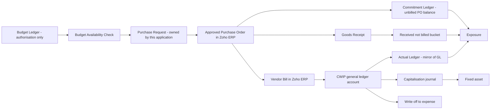
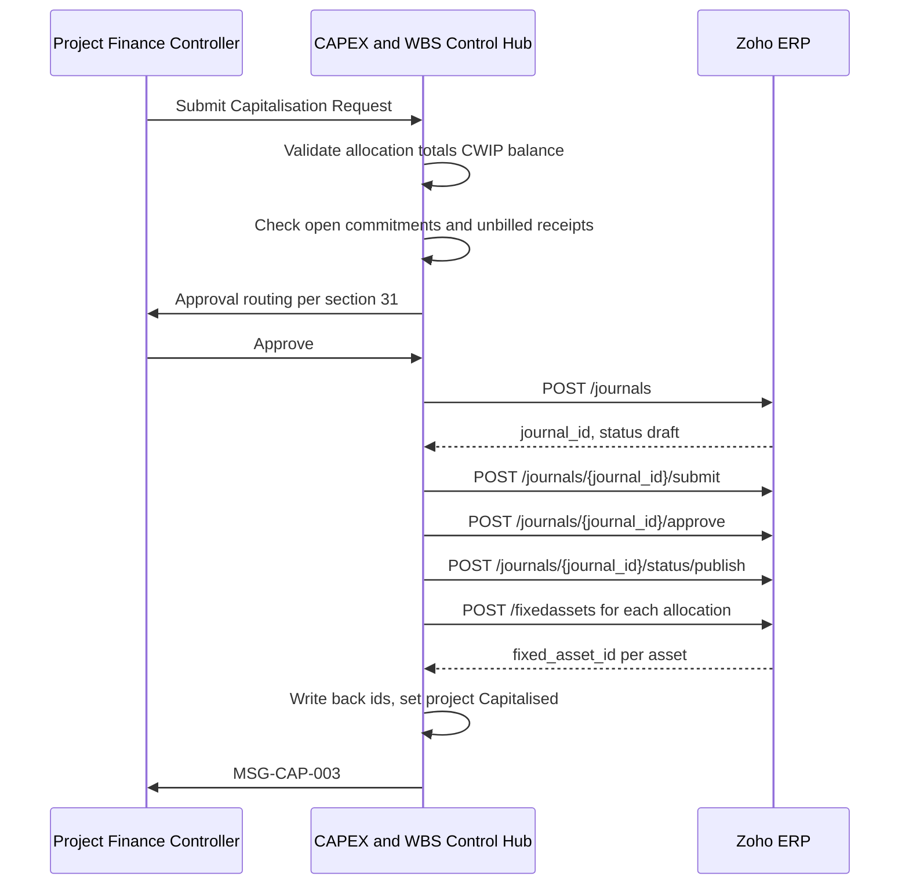

## 23. Accounting Design

### 23.1 Scope, provenance and the professional-validation boundary

This section specifies how capital expenditure becomes a general ledger balance, how that balance is dimensioned so the control layer in §22 Budget and Commitment Calculation Logic can be reconciled to it, and how it leaves CWIP on capitalisation, reversal or write-off. It is written so a coding agent can build the posting engine, the CWIP subledger and the reconciliation report without reinterpreting business intent.

**Three boundaries are drawn before anything else.**

| Boundary | Statement |
|---|---|
| No tax or legal conclusions | This blueprint gives no tax or legal conclusion. Every statutory reference below is a reproduction of a published source with its citation, presented so that Atha Group's own tax and audit advisers can apply it. §23.19 lists, item by item, what must be validated by a qualified professional before the design is switched on in production. |
| Accounting is Zoho's, control is ours | Zoho ERP remains the accounting system of record. The application posts nothing to the general ledger that Zoho did not originate, except the capitalisation journal and its reversal, which are written through `POST {BASE_V3}/journals` under an explicit approval (§23.13). The application's own ledgers — `Commitment Ledger`, `Actual Ledger`, `Budget Ledger` — are **control** ledgers and are never a second set of books. |
| Most of this section is scope-addition | The client document contains **no** occurrence of tax, GST, TDS, TCS, duty, freight, customs, exchange rate, currency other than the rupee symbol, advance, or retention (CONF-15). It also contains no row for capitalisation, project completion or settlement in its own solution-mapping table, although those are steps 9 and 10 of its own workflow (CONF-09). Everything in §23.7 to §23.11 and §23.13 to §23.16 is therefore tagged `provenance=MASTER-PROMPT` or `provenance=DERIVED-RECOMMENDATION` and must not be presented to the client as a confirmed requirement. |

**What the client document does confirm**, and which this section must satisfy:

| Requirement | Statement | Accounting consequence |
|---|---|---|
| REQ-BILL-001 | Workflow Step 8 — Vendor Bill / CWIP: bill is posted to the relevant CWIP GL and becomes actual project expenditure | Debit a CWIP general ledger account; the credit side is **not stated in the client document** |
| REQ-BILL-002 | Bill posting must reduce open commitment and increase actual CWIP | One event, two effects, never both counted |
| REQ-INT-007 | CWIP GL Accounting → dedicated CWIP ledgers, classification `Configuration` | Dedicated ledgers, not one generic account |
| REQ-PRJ-015 | Project master field: CWIP GL, illustrative value `CWIP - Plant & Machinery` | The project master carries the CWIP account, so the account is derivable per project |
| REQ-PRJ-006 | Each capital project must have a unique code that follows all related procurement and accounting transactions | The CAPEX code must be present on the accounting transaction, not only on the purchase document |
| REQ-SEC-002 | Mandatory CAPEX Code and Budget Head on applicable capital procurement | Both dimensions are mandatory at the point of coding, enforced by `MSG-BUD-004` |
| REQ-CAP-001 | Workflow Step 10 — Asset Capitalization: eligible CWIP is transferred to the appropriate fixed asset category and the project is closed | Only *eligible* CWIP transfers; the ineligible remainder needs a documented destination |
| REQ-CAP-002 | Closed or capitalised projects must prevent further procurement unless reopened through approval | Posting control follows the status, not the calendar |
| REQ-CWIP-002 | Expected outcome: improved project-wise CWIP visibility | CWIP must be analysable by project, which forces the dimension design in §23.4 |
| REQ-SEC-001 | Maintain an audit trail from budget approval through procurement, accounting and final capitalisation | Every posting carries a traceable link back to the control record that authorised it |

### 23.2 The two-ledger separation

The single most common failure in a CAPEX control build is treating a commitment as an accounting entry. It is not. The client document itself is explicit that a purchase order reserves budget without a general ledger posting (REQ-PO-002: *"No GL posting stated at PO stage"*; REQ-PO-001: commitment *"is not an accounting posting; it is a budget-control value"*).

| Layer | Entity (C4) | What it holds | Posts to GL | Reconciles to |
|---|---|---|---|---|
| Budget control | `Budget Ledger` | Original budget, supplements, returns, transfers, by project / WBS element / budget head / version | No | Nothing in the GL. It is an authorisation register. |
| Commitment control | `Commitment Ledger` | Unbilled balance of approved purchase order lines, plus the received-but-unbilled bucket | No | Zoho purchase order lines, line by line, via §27 Integration Reconciliation Design |
| Actual control | `Actual Ledger` | Actual CWIP by project / WBS element / budget head, sourced from vendor bill lines, vendor credit lines and approved journal lines | No — it *mirrors* GL, it does not write it | The CWIP general ledger accounts in Zoho. This is the subledger-to-GL reconciliation in §23.17 |
| General ledger | Zoho ERP | Debits and credits | Yes | Itself |

The rule that follows and is binding on the implementation:

> **Only an event that creates or reverses a general ledger posting may move a value into or out of `Actual Ledger`. Only an event that changes the unbilled balance of an approved purchase order line may move a value into or out of `Commitment Ledger`. No event may move the same value into both.**

This is the anti-double-count control. Its mirror, the anti-under-count control, is carried forward from the frozen formula registry: our commitment ledger relieves commitment only on the event that also creates actual cost, and carries an explicit received-but-unbilled exposure bucket so that nothing falls between goods receipt and invoice receipt. The dangerous case that motivates it — goods receipt indicator set but goods receipt non-valuated, so the item counts in neither actual nor commitment — is documented in §22 and is not repeated here.



### 23.3 CWIP general ledger structure

REQ-INT-007 requires *dedicated CWIP ledgers rather than a single generic account*. REQ-PRJ-015 shows the project master carrying a `CWIP GL` field whose illustrative value is `CWIP - Plant & Machinery`, which is a budget-head name. Read together, the client's own design is: **one CWIP control account per budget head, selected on the project master, defaulted to the transaction line.**

#### 23.3.1 Account creation is available by API

Chart-of-accounts creation is a documented operation, so the CWIP account set can be provisioned by the connector rather than by hand:

| Operation | Path | Method | Scope | Body fields |
|---|---|---|---|---|
| Create account | `https://www.zohoapis.in/erp/v3/chartofaccounts` | `POST` | `ERP.accountants.CREATE` | `account_code`, `account_name`, `account_type`, `can_show_in_ze`, `currency_id`, `custom_fields`, `description`, `include_in_vat_return`, `parent_account_id`, `show_on_dashboard` |
| Update account | `https://www.zohoapis.in/erp/v3/chartofaccounts/{account_id}` | `PUT` | `ERP.accountants.UPDATE` | same as create |
| List accounts | `https://www.zohoapis.in/erp/v3/chartofaccounts` | `GET` | `ERP.accountants.READ` | query supports `last_modified_time`, `account_code`, `account_name`, `filter_by`, `page`, `per_page` |
| Deactivate | `https://www.zohoapis.in/erp/v3/chartofaccounts/{account_id}/inactive` | `POST` | `ERP.accountants.CREATE` | — |
| Account transactions | `https://www.zohoapis.in/erp/v3/chartofaccounts/accounttransactions` | `GET` | `ERP.accountants.READ` | `account_id`, `date_start`, `date_end`, `date_before`, `date_after`, `amount_greater_equals`, `transaction_type`, `page`, `per_page` |

`[source: Zoho ERP OpenAPI bundle openapi-all.zip, sha256 E95A0399… — verified 2026-08-05]`

`parent_account_id` exists, so a parent/child account hierarchy is possible. `account_type` is documented with the allowed values *"other_asset, other_current_asset, cash, bank, fixed_asset, other_current_liability, credit_card, long_term_liability, equity, income, other_income, expense, cost_of_goods_sold, other_expense, accounts_receivable, accounts_payable and more"* `[source: Zoho ERP OpenAPI bundle openapi-all.zip, sha256 E95A0399… — verified 2026-08-05]`. The list is open-ended (*"and more"*), so the exact type to assign a CWIP control account is **UNVERIFIED - REQUIRES ZOHO CONFIRMATION**; `fixed_asset` and `other_asset` are the two candidates and the choice determines where the balance appears in Zoho's own balance sheet grouping.

The `accounttransactions` endpoint is the reconciliation instrument in §23.17: it is the only documented way to read the general ledger movements of a named account for a date range without exporting a report.

#### 23.3.2 Proposed account set

`provenance=DERIVED-RECOMMENDATION.` Account codes below are illustrative. They must be re-mapped onto Atha Group's existing chart of accounts before build, which is **UNVERIFIED - REQUIRES CONFIRMATION**.

| Code | Account name | `account_type` (proposed) | Purpose | Dimensioned by |
|---|---|---|---|---|
| 1810 | CWIP — Civil | `fixed_asset` | Actual CWIP for budget head Civil | Project, WBS element, budget head |
| 1820 | CWIP — Plant and Machinery | `fixed_asset` | Actual CWIP for budget head Plant & Machinery | Project, WBS element, budget head |
| 1830 | CWIP — Electrical | `fixed_asset` | Actual CWIP for budget head Electrical | Project, WBS element, budget head |
| 1840 | CWIP — Installation | `fixed_asset` | Actual CWIP for budget head Installation | Project, WBS element, budget head |
| 1850 | CWIP — Consultancy and Other | `fixed_asset` | Actual CWIP for budget head Consultancy & Other | Project, WBS element, budget head |
| 1890 | CWIP — Non-recoverable tax loaded to cost | `fixed_asset` | Optional separate carry of tax loaded into capital cost, so the tax component is visible before capitalisation | Project, WBS element, budget head |
| 1895 | CWIP — Borrowing cost capitalised | `fixed_asset` | Only if Ind AS 23 capitalisation applies; see §23.19 | Project, WBS element |
| 1710 | Capital advances to vendors | `other_asset` | Advances paid against capital purchase orders. **Not** CWIP — see §23.9 | Project, vendor |
| 2110 | Capital creditors — vendor bills payable | `accounts_payable` | Payable arising from capital vendor bills, separated from trade creditors | Vendor, project |
| 2115 | Retention payable — capital contracts | `other_current_liability` | Amounts withheld from capital vendor bills pending defect liability expiry | Vendor, project, contract |
| 1450 | Input tax credit recoverable — capital goods | `other_current_asset` | Tax recognised as recoverable, therefore excluded from capital cost | Project, tax period |
| 5910 | Capital project written off | `expense` | Abandoned project or WBS element written off from CWIP | Project, WBS element |
| 5915 | Non-capitalisable project cost | `expense` | Costs routed away from CWIP by policy — see §23.15 | Project, WBS element, cost centre |

Two design notes the coding agent must implement rather than infer:

1. **Account 1890 is optional and defaults to off.** If the client's policy is that non-recoverable tax is inseparable from the asset cost, the tax is debited to the same CWIP account as the goods and 1890 is never used. The switch is `tax_carry_mode ∈ {Merged, Separate}` on the Organisation entity. Both settings produce the same capitalised value; they differ only in whether the tax component is separately visible before capitalisation.
2. **Account 2110 must not be Zoho's default payables account** if the client wants the Schedule III split between capital creditors and trade creditors to fall out of the ledger rather than out of a spreadsheet. Whether Zoho ERP permits a per-vendor or per-bill override of the payables control account is **UNVERIFIED - REQUIRES ZOHO CONFIRMATION**: no payables-account field appears in the bill create body, which carries only `vendor_id`, line-level `account_id`, `taxes`, `adjustment` and `adjustment_description` `[source: Zoho ERP OpenAPI bundle openapi-all.zip, sha256 E95A0399… — verified 2026-08-05]`.

### 23.4 Project, WBS and budget-head dimensions on accounting entries

This is the constraint that shapes every posting in this section, and it is proven from the vendor's own specification.

| Fact | Evidence |
|---|---|
| Bill **headers** do not carry `project_id`; bill **lines** do | OAS-10 `[source: Zoho ERP OpenAPI bundle openapi-all.zip, sha256 E95A0399… — verified 2026-08-05]` |
| Journal **lines** carry `project_id` and `tags` | OAS-10 `[source: Zoho ERP OpenAPI bundle openapi-all.zip, sha256 E95A0399… — verified 2026-08-05]` |
| Purchase order **lines** carry `project_id`, `tags`, `item_custom_fields`, `account_id`, `location_id` | OAS-04 `[source: Zoho ERP OpenAPI bundle openapi-all.zip, sha256 E95A0399… — verified 2026-08-05]` |
| Bill lines carry `purchaseorder_item_id`, linking bill line to PO line | OAS-03 `[source: Zoho ERP OpenAPI bundle openapi-all.zip, sha256 E95A0399… — verified 2026-08-05]`, corroborated by the field description *"Unique identifier linking this line item to a specific item in the purchase order. Used for tracking PO-to-bill conversions and maintaining audit trails."* `[source: https://www.zoho.com/erp/api/v3/bills/#attributes — verified 2026-08-05]` |
| There is no API to create a custom field **definition**; only to set values on a record | OAS-06 `[source: Zoho ERP OpenAPI bundle openapi-all.zip, sha256 E95A0399… — verified 2026-08-05]` |

**Binding rule: every CAPEX dimension is written at line level, never at header level.** A header-coded design cannot split one bill across two budget heads, which the client's five-head structure makes routine.

#### 23.4.1 Dimension carrier matrix

| Dimension | Carrier on PO line | Carrier on bill line | Carrier on journal line | Fallback if the carrier is unavailable |
|---|---|---|---|---|
| CAPEX / CWIP project code | `project_id` (Zoho project created 1:1 with our `Project`) | `project_id` | `project_id` | Reporting tag `CAPEX_CODE` |
| WBS element code | Reporting tag `WBS_CODE` on `tags` | Reporting tag `WBS_CODE` on `tags` | Reporting tag `WBS_CODE` on `tags` | `item_custom_fields` on the line (PO and bill only; journals have no line custom fields) |
| Budget head | Reporting tag `BUDGET_HEAD`, **and** the `account_id` on the line, which is the budget head's CWIP account | Reporting tag `BUDGET_HEAD` and `account_id` | `account_id` | `account_id` alone — always present |
| Plant / location | `location_id` | `location_id` | `location_id` | Reporting tag |
| Entity / organisation | Zoho `organization_id` | `organization_id` | `organization_id` | none needed |
| Our source control record | `item_custom_fields` carrying the Purchase Request line reference | `item_custom_fields` | `reference_number` on the journal header | `Integration Event` linkage only |

Because the budget head is redundantly carried both as a reporting tag and as the line `account_id`, a mis-tagged line is detectable: the reconciliation in §23.17 asserts that the reporting tag and the account agree, and raises `MSG-INT-006` where they do not.

`WBS_CODE` and `BUDGET_HEAD` reporting tags and any `item_custom_fields` used above are **manual prerequisites**. They cannot be provisioned by API (OAS-06) and must be created in the Zoho ERP user interface per organisation, then discovered by the connector — see §14 Zoho ERP Connector Setup Module and §19 Field, Custom-Field and Reporting-Tag Mapping.

#### 23.4.2 The WBS provenance caveat

The client document contains **no WBS hierarchy at all** — only project plus budget head (CONF-02). Every reference to a WBS element in this section is `provenance=MASTER-PROMPT`. If the client declines the WBS layer, the design degrades cleanly: the `WBS_CODE` reporting tag is not created, the dimension collapses to project plus budget head, and nothing else in §23 changes.

### 23.5 Budget heads and their accounting anchor

The client names exactly five budget heads. Those five, with their frozen control values, are quoted verbatim from the formula registry and must not be recomputed:

> Budget head - Civil: budget 25,00,000; commitment 5,00,000; actual 12,00,000; available 8,00,000.
>
> Budget head - Plant & Machinery: budget 80,00,000; commitment 30,00,000; actual 35,00,000; available 15,00,000.

| Budget head | CWIP account (§23.3.2) | Typical fixed-asset destination on capitalisation | Typical Ind AS 16 treatment question this raises |
|---|---|---|---|
| Civil | 1810 CWIP — Civil | Buildings, civil structures | Whether the structure is a separate significant part requiring separate depreciation (§23.19 V4) |
| Plant & Machinery | 1820 CWIP — Plant and Machinery | Plant and machinery | Componentisation of significant parts (§23.19 V4) |
| Electrical | 1830 CWIP — Electrical | Electrical installations, or a part of plant | Whether it is a component of plant or a standalone asset (§23.19 V5) |
| Installation | 1840 CWIP — Installation | Loaded onto the asset installed | Directly attributable cost of bringing the asset to location and condition (§23.19 V1) |
| Consultancy & Other | 1850 CWIP — Consultancy and Other | Allocated across assets, or expensed | The most likely to contain non-capitalisable general overhead (§23.19 V2) |

**CONF-14 is surfaced, not resolved.** The client names five budget heads; the master prompt's POC dataset requires ten, and the illustrative WBS list carries eleven names including *Pre-operative expenses* and *Contingency*. Those two are exactly the categories most likely to contain non-capitalisable cost. The blueprint therefore does the following and asks the client to ratify it:

- The five client heads are the confirmed set and are configured as-is.
- Additional heads required for the POC dataset are created as `provenance=MASTER-PROMPT` and are visibly labelled as such on SCR-30 Master Data Configuration.
- Each budget head carries a mandatory `capitalisation_default ∈ {Capitalise, Expense, Split — requires rule}` attribute. Heads named *Pre-operative expenses* and *Contingency* default to `Split — requires rule`, which forces an explicit decision at capitalisation rather than a silent sweep into the asset value.

### 23.6 Vendor bill posting

#### 23.6.1 The posting event and its two effects

REQ-BILL-002 requires two simultaneous effects from one event. The implementation must make them a single transaction:

| Effect | Ledger | Amount | Guard |
|---|---|---|---|
| Actual CWIP increases | `Actual Ledger` | Net capitalisable value of the bill line | Only when the bill has reached a posted status in Zoho |
| Open commitment decreases | `Commitment Ledger` | The same net capitalisable value, applied against the PO line identified by `purchaseorder_item_id` | Never more than the remaining unbilled balance of that PO line |

The frozen commitment-to-actual position for a part-billed purchase order is quoted verbatim and must not be recomputed:

> Commitment-to-actual, part billed: po 20L; actual bill 12L; open commitment 8L; budget exposure 20L.

Exposure is unchanged by billing progress. Only its split between commitment and actual moves. That is the whole of the anti-double-count rule as it applies to bill posting.

#### 23.6.2 Where the bill comes from

Bills are ingested by polling `GET {BASE_V3}/bills`, which supports `last_modified_time`, `purchaseorder_id`, `project_id`, `status`, `page` and `per_page` `[source: Zoho ERP OpenAPI bundle openapi-all.zip, sha256 E95A0399… — verified 2026-08-05]`. Detection latency and the look-back window are specified in §25 API and Event Architecture.

Whether the application also **creates** bills is a separate decision. It can: `POST {BASE_V3}/bills` with scope `ERP.bills.CREATE`, followed by `POST {BASE_V3}/bills/{bill_id}/submit` and `POST {BASE_V3}/bills/{bill_id}/approve` `[source: Zoho ERP OpenAPI bundle openapi-all.zip, sha256 E95A0399… — verified 2026-08-05]`. The recommendation for the POC is **read-only on bills**: accounts payable keys the bill in Zoho, and the application observes it. Creating bills from the control layer would put a control application inside the payables process and invert the source-of-truth matrix in §13.

#### 23.6.3 Account derivation decision table

Executed per bill line, in order. The first matching row wins.

| # | Condition | `account_id` written / expected on the bill line | Dimension written | Message on failure |
|---|---|---|---|---|
| 1 | Line has `purchaseorder_item_id`, and the matched PO line carries a known `BUDGET_HEAD` tag | CWIP account mapped to that budget head | Project, WBS, budget head inherited from the PO line | — |
| 2 | Line has `purchaseorder_item_id`, PO line has `project_id` but no budget-head tag | CWIP account from the project master `CWIP GL` field (REQ-PRJ-015) | Project from PO line; budget head defaulted from project; flagged for review | `MSG-BUD-004` |
| 3 | Line has no `purchaseorder_item_id` but carries `project_id` matching a CAPEX project | CWIP account from the project master `CWIP GL` field | Project only; WBS and budget head unresolved | `MSG-BUD-004` |
| 4 | Line carries a CAPEX project dimension but the project is `Closed`, `Capitalised` or `Financially Completed` | Posting is accepted in Zoho but quarantined in our `Actual Ledger` as an exception | — | `MSG-PRC-006` |
| 5 | Line carries no CAPEX dimension at all and the vendor is flagged as a capital vendor | Not a CAPEX posting. Excluded from `Actual Ledger`. Listed on SCR-25 Exception and Overrun Monitor as *possible unposted capital cost* | — | — |
| 6 | Bill line value exceeds the remaining unbilled balance of the matched PO line | Accepted, but the excess is recorded as *over-billing* and does **not** relieve more commitment than remains | — | `MSG-PRC-004` |

Row 6 is the boundary condition that protects the anti-double-count rule. Its message text is fixed by the message registry: *"Bill {bill_number} line {line_number} is {bill_amount} against purchase order line {po_line} of {po_amount}, an excess of {excess}. Confirm this is intended, or correct the bill before it is posted to CWIP."*

#### 23.6.4 Illustrative posting

`provenance=DERIVED-RECOMMENDATION.` The amounts below are illustrative amounts authored for this blueprint to demonstrate the posting shape. They are **not** from the client document and must not be confused with the frozen worked examples quoted in §22 and §23.5.

Vendor bill for a machine ordered against project `CAPEX-2026-001`, WBS `CAPEX-2026-001.03`, budget head Plant & Machinery. Basic value ₹10,00,000.00, GST at 18 percent ₹1,80,000.00, tax assumed fully recoverable, no freight, no retention.

| Dr / Cr | Account | Amount | Project | WBS | Budget head |
|---|---|---|---|---|---|
| Dr | 1820 CWIP — Plant and Machinery | ₹10,00,000.00 | CAPEX-2026-001 | CAPEX-2026-001.03 | Plant & Machinery |
| Dr | 1450 Input tax credit recoverable — capital goods | ₹1,80,000.00 | CAPEX-2026-001 | — | — |
| Cr | 2110 Capital creditors — vendor bills payable | ₹11,80,000.00 | CAPEX-2026-001 | — | — |

Control effects of the same event: `Actual Ledger` increases by ₹10,00,000.00 against `CAPEX-2026-001.03` / Plant & Machinery; `Commitment Ledger` decreases by ₹10,00,000.00 against the same key, applied to the PO line identified by `purchaseorder_item_id`. **Exposure is unchanged.** The recoverable tax of ₹1,80,000.00 enters neither ledger, because it is not project cost.

If the same tax were **non-recoverable**, the first two lines collapse into one debit of ₹11,80,000.00 to account 1820 (or ₹10,00,000.00 to 1820 and ₹1,80,000.00 to 1890 where `tax_carry_mode = Separate`), and `Actual Ledger` increases by ₹11,80,000.00. **This single policy answer changes every availability figure in the client's own sections 6, 7 and 12** — see §23.7 and CONF-15.

### 23.7 Recoverable versus non-recoverable tax

`provenance=MASTER-PROMPT.` The client document is silent on tax (CONF-15). This subsection therefore does two things and only two: it states the design that lets either policy be configured, and it reproduces the statutory text that the client's advisers must apply. **It gives no tax conclusion.**

#### 23.7.1 The blocking question

> Are approved CAPEX budgets stated inclusive or exclusive of GST, and is input tax credit expected to be recoverable on this capital spend?

Until that is answered, no availability figure in this application can be asserted to be correct. The question is carried as an open question in §44 and as a risk in §42, and it appears on the client clarification questionnaire in §45.

#### 23.7.2 What the source law says, reproduced with citations

| Reference | Reproduced text | Citation |
|---|---|---|
| CGST section 2(19) | *"capital goods means goods, the value of which is capitalised in the books of account of the person claiming the input tax credit"* | `[source: https://www.indiacode.nic.in/show-data?abv=CEN&statehandle=123456789/1362&actid=AC_CEN_2_2_00042_201712_1517807328102&orgactid=AC_CEN_2_2_00042_201712_1517807328102&sectionId=5117&sectionno=2&orderno=2 — verified 2026-08-05]` |
| CGST section 16(1) | A registered person is *"entitled to take credit of input tax charged on any supply of goods or services or both to him"* used or intended to be used in the course or furtherance of business | `[source: https://www.indiacode.nic.in/show-data?abv=CEN&statehandle=123456789/1362&actid=AC_CEN_2_2_00042_201712_1517807328102&orgactid=AC_CEN_2_2_00042_201712_1517807328102&sectionId=5131&sectionno=16&orderno=17 — verified 2026-08-05]` |
| CGST section 16(3) | *"Where the registered person has claimed depreciation on the tax component of the cost of capital goods and plant and machinery"*, then *"the input tax credit on the said tax component shall not be allowed"* | `[source: https://www.indiacode.nic.in/show-data?abv=CEN&statehandle=123456789/1362&actid=AC_CEN_2_2_00042_201712_1517807328102&orgactid=AC_CEN_2_2_00042_201712_1517807328102&sectionId=5131&sectionno=16&orderno=17 — verified 2026-08-05]` |
| CGST section 17(5)(c) | Blocked: *"works contract services when supplied for construction of an immovable property (other than plant and machinery)"* | `[source: https://www.indiacode.nic.in/show-data?abv=CEN&statehandle=123456789/1362&actid=AC_CEN_2_2_00042_201712_1517807328102&orgactid=AC_CEN_2_2_00042_201712_1517807328102&sectionId=5132&sectionno=17&orderno=18 — verified 2026-08-05]` |
| CGST section 17(5)(d) | Blocked: *"goods or services or both received by a taxable person for construction of an immovable property (other than plant and machinery) on his own account including when such goods or services or both are used in the course or furtherance of business."* | `[source: https://www.indiacode.nic.in/show-data?abv=CEN&statehandle=123456789/1362&actid=AC_CEN_2_2_00042_201712_1517807328102&orgactid=AC_CEN_2_2_00042_201712_1517807328102&sectionId=5132&sectionno=17&orderno=18 — verified 2026-08-05]` |
| Explanation to (c) and (d) | *"the expression construction includes re-construction, renovation, additions or alterations or repairs, to the extent of capitalisation"* | `[source: https://www.indiacode.nic.in/show-data?abv=CEN&statehandle=123456789/1362&actid=AC_CEN_2_2_00042_201712_1517807328102&orgactid=AC_CEN_2_2_00042_201712_1517807328102&sectionId=5132&sectionno=17&orderno=18 — verified 2026-08-05]` |
| Plant and machinery definition | *"apparatus, equipment, and machinery fixed to earth by foundation or structural support that are used for making outward supply"* | `[source: https://www.indiacode.nic.in/show-data?abv=CEN&statehandle=123456789/1362&actid=AC_CEN_2_2_00042_201712_1517807328102&orgactid=AC_CEN_2_2_00042_201712_1517807328102&sectionId=5132&sectionno=17&orderno=18 — verified 2026-08-05]` |
| Its exclusions | *"(i) land, building or any other civil structures; (ii) telecommunication towers; and (iii) pipelines laid outside the factory premises"* | `[source: https://www.indiacode.nic.in/show-data?abv=CEN&statehandle=123456789/1362&actid=AC_CEN_2_2_00042_201712_1517807328102&orgactid=AC_CEN_2_2_00042_201712_1517807328102&sectionId=5132&sectionno=17&orderno=18 — verified 2026-08-05]` |

Two consequences are worth stating plainly for the coding agent, because they explain why the design is built the way it is, and neither is a tax conclusion:

- The capitalisation decision and the credit decision are **interlocked in both directions**. Section 2(19) defines capital goods by whether the value is capitalised in the books; section 16(3) denies credit on a tax component on which depreciation has been claimed. So the accounting treatment of the tax component and its credit treatment cannot be decided independently, and a build that lets a user change one without re-evaluating the other is defective.
- The Civil and Plant & Machinery budget heads sit on **opposite sides** of the section 17(5) carve-out, because the carve-out turns on *plant and machinery* versus *immovable property*, and the definition expressly excludes land, buildings and other civil structures. The design must therefore permit the recoverability flag to be set per budget head, not per project. Whether any particular Atha Group item falls one side or the other is a determination for the client's advisers (§23.19 V6).

#### 23.7.3 Design that supports either answer without a schema change

Every commitment and actual ledger row carries three amounts, always, regardless of policy:

| Field | Meaning | Always populated |
|---|---|---|
| `gross_amount` | Line value including all taxes | Yes |
| `tax_amount` | Total tax on the line | Yes, zero where none |
| `net_amount` | `gross_amount − tax_amount` | Yes |
| `recoverable_tax_amount` | Portion of `tax_amount` classified as recoverable | Yes, zero where none |
| `non_recoverable_tax_amount` | `tax_amount − recoverable_tax_amount` | Yes, zero where none |
| `budget_consumption_amount` | The amount that actually consumes budget | Yes — **derived**, see the decision table below |

`budget_consumption_amount` is the only figure that reaches `Exposure`, and it is computed, never entered:

| # | `budget_basis` on the Organisation | `tax_recoverability` on the budget head | `budget_consumption_amount` |
|---|---|---|---|
| 1 | `Exclusive of tax` | `Fully recoverable` | `net_amount` |
| 2 | `Exclusive of tax` | `Fully blocked` | `net_amount + non_recoverable_tax_amount` — the blocked tax is a cost of the asset, so it consumes budget even though the budget was set exclusive of tax. **This row is the one that surprises users** and must be shown with a tooltip on SCR-13 Budget Availability Check |
| 3 | `Exclusive of tax` | `Partly recoverable` | `net_amount + non_recoverable_tax_amount` |
| 4 | `Inclusive of tax` | `Fully recoverable` | `net_amount` — the recoverable portion is removed even though the budget was set inclusive, otherwise the budget is systematically overstated |
| 5 | `Inclusive of tax` | `Fully blocked` | `gross_amount` |
| 6 | `Inclusive of tax` | `Partly recoverable` | `net_amount + non_recoverable_tax_amount` |
| 7 | Any | `Undetermined` | `gross_amount`, and the line is flagged `RECONCILIATION_PENDING` until a determination is recorded. The conservative default deliberately overstates consumption rather than understating it |

Row 7 is the safe default before the client answers §23.7.1. It cannot silently permit overspend.

#### 23.7.4 What Zoho gives us, and what it does not

| Need | Available? | Evidence |
|---|---|---|
| Tax identifier per line | Yes — `tax_id`, `tax_exemption_id`, `tax_exemption_code`, `reverse_charge_tax_id`, `tds_tax_id` on PO and bill lines | `[source: Zoho ERP OpenAPI bundle openapi-all.zip, sha256 E95A0399… — verified 2026-08-05]` |
| HSN / SAC per line | Yes — `hsn_or_sac` on PO and bill lines | `[source: Zoho ERP OpenAPI bundle openapi-all.zip, sha256 E95A0399… — verified 2026-08-05]` |
| Inclusive-tax flag on the document | Yes — `is_inclusive_tax` and `is_item_level_tax_calc` on the bill and PO create bodies | `[source: Zoho ERP OpenAPI bundle openapi-all.zip, sha256 E95A0399… — verified 2026-08-05]` |
| GST registration treatment | Yes — `gst_treatment`, documented allowed values `business_gst`, `business_none`, `overseas`, `consumer` | `[source: Zoho ERP OpenAPI bundle openapi-all.zip, sha256 E95A0399… — verified 2026-08-05]` |
| An **input tax credit eligibility flag** on a line or a tax | **No.** A case-insensitive scan of all 78 module specification files returns zero occurrences of `itc_eligibility`, zero of *input tax credit*, zero of *ineligible* and zero of *capital goods* | `[source: Zoho ERP OpenAPI bundle openapi-all.zip, sha256 E95A0399… — verified 2026-08-05]` |

**Therefore recoverability is derived by this application, not read from Zoho.** The derivation rule is: `tax_recoverability` is an attribute of the budget head, overridable per purchase request line by `Finance` with a mandatory reason recorded under `MSG-SEC-003`. Whether Zoho ERP exposes an ITC-eligibility concept anywhere in its product user interface that is simply absent from the API is **UNVERIFIED - REQUIRES ZOHO CONFIRMATION**.

### 23.8 Freight and landed cost

`provenance=MASTER-PROMPT.` Absent from the client document (CONF-15).

#### 23.8.1 The API constraint

| Fact | Evidence |
|---|---|
| No landed-cost concept exists in the ERP API. A case-insensitive scan of all 78 module specification files returns zero occurrences of `landed`, `landed_cost` and `freight` | `[source: Zoho ERP OpenAPI bundle openapi-all.zip, sha256 E95A0399… — verified 2026-08-05]` |
| `shipping_charge` exists only on sales-side documents — estimates, invoices, sales orders and shipment orders. It does **not** appear on bills or purchase orders | `[source: Zoho ERP OpenAPI bundle openapi-all.zip, sha256 E95A0399… — verified 2026-08-05]` |
| Bills and purchase orders carry `adjustment` and `adjustment_description` at header level | `[source: Zoho ERP OpenAPI bundle openapi-all.zip, sha256 E95A0399… — verified 2026-08-05]` |

So on the purchase side there are exactly two places freight can live: as its own **line item** on the bill, or as a header **`adjustment`**. The first is dimensionable at line level; the second is not, because `adjustment` is a header field and headers carry no `project_id` (OAS-10).

#### 23.8.2 Ruling

| Rule | Statement |
|---|---|
| F1 | Freight, insurance, customs duty, clearing charges and erection charges intended for capitalisation **must be entered as bill lines**, never as header `adjustment`. A header adjustment on a bill carrying CAPEX lines is a defect and is raised on SCR-25 Exception and Overrun Monitor. |
| F2 | Each such line carries the same `project_id` and `WBS_CODE` tag as the goods it relates to, and the `account_id` of the budget head that will bear it. |
| F3 | Where one freight line covers goods spanning several budget heads, the application splits it into an `Actual Ledger` allocation using the `landed_cost_basis` configured on the Organisation. |
| F4 | The **general ledger is not re-split**. The GL carries the freight line as entered; the split lives in `Actual Ledger` and is reconciled back to the single GL line by the identity in §23.17. This keeps our subledger richer than the GL without making the two disagree in total. |

#### 23.8.3 Allocation basis decision table

| `landed_cost_basis` | Allocation weight | Use when | Rounding |
|---|---|---|---|
| `By net value` (default) | Net value of each related goods line | Freight priced on invoice value | Largest-remainder to the line with the greatest net value; total must equal the freight line exactly |
| `By quantity` | Quantity on each related goods line | Uniform items, freight priced per unit | Largest-remainder to the highest quantity line |
| `By weight` | `weight` attribute on the item master | Heavy plant where value and weight diverge | Largest-remainder to the heaviest line. Requires a weight attribute; **UNVERIFIED - REQUIRES ZOHO CONFIRMATION** whether the ERP item master exposes weight through the API |
| `Manual` | Operator-entered percentages per budget head | Customs duty on a mixed consignment | Percentages must total 100.0; the form blocks submission otherwise |
| `None` | No split; the whole line stays on the budget head it was coded to | Single-head consignments | not applicable |

Rounding rule, binding: allocate to two decimals, then assign the residual paise to the largest weight so that the sum of the allocations equals the source line to the paisa. Never distribute a rounding difference to a suspense account.

#### 23.8.4 Ind AS 16 anchor

The reason freight is capitalised at all, and the reason some costs on the same bill are not, is a matter of the recognition standard rather than of system design. The relevant reproduced statements, for the client's advisers:

- *"any costs directly attributable to bringing the asset to the location and condition necessary for it to be capable of operating"* `[source: https://resource.cdn.icai.org/46263indas36370.pdf — verified 2026-08-05]`
- *"its purchase price, including import duties and non-refundable purchase taxes, after deducting trade discounts and rebates"* `[source: https://resource.cdn.icai.org/46263indas36370.pdf — verified 2026-08-05]`
- Expressly **not** costs of an item of property, plant and equipment: *"Examples of costs that are not costs of an item of property, plant and equipment are: (a) Costs of opening a new facility."* and *"(d) Administration and other general overhead costs."* `[source: https://resource.cdn.icai.org/46263indas36370.pdf — verified 2026-08-05]`

The second and third points together are why the Consultancy & Other and Pre-operative expenses heads default to `Split — requires rule` in §23.5.

### 23.9 Advance to vendor

`provenance=MASTER-PROMPT.` Absent from the client document (CONF-15).

#### 23.9.1 The two rules that govern it

| Rule | Source |
|---|---|
| A vendor advance is **not** actual CWIP unless the accounting policy and a source transaction support it | Frozen anti-double-count rule 7, §22 |
| Capital advances are presented outside CWIP | *"capital advances / advances for purchase of capital assets should be included under other non-current assets and hence, should not be included"* under capital work-in-progress `[source: https://resource.cdn.icai.org/68982clcgc55147-gnd2.pdf — verified 2026-08-05]` |

These two agree. The design consequence is unambiguous: an advance debits account 1710 Capital advances to vendors, never a CWIP account, and never touches `Actual Ledger`.

#### 23.9.2 How an advance is recognised from Zoho data

There is no advance flag. OAS-11 records that vendor advances have no dedicated endpoint or flag, and that *an advance is simply a vendor payment whose `bills[]` allocation array is empty* `[source: Zoho ERP OpenAPI bundle openapi-all.zip, sha256 E95A0399… — verified 2026-08-05]`. This is corroborated by the vendor-payments documentation: *"Create a payment made to your vendor and you can also apply them to bills either partially or fully."* `[source: https://www.zoho.com/erp/api/v3/vendor-payments/#create-a-vendor-payment — verified 2026-08-05]`, and by the credits mechanism: *"Apply the vendor credits from excess vendor payments to a bill. Multiple credits can be applied at once."* `[source: https://www.zoho.com/erp/api/v3/bills/#apply-credits — verified 2026-08-05]`.

Derivation rule, executed on each vendor payment retrieved by `GET {BASE_V3}/vendorpayments` (which supports `last_modified_time`, `vendor_id`, `bill_id`, `page`, `per_page`) `[source: Zoho ERP OpenAPI bundle openapi-all.zip, sha256 E95A0399… — verified 2026-08-05]`:

| # | Condition | Classification | Ledger effect | Exposure effect |
|---|---|---|---|---|
| 1 | Unapplied amount > 0 **and** vendor has an open capital PO for a CAPEX project | `Capital advance` | Recorded on the `Purchase Order Reference` as `advance_paid`; **no** `Actual Ledger` entry | **None.** The advance is already inside the PO's committed value; counting it again would double-count |
| 2 | Unapplied amount > 0 **and** vendor has no open capital PO | `Unclassified advance` | Held in a review list on SCR-25 | None |
| 3 | Fully applied to bills | Not an advance — it is settlement of a payable | None; the bill already drove the ledgers | None |
| 4 | Applied to a bill on a **non**-CAPEX project | Out of scope | None | None |

Row 1 is the anti-double-count guard for advances, and it is the mirror of the guard in §23.6.1. An advance against an open PO is *already* budget-consumed as commitment. If the advance were also treated as actual, exposure would exceed the PO value, which REQ-PO-003 forbids.

#### 23.9.3 Illustrative postings

`provenance=DERIVED-RECOMMENDATION.` Illustrative amounts; not from the client document.

Advance of ₹2,00,000.00 paid against a purchase order of ₹10,00,000.00:

| Dr / Cr | Account | Amount | Ledger effect |
|---|---|---|---|
| Dr | 1710 Capital advances to vendors | ₹2,00,000.00 | none |
| Cr | Bank | ₹2,00,000.00 | none |

Bill of ₹10,00,000.00 subsequently received and the advance adjusted:

| Dr / Cr | Account | Amount | Ledger effect |
|---|---|---|---|
| Dr | 1820 CWIP — Plant and Machinery | ₹10,00,000.00 | `Actual Ledger` +₹10,00,000.00 |
| Cr | 2110 Capital creditors — vendor bills payable | ₹10,00,000.00 | — |
| Dr | 2110 Capital creditors — vendor bills payable | ₹2,00,000.00 | — |
| Cr | 1710 Capital advances to vendors | ₹2,00,000.00 | — |

At no point does the ₹2,00,000.00 appear twice in exposure.

#### 23.9.4 The SAP-familiar behaviour this mirrors

An SAP-experienced user will expect down payments to interact with settlement. They do: in classic on-premise SAP ERP, at full settlement the down payments and their clearings must net to zero `[source: https://help.sap.com/doc/saphelp_me60/6.0.4/en-US/fa/5ad151e33df53ae10000000a44176d/content.htm?no_cache=true — verified 2026-08-05]`, and any down payments must be reversed before a full transfer of the asset under construction can be carried out `[source: https://help.sap.com/doc/saphelp_me60/6.0.4/en-US/74/32ba538c95b54ce10000000a174cb4/content.htm?no_cache=true — verified 2026-08-05]`. Both statements are documented for classic on-premise SAP ERP; the S/4HANA Cloud Public Edition behaviour is not asserted here.

This application adopts the equivalent control as a **hard gate**: the capitalisation request in §23.13 cannot be submitted while an unadjusted capital advance exists against the project. The user sees `MSG-CAP-001`, which names the open amounts and tells them what to do.

### 23.10 Retention payable

`provenance=MASTER-PROMPT.` Absent from the client document (CONF-15).

#### 23.10.1 The API constraint

A case-insensitive scan of all 78 module specification files returns **zero occurrences of `retention`** `[source: Zoho ERP OpenAPI bundle openapi-all.zip, sha256 E95A0399… — verified 2026-08-05]`. There is no retention field, no retention percentage, no retention release action and no retention ageing report in the ERP API.

Whether Zoho ERP supports retention as a product feature configurable in the user interface is **UNVERIFIED - REQUIRES ZOHO CONFIRMATION**.

#### 23.10.2 Ruling

Retention is modelled as a **deduction on the bill, not a reduction of cost**. The asset cost is the full contract value; the retained portion is a liability until released.

| Rule | Statement |
|---|---|
| R1 | The full bill line value debits CWIP. Retention never reduces the CWIP debit. |
| R2 | Retention is a separate credit line to 2115 Retention payable — capital contracts, keyed to vendor, project and contract reference. |
| R3 | `Actual Ledger` increases by the **full** line value, not the net-of-retention value, because the cost has been incurred. |
| R4 | `Commitment Ledger` relieves by the **full** line value for the same reason. Retention does not keep a purchase order open. |
| R5 | Release of retention is a payment against 2115, not a new CWIP posting, and has **no** effect on `Actual Ledger`, `Commitment Ledger` or exposure. |
| R6 | Unreleased retention is an ageing exposure reported on SCR-23 Open Commitment Ageing as a distinct bucket, because it is money owed against a completed capital contract and it is a known cause of delayed project closure. |
| R7 | The capitalisation request in §23.13 does **not** block on unreleased retention, because the cost is already fully in CWIP. It does, however, display the retention balance on the capitalisation summary so the reviewer sees it. |

Where the client's contracts instead provide that retention is a **contingent** amount not yet incurred, rules R1 to R4 invert and retention must not be billed until earned. That is a contract-law and accounting-policy determination, not a system decision — §23.19 V8.

#### 23.10.3 Illustrative postings

`provenance=DERIVED-RECOMMENDATION.` Illustrative amounts; not from the client document.

Civil contractor bill of ₹5,00,000.00 with 10 percent retention:

| Dr / Cr | Account | Amount | Ledger effect |
|---|---|---|---|
| Dr | 1810 CWIP — Civil | ₹5,00,000.00 | `Actual Ledger` +₹5,00,000.00 |
| Cr | 2110 Capital creditors — vendor bills payable | ₹4,50,000.00 | — |
| Cr | 2115 Retention payable — capital contracts | ₹50,000.00 | — |

Release after the defect liability period:

| Dr / Cr | Account | Amount | Ledger effect |
|---|---|---|---|
| Dr | 2115 Retention payable — capital contracts | ₹50,000.00 | none |
| Cr | Bank | ₹50,000.00 | none |

#### 23.10.4 How retention is detected from Zoho data

Because no retention field exists, the application must recognise retention by one of three configurable mechanisms, declared on the Organisation:

| Mechanism | How it works | Reliability |
|---|---|---|
| `Negative line` | A bill line with a negative value coded to account 2115 | High — visible at line level, dimensionable, and matched by `account_id` |
| `Header adjustment` | A negative `adjustment` with a recognised `adjustment_description` pattern | Low — headers carry no project dimension, so the retention cannot be attributed to a WBS element without a rule |
| `Manual` | Recorded in the application against the `Vendor Bill Reference` by `Finance`, with the Zoho bill left untouched | Medium — accurate in our subledger but creates a documented, reconciled difference with the GL |

`Negative line` is the recommendation. The other two are provided because the mechanism actually used depends on how the client's accounts payable team already keys these bills, which is **UNVERIFIED - REQUIRES CONFIRMATION**.

### 23.11 Capital creditor

`provenance=MASTER-PROMPT.`

A *capital creditor* is a payable arising from a capital purchase rather than a revenue purchase. It matters here for one reason only: Schedule III presents trade payables and other payables separately, and an entity that cannot split them from its ledger will split them from a spreadsheet at year end, which is exactly the manual reconciliation this application exists to remove.

| Design element | Specification |
|---|---|
| Account | 2110 Capital creditors — vendor bills payable, distinct from the trade payables control account |
| How a bill is classified | A bill is a capital bill when **any** line carries a CAPEX project dimension. Mixed bills — some capital lines, some revenue lines — are permitted and are reported as such on SCR-17 Vendor Bill and Actual CWIP View |
| Mixed-bill payable split | If the client requires the payable to be split across 2110 and trade payables in proportion to the lines, this must be done **in Zoho at the point of keying**, because a payables control account is not a field the API exposes on the bill body |
| If the split cannot be made in Zoho | The application reports the capital portion of payables as a **derived** figure from `Actual Ledger` and labels it as derived on every report that shows it. It does not claim it is a ledger balance |
| Vendor master requirement | Vendors used for capital procurement carry a `capital_vendor` flag in our master data so that the exception in decision row 5 of §23.6.3 can be raised |

Whether Zoho ERP permits a per-bill or per-vendor override of the accounts-payable control account is **UNVERIFIED - REQUIRES ZOHO CONFIRMATION**. The bill create body carries no payables account field `[source: Zoho ERP OpenAPI bundle openapi-all.zip, sha256 E95A0399… — verified 2026-08-05]`.

### 23.12 CWIP balance and the asset under construction

The glossary fixes the terms: SAP's *Asset Under Construction* maps to this application's **CWIP Balance**, whose Zoho counterpart is the CWIP general ledger account, and whose client-preferred term is **CWIP**. The application uses *CWIP Balance* in all UI text and prose.

#### 23.12.1 What the SAP model does, and what we adopt from it

The comparison below is included because the reader is SAP-familiar and will expect these behaviours. Every SAP row is labelled with the variant its source documents. No row implies that this application is SAP, is certified by SAP, or reproduces SAP.

| Behaviour | SAP, classic on-premise SAP ERP (help.sap.com `saphelp_me60` 6.0.4) | This application | Zoho ERP |
|---|---|---|---|
| Object that carries cost before capitalisation | The account assignment object for purchase orders and actual postings on an investment measure is always the internal order or the WBS element, never the asset under construction `[source: https://help.sap.com/doc/saphelp_me60/6.0.4/en-US/2e/a1c6535e601e4be10000000a174cb4/content.htm?no_cache=true — verified 2026-08-05]` | The `WBS Element`, or the `Project` where the client declines the WBS layer | The Zoho project, carried on the transaction **line** as `project_id` |
| Direct posting to the AuC | Costs cannot be posted directly to the asset under construction; they must be posted to the CO object `[source: https://help.sap.com/doc/saphelp_me60/6.0.4/en-US/77/a1c6535e601e4be10000000a174cb4/content.htm?no_cache=true — verified 2026-08-05]` | Adopted. A bill line coded to a CWIP account with no project dimension is an exception, not a posting we accept into `Actual Ledger` | Not enforced by Zoho; enforced by our validation |
| Balance-sheet presentation | Assets under construction are normally shown as their own balance sheet item `[source: https://help.sap.com/doc/saphelp_me60/6.0.4/en-US/68/2aba538c95b54ce10000000a174cb4/content.htm?no_cache=true — verified 2026-08-05]` | Adopted, and required independently: Schedule III Division II presents Capital work-in-progress as a separate non-current asset line after Property, Plant and Equipment `[source: https://upload.indiacode.nic.in/schedulefile?aid=AC_CEN_22_29_00008_201318_1517807327856&rid=10 — verified 2026-08-05]` | The CWIP accounts group into the balance sheet by `account_type` |
| Depreciation before capitalisation | Ordinary depreciation is not permitted on assets under construction in most countries `[source: https://help.sap.com/doc/saphelp_me60/6.0.4/en-US/68/2aba538c95b54ce10000000a174cb4/content.htm?no_cache=true — verified 2026-08-05]` | No depreciation is computed on CWIP. Depreciation begins on the fixed asset after transfer | Zoho fixed assets carry `depreciation_start_date`; CWIP GL accounts are not depreciating objects |
| One project, many assets | The capitalised balance of one asset under construction can be settled to several different completed assets `[source: https://help.sap.com/doc/saphelp_me60/6.0.4/en-US/4a/a1c6535e601e4be10000000a174cb4/content.htm?no_cache=true — verified 2026-08-05]` | Adopted — `Capitalisation Request` has many `Asset Allocation` rows | Multiple `POST /fixedassets` calls, one per asset |
| Costs split into capitalisable and not | Periodic settlement splits the accumulated costs into capitalisable and non-capitalisable amounts `[source: https://help.sap.com/doc/saphelp_me60/6.0.4/en-US/77/a1c6535e601e4be10000000a174cb4/content.htm?no_cache=true — verified 2026-08-05]`, and costs that do not require capitalisation are posted to a non-operating expense account `[source: https://help.sap.com/doc/saphelp_me60/6.0.4/en-US/56/a1c6535e601e4be10000000a174cb4/content.htm?no_cache=true — verified 2026-08-05]` | **Adopted and made mandatory.** The capitalisation workbench forces every rupee of the CWIP balance to a destination — asset, expense or explicit write-off. `MSG-CAP-002` blocks an incomplete allocation | Two journal lines from one capitalisation journal |
| Partial capitalisation | Partial capitalisation exists because different parts of a large investment measure are frequently put into service one after another `[source: https://help.sap.com/doc/saphelp_me60/6.0.4/en-US/5f/a1c6535e601e4be10000000a174cb4/content.htm?no_cache=true — verified 2026-08-05]` | Adopted — a project may have several `Capitalisation Request` records over time; the project moves to `Capitalised` only when the residual is nil or written off | Repeated journals |
| Reversal restriction | Only the most recently performed settlement can be reversed `[source: https://help.sap.com/doc/saphelp_me60/6.0.4/en-US/fa/5ad151e33df53ae10000000a44176d/content.htm?no_cache=true — verified 2026-08-05]` | Adopted as a control: only the latest `Capitalisation Request` for a project may be reversed, and only while no later request exists | `POST /journals/{journal_id}/reverse` has no such restriction; ours is an application-level control |
| Immutability once posted | Once a settlement has been posted, the distribution rules that were used can no longer be changed `[source: https://help.sap.com/doc/saphelp_me60/6.0.4/en-US/5f/a1c6535e601e4be10000000a174cb4/content.htm?no_cache=true — verified 2026-08-05]` | Adopted — an approved `Capitalisation Request` and its `Asset Allocation` rows are immutable; correction is by reversal and re-raise | — |

The one place we deliberately diverge: SAP creates the asset under construction automatically at release of the investment measure when an investment profile is assigned `[source: https://help.sap.com/doc/saphelp_me60/6.0.4/en-US/31/a1c6535e601e4be10000000a174cb4/content.htm?no_cache=true — verified 2026-08-05]`. This application does **not** create a Zoho fixed asset at project release, because a Zoho fixed asset starts depreciating from `depreciation_start_date` and carries no link back to the project (OAS-09). The CWIP balance lives in the general ledger account, not in an asset record, until capitalisation.

#### 23.12.2 The settlement qualifier that must not be dropped

The frozen registry records a correction that this section is bound by: with no capitalisation key, the system settles all debits **not assigned to CO receivers** to the asset under construction during periodic settlement. A research lane had dropped the qualifier and asserted that 100 percent of debits go to the AuC — which would model CWIP as a total-cost sink and erase the non-capitalisable and pre-operative-expense write-off path.

The design consequence is stated as a rule:

> **The capitalisation model must have two outbound paths from CWIP, not one: capitalisable value to fixed assets, and non-capitalisable value to expense. A build that offers only the first is wrong.**

Both paths appear in the capitalisation journal in §23.13.2 and in the master posting table in §23.18.

### 23.13 Transfer to fixed asset and the capitalisation journal

#### 23.13.1 The anchoring problem, and its solution

Fixed assets cannot be linked to a source project, purchase order or bill: the create body carries only `asset_account_id`, `asset_cost`, `asset_name`, `asset_purchase_date`, `computation_type`, `custom_fields`, `dep_start_value`, `depreciation_account_id`, `depreciation_frequency`, `depreciation_method`, `depreciation_percentage`, `depreciation_start_date`, `description`, `expense_account_id`, `fixed_asset_type_id`, `notes`, `salvage_value`, `serial_no`, `tags`, `total_life` and `warranty_expiry_date`, and the only linkage-shaped field present is `asset_purchase_date`. The list endpoint offers `filter_by`, `sort_column`, `sort_order`, `page` and `per_page` and has **no** `last_modified_time` (OAS-09) `[source: Zoho ERP OpenAPI bundle openapi-all.zip, sha256 E95A0399… — verified 2026-08-05]`.

Three consequences, all binding:

| # | Consequence |
|---|---|
| 1 | Capitalisation traceability is anchored on **our** `Capitalisation Request` and its `Asset Allocation` rows, not on the Zoho asset record. The asset-to-CWIP trace is a Hub trace. |
| 2 | Asset synchronisation is **full refresh only**, and cannot be incremental. This is stated on SCR-38 so nobody expects a delta feed. |
| 3 | `tags` and `custom_fields` **are** available on the asset create body, so the CAPEX code and the capitalisation request number are written into them as a best-effort back-reference. Because custom field *definitions* cannot be created by API (OAS-06), this back-reference works only after the manual prerequisite in §19 is complete, and the design must function without it. |

#### 23.13.2 The capitalisation journal

Journals are the only general-ledger write this application performs. The full operation set is documented:

| Operation | Path | Method | Scope |
|---|---|---|---|
| Create journal | `https://www.zohoapis.in/erp/v3/journals` | `POST` | `ERP.accountants.CREATE` |
| Submit for approval | `https://www.zohoapis.in/erp/v3/journals/{journal_id}/submit` | `POST` | `ERP.accountants.CREATE` |
| Approve | `https://www.zohoapis.in/erp/v3/journals/{journal_id}/approve` | `POST` | `ERP.accountants.CREATE` |
| Reject | `https://www.zohoapis.in/erp/v3/journals/{journal_id}/reject` | `POST` | `ERP.accountants.CREATE` |
| Publish | `https://www.zohoapis.in/erp/v3/journals/{journal_id}/status/publish` | `POST` | `ERP.accountants.CREATE` |
| Reverse | `https://www.zohoapis.in/erp/v3/journals/{journal_id}/reverse` | `POST` | `ERP.accountants.CREATE` |
| Read one | `https://www.zohoapis.in/erp/v3/journals/{journal_id}` | `GET` | `ERP.accountants.READ` |
| List with delta | `https://www.zohoapis.in/erp/v3/journals` | `GET` | `ERP.accountants.READ` — supports `last_modified_time`, `project_id`, `account_id`, `reference_number`, `status`, `page`, `per_page` |

`[source: Zoho ERP OpenAPI bundle openapi-all.zip, sha256 E95A0399… — verified 2026-08-05]`

Journal create body fields: `currency_id`, `custom_fields`, `exchange_rate`, `include_in_vat_return`, `is_bas_adjustment`, `journal_date`, `journal_type`, `line_items`, `location_id`, `notes`, `product_type`, `reference_number`, `status`, `tags`, `tax_exemption_code`, `tax_exemption_type`, `vat_treatment`. Journal line fields: `account_id`, `amount`, `debit_or_credit`, `description`, `line_id`, `location_id`, `project_id`, `tags`, plus tax fields `[source: Zoho ERP OpenAPI bundle openapi-all.zip, sha256 E95A0399… — verified 2026-08-05]`.

`project_id` and `tags` on the journal line are what make a WBS-coded capitalisation journal possible (OAS-10). This is the enabling fact for the whole capitalisation design.

**Sample capitalisation journal payload.** `provenance=DERIVED-RECOMMENDATION`; illustrative amounts. Project `CAPEX-2026-001`, CWIP balance ₹40,00,000.00 in account 1820, of which ₹36,00,000.00 capitalises to two assets and ₹4,00,000.00 is non-capitalisable pre-operative cost routed to expense.

```json
POST https://www.zohoapis.in/erp/v3/journals?organization_id=10234695
Authorization: Zoho-oauthtoken <access_token>
Content-Type: application/json

{
  "journal_date": "2026-08-31",
  "reference_number": "CAP-2026-0007",
  "journal_type": "both",
  "notes": "Capitalisation of CAPEX-2026-001 per capitalisation request CAP-2026-0007",
  "line_items": [
    {
      "account_id": "460000000038101",
      "description": "Machine line A - capitalised from CWIP Plant and Machinery",
      "debit_or_credit": "debit",
      "amount": 2400000.00,
      "project_id": "460000000091001",
      "tags": [
        { "tag_id": "460000000077001", "tag_option_id": "460000000077011" },
        { "tag_id": "460000000077002", "tag_option_id": "460000000077101" }
      ]
    },
    {
      "account_id": "460000000038101",
      "description": "Machine line B - capitalised from CWIP Plant and Machinery",
      "debit_or_credit": "debit",
      "amount": 1200000.00,
      "project_id": "460000000091001",
      "tags": [
        { "tag_id": "460000000077001", "tag_option_id": "460000000077012" },
        { "tag_id": "460000000077002", "tag_option_id": "460000000077101" }
      ]
    },
    {
      "account_id": "460000000038915",
      "description": "Non-capitalisable pre-operative cost written to expense",
      "debit_or_credit": "debit",
      "amount": 400000.00,
      "project_id": "460000000091001",
      "tags": [
        { "tag_id": "460000000077001", "tag_option_id": "460000000077013" },
        { "tag_id": "460000000077002", "tag_option_id": "460000000077105" }
      ]
    },
    {
      "account_id": "460000000038820",
      "description": "CWIP Plant and Machinery released on capitalisation of CAPEX-2026-001",
      "debit_or_credit": "credit",
      "amount": 4000000.00,
      "project_id": "460000000091001",
      "tags": [
        { "tag_id": "460000000077002", "tag_option_id": "460000000077101" }
      ]
    }
  ]
}
```

Expected response envelope, per the documented response structure `[source: https://www.zoho.com/erp/api/v3/response/ — verified 2026-08-05]`:

```json
{
  "code": 0,
  "message": "success",
  "journal": {
    "journal_id": "460000000123456",
    "entry_number": "JE-00214",
    "reference_number": "CAP-2026-0007",
    "journal_date": "2026-08-31",
    "status": "draft",
    "total": 4000000.00
  }
}
```

The `journal_id` is written back to the `Capitalisation Request` and is the reconciliation key in §23.17.

Note two field caveats the coding agent must handle rather than assume: the exact `journal_type` token accepted for a two-sided journal and the exact shape of the `tags` array element are **UNVERIFIED - REQUIRES ZOHO CONFIRMATION** — the specification names the fields but the enumerations shown above are illustrative. The connector must validate these against a live organisation during the connectivity test in §14.10 before the capitalisation flow is enabled.

#### 23.13.3 Fixed asset creation

For each `Asset Allocation` row that is a capitalisation to an asset:

```json
POST https://www.zohoapis.in/erp/v3/fixedassets?organization_id=10234695
Authorization: Zoho-oauthtoken <access_token>
Content-Type: application/json

{
  "asset_name": "Machine line A - New Manufacturing Plant Phase 1",
  "asset_cost": 2400000.00,
  "asset_account_id": "460000000038101",
  "asset_purchase_date": "2026-08-31",
  "depreciation_start_date": "2026-09-01",
  "fixed_asset_type_id": "460000000044001",
  "description": "Capitalised from CAPEX-2026-001 WBS CAPEX-2026-001.03 under capitalisation request CAP-2026-0007",
  "serial_no": "ATH-PM-2026-0141",
  "tags": [
    { "tag_id": "460000000077002", "tag_option_id": "460000000077101" }
  ]
}
```

The asset's `depreciation_start_date` is a control point, not a convenience field. Depreciation begins when the asset is available for use — *"Depreciation of an asset begins when it is available for use, i.e. when it is in the location and condition necessary"* for it to operate as management intends `[source: https://resource.cdn.icai.org/46263indas36370.pdf — verified 2026-08-05]`. The application therefore requires the `ready_for_use_date` to be captured on the `Capitalisation Request` and defaults `depreciation_start_date` from it, rather than from the journal date. Where they differ, the difference is displayed and must be justified.

#### 23.13.4 Order of operations, and what happens when a step fails



Failure handling, because a multi-call sequence has no distributed transaction:

| Failure point | State left behind | Recovery |
|---|---|---|
| `POST /journals` fails | Nothing in Zoho; `Capitalisation Request` stays `Approved` | Retry per §25. Idempotency by pre-flight `GET {BASE_V3}/journals?reference_number=CAP-2026-0007` before any retry |
| Journal created but `publish` fails | Draft journal in Zoho | The request holds status `INTEGRATION_FAILED`; the draft journal id is displayed; the operator either retries publish or deletes the draft. **Never create a second journal without the pre-flight check** |
| Journal published but an asset create fails | GL is correct; asset register is incomplete | The request holds `RECONCILIATION_PENDING`. The remaining assets are retried individually. The GL is not reversed for an asset-register failure |
| All succeed but write-back of `fixed_asset_id` fails | Everything correct in Zoho; our link is missing | Full-refresh asset sync plus name-and-cost match, then a manual confirm on SCR-22 Asset Allocation Screen. This is a direct consequence of OAS-09 |

#### 23.13.5 Preconditions on the capitalisation request

| # | Precondition | Severity | Message |
|---|---|---|---|
| 1 | Allocations total exactly the CWIP balance for the project | Blocking | `MSG-CAP-002` |
| 2 | No open commitment and no received-but-unbilled balance, or an explicit written-off decision for each | Warning that must be acknowledged | `MSG-CAP-001` |
| 3 | No unadjusted capital advance against the project | Blocking | `MSG-CAP-001` variant naming the advance |
| 4 | Project status is `Technically Completed` or `Awaiting Capitalisation` | Blocking | — |
| 5 | Every allocation row names a fixed asset type and a `ready_for_use_date` | Blocking | — |
| 6 | Subledger-to-GL difference for the project is within tolerance (§23.17) | Blocking | `MSG-INT-006` |
| 7 | Approval per the §31 Role and Approval Matrix is complete | Blocking | `MSG-SEC-001` |

Precondition 2 is a warning rather than a block on purpose. The client's own workflow step 9 requires that *open commitments and pending bills are resolved* at project completion (REQ-PRJ-004), but resolving them may legitimately mean writing them off, and the system must let the controller do that with a recorded reason instead of forcing them to fabricate a bill.

### 23.14 Reversal

Three distinct reversal cases exist and they must not be conflated.

| Case | Trigger | Mechanism in Zoho | Effect on `Actual Ledger` | Effect on `Commitment Ledger` | Effect on exposure |
|---|---|---|---|---|---|
| Bill reversal or void | Accounts payable voids a bill already posted to CWIP | `POST {BASE_V3}/bills/{bill_id}/status/void` `[source: Zoho ERP OpenAPI bundle openapi-all.zip, sha256 E95A0399… — verified 2026-08-05]` | Decrease by the reversed value | **Increase** by the same value, restoring the unbilled balance of the PO line — but only if the purchase order is still open | Unchanged if the PO is still open; decreases if the PO has been closed or cancelled |
| Vendor credit note | Vendor issues a credit against a billed capital purchase | Vendor Credit module; delta-polled by `last_modified_time` | Decrease by the credited value | No change | **Decrease.** Frozen anti-double-count rule 6: credit notes and bill reversals reduce actual and restore available budget |
| Capitalisation reversal | A capitalisation is found to be wrong | `POST {BASE_V3}/journals/{journal_id}/reverse` `[source: Zoho ERP OpenAPI bundle openapi-all.zip, sha256 E95A0399… — verified 2026-08-05]` | Restore the CWIP balance to the project | No change | Unchanged — the value never left exposure; it moved between CWIP and fixed assets, both of which sit below the exposure line |

Controls on capitalisation reversal, adopted from the SAP behaviour in §23.12.1 and made explicit here:

| # | Control |
|---|---|
| 1 | Only the **most recent** `Capitalisation Request` for a project may be reversed. If a later request exists it must be reversed first. |
| 2 | Reversal requires a mandatory reason. `MSG-SEC-003` is shown: the user is told the reason is mandatory and will be stored in the audit trail with their name and the current time. |
| 3 | Reversal is an approval-bearing action per §31, not a user convenience. |
| 4 | The project returns to `Reopened`, not to `Technically Completed`, so the audit trail shows that closure was undone rather than never reached. |
| 5 | Assets created by the reversed capitalisation are cancelled through `POST {BASE_V3}/fixedassets/{fixed_asset_id}/status/cancel` `[source: Zoho ERP OpenAPI bundle openapi-all.zip, sha256 E95A0399… — verified 2026-08-05]`, never deleted. Depreciation already charged is **not** unwound by this application; that is an accounting-policy decision for the client's advisers (§23.19 V9). |
| 6 | An accounting period may be locked. Transaction-lock state is readable at `GET {BASE_V3}/transactionlock` and `GET {BASE_V3}/transactionlocks` `[source: Zoho ERP OpenAPI bundle openapi-all.zip, sha256 E95A0399… — verified 2026-08-05]`. The application must read the lock before offering a reversal date and must tell the user when a period is closed rather than letting the call fail with a raw Zoho error. |

### 23.15 Write-off of an abandoned project or WBS element

`provenance=MASTER-PROMPT.` The client document requires *one abandoned or cancelled WBS case* in the POC dataset but gives no rule for it.

#### 23.15.1 The two write-off shapes

| Shape | What it is | Destination | When |
|---|---|---|---|
| **Cost write-off** | Value in CWIP that will never become an asset — abandoned civil work, cancelled scope, cost of a design later discarded | 5910 Capital project written off | On abandonment, or at capitalisation when the residual cannot be allocated |
| **Policy reclassification** | Value in CWIP that was never capitalisable in the first place — general overhead, cost of opening the facility, incidental cost booked to the project by mistake | 5915 Non-capitalisable project cost, dimensioned to the cost centre that should bear it | At capitalisation, or on discovery |

The distinction matters because the second is a correction of coding and the first is a loss. They are reported separately on SCR-19 CWIP Ledger and are approved by different roles in §31.

#### 23.15.2 SAP anchor

In classic on-premise SAP ERP, at full settlement amounts previously held on the AuC but later judged non-capitalisable can be corrected out to CO receivers as expense `[source: https://help.sap.com/doc/saphelp_me60/6.0.4/en-US/c2/a1c6535e601e4be10000000a174cb4/content.htm?no_cache=true — verified 2026-08-05]`, and that correction is restricted to costs of the current fiscal year `[source: https://help.sap.com/doc/saphelp_me60/6.0.4/en-US/c2/a1c6535e601e4be10000000a174cb4/content.htm?no_cache=true — verified 2026-08-05]`. Separately, only debits posted in the current fiscal year may be settled to CO receivers such as cost centres `[source: https://help.sap.com/doc/saphelp_me60/6.0.4/en-US/5f/a1c6535e601e4be10000000a174cb4/content.htm?no_cache=true — verified 2026-08-05]`.

This application does **not** adopt the fiscal-year restriction, because it is a consequence of SAP's controlling architecture rather than of accounting principle, and because a CWIP balance older than one year is precisely the balance most likely to need writing off — the Schedule III ageing schedule in §23.16 has three buckets beyond one year. The design does, however, adopt the underlying idea: a write-off of prior-year CWIP is a **different approval route** from a current-year reclassification, and is flagged as such on the request.

#### 23.15.3 Trigger conditions and the decision table

| # | Condition | Proposed action | Approver (§31) | Status transition |
|---|---|---|---|---|
| 1 | Project or WBS element formally abandoned by the CAPEX Committee | Full write-off of the CWIP balance for the affected WBS element | CFO | Project → `Closed`; WBS element → `Closed` |
| 2 | Capitalisation residual cannot be allocated to any asset | Write-off of the residual only | Project Finance Controller, then CFO above threshold | Project → `Capitalised` after the residual clears |
| 3 | Cost identified as general overhead or facility-opening cost | Reclassification to 5915, not a write-off | Finance | No project status change |
| 4 | CWIP balance older than the ageing threshold with no activity and no forward plan | **Review**, not automatic write-off. Raised on SCR-24 CWIP Ageing | Project Finance Controller | No automatic transition |
| 5 | Open commitment on an abandoned project | Release the commitment first, then write off the actual | Procurement releases; Finance writes off | PO → cancelled or closed; `MSG-PRC-002` or `MSG-PRC-003` |

Row 4 is deliberately not automated. An ageing bucket is a disclosure fact, not an impairment conclusion, and the system must not convert one into the other.

#### 23.15.4 Illustrative posting

`provenance=DERIVED-RECOMMENDATION.` Illustrative amounts; not from the client document.

Abandoned civil work on WBS `CAPEX-2026-001.02`, CWIP balance ₹6,00,000.00 written off:

| Dr / Cr | Account | Amount | Project | WBS |
|---|---|---|---|---|
| Dr | 5910 Capital project written off | ₹6,00,000.00 | CAPEX-2026-001 | CAPEX-2026-001.02 |
| Cr | 1810 CWIP — Civil | ₹6,00,000.00 | CAPEX-2026-001 | CAPEX-2026-001.02 |

`Actual Ledger` decreases by ₹6,00,000.00 against that WBS element. **Available budget increases by the same amount**, which is correct and is also a control risk: a write-off must not become a route to free budget. The application therefore does two things: the write-off approval and the budget-release approval are the same decision presented on one screen, and the released budget is returned to the parent by an automatic `Budget Return` rather than remaining available at the abandoned node.

### 23.16 CWIP ageing and the Schedule III and CARO disclosure obligation

This subsection is the reason several fields elsewhere in this blueprint are mandatory. It is the strongest single argument for the application, because the disclosures below are **not** obtainable from a general ledger balance alone.

#### 23.16.1 The obligation

| Fact | Reproduced text | Citation |
|---|---|---|
| Schedule III was amended | *"Schedule III has been further amended vide the Government Notification dated 24 March, 2021 to include certain additional presentation and disclosures requirements"* | `[source: https://resource.cdn.icai.org/68982clcgc55147-gnd2.pdf — verified 2026-08-05]` |
| The amending instrument | *"Amended pursuant to MCA Notification G.S.R. 207(E) dated 24th March 2021"* | `[source: https://resource.cdn.icai.org/68982clcgc55147-gnd2.pdf — verified 2026-08-05]` |
| From when it applies | *"These changes need to be applied in preparation of financial statements for the financial year commencing on or after 1 April, 2021."* | `[source: https://resource.cdn.icai.org/68982clcgc55147-gnd2.pdf — verified 2026-08-05]` |
| The ageing schedule | *"For capital-work-in progress, following ageing schedule shall be given"* | `[source: https://resource.cdn.icai.org/68982clcgc55147-gnd2.pdf — verified 2026-08-05]` |
| The completion schedule | *"For capital-work-in progress, whose completion is overdue or has exceeded its cost compared to its original plan, following CWIP completion schedule shall be given"* | `[source: https://resource.cdn.icai.org/68982clcgc55147-gnd2.pdf — verified 2026-08-05]` |

#### 23.16.2 The ageing schedule, and the fields it forces

| Prescribed element | Reproduced text | Citation | What the application must store to produce it |
|---|---|---|---|
| Four buckets | *"Less than 1 year 1-2 years 2-3 years More than 3 years"* | `[source: https://resource.cdn.icai.org/68982clcgc55147-gnd2.pdf — verified 2026-08-05]` | `initial_recognition_date` on **every** CWIP movement row in `Actual Ledger` |
| Two categories | *"Projects in progress Projects temporarily suspended"* | `[source: https://resource.cdn.icai.org/68982clcgc55147-gnd2.pdf — verified 2026-08-05]` | `cwip_category ∈ {Projects in progress, Projects temporarily suspended}` on the `Project`, re-evaluated at each reporting date |
| Ageing basis | *"the ageing for an item of CWIP shall be determined from the date of its initial recognition to the date of balance sheet"* | `[source: https://resource.cdn.icai.org/68982clcgc55147-gnd2.pdf — verified 2026-08-05]` | Ageing is computed **per movement**, not per project balance. This is the single most important data-model consequence in this subsection |
| One project spans buckets | *"the ageing for the total amount of CWIP shall fall into different ageing buckets as at a particular balance sheet date"* | `[source: https://resource.cdn.icai.org/68982clcgc55147-gnd2.pdf — verified 2026-08-05]` | The report must **not** assign a project to a single bucket. It buckets each movement and sums |
| Not at project level | *"The disclosure is not required to be presented at an asset/project level"* | `[source: https://resource.cdn.icai.org/68982clcgc55147-gnd2.pdf — verified 2026-08-05]` | The ageing schedule aggregates; the drill-down to project is ours, not the disclosure's |
| Must tally | *"Total shall tally with CWIP amount in the balance sheet."* | `[source: https://resource.cdn.icai.org/68982clcgc55147-gnd2.pdf — verified 2026-08-05]` | The reconciliation in §23.17 is a precondition of the disclosure, not an optional check |
| Suspension carve-out | *"When temporary suspension is a necessary part of the process of getting an asset ready for its intended use"* the project is not treated as temporarily suspended | `[source: https://resource.cdn.icai.org/68982clcgc55147-gnd2.pdf — verified 2026-08-05]` | `suspension_reason` and `is_necessary_suspension` on the `Project`, so the classification is a recorded judgement, not an inference from inactivity |
| Scope extension | *"The requirements mentioned above in respect of CWIP shall be applicable for investment property under development."* | `[source: https://resource.cdn.icai.org/68982clcgc55147-gnd2.pdf — verified 2026-08-05]` | A `project_class` attribute so investment property under development is included if Atha Group has any |

**Because ageing runs from the date of initial recognition of each item of CWIP, a design that stores only a project-level CWIP balance cannot produce this disclosure.** Every row written to `Actual Ledger` carries `initial_recognition_date`, and it is never overwritten by a later movement. This is why `Actual Ledger` is a movement ledger and not a balance table.

SCR-24 CWIP Ageing produces the schedule in the prescribed shape:

| Category | Less than 1 year | 1-2 years | 2-3 years | More than 3 years | Total |
|---|---|---|---|---|---|
| Projects in progress | computed | computed | computed | computed | computed |
| Projects temporarily suspended | computed | computed | computed | computed | computed |
| **Total** | | | | | **must equal the CWIP balance in the balance sheet** |

#### 23.16.3 The completion schedule — overdue and cost overrun

| Prescribed element | Reproduced text | Citation | Application consequence |
|---|---|---|---|
| Two triggers | Disclosure is required *"only in those cases where the actual cost of an asset/project has already exceeded the estimated cost as per original plan"* **or** where actual timelines for completion have exceeded the estimated timelines as per original plan | `[source: https://resource.cdn.icai.org/68982clcgc55147-gnd2.pdf — verified 2026-08-05]` | **Both** limbs must be implemented. A build that tests only cost overrun is incomplete. The verifier flagged an earlier record that dropped the second limb |
| Assessment cadence | *"Such assessment needs to be done at each reporting date."* | `[source: https://resource.cdn.icai.org/68982clcgc55147-gnd2.pdf — verified 2026-08-05]` | A dated `CWIP Disclosure Assessment` snapshot per reporting date, stored, not recomputed on demand |
| Project level | *"This disclosure is required to be made at project level and separately for the two categories"* | `[source: https://resource.cdn.icai.org/68982clcgc55147-gnd2.pdf — verified 2026-08-05]` | Unlike the ageing schedule, this one **is** at project level |
| Suspended projects | *"Details of projects where activity has been suspended shall be given separately."* | `[source: https://resource.cdn.icai.org/68982clcgc55147-gnd2.pdf — verified 2026-08-05]` | Same two-category split |
| What "original plan" means | *"that plan which is approved by the relevant approving authority and on the basis of which implementation progress is evaluated"* | `[source: https://resource.cdn.icai.org/68982clcgc55147-gnd2.pdf — verified 2026-08-05]` | Maps exactly onto **Original Budget** and the original approved timeline, both of which are immutable in this design |
| Revisions are excluded | *"When plans are subsequently revisited and revised, same should not be considered for determining variation when making above disclosures."* | `[source: https://resource.cdn.icai.org/68982clcgc55147-gnd2.pdf — verified 2026-08-05]` | **The overrun test is against Original Budget, not Current Approved Budget.** This is the single highest-value alignment between the client's control requirement and their statutory disclosure requirement |
| What a project is | *"Project may be construed as smallest group of assets having a common intended use."* | `[source: https://resource.cdn.icai.org/68982clcgc55147-gnd2.pdf — verified 2026-08-05]` | The project-versus-WBS granularity question is a client determination; §23.19 V10 |

The last two rows are worth restating for the reader who will build this, because they close a loop the client's own document opens without knowing it:

> REQ-SEC-003 requires **no silent overwrite of the original approved budget**, and REQ-REV-005 requires that the original budget remains unchanged when a revision is approved. The Guidance Note independently requires that subsequently revised plans are **not** used to determine variation for the CWIP overdue and cost-overrun disclosures. The client's internal control requirement and their statutory disclosure requirement demand the same immutable Original Budget. Implementing REQ-SEC-003 correctly delivers the disclosure basis for free; implementing it as an overwrite destroys it.

The overrun determination is therefore:

| Test | Comparison | Data |
|---|---|---|
| Cost overrun | `Actual CWIP for the project > Original Budget for the project` | `Budget Version` where `version_type = Original`, never the current approved version |
| Timeline overdue | `reporting_date > original_planned_completion_date` and the project is not yet `Capitalised` | `original_planned_completion_date`, captured at project creation and **immutable**, alongside `current_planned_completion_date` which may be revised |

Both are evaluated at each reporting date and snapshotted. The application never back-dates a determination.

#### 23.16.4 Capital advances are excluded

Stated once more because it is the most common presentation error in this area, and because it is what makes account 1710 in §23.3.2 mandatory rather than optional: *"capital advances / advances for purchase of capital assets should be included under other non-current assets and hence, should not be included"* under capital work-in-progress `[source: https://resource.cdn.icai.org/68982clcgc55147-gnd2.pdf — verified 2026-08-05]`.

#### 23.16.5 What CARO 2020 actually requires, stated accurately

CARO clauses that bear on this application:

| Clause | Reproduced text | Citation | Application consequence |
|---|---|---|---|
| 3(i)(a)(A) | *"Whether the company is maintaining proper records showing full particulars, including quantitative details and situation of Property, Plant and Equipment"* | `[source: https://resource.cdn.icai.org/60117aasb48979-a.pdf — verified 2026-08-05]` | The `Asset Allocation` record must carry enough particulars — asset name, serial number, location, cost, capitalisation date — for the resulting asset register entry to satisfy this |
| 3(i)(b) | *"Whether these Property, Plant and Equipment have been physically verified by the management at reasonable intervals"* | `[source: https://resource.cdn.icai.org/60117aasb48979-a.pdf — verified 2026-08-05]` | Out of scope for this application, but the asset identifiers it writes are what make verification possible |
| 3(ix)(c) | *"Whether term loans were applied for the purpose for which the loans were obtained; if not, the amount of loan so diverted"* | `[source: https://resource.cdn.icai.org/60117aasb48979-a.pdf — verified 2026-08-05]` | Project-wise CWIP with a funding-source dimension is what evidences application of a term loan to its stated purpose. If Atha Group's greenfield plant is debt-funded, a `funding_source` attribute on the `Project` should be added |

**A correction that must not be repeated.** A research record asserted that CARO 2020's twenty-one clauses contain no CWIP ageing or overdue-project requirement and that the requirement sits in Schedule III instead. That record is recorded as **UNVERIFIED - REQUIRES CONFIRMATION** and is not citable. What *is* established is only that *"Paragraph 3 has twenty one clauses in all."* The correct and safe statement for this blueprint is the positive one: the CWIP ageing schedule and the CWIP completion schedule are **Schedule III** requirements, cited above from the ICAI Guidance Note. This section makes no claim about what CARO does not contain.

#### 23.16.6 The disclosure data contract

The fields below are mandatory. A build that omits any of them cannot produce the disclosures and the acceptance criteria in §37 will fail.

| Field | Entity | Why |
|---|---|---|
| `initial_recognition_date` | `Actual Ledger` row | Ageing basis, per movement |
| `cwip_category` | `Project`, snapshotted per reporting date | Two-category split |
| `suspension_reason`, `is_necessary_suspension` | `Project` | The suspension carve-out |
| `original_planned_completion_date` (immutable) | `Project` | Timeline overdue limb |
| `current_planned_completion_date` | `Project` | Management reporting; explicitly **not** used for the disclosure |
| `Original Budget` version, immutable | `Budget Version` | Cost overrun limb |
| `reporting_date` | `CWIP Disclosure Assessment` | Assessment at each reporting date |
| `project_class` | `Project` | Investment property under development extension |
| `funding_source` | `Project` | CARO 3(ix)(c), where debt-funded |
| `is_material_for_disclosure` | `Project` | The Guidance Note permits aggregating projects that are not individually material under the relevant category; the flag makes that judgement explicit and auditable |

### 23.17 Subledger-to-general-ledger reconciliation

#### 23.17.1 The identity being tested

For every project, for every reporting date:

```
For each (project, budget_head):

  SUBLEDGER  = sum of Actual Ledger movements
                 where project = P
                   and budget_head = B
                   and posting_date <= D
                   and movement_type in (BILL, CREDIT_NOTE, JOURNAL, WRITE_OFF, CAPITALISATION)

  GENERAL LEDGER = closing balance of the CWIP account mapped to B
                   restricted to project dimension P
                   as at D
                   read from GET /chartofaccounts/accounttransactions

  DIFFERENCE = SUBLEDGER - GENERAL LEDGER

  ASSERT abs(DIFFERENCE) <= tolerance(B)
```

`tolerance` defaults to ₹1.00 per project and budget head, to absorb paise-level rounding only. Any larger difference is a defect, not a tolerance.

#### 23.17.2 The reconciliation instrument

`GET {BASE_V3}/chartofaccounts/accounttransactions` accepts `account_id`, `date_start`, `date_end`, `date_before`, `date_after`, `amount_greater_equals`, `transaction_type`, `filter_by`, `sort_column`, `page` and `per_page`, under scope `ERP.accountants.READ` `[source: Zoho ERP OpenAPI bundle openapi-all.zip, sha256 E95A0399… — verified 2026-08-05]`.

It does **not** accept a `project_id` filter. Whether the response rows carry the project dimension is **UNVERIFIED - REQUIRES ZOHO CONFIRMATION**. The design must therefore work either way:

| If | Then |
|---|---|
| The response carries the project dimension per row | Reconcile directly at project and budget-head level |
| It does not | Reconcile at **account** level against the sum of our `Actual Ledger` for all projects mapped to that account, and reconcile at project level against the sum of the source documents we ingested — bills, credits, journals — which do carry `project_id` at line level |

The second path is weaker but sufficient, because every source document line we consume is project-dimensioned by construction (§23.4).

#### 23.17.3 Known and expected differences

A reconciliation that reports zero without explaining these is lying.

| # | Difference | Sign | Expected? | Treatment |
|---|---|---|---|---|
| 1 | Retention split, where our subledger splits and the GL carries one line | Nil in total | Yes | Documented as a presentation difference; totals must still agree |
| 2 | Landed-cost allocation across budget heads | Nil in total | Yes | Same. Per-head figures differ; the account total agrees |
| 3 | Capital bill posted directly in Zoho with a CAPEX project dimension but no PO | Subledger < GL until ingested | Yes, transiently | Detection latency per §25; look-back window closes it |
| 4 | Capital bill posted in Zoho to a CWIP account with **no** project dimension | Subledger < GL, permanently | No | Exception on SCR-27 Reconciliation Exception Queue. `MSG-INT-006`. Correction owner: Finance |
| 5 | Non-capital bill mis-posted to a CWIP account | Subledger < GL | No | Same as row 4 |
| 6 | Manual journal to a CWIP account raised outside this application | Subledger < GL until the journal poll runs | Partly | Journals are delta-polled by `last_modified_time`; unattributed journals become exceptions |
| 7 | Timing: bill dated in period, ingested after cut-off | Transient | Yes | Cut-off report shows the movement and its ingestion time |
| 8 | Currency revaluation on a foreign-currency capital bill | Subledger ≠ GL | Depends on policy | **Out of scope until the client answers the currency question.** Flagged, not silently absorbed |

#### 23.17.4 Reconciliation report shape

Produced on SCR-27 Reconciliation Exception Queue and consumable as the evidence pack for the auditor:

| Project | Budget head | CWIP account | Subledger | General ledger | Difference | Status | Owner |
|---|---|---|---|---|---|---|---|
| per project | per head | account code and name | ₹ figure | ₹ figure | ₹ figure, negatives in parentheses | `RECONCILIATION_PENDING` where beyond tolerance | Finance or Project Finance Controller |

A total row is mandatory and must tie to the CWIP balance used in the §23.16 ageing schedule, because *"Total shall tally with CWIP amount in the balance sheet."* `[source: https://resource.cdn.icai.org/68982clcgc55147-gnd2.pdf — verified 2026-08-05]`.

#### 23.17.5 Cadence

| Run | Frequency | Trigger |
|---|---|---|
| Project-level CWIP reconciliation | Daily | Scheduled, per §25 |
| Full CWIP reconciliation with GL account transactions | Monthly, at period close | Scheduled plus manual |
| Pre-capitalisation reconciliation | On demand | Precondition 6 of §23.13.5 — a capitalisation cannot proceed on an unreconciled project |
| Reporting-date assessment | Per reporting date | Feeds the §23.16 disclosures |

### 23.18 Master posting decision table

One row per business event. This is the table the posting engine implements.

| # | Event | Debit | Credit | `Actual Ledger` | `Commitment Ledger` | Exposure | Source of truth |
|---|---|---|---|---|---|---|---|
| 1 | Budget approved | — | — | — | — | — | Our `Budget Ledger` |
| 2 | Purchase Request approved | — | — | — | — | Optional soft reservation only (CONF-10) | Our `Purchase Request Reference` |
| 3 | Purchase Order approved in Zoho | — | — | — | **+** unbilled value | **+** | Zoho PO, polled |
| 4 | Goods received | — | — | — | no change; **+** received-not-billed bucket | unchanged | Reconstructed by us (OAS-03) |
| 5 | Vendor bill posted, capitalisable, tax recoverable | CWIP account for the budget head; input tax credit account | Capital creditors | **+** net | **−** net | unchanged | Zoho bill line |
| 6 | Vendor bill posted, tax blocked | CWIP account, including tax | Capital creditors | **+** gross | **−** gross | unchanged | Zoho bill line |
| 7 | Vendor bill with retention | CWIP account, full value | Capital creditors, net; Retention payable, retained | **+** full | **−** full | unchanged | Zoho bill lines |
| 8 | Freight line on a capital bill | CWIP account of the bearing head | Capital creditors | **+**, split per §23.8.3 | **−** if PO-linked | unchanged | Zoho bill line |
| 9 | Capital advance paid | Capital advances to vendors | Bank | none | none | none | Zoho vendor payment with empty `bills[]` |
| 10 | Advance adjusted against a bill | Capital creditors | Capital advances to vendors | none | none | none | Zoho vendor payment allocation |
| 11 | Vendor credit note against a capital bill | Capital creditors | CWIP account | **−** | no change | **−** | Zoho vendor credit |
| 12 | Bill voided | reverse of row 5, 6 or 7 | | **−** | **+** if PO still open | unchanged, or **−** if PO closed | Zoho bill status `void` |
| 13 | PO cancelled before billing | — | — | — | **−** whole commitment | **−** to nil for that PO | Zoho PO status `cancelled`; `MSG-PRC-002` |
| 14 | PO closed with residual | — | — | — | **−** unbilled residual only | **−** by the residual | Zoho PO status; `MSG-PRC-003` |
| 15 | PO amended upward | — | — | — | **+** delta only | **+** delta | Zoho PO; `MSG-PRC-001` |
| 16 | Capitalisation — capitalisable portion | Fixed asset account | CWIP account | **−** | — | unchanged | Our journal, then Zoho |
| 17 | Capitalisation — non-capitalisable portion | Non-capitalisable project cost | CWIP account | **−** | — | unchanged | Same journal |
| 18 | Capitalisation reversed | reverse of rows 16 and 17 | | **+** back to CWIP | — | unchanged | `POST /journals/{journal_id}/reverse` |
| 19 | Abandoned project written off | Capital project written off | CWIP account | **−** | — | **−**, and the budget is returned to the parent | Our journal, then Zoho |
| 20 | Retention released | Retention payable | Bank | none | none | none | Zoho vendor payment |
| 21 | Borrowing cost capitalised | CWIP — borrowing cost capitalised | Interest expense or Interest payable | **+** | — | **+** if the budget is stated inclusive of borrowing cost | Client policy; see §23.19 V3 |

Row 21 is included for completeness because Ind AS 23 applies to a greenfield plant, and is switched **off** by default. It is enabled only once the client confirms whether borrowing cost is inside or outside the approved CAPEX budget — otherwise it would silently consume budget that was never approved for it.

### 23.19 Jurisdiction-specific items requiring professional validation

The master prompt is explicit that tax accounting treatment must remain subject to client policy and professional validation, and that no legal or tax conclusion may be given without identifying jurisdiction-specific validation requirements. This table is that identification. **Each row is a question for a qualified professional, not an answer.**

| ID | Item | Who must validate | Why the system cannot decide it | What the system does until it is answered |
|---|---|---|---|---|
| V1 | Which costs are *directly attributable* to bringing each asset to the location and condition necessary to operate as management intends | Statutory auditor / Ind AS adviser | The standard sets a principle, not a rule; the determination is entity-specific and asset-specific | Every budget head carries `capitalisation_default`; the workbench forces an explicit decision on `Split — requires rule` heads |
| V2 | Whether specific consultancy, pre-operative and contingency costs are capitalisable, given that costs of opening a new facility and administration and general overhead are expressly not costs of PPE | Statutory auditor | Same | Those heads default to `Split — requires rule`; nothing sweeps silently into asset value |
| V3 | Whether Ind AS 23 borrowing-cost capitalisation applies, from what commencement date, whether suspension applies to any period, and when it ceases | Statutory auditor with treasury | Requires knowledge of the borrowing structure and of when activities were substantially complete | Row 21 of §23.18 is disabled; a `borrowing_cost_policy` attribute exists and is unset |
| V4 | Componentisation: which parts of the plant have a cost significant to the total and a different useful life, and therefore require separate depreciation | Statutory auditor with engineering | Requires engineering judgement on useful lives | `Asset Allocation` supports many assets per project so componentisation is possible; it is not imposed |
| V5 | Whether Electrical, Instrumentation and Utilities scope is a component of plant or a separate asset class | Statutory auditor with engineering | Same | Budget heads are configured; the mapping from head to fixed asset type is a client-maintained table on SCR-30 |
| V6 | GST input tax credit recoverability on each budget head, having regard to the blocked-credit provisions and the plant-and-machinery definition and its exclusions | GST adviser | The plant-and-machinery carve-out turns on facts about each item, its fixing to earth and its use | `tax_recoverability` per budget head defaults to `Undetermined`, which conservatively treats the tax as budget-consuming (row 7 of §23.7.3) |
| V7 | Whether approved CAPEX budgets are stated inclusive or exclusive of GST | Client finance leadership | It is a policy choice, not a fact to be discovered | `budget_basis` is unset; the availability check displays the assumption in force on every result |
| V8 | Whether retention is an incurred liability at billing or a contingent amount not yet incurred | Statutory auditor with legal review of the contracts | Depends on contract terms | The default treats retention as incurred (§23.10.2). The alternative is configurable |
| V9 | On reversal of a capitalisation, whether depreciation already charged is unwound, and how | Statutory auditor | Depends on materiality and on period status | The application cancels the asset and restores CWIP; it does not touch depreciation |
| V10 | What constitutes a *project* for the Schedule III CWIP disclosures, given that ICAI suggests the smallest group of assets having a common intended use and that identification should be consistent with how management monitors progress | Statutory auditor with the project management office | It is a judgement that must match internal monitoring | `project_class` and the project-versus-WBS reporting level are configurable; the choice is recorded and shown on the disclosure |
| V11 | Classification of each project as *in progress* or *temporarily suspended* at each reporting date, and whether a suspension is a necessary part of readying the asset | Statutory auditor | It is a judgement about the nature of the delay | `suspension_reason` and `is_necessary_suspension` are mandatory when the category is changed; the change is audited |
| V12 | Foreign currency treatment on imported capital goods, including which exchange rate is used and how differences are treated | Statutory auditor | Out of scope of the client document entirely (CONF-15) | Foreign-currency capital bills are flagged and excluded from automatic exposure conversion until the policy is set |
| V13 | Whether Atha Group is a Significant Data Fiduciary and what personal data this application processes | Data protection counsel | A DPDP determination, not an accounting one | See §26 Integration Security and Secret Management |
| V14 | The mapping of each proposed CWIP, advance, retention, creditor and write-off account onto Atha Group's existing chart of accounts | Client finance, with the auditor | Their chart is not known to this blueprint | Illustrative codes in §23.3.2 are labelled illustrative everywhere they appear |

### 23.20 Items this section carries as unverified

| # | Item | Marker |
|---|---|---|
| 1 | The correct `account_type` value for a CWIP control account. The documented list is open-ended (*"and more"*) | **UNVERIFIED - REQUIRES ZOHO CONFIRMATION** |
| 2 | Whether Zoho ERP permits a per-vendor or per-bill override of the accounts-payable control account, which the capital-creditor split needs | **UNVERIFIED - REQUIRES ZOHO CONFIRMATION** |
| 3 | Whether Zoho ERP exposes any input-tax-credit eligibility concept in the product UI. It is absent from the API entirely | **UNVERIFIED - REQUIRES ZOHO CONFIRMATION** |
| 4 | Whether Zoho ERP supports retention as a product feature. `retention` appears nowhere in the specification | **UNVERIFIED - REQUIRES ZOHO CONFIRMATION** |
| 5 | Whether landed-cost apportionment exists as a product feature. `landed`, `landed_cost` and `freight` appear nowhere in the specification | **UNVERIFIED - REQUIRES ZOHO CONFIRMATION** |
| 6 | Whether the item master exposes a weight attribute through the API, needed for `landed_cost_basis = By weight` | **UNVERIFIED - REQUIRES ZOHO CONFIRMATION** |
| 7 | The exact accepted `journal_type` token for a two-sided journal, and the exact shape of a `tags` array element | **UNVERIFIED - REQUIRES ZOHO CONFIRMATION** |
| 8 | Whether `GET /chartofaccounts/accounttransactions` returns the project dimension per row | **UNVERIFIED - REQUIRES ZOHO CONFIRMATION** |
| 9 | Whether a fixed asset can be created in a status that defers depreciation until a later confirmed ready-for-use date | **UNVERIFIED - REQUIRES ZOHO CONFIRMATION** |
| 10 | Atha Group's existing chart of accounts, CWIP account structure and opening CWIP balances | **UNVERIFIED - REQUIRES CONFIRMATION** |
| 11 | Whether the client's approved CAPEX budgets are stated inclusive or exclusive of tax (CONF-15) | **UNVERIFIED - REQUIRES CONFIRMATION** |
| 12 | Whether capitalisation and closure are one act or two (CONF-11) | **UNVERIFIED - REQUIRES CONFIRMATION** |
| 13 | Whether the client's budget-head taxonomy is the five heads in the document or a larger set (CONF-14) | **UNVERIFIED - REQUIRES CONFIRMATION** |
| 14 | Whether Atha Group's greenfield plant is debt-funded, which determines whether V3 and CARO 3(ix)(c) apply | **UNVERIFIED - REQUIRES CONFIRMATION** |
