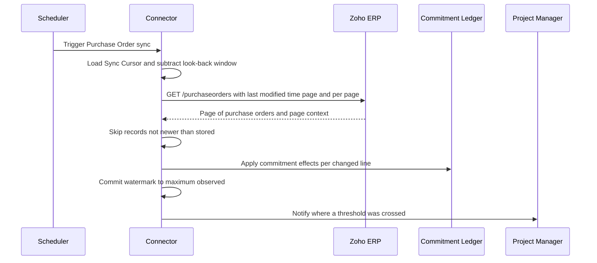
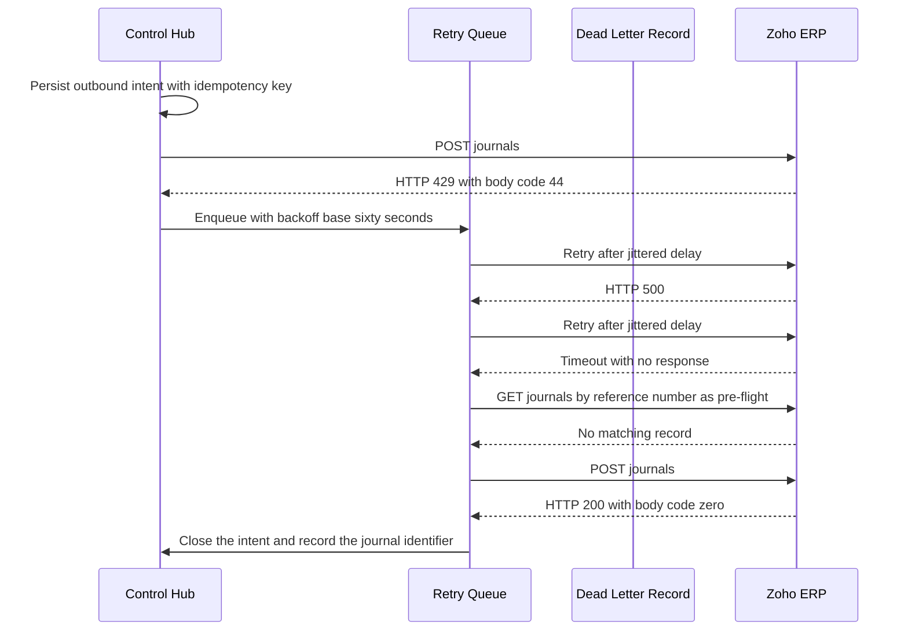
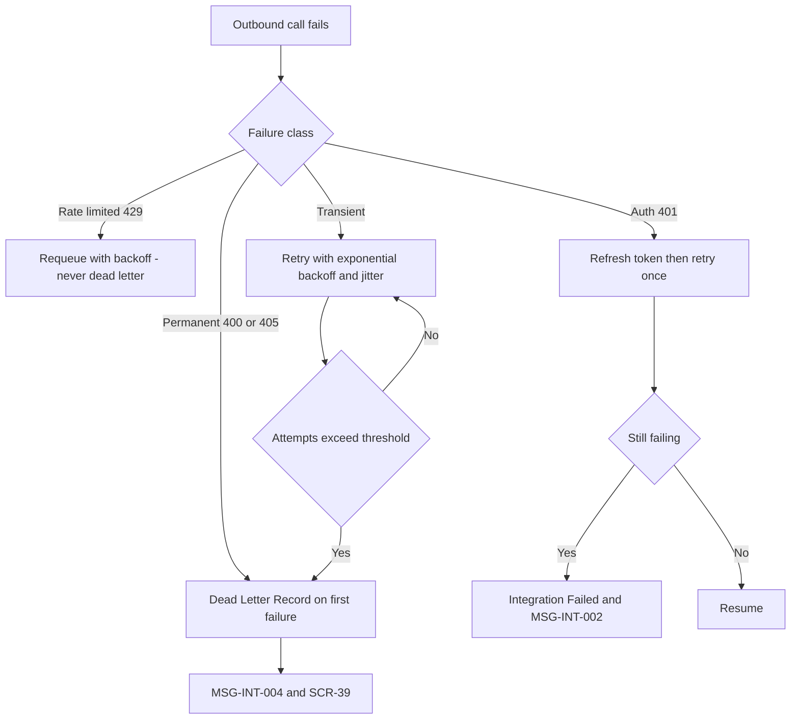

## 25. API and Event Architecture

### 25.1 Two API surfaces, and which one this section owns

There are two API surfaces in this solution and confusing them is the fastest way to build the wrong thing.

| Surface | Who owns it | Who calls it | Where it is specified |
|---|---|---|---|
| **The Control Hub API** — the CAPEX and WBS Control Hub's own REST API | This project | The Hub's own web front end, Zoho Analytics or any client-side reporting tool, scheduled jobs, and any future Atha Group system | **This section.** §25.3 to §25.14 |
| **The Zoho ERP API** — the vendor's REST API | Zoho | The Hub's connector, outbound only | §16 Zoho ERP API Capability Matrix and §17 Zoho ERP Endpoint Inventory define what exists; §14 defines how it is configured; §18 defines what flows; **this section** defines the ingestion engine that drives it — §25.15 to §25.19 |

Nothing in §25.3 to §25.14 is a Zoho path. Nothing in §25.15 to §25.19 invents a Zoho path. Every Zoho path quoted below appears in the machine-generated endpoint inventory.

This section deliberately does not restate what other sections own: OAuth grant mechanics and token storage are in §15 OAuth, Credential and Scope Management and §26 Integration Security and Secret Management; per-object sync feasibility and schedule defaults are in §14.11; the outbound idempotency mechanisms against Zoho are in §18.8; reconciliation logic is in §27 Integration Reconciliation Design. Cross-references are given rather than duplicated text.

### 25.2 The design constraints that are forced, not chosen

Every architectural decision in this section traces to one of these. None of them is a preference.

| # | Constraint | Evidence | What it forces |
|---|---|---|---|
| C1 | No webhook, event, notification, subscription or callback path exists anywhere in the ERP REST API | Established mechanically: the 84-page ERP API documentation index contains no such page, direct URL probes returned 404, and a scan of the 78-module bundle for hook, event, trigger, subscribe, notification, push and callback returned nothing in any path name `[source: https://www.zoho.com/erp/api/v3/introduction/ — verified 2026-08-05]`. The endpoint inventory contains **zero** rows matching *webhook* across all 869 operations `[source: Zoho ERP OpenAPI bundle openapi-all.zip, sha256 E95A0399… — verified 2026-08-05]` | **Polling is the primary and only assumed ingestion mechanism.** Webhooks are a conditional accelerator, §25.18 |
| C2 | Rate limit of 100 requests per minute per organisation | *"You can make 100 requests per minute per organization."* `[source: https://www.zoho.com/erp/api/v3/introduction/ — verified 2026-08-05]` | A per-organisation token bucket, and organisations serialised, not parallelised |
| C3 | Daily quota by plan | *"Standard plan — 2,000 requests/day"*, *"Premium plan — 10,000 requests/day"*, *"Zoho ERP (India) offers Standard and Premium plans only."* `[source: https://www.zoho.com/erp/api/v3/introduction/ — verified 2026-08-05]` | Poll frequency is budgeted, not chosen freely. A 15-minute cycle on two objects across two organisations must be shown to fit inside the declared budget |
| C4 | Concurrency limiter | *"The concurrent rate limiter is the maximum number of API calls that can be simultaneously active for an organization at any given point in time."* with *"All plans — 10 concurrent calls (soft limit)"* `[source: https://www.zoho.com/erp/api/v3/introduction/ — verified 2026-08-05]` | A semaphore, sized below the soft limit |
| C5 | No `Retry-After` header is documented, and the documented status set is only 200, 201, 400, 401, 404, 405, 429, 500 | `[source: https://www.zoho.com/erp/api/v3/errors/ — verified 2026-08-05]` | Backoff must be **self-computed**. The client must never wait for a header that may not arrive |
| C6 | Access tokens last one hour; refresh tokens do not expire but are capped at 20 per user | *"Each access token is valid only for an hour…"*, *"A refresh token does not expire."*, *"The maximum limit is 20 refresh tokens per user."* `[source: https://www.zoho.com/erp/api/v3/oauth/ — verified 2026-08-05]` | Proactive refresh at a margin before expiry, and a hard rule that re-consent is a governed act, not an automatic retry |
| C7 | Pagination is offset-based with no total count. `page_context` contains exactly `page`, `per_page`, `has_more_page` | `[source: https://www.zoho.com/erp/api/v3/pagination/ — verified 2026-08-05]` | Progress cannot be reported as a percentage. `has_more_page` is the only loop terminator |
| C8 | `per_page` default is 200 with a documented maximum of 200 | The specification declares a `per_page` default of 200 on 64 operations and an explicit maximum of 200 on 2 (OAS-08) `[source: Zoho ERP OpenAPI bundle openapi-all.zip, sha256 E95A0399… — verified 2026-08-05]` | Never request more than 200 |
| C9 | Purchase Receive has no list endpoint and its lines carry no PO-line link and no project, tag or custom-field coding | OAS-03 `[source: Zoho ERP OpenAPI bundle openapi-all.zip, sha256 E95A0399… — verified 2026-08-05]` | The GRN sync endpoint in §25.14.7 is a **reconstruction** job, not a list-and-page job. Its contract must say so |
| C10 | Fixed assets carry no `last_modified_time` and no link to a source project, PO or bill | OAS-09 `[source: Zoho ERP OpenAPI bundle openapi-all.zip, sha256 E95A0399… — verified 2026-08-05]` | Asset sync is full-refresh; it has no incremental mode to offer |
| C11 | Purchase Request does not exist anywhere in the ERP API — zero paths, zero modules, zero scopes across 78 modules, 561 paths and 163 scopes | OAS-02 `[source: Zoho ERP OpenAPI bundle openapi-all.zip, sha256 E95A0399… — verified 2026-08-05]` | The Hub's own API is the **only** API for Purchase Requests. There is no sync endpoint for them and there never can be |
| C12 | No sandbox exists in Zoho ERP; the only isolation primitives are separate organisations and a trial plan | `[source: https://www.zoho.com/erp/api/v3/introduction/ — verified 2026-08-05]` | The POC mock strategy in §35 is not a convenience; it is the only safe test surface |
| C13 | Response envelope is `{code, message, <resource>}` where `code` is zero on success and non-zero on error | `[source: https://www.zoho.com/erp/api/v3/response/ — verified 2026-08-05]` | HTTP status alone is not sufficient to detect a Zoho error. The body `code` must be checked on every response |
| C14 | Timestamps are ISO 8601 with offset, example `2016-06-11T17:38:06+0530` | `[source: https://www.zoho.com/erp/api/v3/response/ — verified 2026-08-05]` | The Hub stores and compares watermarks with offset preserved; it never truncates to a date |

---

**Part A — the Control Hub API.** §25.3 to §25.14.

### 25.3 Base path, media type and versioning

| Element | Specification |
|---|---|
| Base path | `https://{host}/api/v1` |
| Media type | `application/json; charset=utf-8` on request and response. `application/csv` and `application/pdf` are accepted on `Accept` for report endpoints only |
| Character encoding | UTF-8 only |
| Date and timestamp format | **ISO-8601 in every payload, export and audit record**, with offset — `2026-08-06T14:22:31+05:30`. Dates without a time are `2026-08-06`. The `dd-MMM-yyyy` form is a presentation concern of the user interface and never appears in a payload |
| Monetary values | JSON `number` with two decimal places, in the transaction currency, accompanied by a sibling `currency` field. A `formatted` string in Indian grouping may be supplied on **read** responses for convenience; it is never accepted on write |
| Versioning scheme | Major version in the path (`/api/v1`). Minor, backward-compatible changes do not change the path |
| What counts as breaking | Removing a field, renaming a field, narrowing an enumeration, changing a type, making an optional request field mandatory, or changing the meaning of an existing value |
| What does not | Adding an optional request field, adding a response field, adding an enumeration value **where the field is documented as extensible**, adding a new endpoint |
| Deprecation protocol | A deprecated endpoint returns `Deprecation: true` and `Sunset: <IMF-fixdate>` response headers, plus a `Link` header pointing at the successor. Minimum notice is one full release cycle. This is a `DERIVED-RECOMMENDATION`; the client has stated no API lifecycle requirement |
| Version discovery | `GET /api/v1/meta` returns the running build, the schema version, the supported enumerations for every extensible field, and the list of message IDs the API can emit |

**Enumerations are contract-frozen.** Every status value returned by this API is one of the 21 in the status registry. Every message identifier is one of the 27 in the message registry. Every role name is one of the 13 in the role registry. The API must never invent a synonym — a client that switches on `"Connected"` or `"Token expired"` will break, because those labels do not exist.

### 25.4 Authentication

`provenance=DERIVED-RECOMMENDATION.` The client document states no authentication requirement.

| Element | Recommendation | Note |
|---|---|---|
| Human users | OpenID Connect authorisation-code flow with PKCE against Atha Group's existing identity provider. The Hub is a relying party and does not hold passwords | The identity provider in use is **UNVERIFIED - REQUIRES CONFIRMATION** |
| Machine clients | OAuth 2.0 client-credentials grant, one client per integration, each bound to a named service principal that appears in the audit trail | — |
| Token presentation | `Authorization: Bearer <jwt>` | Deliberately **not** the Zoho scheme. Zoho's ERP API uses `Authorization: Zoho-oauthtoken <token>` `[source: https://www.zoho.com/erp/api/v3/introduction/ — verified 2026-08-05]`, and the two must never be confused in code or in a proxy configuration |
| Access token lifetime | 60 minutes for humans, 15 minutes for machine clients | — |
| Refresh | Rotating refresh tokens for human sessions; machine clients re-authenticate | — |
| Multi-factor authentication | Required for `System Administrator`, `CFO`, `CAPEX Committee` and `Project Finance Controller` at the identity provider, not at the application | §32 Security and Internal Controls |
| Session expiry warning | The front end raises `MSG-SEC-002` before expiry: *"Your session will expire in {minutes} minutes. Save your work, or continue to stay signed in."* | — |
| Transport | TLS 1.2 minimum, HSTS enabled. Plain HTTP is refused, not redirected | — |

The Zoho OAuth credentials are **never** exchanged with a Hub API caller and never appear in a Hub API response. That boundary is absolute and is tested in §26.16.

### 25.5 Authorisation

Authorisation is evaluated in three layers, in order. All three must pass.

| Layer | Question | Mechanism |
|---|---|---|
| 1. Scope | Does the token permit this operation class at all? | OAuth scopes on the token, listed below |
| 2. Role | Does the caller's role permit this action on this entity type? | Role from the 13-role registry, resolved against the §31 Role and Approval Matrix |
| 3. Data | Does the caller's assignment permit this specific project, plant or entity? | Row-level filter on `organisation_id`, `plant_id` and project assignment |

#### 25.5.1 Hub API scope catalogue

`provenance=DERIVED-RECOMMENDATION.` Scope names are the Hub's own and are unrelated to Zoho scope strings.

| Scope | Grants |
|---|---|
| `capex.projects.read` / `.write` | CAPEX projects and WBS elements |
| `capex.budgets.read` / `.write` | Budget versions, lines and revisions |
| `capex.budgetcheck.execute` | Run a budget availability check |
| `capex.requests.read` / `.write` | Purchase Requests |
| `capex.commitments.read` | Commitment ledger and PO references |
| `capex.actuals.read` | Actual ledger, bills, CWIP |
| `capex.capitalisation.read` / `.write` | Capitalisation requests and asset allocations |
| `capex.approvals.act` | Approve, reject or return an item routed to the caller |
| `capex.reports.read` | Report and dashboard endpoints |
| `capex.reconciliation.read` / `.execute` | Reconciliation views and runs |
| `integration.sync.execute` | Trigger a Zoho sync job |
| `integration.deadletter.read` / `.replay` | Dead-letter inspection and replay |
| `integration.config.read` / `.write` | Connection profiles, mappings, schedules |
| `audit.read` | Audit trail |

#### 25.5.2 Role-to-scope matrix

Read as: the role is granted the scopes marked. Write scopes always imply the matching read scope.

| Role | projects | budgets | budgetcheck | requests | commitments | actuals | capitalisation | approvals | reports | reconciliation | sync | deadletter | config | audit |
|---|---|---|---|---|---|---|---|---|---|---|---|---|---|---|
| Requestor | read | read | execute | write | read | — | — | — | read | — | — | — | — | — |
| Project Manager | write | read | execute | write | read | read | — | act | read | read | — | — | — | — |
| Plant Head | read | read | execute | read | read | read | read | act | read | read | — | — | — | — |
| Department Head | read | read | execute | read | read | read | — | act | read | — | — | — | — | — |
| Procurement | read | read | execute | read | write | read | — | act | read | read | execute | read | — | — |
| Finance | read | read | execute | read | read | write | write | act | read | execute | execute | read | — | read |
| Project Finance Controller | write | write | execute | read | read | write | write | act | read | execute | execute | replay | read | read |
| CAPEX Committee | read | read | — | read | read | read | read | act | read | — | — | — | — | read |
| CFO | read | write | — | read | read | read | read | act | read | read | — | — | — | read |
| Management Approver | read | read | — | read | read | read | read | act | read | — | — | — | — | — |
| System Administrator | read | read | — | read | read | read | read | — | read | read | execute | replay | write | read |
| Internal Auditor | read | read | — | read | read | read | read | — | read | read | — | read | read | read |
| Read-only Management User | read | read | — | — | read | read | read | — | read | — | — | — | — | — |

Two rules that must be enforced in code, not by convention:

1. **`System Administrator` has no approval authority.** The administrator can configure the connector and replay a dead letter, but cannot approve a budget, a revision, a purchase request or a capitalisation. This is the segregation-of-duties control in §32.
2. **`Internal Auditor` is read-only everywhere, including dead letters.** The auditor may inspect a dead-letter record but may not replay it, because replay is a write to Zoho.

#### 25.5.3 Denial response

A denial always names the role, the action and the entity, and tells the caller who to contact, per `MSG-SEC-001`:

```json
HTTP/1.1 403 Forbidden
Content-Type: application/json

{
  "error": {
    "code": "AUTHZ_ROLE_DENIED",
    "message_id": "MSG-SEC-001",
    "message": "Your role (Requestor) cannot approve for Budget Revision. Contact CFO if you need this access.",
    "params": {
      "role": "Requestor",
      "action": "approve",
      "entity": "Budget Revision",
      "approver_role": "CFO"
    }
  },
  "correlation_id": "01J9F3K7QF9Z2C4WQ0H8N3B7XA",
  "timestamp": "2026-08-06T14:22:31+05:30"
}
```

A denial never leaks the existence or the contents of a record the caller cannot see. Where visibility itself is restricted, the API returns `404` with `RESOURCE_NOT_FOUND`, not `403`.

### 25.6 Request and response conventions

#### 25.6.1 Standard request headers

| Header | Required | Purpose |
|---|---|---|
| `Authorization` | Yes | `Bearer <jwt>` |
| `Content-Type` | On write | `application/json; charset=utf-8` |
| `Accept` | No | Defaults to JSON |
| `X-Correlation-Id` | No | Caller-supplied correlation identifier. If absent the API generates one and returns it. Format: ULID or UUIDv4 |
| `Idempotency-Key` | **Yes on every `POST`** | §25.7 |
| `If-Match` | On `PUT` and `PATCH` | Optimistic concurrency, §25.12 |
| `X-Reason-Code` and `X-Reason-Text` | On any override or forced action | Written to the audit trail. Absence on an override-flagged endpoint is a `400` with `MSG-SEC-003` |
| `X-On-Behalf-Of` | No | Delegated action; the delegator and the delegate are both recorded |

#### 25.6.2 Standard response headers

| Header | Present | Purpose |
|---|---|---|
| `X-Correlation-Id` | Always | Echoed or generated |
| `X-Request-Id` | Always | Unique per request; distinct from the correlation ID, which spans a chain |
| `ETag` | On single-resource reads | Concurrency token |
| `X-RateLimit-Limit`, `X-RateLimit-Remaining`, `X-RateLimit-Reset` | Always | §25.13 |
| `Retry-After` | On `429` and `503` | Seconds. **The Hub always sends this, even though Zoho does not** (C5) |
| `Deprecation`, `Sunset`, `Link` | On deprecated endpoints | §25.3 |

#### 25.6.3 Correlation identifier semantics

This is the thread that makes an audit trail from budget approval through procurement, accounting and capitalisation actually traceable, which is REQ-SEC-001.

| Property | Rule |
|---|---|
| Generation | The originating request generates one `correlation_id` if the caller did not supply one |
| Propagation | It is carried on every downstream artefact: the `Integration Event`, the `Integration Request`, the `Integration Response`, every `Sync Log` line, every `Audit Log` row, every `Retry Queue` entry and every `Dead-Letter Record` |
| Outbound to Zoho | Carried as a `W3C traceparent` header on the outbound call **and** written into the Zoho record's `reference_number` or a discovered custom field where one exists, so the trail survives outside our database |
| Not a business key | It is never used as an idempotency key, a document number or a natural key. Those are separate |
| Retention | Same retention as the `Audit Log` |

Every log line, every error response and every screen that shows an integration failure displays the correlation ID, and SCR-28 Audit Trail Viewer accepts it as a search term.

#### 25.6.4 Audit metadata on every write

Every entity in the data model carries the audit attributes required by the entity contract. The API surfaces them on read and populates them on write from the token and headers — never from the request body.

| Field | Populated from | Client may set? |
|---|---|---|
| `created_at`, `created_by` | Server clock, token subject | No |
| `updated_at`, `updated_by` | Server clock, token subject | No |
| `version` | Server increment | No |
| `correlation_id` | Header or generated | Yes, as a header only |
| `reason_code`, `reason_text` | `X-Reason-Code`, `X-Reason-Text` | Yes, as headers |
| `on_behalf_of` | `X-On-Behalf-Of` | Yes, as a header |
| `source_system_id` | Set by the connector on inbound records | No |
| `sync_status` | Derived | No |
| `effective_date` | Business date on the payload where the entity has one | Yes |
| `is_deleted` | Soft delete only. **No API operation performs a hard delete** | Via `DELETE`, which sets the flag |

A `PUT` or `PATCH` that includes any server-owned field in the body is rejected with `400 / FIELD_NOT_WRITABLE` naming the field, rather than silently ignoring it.

### 25.7 Idempotency

#### 25.7.1 Contract

| Rule | Specification |
|---|---|
| Scope | `Idempotency-Key` is **mandatory** on every `POST`. It is ignored on `GET`, `PUT`, `PATCH` and `DELETE`, which are idempotent by construction |
| Format | Client-generated, 16 to 128 characters, opaque to the server. A ULID or UUIDv4 is recommended |
| Uniqueness domain | `(client_id, endpoint, idempotency_key)` |
| Retention | 7 days. A key reused after 7 days is treated as new |
| First call | Executed; the response, status and headers are stored against the key |
| Replay with an identical body | The stored response is returned verbatim, with `Idempotency-Replayed: true` |
| Replay with a different body | `409 Conflict` with `IDEMPOTENCY_KEY_REUSED`. The body is fingerprinted by a canonical-JSON SHA-256 hash, so key order and whitespace do not matter |
| Concurrent replay while the first is still running | `409 Conflict` with `IDEMPOTENCY_IN_PROGRESS` and `Retry-After: 2` |
| Missing key | `400 Bad Request` with `IDEMPOTENCY_KEY_REQUIRED` |
| Failure semantics | A `5xx` outcome is **not** stored. The key remains usable, so a retry after a server error executes for real |
| Storage | A dedicated table, not a cache. Idempotency must survive a process restart |

#### 25.7.2 Why this is stricter than usual here

Because the two most consequential operations in this system are `POST /budget-check` followed by an approval that consumes budget, and `POST /capitalisation-requests` which writes to the general ledger. A duplicated budget consumption breaks REQ-PO-003; a duplicated capitalisation journal breaks the CWIP balance and the §23.16 disclosure. Idempotency here is a financial control, not a convenience.

Idempotency **against Zoho** is a different mechanism entirely and is specified in §18.8: vendor-supplied upsert headers where available, pre-flight lookup by natural key otherwise, and a deterministic Hub-side outbound intent key in all cases.

### 25.8 Pagination

The Hub API uses **cursor pagination**, deliberately unlike Zoho's.

| Element | Hub API | Zoho ERP API | Why they differ |
|---|---|---|---|
| Parameters | `limit` (default 50, maximum 200), `cursor` (opaque) | `page`, `per_page` `[source: https://www.zoho.com/erp/api/v3/pagination/ — verified 2026-08-05]` | Offset pagination skips or repeats rows when the underlying set changes mid-scan. Budget and commitment data changes constantly |
| Total count | Not returned by default. `?include_total=true` returns `total_count` at a documented cost | Not available. `page_context` contains exactly `page`, `per_page` and `has_more_page` `[source: https://www.zoho.com/erp/api/v3/pagination/ — verified 2026-08-05]` | The Hub can afford a count on request; Zoho cannot supply one at all |
| Termination | `page.next_cursor` is `null` | `has_more_page` is `false` | — |
| Maximum page | 200 | Default 200, documented maximum 200 (OAS-08) `[source: Zoho ERP OpenAPI bundle openapi-all.zip, sha256 E95A0399… — verified 2026-08-05]` | Matched intentionally so a connector page maps one-to-one onto a Hub page |

Response envelope for a collection:

```json
{
  "data": [ /* … */ ],
  "page": {
    "limit": 50,
    "next_cursor": "eyJrIjoiQ0FQRVgtMjAyNi0wMDEuMDMiLCJ2IjoxNzU0NDgwMDAwfQ",
    "has_more": true,
    "total_count": null
  },
  "correlation_id": "01J9F3K7QF9Z2C4WQ0H8N3B7XA",
  "timestamp": "2026-08-06T14:22:31+05:30"
}
```

A cursor encodes the sort key of the last row plus a snapshot token. A cursor is valid for 15 minutes and is refused with `410 Gone / CURSOR_EXPIRED` afterwards, so a client cannot page through a set that has drifted beyond recognition.

### 25.9 Filtering

Explicit, typed and enumerable — not a query language, because a query language on a financial-control API is an authorisation hole.

| Form | Example |
|---|---|
| Equality | `?filter[budget_head][eq]=Plant%20%26%20Machinery` |
| Set membership | `?filter[status][in]=Approved,Released` |
| Comparison | `?filter[utilisation_pct][gte]=80` |
| Range | `?filter[posting_date][between]=2026-04-01,2026-06-30` |
| Null tests | `?filter[capitalisation_date][isnull]=true` |
| Text | `?filter[project_name][contains]=Plant` |
| Hierarchy | `?filter[wbs_code][descendant_of]=CAPEX-2026-001.03` |

| Rule | Specification |
|---|---|
| Allowed operators | `eq`, `ne`, `in`, `nin`, `gt`, `gte`, `lt`, `lte`, `between`, `contains`, `startswith`, `isnull`, `descendant_of` |
| Field allow-list | Each endpoint publishes its filterable fields at `GET /api/v1/meta`. An unknown field is `400 / FILTER_FIELD_UNKNOWN`, never silently ignored |
| Combination | Multiple filters combine with AND. OR is not supported; a client needing OR uses `in` |
| Authorisation | Filters are applied **after** the row-level data filter of §25.5, never before. A filter can narrow what the caller may see; it can never widen it |
| Empty result | `200` with an empty `data` array, and the front end shows `MSG-GEN-002`: *"No {object_type} match the current filters. Clear filters, or adjust the {primary_filter} to widen the search."* |

Zoho's own filtering is different and much narrower. Where the connector filters Zoho, it uses only documented query parameters — for example `GET {BASE_V3}/purchaseorders` accepts `status`, `vendor_id`, `last_modified_time`, `custom_field`, `search_text`, `filter_by`, `sort_column`, `page`, `per_page` `[source: Zoho ERP OpenAPI bundle openapi-all.zip, sha256 E95A0399… — verified 2026-08-05]`. Anything else is filtered on the Hub side after retrieval, and the cost of that is accounted for in the call budget.

### 25.10 Sorting

| Element | Specification |
|---|---|
| Parameter | `?sort=-utilisation_pct,wbs_code` — leading `-` for descending, comma-separated for multi-key |
| Default | Documented per endpoint at `GET /api/v1/meta`; never undefined |
| Allow-list | Sortable fields are published per endpoint. Unknown field is `400 / SORT_FIELD_UNKNOWN` |
| Stability | Every sort is made total by appending the resource identifier as a final tie-breaker, so cursor pagination cannot skip or repeat a row |
| Nulls | Nulls sort last on ascending and first on descending, always, and this is documented rather than left to the database |

Zoho exposes `sort_column` on 51 operations and `sort_order` on 18 `[source: Zoho ERP OpenAPI bundle openapi-all.zip, sha256 E95A0399… — verified 2026-08-05]`, so the connector cannot assume a sort is available on every list it calls; where it is not, the connector sorts after retrieval.

### 25.11 Error model

#### 25.11.1 The error object

Every non-2xx response has exactly this shape. There is no second shape.

```json
{
  "error": {
    "code": "BUDGET_EXCEEDED",
    "message_id": "MSG-BUD-001",
    "message": "The proposed PO value of 20,00,000 exceeds the available budget of 15,00,000 for WBS CAPEX-2026-001.03 by 5,00,000. Submit a budget revision or request exception approval.",
    "severity": "error",
    "params": {
      "document_type": "PO",
      "amount": "20,00,000",
      "available": "15,00,000",
      "wbs_code": "CAPEX-2026-001.03",
      "budget_head": "Plant & Machinery",
      "shortfall": "5,00,000"
    },
    "field_errors": [],
    "next_actions": [
      { "action": "SUBMIT_BUDGET_REVISION", "href": "/api/v1/budget-revisions" },
      { "action": "REQUEST_EXCEPTION_APPROVAL", "href": "/api/v1/purchase-requests/{id}/exception" }
    ],
    "retryable": false
  },
  "correlation_id": "01J9F3K7QF9Z2C4WQ0H8N3B7XA",
  "request_id": "01J9F3K7QG3M8T1S0V4E7R2WQP",
  "timestamp": "2026-08-06T14:22:31+05:30"
}
```

Binding rules on the `message` string:

| Rule | Source |
|---|---|
| It must name the object, state the numbers that matter, give the shortfall or difference where relevant, and offer at least one concrete next action | The message-registry template |
| It must **not** contain a bare error code with no explanation, the words *invalid*, *error occurred* or *failed* without a reason, or technical exception text shown to a business user | The same template |
| Where a registered message exists for the condition, `message_id` must be that identifier and `message` must be that template rendered with real values | The message registry |
| Where no registered message exists, `message_id` is `null` and the message must still satisfy the template. A `contract_gap` is raised so the message can be added to the registry rather than invented at runtime | The conventions contract |

`field_errors` is populated for validation failures so the front end can place messages beneath the offending field and build the form-level error summary that accessibility requires:

```json
"field_errors": [
  { "field": "line_items[2].budget_head", "code": "REQUIRED", "message_id": "MSG-BUD-004",
    "message": "A CAPEX code and budget head are mandatory on capital procurement. Select a budget head for line 3 before submitting." }
]
```

#### 25.11.2 HTTP status catalogue for the Hub API

| Status | When | `retryable` | Example code |
|---|---|---|---|
| `200` | Successful read or action | — | — |
| `201` | Resource created | — | — |
| `202` | Accepted for asynchronous processing; body carries a job identifier | — | — |
| `204` | Successful action with no body | — | — |
| `400` | Malformed request, unknown filter or sort field, non-writable field in body, missing idempotency key | No | `VALIDATION_FAILED` |
| `401` | Missing, malformed or expired token | No | `AUTH_TOKEN_INVALID` |
| `403` | Authenticated but not permitted | No | `AUTHZ_ROLE_DENIED` |
| `404` | Not found, or not visible to this caller | No | `RESOURCE_NOT_FOUND` |
| `409` | Idempotency key reuse with a different body; optimistic-concurrency version conflict; state-machine transition not permitted | Sometimes | `IDEMPOTENCY_KEY_REUSED`, `VERSION_CONFLICT`, `INVALID_STATE_TRANSITION` |
| `410` | Expired pagination cursor | No | `CURSOR_EXPIRED` |
| `422` | Well-formed and permitted, but a business rule refuses it — the budget-check failure above is the archetype | No | `BUDGET_EXCEEDED` |
| `429` | Hub rate limit exceeded | **Yes** | `RATE_LIMITED` |
| `500` | Unhandled server fault | **Yes** | `INTERNAL_ERROR` |
| `502` | Upstream Zoho returned an unusable response | **Yes** | `UPSTREAM_BAD_RESPONSE` |
| `503` | Connector paused, maintenance window, or Zoho connection in `Integration Failed` | **Yes** | `UPSTREAM_UNAVAILABLE` |
| `504` | Upstream timeout | **Yes** | `UPSTREAM_TIMEOUT` |

The distinction between `400` and `422` is load-bearing and must be implemented as stated: `400` means *the request is wrong*; `422` means *the request is right and the answer is no*. A budget check that fails is a `422`, and the client renders it as a business message, not as a bug.

#### 25.11.3 Hub error-code registry

| Code | Status | `message_id` | Meaning |
|---|---|---|---|
| `VALIDATION_FAILED` | 400 | varies | One or more field errors; see `field_errors` |
| `IDEMPOTENCY_KEY_REQUIRED` | 400 | — | `POST` without `Idempotency-Key` |
| `IDEMPOTENCY_KEY_REUSED` | 409 | — | Same key, different body |
| `IDEMPOTENCY_IN_PROGRESS` | 409 | — | Original request still executing |
| `FIELD_NOT_WRITABLE` | 400 | — | Server-owned field supplied in body |
| `FILTER_FIELD_UNKNOWN` / `SORT_FIELD_UNKNOWN` | 400 | — | Not on the allow-list |
| `CURSOR_EXPIRED` | 410 | — | Cursor older than 15 minutes |
| `AUTH_TOKEN_INVALID` | 401 | — | — |
| `AUTHZ_ROLE_DENIED` | 403 | `MSG-SEC-001` | Role lacks the action |
| `AUTHZ_DATA_SCOPE_DENIED` | 404 | — | Record outside the caller's data scope |
| `REASON_REQUIRED` | 400 | `MSG-SEC-003` | Override attempted without a reason |
| `RESOURCE_NOT_FOUND` | 404 | — | — |
| `VERSION_CONFLICT` | 409 | — | `If-Match` did not match the current `ETag` |
| `INVALID_STATE_TRANSITION` | 409 | — | Transition not permitted by the state machine in §30 |
| `BUDGET_EXCEEDED` | 422 | `MSG-BUD-001` | Proposed commitment exceeds available budget |
| `BUDGET_HEAD_REQUIRED` | 422 | `MSG-BUD-004` | CAPEX code or budget head missing on a capital line |
| `BUDGET_TRANSFER_NEGATIVE` | 422 | `MSG-BUD-006` | Transfer would leave the source negative |
| `PROCUREMENT_BLOCKED_BY_STATUS` | 422 | `MSG-PRC-006` | Project is `Closed`, `Capitalised` or `Financially Completed` |
| `BILL_EXCEEDS_PO_LINE` | 422 | `MSG-PRC-004` | Bill line exceeds the PO line it references |
| `CAPITALISATION_ALLOCATION_MISMATCH` | 422 | `MSG-CAP-002` | Allocations do not total the CWIP balance |
| `CAPITALISATION_OPEN_ITEMS` | 422 | `MSG-CAP-001` | Open commitments or unbilled receipts remain |
| `SCOPE_MISSING` | 503 | `MSG-INT-001` | Required Zoho OAuth scope not granted |
| `CONNECTION_UNAUTHORISED` | 503 | `MSG-INT-002` | Zoho refresh token revoked or expired beyond refresh |
| `UPSTREAM_RATE_LIMITED` | 503 | `MSG-INT-003` | Zoho rate limit hit; work is queued, nothing lost |
| `RECONCILIATION_OUT_OF_TOLERANCE` | 422 | `MSG-INT-006` | Difference beyond tolerance blocks the action |
| `RATE_LIMITED` | 429 | — | Hub rate limit |
| `INTERNAL_ERROR` | 500 | — | — |
| `UPSTREAM_BAD_RESPONSE` / `UPSTREAM_TIMEOUT` / `UPSTREAM_UNAVAILABLE` | 502 / 504 / 503 | — | — |

#### 25.11.4 Mapping Zoho responses onto Hub behaviour

This is the table the connector implements. **The Zoho body `code` must be read on every response, because a `200` can carry a non-zero `code`** (C13).

| Zoho signal | Documented text | Hub classification | Retry | Backoff | User-facing |
|---|---|---|---|---|---|
| HTTP `200` with body `code: 0` | *"code = Zoho ERP error code. This will be zero for a success response"* `[source: https://www.zoho.com/erp/api/v3/response/ — verified 2026-08-05]` | Success | — | — | — |
| HTTP `200` with body `code != 0` | Same source | **Failure.** Do not treat as success | Depends on code | Standard | Mapped by code |
| `400 Bad Request` | `[source: https://www.zoho.com/erp/api/v3/errors/ — verified 2026-08-05]` | Permanent. Our payload is wrong | **No** | — | Dead-letter after first failure; `MSG-INT-004` |
| `401 Unauthorized (Invalid AuthToken)` | `[source: https://www.zoho.com/erp/api/v3/errors/ — verified 2026-08-05]` | Token problem. **Refresh once, then retry once.** If it recurs, the grant is broken | Once, after refresh | Immediate | `MSG-INT-002` on recurrence |
| `404 URL Not Found` | `[source: https://www.zoho.com/erp/api/v3/errors/ — verified 2026-08-05]` | Permanent. Either the record is gone or the base path resolved wrongly (OAS-01) | No | — | Dead-letter; check module base path first |
| `405 Method Not Allowed` | *"Method you have called is not supported for the invoked API"* `[source: https://www.zoho.com/erp/api/v3/errors/ — verified 2026-08-05]` | Permanent build defect | No | — | Dead-letter; raise as a defect, not an operational alert |
| `429` with body `code: 45` | *"An error with HTTP status code 429 will be returned if the number of requests made exceeds the number of requests of a particular plan."* `[source: https://www.zoho.com/erp/api/v3/introduction/ — verified 2026-08-05]` | **Daily quota exhausted** | Yes, but not today | Requeue for the next quota window; do not hammer | `MSG-INT-003` |
| `429` with body `code: 44` | *"For security reasons your account has been blocked as you have exceeded the maximum number of requests per minute"* and the organisation variant `[source: https://www.zoho.com/erp/api/v3/introduction/ — verified 2026-08-05]` | **Per-minute limiter tripped** | Yes | Exponential from 60 s, because the window is a minute | `MSG-INT-003` |
| `429` with body `code: 1070` | *"You have reached the maximum number of in process requests allowed. Kindly try again after some time."* `[source: https://www.zoho.com/erp/api/v3/introduction/ — verified 2026-08-05]` | **Concurrency limiter tripped** | Yes | Short backoff from 2 s with jitter; reduce the semaphore by one for 5 minutes | `MSG-INT-003` |
| `500 Internal Error` | `[source: https://www.zoho.com/erp/api/v3/errors/ — verified 2026-08-05]` | Transient | Yes | Standard | Silent unless it persists |
| Network timeout, no response | not documented | **Unknown outcome** | Yes, but never a blind `POST` retry — pre-flight lookup first per §18.8 | Standard | Silent unless it persists |
| `403`, `409`, `422` | Do **not** appear in the documented status table, and `Retry-After` does not appear on that page `[source: https://www.zoho.com/erp/api/v3/errors/ — verified 2026-08-05]` | Treat any undocumented status as transient-unknown: retry twice, then dead-letter | Twice | Standard | `MSG-INT-004` on dead-letter |

**Insufficient-scope is not separately signalled.** The documented `401` text is *"Unauthorized (Invalid AuthToken)"* and no insufficient-scope status is documented `[source: https://www.zoho.com/erp/api/v3/errors/ — verified 2026-08-05]`. The connector therefore cannot distinguish a revoked token from a missing scope by status code alone, and must consult the scope validation in §15 before concluding which it is. Presenting `MSG-INT-002` when the real cause is a missing scope would send the administrator down the wrong path.

### 25.12 Concurrency control

| Element | Specification |
|---|---|
| Mechanism | Optimistic. `ETag` on single-resource reads, `If-Match` required on `PUT` and `PATCH` |
| Mismatch | `409 / VERSION_CONFLICT`, with the current `version` and `updated_by` in `params` so the UI can say who changed it |
| Missing `If-Match` | `428 Precondition Required` on entities flagged as concurrency-sensitive — budgets, budget revisions, capitalisation requests. Others accept last-write-wins |
| Budget consumption | **Pessimistic**, not optimistic. A budget availability check that results in an approval takes a short-lived advisory lock on the `(project, wbs_element, budget_head)` key for the duration of the approval transaction |

The pessimistic exception exists because of a specific, documented ambiguity: the client's control formula counts only Actual CWIP and Open PO Commitments, so an approved Purchase Request reserves nothing, and two Purchase Requests of ₹10,00,000 each can both pass a check against ₹15,00,000 available and both become purchase orders (CONF-10). The blueprint does not silently resolve that; it makes PR reservation configurable with the client's own behaviour as the default, and it serialises the budget ledger so that the race exists **only** where the client has chosen soft checking. The concurrency test case for this is in §39.

### 25.13 Rate limiting on the Hub API

`provenance=DERIVED-RECOMMENDATION.`

| Class | Limit | Window | Rationale |
|---|---|---|---|
| Interactive user | 600 requests | per minute per user | Generous; a busy grid can burst |
| `POST /budget-check` | 60 requests | per minute per user | Each one may touch the ledger |
| Report and reconciliation reads | 30 requests | per minute per user | Expensive aggregations |
| Machine client, default | 1,200 requests | per minute per client | — |
| `integration.sync.execute` | 1 run per object | per 5 minutes | Matches the connector's own manual-sync guard in §14.11.2 and protects the Zoho quota |

A `429` from the Hub always carries `Retry-After` and `X-RateLimit-Reset`. The Hub's own limits are set well above the Zoho limits on purpose: the scarce resource is the Zoho quota, not the Hub, and the Hub must absorb bursts rather than pass them through.

### 25.14 Sample endpoints

Eleven endpoints, as required by the brief. Each is given with a request and a response. `{{…}}` is not used; every value shown is concrete so a coding agent can copy the shape directly.

Common to all: `Authorization: Bearer <jwt>`, `Content-Type: application/json`, `Idempotency-Key` on every `POST`, `X-Correlation-Id` optional.

#### 25.14.1 `POST /api/v1/projects`

Creates a CAPEX project. Requires `capex.projects.write`.

```json
POST /api/v1/projects
Idempotency-Key: 01J9F3M2A5R7X0K4V9Q2N6T8ZC

{
  "capex_code": "CAPEX-2026-001",
  "project_name": "New Manufacturing Plant - Phase 1",
  "organisation_id": "ORG-ATHA-01",
  "plant_id": "PLT-UNIT-01",
  "department_id": "DEP-MFG",
  "project_owner_user_id": "USR-00417",
  "asset_category": "Plant and Machinery",
  "cwip_gl_account_code": "1820",
  "project_class": "Property, Plant and Equipment",
  "original_planned_start_date": "2026-04-01",
  "original_planned_completion_date": "2027-09-30",
  "currency": "INR",
  "funding_source": "Internal accruals",
  "cwip_category": "Projects in progress"
}
```

```json
HTTP/1.1 201 Created
Location: /api/v1/projects/PRJ-000123
ETag: "1"

{
  "data": {
    "project_id": "PRJ-000123",
    "capex_code": "CAPEX-2026-001",
    "project_name": "New Manufacturing Plant - Phase 1",
    "status": "Draft",
    "organisation_id": "ORG-ATHA-01",
    "plant_id": "PLT-UNIT-01",
    "department_id": "DEP-MFG",
    "asset_category": "Plant and Machinery",
    "cwip_gl_account_code": "1820",
    "original_planned_completion_date": "2027-09-30",
    "current_planned_completion_date": "2027-09-30",
    "cwip_category": "Projects in progress",
    "zoho_project_id": null,
    "sync_status": "Draft",
    "version": 1,
    "created_at": "2026-08-06T14:22:31+05:30",
    "created_by": "USR-00417"
  },
  "correlation_id": "01J9F3K7QF9Z2C4WQ0H8N3B7XA",
  "timestamp": "2026-08-06T14:22:31+05:30"
}
```

Notes for the implementer. `original_planned_completion_date` is immutable after the project leaves `Draft`, because the Schedule III overdue disclosure is measured against the original plan and not against a revised one (§23.16.3). `zoho_project_id` is `null` until the outbound push creates the corresponding Zoho project; the Hub is usable before Zoho is connected.

#### 25.14.2 `POST /api/v1/projects/{projectId}/wbs`

Creates a WBS element. `provenance=MASTER-PROMPT` — the client document contains no WBS hierarchy (CONF-02). Requires `capex.projects.write`.

```json
POST /api/v1/projects/PRJ-000123/wbs
Idempotency-Key: 01J9F3M9C1B4D7F0H3K6M9P2SV

{
  "wbs_code": "CAPEX-2026-001.03",
  "wbs_name": "Plant and machinery",
  "parent_wbs_code": "CAPEX-2026-001",
  "level": 2,
  "is_account_assignment": true,
  "is_billing_element": false,
  "responsible_user_id": "USR-00417",
  "planned_start_date": "2026-06-01",
  "planned_finish_date": "2027-03-31"
}
```

```json
HTTP/1.1 201 Created
Location: /api/v1/projects/PRJ-000123/wbs/WBS-000456
ETag: "1"

{
  "data": {
    "wbs_element_id": "WBS-000456",
    "project_id": "PRJ-000123",
    "wbs_code": "CAPEX-2026-001.03",
    "wbs_name": "Plant and machinery",
    "parent_wbs_element_id": "WBS-000450",
    "level": 2,
    "path": "CAPEX-2026-001 / CAPEX-2026-001.03",
    "is_account_assignment": true,
    "status": "Draft",
    "rollup": {
      "approved_budget": 0.00,
      "open_po_commitment": 0.00,
      "actual_cwip": 0.00,
      "received_not_billed": 0.00,
      "available_budget": 0.00
    },
    "version": 1
  },
  "correlation_id": "01J9F3K7QF9Z2C4WQ0H8N3B7XB",
  "timestamp": "2026-08-06T14:24:02+05:30"
}
```

Validation rules enforced here: a WBS element may only be created under a parent in the same project; `level` must be exactly one greater than the parent's; only elements flagged `is_account_assignment` may carry budget or receive postings; and a code must be unique within the organisation.

#### 25.14.3 `POST /api/v1/projects/{projectId}/budgets`

Creates a budget version with lines by WBS element and budget head. Requires `capex.budgets.write`.

```json
POST /api/v1/projects/PRJ-000123/budgets
Idempotency-Key: 01J9F3NGT2W5Y8A1C4E7G0J3LN

{
  "version_type": "Original",
  "effective_date": "2026-04-01",
  "currency": "INR",
  "budget_basis": "Exclusive of tax",
  "approval_reference": "CAPEX-COMM/2026/017",
  "lines": [
    { "wbs_code": "CAPEX-2026-001.01", "budget_head": "Civil",                "amount": 2500000.00 },
    { "wbs_code": "CAPEX-2026-001.03", "budget_head": "Plant & Machinery",    "amount": 8000000.00 },
    { "wbs_code": "CAPEX-2026-001.04", "budget_head": "Electrical",           "amount": 2000000.00 },
    { "wbs_code": "CAPEX-2026-001.07", "budget_head": "Installation",         "amount": 1500000.00 },
    { "wbs_code": "CAPEX-2026-001.09", "budget_head": "Consultancy & Other",  "amount": 1000000.00 }
  ]
}
```

```json
HTTP/1.1 201 Created
Location: /api/v1/projects/PRJ-000123/budgets/BGV-000031

{
  "data": {
    "budget_version_id": "BGV-000031",
    "project_id": "PRJ-000123",
    "version_number": 1,
    "version_type": "Original",
    "status": "Draft",
    "budget_basis": "Exclusive of tax",
    "total_amount": 15000000.00,
    "total_amount_formatted": "₹1,50,00,000.00",
    "is_immutable_once_approved": true,
    "lines": [
      { "budget_line_id": "BGL-000121", "wbs_code": "CAPEX-2026-001.01", "budget_head": "Civil",             "amount": 2500000.00, "amount_formatted": "₹25,00,000.00" },
      { "budget_line_id": "BGL-000122", "wbs_code": "CAPEX-2026-001.03", "budget_head": "Plant & Machinery", "amount": 8000000.00, "amount_formatted": "₹80,00,000.00" },
      { "budget_line_id": "BGL-000123", "wbs_code": "CAPEX-2026-001.04", "budget_head": "Electrical",        "amount": 2000000.00, "amount_formatted": "₹20,00,000.00" },
      { "budget_line_id": "BGL-000124", "wbs_code": "CAPEX-2026-001.07", "budget_head": "Installation",      "amount": 1500000.00, "amount_formatted": "₹15,00,000.00" },
      { "budget_line_id": "BGL-000125", "wbs_code": "CAPEX-2026-001.09", "budget_head": "Consultancy & Other","amount": 1000000.00, "amount_formatted": "₹10,00,000.00" }
    ],
    "version": 1
  },
  "correlation_id": "01J9F3K7QF9Z2C4WQ0H8N3B7XC",
  "timestamp": "2026-08-06T14:31:18+05:30"
}
```

The line amounts above are the client's own five budget-head figures. Once this version is approved it becomes the **Original Budget** and is immutable — REQ-SEC-003 and REQ-REV-005 — which is also the basis of the Schedule III cost-overrun test (§23.16.3). Any subsequent change is a `POST /budget-revisions`, never a `PUT` on this resource.

`budget_basis` is mandatory on creation and has no default, because the client has not stated whether budgets are inclusive or exclusive of tax (CONF-15) and a wrong default would silently corrupt every availability figure.

#### 25.14.4 `POST /api/v1/budget-check`

The control heart of the system. Requires `capex.budgetcheck.execute`. Non-mutating by default; `"mode": "reserve"` takes a reservation where the client has enabled PR reservation (CONF-10).

```json
POST /api/v1/budget-check
Idempotency-Key: 01J9F3PQR4T7V0X3Z6B9D2F5HK

{
  "mode": "simulate",
  "document_type": "PO",
  "document_reference": "PR-2026-0042",
  "check_level": "both",
  "as_of": "2026-08-06T14:35:00+05:30",
  "lines": [
    {
      "line_number": 1,
      "project_code": "CAPEX-2026-001",
      "wbs_code": "CAPEX-2026-001.03",
      "budget_head": "Plant & Machinery",
      "gross_amount": 2000000.00,
      "tax_amount": 0.00,
      "currency": "INR"
    }
  ]
}
```

Response, over budget. This is the frozen worked example from the client's own section 7, quoted rather than recomputed:

> 80L Budget - 35L Actual CWIP - 30L Open PO Commitment = 15L Available. A new PO of 20L exceeds available budget by 5L and must route to exception approval or budget revision.

```json
HTTP/1.1 422 Unprocessable Entity

{
  "data": {
    "check_id": "BCK-000982",
    "mode": "simulate",
    "overall_result": "EXCEEDED",
    "as_of": "2026-08-06T14:35:00+05:30",
    "lines": [
      {
        "line_number": 1,
        "result": "EXCEEDED",
        "level": "budget_head",
        "project_code": "CAPEX-2026-001",
        "wbs_code": "CAPEX-2026-001.03",
        "budget_head": "Plant & Machinery",
        "current_approved_budget": 8000000.00,
        "current_approved_budget_formatted": "₹80,00,000.00",
        "actual_cwip": 3500000.00,
        "actual_cwip_formatted": "₹35,00,000.00",
        "open_po_commitment": 3000000.00,
        "open_po_commitment_formatted": "₹30,00,000.00",
        "received_not_billed": 0.00,
        "exposure": 6500000.00,
        "available_budget": 1500000.00,
        "available_budget_formatted": "₹15,00,000.00",
        "proposed_amount": 2000000.00,
        "proposed_amount_formatted": "₹20,00,000.00",
        "shortfall": 500000.00,
        "shortfall_formatted": "₹5,00,000.00",
        "budget_consumption_basis": "net_amount",
        "threshold_crossed": "EXCEEDED"
      }
    ],
    "routing": {
      "normal_approval_permitted": false,
      "required_route": "EXCEPTION_OR_REVISION"
    }
  },
  "error": {
    "code": "BUDGET_EXCEEDED",
    "message_id": "MSG-BUD-001",
    "message": "The proposed PO value of 20,00,000 exceeds the available budget of 15,00,000 for WBS CAPEX-2026-001.03 (Plant & Machinery) by 5,00,000. Submit a budget revision or request exception approval.",
    "severity": "error",
    "params": {
      "document_type": "PO",
      "amount": "20,00,000",
      "available": "15,00,000",
      "wbs_code": "CAPEX-2026-001.03",
      "budget_head": "Plant & Machinery",
      "shortfall": "5,00,000"
    },
    "next_actions": [
      { "action": "SUBMIT_BUDGET_REVISION", "href": "/api/v1/budget-revisions" },
      { "action": "REQUEST_EXCEPTION_APPROVAL", "href": "/api/v1/purchase-requests/PR-2026-0042/exception" }
    ],
    "retryable": false
  },
  "correlation_id": "01J9F3K7QF9Z2C4WQ0H8N3B7XD",
  "timestamp": "2026-08-06T14:35:00+05:30"
}
```

Design points the coding agent must not vary:

| # | Point |
|---|---|
| 1 | The response body carries **both** `data` and `error`. The caller needs the numbers even when the answer is no, because the screen must show the whole picture, not just a refusal |
| 2 | `check_level` accepts `project`, `budget_head` or `both`. Whether project-level and budget-head-level limits are independent controls is a documented client ambiguity (CONF-20), so the API exposes the choice rather than assuming it. The default is `both`, the conservative reading |
| 3 | `received_not_billed` is returned as its own figure, always. It is the anti-under-count bucket and it must be visible, not folded into commitment |
| 4 | `threshold_crossed` returns `NONE`, `80_PERCENT`, `90_PERCENT` or `EXCEEDED`, driving `MSG-BUD-002`, `MSG-BUD-003` and `MSG-BUD-001` respectively. The thresholds are the client's own recommended alerts |
| 5 | `budget_consumption_basis` names which of the six rows of the tax decision table in §23.7.3 was applied, so a user can see why the figure is what it is |
| 6 | `mode: "reserve"` is refused with `409 / INVALID_STATE_TRANSITION` when PR reservation is disabled for the entity, rather than silently behaving as `simulate` |

#### 25.14.5 `POST /api/v1/budget-revisions`

Requires `capex.budgets.write`. Supplement, return or transfer.

```json
POST /api/v1/budget-revisions
Idempotency-Key: 01J9F3QWE6Y9B2D5G8J1L4N7QT

{
  "project_code": "CAPEX-2026-001",
  "revision_type": "Supplement",
  "reason": "Vendor price escalation on imported machine line following revised quotation dated 24-Jul-2026",
  "justification_attachment_ids": ["ATT-000771"],
  "effective_date": "2026-08-10",
  "lines": [
    {
      "wbs_code": "CAPEX-2026-001.03",
      "budget_head": "Plant & Machinery",
      "delta_amount": 500000.00
    }
  ]
}
```

```json
HTTP/1.1 201 Created
Location: /api/v1/budget-revisions/BRV-000014

{
  "data": {
    "budget_revision_id": "BRV-000014",
    "revision_number": "REV-2026-003",
    "project_code": "CAPEX-2026-001",
    "revision_type": "Supplement",
    "status": "Submitted",
    "requested_by": "USR-00417",
    "requested_at": "2026-08-06T14:41:07+05:30",
    "reason": "Vendor price escalation on imported machine line following revised quotation dated 24-Jul-2026",
    "lines": [
      {
        "wbs_code": "CAPEX-2026-001.03",
        "budget_head": "Plant & Machinery",
        "delta_amount": 500000.00,
        "delta_amount_formatted": "₹5,00,000.00",
        "budget_before": 8000000.00,
        "budget_after_if_approved": 8500000.00
      }
    ],
    "approval_instance_id": "APR-000308",
    "next_approver_role": "CFO",
    "original_budget_unchanged": true,
    "version": 1
  },
  "correlation_id": "01J9F3K7QF9Z2C4WQ0H8N3B7XE",
  "timestamp": "2026-08-06T14:41:07+05:30"
}
```

On approval the API emits `MSG-BUD-005`: *"Revision {revision_number} approved by {approver} on {date}. Current approved budget for {wbs_code} is now {new_budget} (original {original_budget}, revisions {revision_total}). The original budget is unchanged."*

Two guards. A `Transfer` requires both a source and a destination line and must net to zero at the level above; a transfer that would leave the source with negative availability is refused with `MSG-BUD-006`, which states the maximum transferable amount so the user can correct it in one attempt rather than by trial. And approving a revision does **not** release the blocked transaction: REQ-REV-007 requires revalidation, so the client must re-run `POST /budget-check` afterwards. The API makes that explicit by returning `"requires_revalidation": true` on the approval response.

#### 25.14.6 `POST /api/v1/integrations/zoho/purchase-orders/sync`

Triggers an inbound purchase-order sync. Requires `integration.sync.execute`. Asynchronous.

```json
POST /api/v1/integrations/zoho/purchase-orders/sync
Idempotency-Key: 01J9F3R4T7V0X3Z6B9D2F5H8KM

{
  "connection_profile_id": "CNP-000002",
  "mode": "incremental",
  "look_back_minutes": 1440,
  "status_filter": ["open", "billed", "closed", "cancelled"],
  "max_pages": 25,
  "dry_run": false
}
```

```json
HTTP/1.1 202 Accepted
Location: /api/v1/integrations/jobs/SYJ-004411

{
  "data": {
    "sync_job_id": "SYJ-004411",
    "object_type": "Purchase Order",
    "connection_profile_id": "CNP-000002",
    "zoho_organization_id": "10234695",
    "mode": "incremental",
    "status": "Submitted",
    "watermark_before": "2026-08-06T13:15:44+05:30",
    "query_from": "2026-08-05T13:15:44+05:30",
    "look_back_minutes": 1440,
    "endpoint_used": "GET https://www.zohoapis.in/erp/v3/purchaseorders",
    "estimated_calls": 3,
    "daily_call_budget_remaining": 1642,
    "poll_url": "/api/v1/integrations/jobs/SYJ-004411"
  },
  "correlation_id": "01J9F3K7QF9Z2C4WQ0H8N3B7XF",
  "timestamp": "2026-08-06T14:45:00+05:30"
}
```

Completion, read from the poll URL:

```json
{
  "data": {
    "sync_job_id": "SYJ-004411",
    "status": "Fully Actualised",
    "started_at": "2026-08-06T14:45:01+05:30",
    "finished_at": "2026-08-06T14:45:09+05:30",
    "pages_fetched": 2,
    "api_calls_used": 4,
    "records_examined": 214,
    "records_changed": 7,
    "records_skipped_not_newer": 207,
    "records_rejected": 0,
    "commitment_effects": [
      { "zoho_purchaseorder_id": "460000000210441", "purchaseorder_number": "PO-00318",
        "event": "COMMITMENT_CREATED", "wbs_code": "CAPEX-2026-001.03",
        "budget_head": "Plant & Machinery", "amount": 2000000.00 },
      { "zoho_purchaseorder_id": "460000000210307", "purchaseorder_number": "PO-00301",
        "event": "COMMITMENT_RELEASED_ON_CANCELLATION", "wbs_code": "CAPEX-2026-001.01",
        "budget_head": "Civil", "amount": 300000.00, "message_id": "MSG-PRC-002" }
    ],
    "watermark_after": "2026-08-06T14:44:52+05:30",
    "exceptions": []
  }
}
```

`records_skipped_not_newer` is reported deliberately. It is the visible proof that the look-back window is working and that inbound idempotency is discarding what has already been seen, rather than reprocessing it.

**Commitment recognition timing is a documented, unresolved ambiguity (CONF-21).** The client document says an *approved PO is created in Zoho ERP and reserves/commits the budget*, conflating creation with approval, and does not say whether a draft purchase order commits budget. The default here — `status_filter` excluding `draft` — recognises commitment when the purchase order becomes open or approved in Zoho, detected by this poll. The detection latency is therefore up to the poll interval plus the run time, and this is stated as a control limitation on SCR-15 Purchase Order Commitment View rather than hidden.

#### 25.14.7 `POST /api/v1/integrations/zoho/grns/sync`

**This endpoint is not a list-and-page job, and its contract says so.** Purchase Receive has no list or search endpoint, and its lines carry no purchase-order line link and no project, tag or custom-field coding (C9). The only documented operations are `POST /purchasereceives`, `GET /purchasereceives/{purchasereceive_id}`, `PUT` and `DELETE` `[source: Zoho ERP OpenAPI bundle openapi-all.zip, sha256 E95A0399… — verified 2026-08-05]`.

Therefore received-but-unbilled exposure is **reconstructed** by the Hub, and this endpoint drives that reconstruction.

```json
POST /api/v1/integrations/zoho/grns/sync
Idempotency-Key: 01J9F3SB8D1F4H7K0M3P6R9T2W

{
  "connection_profile_id": "CNP-000002",
  "strategy": "from_open_purchase_orders",
  "scope": {
    "project_codes": ["CAPEX-2026-001"],
    "po_status_filter": ["open", "partially_billed"]
  },
  "max_purchase_orders": 200
}
```

```json
HTTP/1.1 202 Accepted
Location: /api/v1/integrations/jobs/SYJ-004412

{
  "data": {
    "sync_job_id": "SYJ-004412",
    "object_type": "Goods Receipt",
    "reconstruction_required": true,
    "reconstruction_reason": "Purchase Receive exposes no list endpoint and receipt lines carry no purchase order line link (OAS-03). Received-but-unbilled exposure is derived by this application.",
    "strategy": "from_open_purchase_orders",
    "derivation_rule": "received_not_billed = sum over PO lines of (received_quantity - billed_quantity) * rate, where received_quantity is taken from the purchase order detail read and billed_quantity is matched on purchaseorder_item_id from bill lines",
    "purchase_orders_in_scope": 38,
    "estimated_calls": 38,
    "daily_call_budget_remaining": 1604,
    "confidence": "DERIVED",
    "poll_url": "/api/v1/integrations/jobs/SYJ-004412"
  },
  "correlation_id": "01J9F3K7QF9Z2C4WQ0H8N3B7XG",
  "timestamp": "2026-08-06T14:52:00+05:30"
}
```

Completion:

```json
{
  "data": {
    "sync_job_id": "SYJ-004412",
    "status": "Fully Actualised",
    "purchase_orders_read": 38,
    "api_calls_used": 38,
    "received_not_billed_total": 1250000.00,
    "received_not_billed_total_formatted": "₹12,50,000.00",
    "by_budget_head": [
      { "budget_head": "Plant & Machinery", "amount": 900000.00, "oldest_receipt_days": 41 },
      { "budget_head": "Civil",             "amount": 350000.00, "oldest_receipt_days": 12 }
    ],
    "ageing_alerts": [
      { "message_id": "MSG-PRC-005",
        "message": "CAPEX-2026-001.03 has 9,00,000 received but not yet billed, the oldest for 41 days. This is included in exposure and will convert to actual CWIP when the vendor bills." }
    ],
    "limitation_notice": "Receipt-level detail (receipt number, receipt date per line) is not retrievable without a purchasereceive_id. Where a receipt identifier is unknown, the derived figure is quantity-based and the receipt date is approximated by the purchase order's last modified time. This is a documented limitation, not a defect.",
    "confidence": "DERIVED"
  }
}
```

The `confidence: "DERIVED"` marker propagates to every screen and report that consumes this figure. A derived number must never be presented with the same authority as a read one.

Whether the purchase-order detail response actually exposes a per-line received quantity is **UNVERIFIED - REQUIRES ZOHO CONFIRMATION**. If it does not, the fallback strategy is `from_known_receipt_ids`, which requires the receipt identifiers to be captured by another route, and if neither is available the received-but-unbilled bucket must be maintained manually on SCR-16 GRN and Unbilled Receipt View. All three strategies are implemented; which one is active is shown on SCR-38.

#### 25.14.8 `POST /api/v1/integrations/zoho/vendor-bills/sync`

The actuals feed, and the leg of line-level matching that **does** work. Bill lines carry `purchaseorder_item_id` (C9, positive half).

```json
POST /api/v1/integrations/zoho/vendor-bills/sync
Idempotency-Key: 01J9F3T5G8K1N4Q7S0V3X6Z9BD

{
  "connection_profile_id": "CNP-000002",
  "mode": "incremental",
  "look_back_minutes": 1440,
  "include_vendor_credits": true,
  "max_pages": 25
}
```

```json
{
  "data": {
    "sync_job_id": "SYJ-004413",
    "status": "Fully Actualised",
    "endpoint_used": "GET https://www.zohoapis.in/erp/v3/bills",
    "pages_fetched": 1,
    "api_calls_used": 3,
    "records_changed": 4,
    "line_matching": {
      "lines_examined": 19,
      "matched_to_po_line_by_purchaseorder_item_id": 17,
      "matched_to_po_header_only": 1,
      "unmatched_capital_lines": 1
    },
    "ledger_effects": [
      {
        "zoho_bill_id": "460000000311902",
        "bill_number": "BILL-00274",
        "line_number": 1,
        "purchaseorder_item_id": "460000000210442",
        "wbs_code": "CAPEX-2026-001.03",
        "budget_head": "Plant & Machinery",
        "gross_amount": 1416000.00,
        "tax_amount": 216000.00,
        "recoverable_tax_amount": 216000.00,
        "non_recoverable_tax_amount": 0.00,
        "net_amount": 1200000.00,
        "budget_consumption_amount": 1200000.00,
        "actual_ledger_delta": 1200000.00,
        "commitment_ledger_delta": -1200000.00,
        "exposure_delta": 0.00,
        "cwip_gl_account_code": "1820"
      }
    ],
    "exceptions": [
      {
        "zoho_bill_id": "460000000311907",
        "bill_number": "BILL-00279",
        "line_number": 2,
        "code": "BILL_EXCEEDS_PO_LINE",
        "message_id": "MSG-PRC-004",
        "message": "Bill BILL-00279 line 2 is 4,50,000 against purchase order line PO-00311/1 of 4,00,000, an excess of 50,000. Confirm this is intended, or correct the bill before it is posted to CWIP.",
        "commitment_relieved": 400000.00,
        "note": "Commitment relieved is capped at the remaining unbilled balance of the purchase order line. The excess is recorded as over-billing and does not relieve commitment that does not exist."
      }
    ],
    "watermark_after": "2026-08-06T14:56:31+05:30"
  }
}
```

`exposure_delta: 0.00` on the matched line is the anti-double-count invariant made visible in the payload. The frozen worked example it satisfies is quoted rather than recomputed:

> Commitment-to-actual, part billed: po 20L; actual bill 12L; open commitment 8L; budget exposure 20L.

#### 25.14.9 `POST /api/v1/capitalisation-requests`

Requires `capex.capitalisation.write`. Creates the request; it does not post anything. Posting happens on approval, per the sequence in §23.13.4.

```json
POST /api/v1/capitalisation-requests
Idempotency-Key: 01J9F3V6H9M2P5S8V1Y4A7C0EF

{
  "project_code": "CAPEX-2026-001",
  "capitalisation_date": "2026-08-31",
  "ready_for_use_date": "2026-08-31",
  "basis": "Full",
  "allocations": [
    {
      "allocation_type": "Asset",
      "asset_name": "Machine line A - New Manufacturing Plant Phase 1",
      "fixed_asset_type_code": "FAT-PM-01",
      "wbs_code": "CAPEX-2026-001.03",
      "budget_head": "Plant & Machinery",
      "amount": 2400000.00,
      "serial_no": "ATH-PM-2026-0141",
      "depreciation_start_date": "2026-09-01"
    },
    {
      "allocation_type": "Asset",
      "asset_name": "Machine line B - New Manufacturing Plant Phase 1",
      "fixed_asset_type_code": "FAT-PM-01",
      "wbs_code": "CAPEX-2026-001.03",
      "budget_head": "Plant & Machinery",
      "amount": 1200000.00,
      "serial_no": "ATH-PM-2026-0142",
      "depreciation_start_date": "2026-09-01"
    },
    {
      "allocation_type": "Expense",
      "expense_account_code": "5915",
      "wbs_code": "CAPEX-2026-001.10",
      "budget_head": "Consultancy & Other",
      "amount": 400000.00,
      "reason": "Pre-operative cost not directly attributable to bringing an asset to its location and condition"
    }
  ]
}
```

```json
HTTP/1.1 201 Created
Location: /api/v1/capitalisation-requests/CAP-2026-0007

{
  "data": {
    "capitalisation_request_id": "CAP-2026-0007",
    "project_code": "CAPEX-2026-001",
    "status": "Submitted",
    "cwip_balance_at_request": 4000000.00,
    "cwip_balance_at_request_formatted": "₹40,00,000.00",
    "allocated_total": 4000000.00,
    "unallocated_residual": 0.00,
    "preconditions": [
      { "check": "ALLOCATION_TOTALS_CWIP",          "result": "PASS" },
      { "check": "NO_OPEN_COMMITMENT",              "result": "WARN",
        "message_id": "MSG-CAP-001",
        "message": "CAPEX-2026-001 has 2,00,000 in open commitments and 0 received but unbilled. Resolve or explicitly write off these before capitalising, or the asset value will be understated.",
        "acknowledgement_required": true },
      { "check": "NO_UNADJUSTED_CAPITAL_ADVANCE",   "result": "PASS" },
      { "check": "PROJECT_STATUS_ELIGIBLE",         "result": "PASS", "status": "Technically Completed" },
      { "check": "SUBLEDGER_GL_RECONCILED",         "result": "PASS", "difference": 0.00 },
      { "check": "ACCOUNTING_PERIOD_OPEN",          "result": "PASS" }
    ],
    "approval_instance_id": "APR-000341",
    "next_approver_role": "CFO",
    "planned_postings": {
      "journal_lines": 4,
      "fixed_assets_to_create": 2,
      "expense_lines": 1
    },
    "version": 1
  },
  "correlation_id": "01J9F3K7QF9Z2C4WQ0H8N3B7XH",
  "timestamp": "2026-08-06T15:03:44+05:30"
}
```

If the allocations do not total the CWIP balance the request is refused with `422 / CAPITALISATION_ALLOCATION_MISMATCH` and `MSG-CAP-002`: *"The allocation totals {allocated} against a CWIP balance of {balance}, a difference of {difference}. Allocate the full balance across assets, or record the remainder as a write-off with a reason."* This is the mechanism that forces the two-path settlement model of §23.12.2 — capitalisable value to assets, non-capitalisable value to expense — and prevents CWIP being modelled as a total-cost sink.

On completion the API emits `MSG-CAP-003` and the project moves to `Capitalised`.

#### 25.14.10 `GET /api/v1/reports/budget-exposure`

Requires `capex.reports.read`.

```
GET /api/v1/reports/budget-exposure
    ?group_by=project
    &filter[organisation_id][eq]=ORG-ATHA-01
    &filter[utilisation_pct][gte]=70
    &sort=-utilisation_pct
    &limit=50
Accept: application/json
```

The response below reproduces the two frozen dashboard rows from the client document. **They are quoted, not recomputed.**

```json
{
  "data": {
    "as_of": "2026-08-06T15:10:00+05:30",
    "group_by": "project",
    "currency": "INR",
    "formula": "Exposure = Open PO Commitment + Actual CWIP; Available Budget = Current Approved Budget - Exposure; Utilisation % = Exposure / Current Approved Budget",
    "rows": [
      {
        "project_code": "CAPEX-2026-002",
        "project_name": "Production Line",
        "current_budget_formatted": "₹1.50 Cr",
        "open_commitment_formatted": "₹30L",
        "actual_cwip_formatted": "₹85L",
        "available_formatted": "₹35L",
        "utilisation_pct": 76.7,
        "threshold_crossed": "NONE",
        "drill_down": {
          "purchase_requests": "/api/v1/purchase-requests?filter[project_code][eq]=CAPEX-2026-002",
          "purchase_orders":  "/api/v1/purchase-orders?filter[project_code][eq]=CAPEX-2026-002",
          "receipts":         "/api/v1/goods-receipts?filter[project_code][eq]=CAPEX-2026-002",
          "vendor_bills":     "/api/v1/vendor-bills?filter[project_code][eq]=CAPEX-2026-002"
        }
      },
      {
        "project_code": "CAPEX-2026-003",
        "project_name": "Warehouse Expansion",
        "current_budget_formatted": "₹80L",
        "open_commitment_formatted": "₹15L",
        "actual_cwip_formatted": "₹48L",
        "available_formatted": "₹17L",
        "utilisation_pct": 78.8,
        "threshold_crossed": "NONE",
        "drill_down": { "purchase_orders": "/api/v1/purchase-orders?filter[project_code][eq]=CAPEX-2026-003" }
      }
    ],
    "notes": [
      "Lakh and Crore abbreviations are used on dashboard tiles and chart axes only. Full Indian grouping is used on every detail screen and export.",
      "CONF-03: the client document contains two illustrative datasets for what appears to be the same project with irreconcilable commitment and actual figures. These are presented as separate illustrative snapshots and are not averaged, merged or silently reconciled."
    ]
  },
  "page": { "limit": 50, "next_cursor": null, "has_more": false, "total_count": null },
  "correlation_id": "01J9F3K7QF9Z2C4WQ0H8N3B7XJ",
  "timestamp": "2026-08-06T15:10:00+05:30"
}
```

`group_by` accepts `project`, `wbs_element`, `budget_head`, `plant`, `department` and `organisation`, which are the client's four required drill-down dimensions plus the two the WBS layer adds. `Accept: application/csv` returns the same rows with full Indian grouping and no abbreviation, because an export is not a dashboard tile.

#### 25.14.11 `GET /api/v1/reconciliation/cwip`

Requires `capex.reconciliation.read`. This is the subledger-to-general-ledger reconciliation defined in §23.17, exposed as an API so it can be scheduled, exported and used as an auditor's evidence pack.

```
GET /api/v1/reconciliation/cwip
    ?as_of=2026-06-30
    &group_by=project,budget_head
    &filter[organisation_id][eq]=ORG-ATHA-01
    &include_zero_difference=false
```

```json
{
  "data": {
    "as_of": "2026-06-30",
    "run_id": "RCN-000219",
    "run_at": "2026-08-06T15:14:22+05:30",
    "tolerance_per_key": 1.00,
    "source_of_gl": "GET https://www.zohoapis.in/erp/v3/chartofaccounts/accounttransactions",
    "gl_project_dimension_available": false,
    "gl_reconciliation_mode": "account_level_with_document_level_attribution",
    "rows": [
      {
        "project_code": "CAPEX-2026-001",
        "budget_head": "Plant & Machinery",
        "cwip_account_code": "1820",
        "subledger_balance": 3500000.00,
        "subledger_balance_formatted": "₹35,00,000.00",
        "general_ledger_balance": 3500000.00,
        "general_ledger_balance_formatted": "₹35,00,000.00",
        "difference": 0.00,
        "status": "Reconciled"
      },
      {
        "project_code": "CAPEX-2026-001",
        "budget_head": "Civil",
        "cwip_account_code": "1810",
        "subledger_balance": 1200000.00,
        "subledger_balance_formatted": "₹12,00,000.00",
        "general_ledger_balance": 1275000.00,
        "general_ledger_balance_formatted": "₹12,75,000.00",
        "difference": -75000.00,
        "difference_formatted": "(₹75,000.00)",
        "status": "Reconciliation Pending",
        "message_id": "MSG-INT-006",
        "message": "CWIP account 1810: our value 12,00,000 differs from Zoho's 12,75,000 by 75,000, beyond the tolerance of 1. Investigate before relying on the affected report.",
        "probable_causes": [
          "Capital bill posted directly in Zoho to a CWIP account with no project dimension",
          "Manual journal to a CWIP account raised outside this application",
          "Non-capital bill mis-posted to a CWIP account"
        ],
        "correction_owner_role": "Finance",
        "candidate_transactions": [
          { "zoho_transaction_type": "journal", "zoho_id": "460000000411220", "entry_number": "JE-00198",
            "amount": 75000.00, "date": "2026-06-28", "has_project_dimension": false }
        ]
      }
    ],
    "totals": {
      "subledger_total": 6300000.00,
      "subledger_total_formatted": "₹63,00,000.00",
      "general_ledger_total": 6375000.00,
      "difference_total": -75000.00,
      "ties_to_balance_sheet_cwip": false
    },
    "disclosure_note": "The CWIP ageing schedule total must tally with the CWIP amount presented in the balance sheet. This run does not tie and must be cleared before the ageing disclosure in section 23 is produced."
  },
  "correlation_id": "01J9F3K7QF9Z2C4WQ0H8N3B7XK",
  "timestamp": "2026-08-06T15:14:22+05:30"
}
```

`gl_project_dimension_available` is returned rather than assumed, because whether the account-transactions response carries the project dimension per row is **UNVERIFIED - REQUIRES ZOHO CONFIRMATION** (§23.17.2). The reconciliation degrades to account-level with document-level attribution when it does not, and says so in the payload rather than in a footnote nobody reads.

---

## Part B — The event and ingestion architecture

### 25.15 Polling-first, by evidence

#### 25.15.1 Why polling is the architecture, not a fallback

Constraint C1 is a mechanically established negative: no webhook, event, notification, subscription or callback path exists anywhere in the ERP REST API, and the endpoint inventory contains zero rows matching *webhook* across all 869 operations. The master prompt independently instructs that webhook availability must not be assumed. CONF-16 records that the same prompt elsewhere presupposes webhooks exist, and directs that the affected requirements be rewritten conditionally.

This section resolves that by construction:

| Decision | Statement |
|---|---|
| D1 | Polling with a `last_modified_time` watermark and a look-back window is the **primary and only assumed** ingestion mechanism. Every functional requirement is satisfied by polling alone |
| D2 | Webhooks are a **conditional accelerator** that reduces detection latency. They add no capability. If they are never adopted, nothing in the functional scope is lost |
| D3 | If webhooks are adopted, polling **remains enabled** as the backstop, because a webhook silently deleted in the Zoho user interface produces silence rather than an error |
| D4 | Every test case phrased around a webhook is restated as *duplicate inbound event, whether webhook or repeated poll*, so it remains valid under either outcome |

#### 25.15.2 The polling engine

```
FOR each enabled connection_profile, SERIALISED by zoho_organization_id:

  IF connection.oauth_grant_status != Valid:
      raise MSG-INT-002; skip profile

  IF access_token expires within 5 minutes:
      refresh_access_token()          # access token lasts 1 hour (C6)

  FOR each object in sync_configuration ORDERED BY priority:

      IF NOT object.incremental_supported:          # per section 14.11.1
          run_full_refresh(object); CONTINUE

      cursor    := load_sync_cursor(profile, object)
      query_from := cursor.watermark - object.look_back_window
      page      := 1
      max_seen  := cursor.watermark

      LOOP:
          IF token_bucket(org).tokens < 1: wait_until_refill()      # 100/min (C2)
          IF daily_calls_used >= daily_call_budget: raise MSG-INT-003; BREAK
          IF semaphore(org).in_flight >= 8: wait()                  # soft limit 10 (C4)

          response := GET {BASE(object)}/{object.path}
                        ?organization_id={org}
                        &last_modified_time={iso8601(query_from)}
                        &page={page}
                        &per_page=200                               # max 200 (C8)

          IF http_status != 200 OR response.body.code != 0:         # C13
              handle_error(response)                                # section 25.11.4
              BREAK

          FOR each record IN response[object.collection_name]:
              IF record.last_modified_time <= stored(record).last_modified_time:
                  counters.skipped_not_newer += 1                   # inbound idempotency
                  CONTINUE
              upsert_on(zoho_organization_id, object_type, zoho_id)
              apply_ledger_effects(record)                          # section 23.18
              max_seen := MAX(max_seen, record.last_modified_time)

          IF response.page_context.has_more_page == false: BREAK    # C7
          page := page + 1
          IF page > object.max_pages: raise partial_completion; BREAK

      commit_sync_cursor(profile, object, watermark := max_seen)
      write_sync_log(...)
```

Seven properties of this loop are load-bearing:

| # | Property | Reason |
|---|---|---|
| 1 | The watermark advances to the **maximum `last_modified_time` actually observed**, never to the wall clock | The Hub's clock and Zoho's clock are different clocks. Advancing to `now()` would skip records modified during the run |
| 2 | The query starts at `watermark − look_back_window`, not at `watermark` | Compensates for clock skew and for records modified mid-run. There is no change feed to fall back on |
| 3 | Re-reading the look-back overlap is harmless | Inbound idempotency upserts on `(zoho_organization_id, object_type, zoho_id)` and skips anything whose `last_modified_time` is not newer |
| 4 | `has_more_page` is the only loop terminator | There is no total count (C7). A loop that counts pages against an expected total cannot be written |
| 5 | The cursor is committed **after** the pages are processed, not during | A crash mid-run replays from the previous watermark, which the look-back window and idempotency already make safe |
| 6 | Organisations are serialised | The rate limit is per organisation (C2), and the Hub may hold two entities. Parallelising them multiplies the risk of a `code 44` block for no throughput gain that matters at these volumes |
| 7 | The daily budget is checked before every call, not after | Exhausting the daily quota disables the connector for the rest of the day, which is a far worse outcome than a delayed poll |

#### 25.15.3 Look-back window sizing

| Object | Poll interval | Look-back | Why |
|---|---|---|---|
| Purchase Order | 15 minutes | 24 hours | Commitment must be visible quickly; a generous look-back costs one extra page |
| Bill | 15 minutes | 24 hours | Actuals feed |
| Vendor Credit | Hourly | 24 hours | Reduces actual and restores available budget |
| Vendor Payment | Hourly | 24 hours | Advance derivation (§23.9.2) |
| Journal, restricted to CWIP accounts | Hourly | 48 hours | Manual journals are raised in batches at period end and are the most common cause of a subledger-to-GL difference |
| Chart of Accounts | Nightly | 7 days | Slow-moving |
| Contacts, Items, Locations, Currencies, Reporting Tags | Nightly | not applicable | No `last_modified_time`; full refresh |
| Fixed Assets | Nightly, and before every capitalisation reconciliation | not applicable | No `last_modified_time` and no incremental mode (C10) |

The POC default look-back is 24 hours and the production default is 2 hours, which is the trade the client makes between call budget and safety margin. Both are configurable on SCR-37.

#### 25.15.4 The cursor entity

`Sync Cursor` — one row per `(connection_profile_id, object_type)`.

| Field | Type | Purpose |
|---|---|---|
| `sync_cursor_id` | string | Key |
| `connection_profile_id` | string | FK |
| `object_type` | enum | Purchase Order, Bill, Journal, … |
| `watermark` | ISO-8601 with offset | Highest `last_modified_time` observed and committed |
| `watermark_source` | enum {`observed`, `manual_reset`, `initial_load`} | Audit of how it got there |
| `look_back_window_minutes` | integer | Effective value at last run |
| `last_run_at`, `last_success_at` | timestamp | — |
| `consecutive_failures` | integer | Drives `automatic_disable_threshold` |
| `records_seen_last_run`, `records_changed_last_run`, `records_skipped_last_run` | integer | Displayed on SCR-38 |
| `is_reset_pending` | boolean | A manual reset is a governed act; it re-reads history and consumes quota |

Resetting a cursor backwards is permitted only for `System Administrator`, requires `X-Reason-Code`, projects the call cost before it runs, and is written to the `Connector Audit Log`.

### 25.16 Retry

#### 25.16.1 Classification

| Class | Examples | Retry? | Where it goes on give-up |
|---|---|---|---|
| Transient network | Timeout, connection reset, DNS failure | Yes | Retry Queue, then Dead-Letter Record |
| Upstream transient | Zoho `500` | Yes | Same |
| Rate limited | Zoho `429` with `code 44` or `1070` | Yes, with the object-specific backoff in §25.11.4 | Stays in the Retry Queue; **never** dead-lettered for a rate limit alone |
| Quota exhausted | Zoho `429` with `code 45` | Yes, but deferred to the next quota window | Stays queued; the job reports partial completion |
| Auth | Zoho `401` | Refresh once, retry once | `Integration Failed`, `MSG-INT-002` |
| Permanent client error | Zoho `400`, `405` | **No** | Dead-Letter Record on the first failure |
| Not found | Zoho `404` | No, but check base-path resolution first (OAS-01: 14 of 78 modules are on `/erp/v1`) | Dead-Letter Record |
| Business rejection | Our own validation refuses an inbound record | No | Reconciliation exception, not a dead letter |
| Unknown status | Any status outside the documented set (C5) | Twice | Dead-Letter Record |

#### 25.16.2 Backoff schedule

Exponential with full jitter. Base 30 seconds, factor 2, cap 15 minutes, matching the connector defaults in §14.11.2.

| Attempt | Nominal delay | Actual delay | Cumulative |
|---|---|---|---|
| 1 | — | immediate | 0 |
| 2 | 30 s | random in [0, 30 s] | ≤ 30 s |
| 3 | 60 s | random in [0, 60 s] | ≤ 1 m 30 s |
| 4 | 120 s | random in [0, 120 s] | ≤ 3 m 30 s |
| 5 | 240 s | random in [0, 240 s] | ≤ 7 m 30 s |
| 6 | 480 s | random in [0, 480 s] | ≤ 15 m 30 s |
| 7 and beyond | 900 s (cap) | random in [0, 900 s] | — |

Full jitter, not a fixed delay, because several queued records failing on the same rate limit would otherwise retry in lockstep and trip it again.

For a `429` with `code 44` the base is raised to 60 seconds, because the limiter's window is a minute and a shorter retry is guaranteed to fail. For `code 1070` the base is lowered to 2 seconds and the semaphore is reduced by one for 5 minutes, because concurrency clears quickly.

`retry_count` defaults to 3 for the POC and 5 for production. `dead_letter_threshold` defaults to 3 and 5 respectively.

#### 25.16.3 Never blind-retry a write

An outbound `POST` that times out with no response has an **unknown** outcome. The next attempt must perform the pre-flight lookup by natural key specified in §18.8 — for example `GET {BASE_V3}/journals?reference_number=CAP-2026-0007` — before it re-posts. A duplicated capitalisation journal is a materially wrong general ledger, and no retry policy is allowed to cause one.

### 25.17 Dead-letter handling

#### 25.17.1 The record

`Dead-Letter Record` fields:

| Field | Purpose |
|---|---|
| `dead_letter_id` | Key |
| `correlation_id` | Ties back to the originating request and every intermediate artefact |
| `connection_profile_id`, `zoho_organization_id` | Which tenant |
| `direction` | `Inbound` or `Outbound` |
| `object_type`, `record_type`, `record_id` | What failed |
| `endpoint`, `http_method` | Which call |
| `request_payload_redacted` | Body with secrets and personal data redacted per §26.10.1 |
| `response_status`, `response_code`, `response_body_redacted` | What came back |
| `attempt_count`, `first_attempt_at`, `last_attempt_at` | History |
| `failure_class` | From the §25.16.1 table |
| `error_message` | The last error |
| `hub_state_at_failure` | Snapshot of the affected ledger keys, so the effect of a replay can be predicted |
| `status` | `Open`, `Under Review`, `Replayed`, `Resolved manually`, `Discarded` |
| `owner_role` | From the §18.10 error-ownership matrix |
| `discard_reason` | Mandatory when discarding |

On creation the record raises `MSG-INT-004`: *"{record_type} {record_id} failed {attempts} times and has been moved to the dead-letter queue. Last error: {error}. Review and replay once the cause is corrected."*

#### 25.17.2 Dead-letter API

```
GET  /api/v1/integrations/dead-letters?filter[status][eq]=Open&sort=-last_attempt_at
GET  /api/v1/integrations/dead-letters/{deadLetterId}
POST /api/v1/integrations/dead-letters/{deadLetterId}/replay
POST /api/v1/integrations/dead-letters/{deadLetterId}/discard
POST /api/v1/integrations/dead-letters/replay-batch
```

```json
POST /api/v1/integrations/dead-letters/DLQ-000188/replay
Idempotency-Key: 01J9F3W7J0N3Q6T9W2Z5C8F1HK
X-Reason-Code: CAUSE_CORRECTED
X-Reason-Text: Missing WBS reporting tag created in Zoho ERP on 06-Aug-2026 and rediscovered by the connector

{ "verify_before_replay": true }
```

```json
HTTP/1.1 202 Accepted

{
  "data": {
    "dead_letter_id": "DLQ-000188",
    "replay_job_id": "RPJ-000044",
    "verify_before_replay": true,
    "pre_flight": {
      "performed": true,
      "query": "GET https://www.zohoapis.in/erp/v3/journals?reference_number=CAP-2026-0007",
      "existing_record_found": false,
      "safe_to_replay": true
    },
    "status": "Under Review"
  },
  "correlation_id": "01J9F3K7QF9Z2C4WQ0H8N3B7XM",
  "timestamp": "2026-08-06T15:22:10+05:30"
}
```

| Rule | Specification |
|---|---|
| Who | `Project Finance Controller` and `System Administrator` may replay. `Internal Auditor` may read only. `Finance` may read and comment |
| Reason | `X-Reason-Code` and `X-Reason-Text` are **mandatory** on replay and on discard, and are written to the `Connector Audit Log` |
| Pre-flight | `verify_before_replay` defaults to `true` for outbound writes and cannot be set to `false` for a journal or a fixed asset |
| Batch cap | `replay-batch` accepts at most 50 records and projects the call cost before it runs |
| Discard | Permanent, requires a `discard_reason`, and leaves the record visible in the queue with status `Discarded`. Nothing is ever deleted |
| Retention | Dead-letter records are retained for the same period as the `Audit Log` |
| Alerting | A non-empty open dead-letter queue is a tile on SCR-38 and a row on SCR-39 Failed Sync and Retry Queue |

### 25.18 Webhooks — conditional accelerator only

**Position: not adopted for the POC.** This subsection specifies what adoption would require, so that a later decision is a configuration exercise and not a redesign.

#### 25.18.1 What is actually documented

| Fact | Reproduced text | Citation |
|---|---|---|
| Webhooks exist only as a workflow **action** configured in the Zoho ERP user interface | *"Webhooks are user-defined HTTP & HTTPS callbacks that are triggered when a particular event occurs at the source site."* | `[source: https://www.zoho.com/en-in/erp/help/automation/workflow-actions/webhooks.html — verified 2026-08-05]` |
| Method | *"Select the type of API method: PUT, POST, or DELETE. By default, the system selects the POST method."* | `[source: https://www.zoho.com/en-in/erp/help/automation/workflow-actions/webhooks.html — verified 2026-08-05]` |
| Payload | *"You can choose from Default Payload, x-www-form-urlencoded, and Raw body parameters."* | `[source: https://www.zoho.com/en-in/erp/help/automation/workflow-actions/webhooks.html — verified 2026-08-05]` |
| Authentication | *"This will help to verify whether the webhook was sent from Zoho ERP. It should be alphanumeric and range between 12 - 50 characters."* | `[source: https://www.zoho.com/en-in/erp/help/automation/workflow-actions/webhooks.html — verified 2026-08-05]` |

The schema of *Default Payload* is **UNVERIFIED - REQUIRES ZOHO CONFIRMATION**. There is no documented replay protection, no documented signature over the body, and no API to create, list, verify or delete a webhook.

#### 25.18.2 The receiver contract, if adopted

```
POST /api/v1/integrations/zoho/events
X-Zoho-Secret: <shared secret>
Content-Type: application/json
```

```json
HTTP/1.1 202 Accepted

{
  "data": {
    "event_id": "EVT-000901",
    "accepted_at": "2026-08-06T15:30:02+05:30",
    "treatment": "HINT_TO_REREAD",
    "duplicate": false
  },
  "correlation_id": "01J9F3K7QF9Z2C4WQ0H8N3B7XN"
}
```

| Rule | Specification |
|---|---|
| W1 | An inbound event is a **hint to re-read**, never data. On receipt the connector fetches the authoritative record by identifier from the ERP API and processes that. Body tampering is therefore irrelevant to correctness |
| W2 | Respond `202` within 2 seconds, then process asynchronously. Never process inline |
| W3 | Every event is treated as **at-least-once**. A persisted idempotency key derived from the payload plus a receipt window rejects duplicates |
| W4 | `POST` only. `PUT` and `DELETE` are refused with `405`, even though Zoho offers them |
| W5 | Shared-secret comparison is constant-time. A shared secret proves the sender knew the secret; it does not prove the body was unmodified, and it is replayable |
| W6 | Body-size cap of 256 KB and a per-source rate limit, so a burst cannot become a denial of service |
| W7 | Polling **stays enabled**. A webhook deleted in the Zoho UI produces silence, not an error, and only the poll would notice |
| W8 | Every webhook-derived record carries `ingestion_source: "webhook"` in the `Sync Log`, so the two paths can be compared and the webhook's real contribution measured before anyone relies on it |

Detailed webhook security controls are in §26.14 and are not repeated here.

### 25.19 Internal domain events

The Hub emits its own events internally. These are not Zoho events and are not exposed as a public subscription surface in the POC; they exist so that ledger effects, notifications and audit writes are decoupled from the request path.

| Event | Emitted when | Consumers |
|---|---|---|
| `BudgetVersionApproved` | A budget version reaches `Approved` | Budget Ledger, notification, audit |
| `BudgetRevisionApproved` | A revision reaches `Approved` | Budget Ledger, `MSG-BUD-005`, revalidation prompt |
| `BudgetThresholdCrossed` | Utilisation crosses 80 percent or 90 percent | `MSG-BUD-002`, `MSG-BUD-003`, SCR-25 |
| `PurchaseRequestApproved` | PR reaches `Approved` | Optional reservation, outbound PO intent |
| `CommitmentCreated` / `CommitmentAmended` / `CommitmentReleased` | PO sync detects the change | Commitment Ledger, `MSG-PRC-001/002/003` |
| `ReceiptReconstructed` | GRN reconstruction run completes | Received-not-billed bucket, `MSG-PRC-005` |
| `ActualPosted` / `ActualReversed` | Bill or credit sync detects the change | Actual Ledger, exposure recomputation |
| `CapitalisationApproved` | Capitalisation request approved | Outbound journal and asset intents |
| `CapitalisationCompleted` | Journal published and assets created | Project status to `Capitalised`, `MSG-CAP-003` |
| `IntegrationEventFailed` | Any outbound or inbound failure | Retry Queue |
| `RecordDeadLettered` | Attempt count exceeded | Dead-Letter Record, `MSG-INT-004` |
| `ReconciliationDifferenceDetected` | Difference beyond tolerance | `MSG-INT-006`, SCR-27 |

Every event carries `correlation_id`, `occurred_at` in ISO-8601 with offset, the actor, and the affected ledger keys. Delivery is at-least-once and every consumer is idempotent on `(event_id, consumer)`.

### 25.20 End-to-end sequences

Inbound: purchase order becomes commitment.



Outbound with failure and recovery.



Give-up path.



### 25.21 Observability and the API test checklist

#### 25.21.1 What is measured

| Signal | Where | Threshold |
|---|---|---|
| Hub API latency p50 and p95 by endpoint | Metrics | p95 above 2 s for 15 minutes |
| Hub API error rate by status class | Metrics | 5xx above 0.5 percent over 15 minutes |
| Zoho call count against the declared daily budget | `API Usage Record` | Above 70 percent of budget |
| Zoho calls this minute against 100 | `API Usage Record` | Above 80 |
| Zoho `429` count by body code 44, 45 and 1070 | `API Usage Record` | Any in the last hour |
| Sync freshness per object | `Sync Cursor` | Watermark older than three times the interval |
| Retry queue depth | `Retry Queue` | Depth above `batch_size` |
| Open dead letters | `Dead-Letter Record` | Above zero |
| Reconciliation differences beyond tolerance | `Reconciliation Log` | Above zero |
| Idempotency replay rate | Metrics | A sudden rise indicates a client retry storm |

Every log line carries `correlation_id`, `request_id`, `connection_profile_id` and `zoho_organization_id`. No log line ever carries an access token, a refresh token, a client secret or a webhook secret, per §26.10.1.

#### 25.21.2 API test checklist

| # | Test | Expected |
|---|---|---|
| 1 | `POST` without `Idempotency-Key` | `400 / IDEMPOTENCY_KEY_REQUIRED` |
| 2 | Same key, same body, twice | Identical response, `Idempotency-Replayed: true`, exactly one side effect |
| 3 | Same key, different body | `409 / IDEMPOTENCY_KEY_REUSED` |
| 4 | Key replayed after a `500` | Executes for real; the failure was not stored |
| 5 | `PUT` without `If-Match` on a concurrency-sensitive entity | `428` |
| 6 | `PUT` with a stale `ETag` | `409 / VERSION_CONFLICT` naming the current version and editor |
| 7 | Budget check that fails | `422`, body carries both `data` and `error`, `message_id` is `MSG-BUD-001`, message renders the registry template with real values |
| 8 | Unknown filter field | `400 / FILTER_FIELD_UNKNOWN` naming the field |
| 9 | Cursor reused after 15 minutes | `410 / CURSOR_EXPIRED` |
| 10 | Requestor attempts an approval | `403 / AUTHZ_ROLE_DENIED` with `MSG-SEC-001` |
| 11 | Caller requests a project outside their data scope | `404`, not `403` |
| 12 | Override without a reason header | `400 / REASON_REQUIRED` with `MSG-SEC-003` |
| 13 | Zoho returns HTTP `200` with body `code != 0` | Treated as failure, not success |
| 14 | Zoho returns `429` with `code 44` | Requeued, backoff base 60 s, `MSG-INT-003`, **never** dead-lettered |
| 15 | Zoho returns `429` with `code 1070` | Requeued, base 2 s, semaphore reduced for 5 minutes |
| 16 | Zoho returns `429` with `code 45` | Deferred to the next quota window, job reports partial completion |
| 17 | Zoho returns `400` | Dead-lettered on the first failure, `MSG-INT-004` |
| 18 | Zoho returns an undocumented status such as `409` | Retried twice, then dead-lettered |
| 19 | Outbound `POST` times out, then replays | Pre-flight lookup runs first; no duplicate is created |
| 20 | Access token expires mid-run | Refreshed proactively; no failed call |
| 21 | Refresh token revoked | `Integration Failed`, `MSG-INT-002`, all outbound writes pause |
| 22 | Poll run interrupted mid-page | Next run replays from the previous watermark; no record lost, no duplicate ledger effect |
| 23 | Look-back overlap reprocessed | `records_skipped_not_newer` rises; no ledger effect |
| 24 | Duplicate inbound event, whether webhook or repeated poll | Exactly one ledger effect |
| 25 | Two concurrent budget checks against the same key | Serialised; the second sees the first's effect |
| 26 | GRN sync where the receipt line carries no PO link | Returns `confidence: "DERIVED"` and the limitation notice; does not silently claim precision |
| 27 | Fixed asset sync requested in incremental mode | Refused with a message naming OAS-09; only full refresh is offered |
| 28 | Purchase Request sync requested | Refused. **No such endpoint exists and none can be built** (C11) |
| 29 | Sync triggered while the connection is `Integration Failed` | `503 / UPSTREAM_UNAVAILABLE` naming the cause |
| 30 | Daily budget nearly exhausted | Job refuses to start and reports the projected versus remaining call count |

### 25.22 Items this section carries as unverified

| # | Item | Marker |
|---|---|---|
| 1 | Whether Zoho ERP offers any event, webhook or subscription mechanism reachable by API. Established negative across the documentation index, direct URL probes and the full 78-module specification; a vendor statement would still be preferable | **UNVERIFIED - REQUIRES ZOHO CONFIRMATION** |
| 2 | The schema of the Zoho webhook *Default Payload* | **UNVERIFIED - REQUIRES ZOHO CONFIRMATION** |
| 3 | Whether Zoho webhooks offer any replay protection or body signature beyond the shared secret | **UNVERIFIED - REQUIRES ZOHO CONFIRMATION** |
| 4 | Whether the purchase-order detail response exposes a per-line received quantity, which the GRN reconstruction in §25.14.7 depends on | **UNVERIFIED - REQUIRES ZOHO CONFIRMATION** |
| 5 | Whether Zoho ever returns `403`, `409`, `422` or a `Retry-After` header in practice. None appears in the documented status table | **UNVERIFIED - REQUIRES ZOHO CONFIRMATION** |
| 6 | Whether `last_modified_time` filtering on Zoho list endpoints is inclusive or exclusive of the boundary value. The look-back window makes this safe either way, but the behaviour is not documented | **UNVERIFIED - REQUIRES ZOHO CONFIRMATION** |
| 7 | Whether a Zoho record can be modified without its `last_modified_time` advancing, which would be invisible to any incremental poll | **UNVERIFIED - REQUIRES ZOHO CONFIRMATION** |
| 8 | Atha Group's identity provider, and whether OpenID Connect is available for the Hub's own authentication | **UNVERIFIED - REQUIRES CONFIRMATION** |
| 9 | Whether a draft purchase order should consume budget, which determines the default `status_filter` in §25.14.6 (CONF-21) | **UNVERIFIED - REQUIRES CONFIRMATION** |
| 10 | Whether an approved Purchase Request should reserve budget, which determines whether `POST /budget-check` supports `mode: "reserve"` in production (CONF-10) | **UNVERIFIED - REQUIRES CONFIRMATION** |
| 11 | Whether project-level and budget-head-level limits are independent controls, which determines the default `check_level` (CONF-20) | **UNVERIFIED - REQUIRES CONFIRMATION** |
| 12 | The client's required API availability, latency and detection-latency targets. None is stated in the client document | **UNVERIFIED - REQUIRES CONFIRMATION** |
