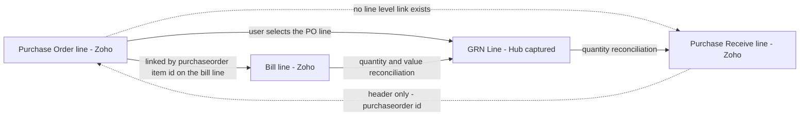

## 27. Integration Reconciliation Design

Reconciliation is the control that keeps the Hub honest. Every number the Hub reports — Open PO Commitment, Actual CWIP, Exposure, Available Budget — is derived from a reference copy of data that lives in Zoho ERP. Reconciliation is the process that proves the reference copy still agrees with the source, names the differences that do not, and puts each one in front of a person who can fix it.

The design principle throughout: **a difference is never silently corrected and never silently ignored.** It is quantified, classified, assigned and aged.

### 27.1 Principles

1. **Reconcile at the level at which the data is controlled.** Because every WBS mapping is at line level (§19.1), the primary reconciliation unit is the line, not the document. Header reconciliation exists only as a cheap pre-filter.
2. **Reconcile against the source, not against a cache.** Every run re-reads Zoho ERP. A reconciliation that compares two Hub tables proves nothing.
3. **Two-sided tolerance.** A difference must breach **both** an absolute floor and a percentage band before it becomes an exception, so that rounding noise on large values and trivial absolute differences on small values are both suppressed.
4. **Every exception has exactly one correction owner**, drawn from the frozen role list. A shared owner is no owner.
5. **The Hub never writes to Zoho ERP to resolve a difference automatically.** Correction is either a human action in Zoho, or a human-released outbound intent (§18.7). This is a control, not a conservatism.
6. **Reconciliation state is a record, not a screen.** Every run writes `Reconciliation Log` rows so that a difference detected in August is still evidenced in November.

### 27.2 Reconciliation object matrix

Columns are as required: object, key, source amount, target amount, quantity, currency, exchange rate, status, last modified, tolerance, exception type, correction owner. "Source" is Zoho ERP. "Target" is the Hub.

| Object | Reconciliation key | Source amount (Zoho) | Target amount (Hub) | Quantity compared | Currency compared | Exchange rate compared | Status compared | Last-modified basis | Tolerance | Exception types raised | Correction owner |
|---|---|---|---|---|---|---|---|---|---|---|---|
| Purchase Order header | `purchaseorder_id` | header `total` | `Purchase Order Reference.gross_value` | no | `currency_id` versus mapped currency | `exchange_rate` versus stored rate | `status` versus `Purchase Order Reference.status` | `last_modified_time` | ₹1.00 and 0.01 percent | Amount mismatch; Status divergence; Currency mismatch; Rate mismatch | Procurement |
| Purchase Order line | `purchaseorder_id` plus `line_item_id` | `quantity` × `rate` | `PO Line.ordered_value` | `quantity` versus `PO Line.quantity`, tolerance 0.001 unit | inherited from header | inherited from header | derived from header status | header `last_modified_time` | ₹1.00 and 0.01 percent | Amount mismatch; Quantity mismatch; Line missing in target; Line missing in source; Coding drift | Procurement |
| Purchase Order line coding | `purchaseorder_id` plus `line_item_id` | `project_id`, `tags[]`, `account_id` | `PO Line.capex_ref`, `wbs_ref`, `budget_head_ref` | no | not applicable | not applicable | not applicable | header `last_modified_time` | exact match required; no tolerance | Coding drift; Unmapped coding value | Project Finance Controller |
| Open PO Commitment per PO line | `purchaseorder_id` plus `line_item_id` | derived: ordered value less matched bill value | `Commitment Ledger` open balance for that line | implied by value | base currency only | rate at PO date | line derived status | latest of PO and bill `last_modified_time` | ₹1.00 and 0.01 percent | Commitment mismatch; Double-count suspected | Project Finance Controller |
| Vendor Bill header | `bill_id` | header `total` | `Vendor Bill Reference.gross_value` | no | `currency_id` | `exchange_rate` | `status` | `last_modified_time` | ₹1.00 and 0.01 percent | Amount mismatch; Status divergence; Currency mismatch; Rate mismatch | Finance |
| Vendor Bill line | `bill_id` plus `line_item_id` | `quantity` × `rate` | `Bill Line.billed_value` | `quantity` versus `Bill Line.quantity`, tolerance 0.001 unit | inherited from header | inherited from header | derived from header | header `last_modified_time` | ₹1.00 and 0.01 percent | Amount mismatch; Quantity mismatch; Line missing in target; Line missing in source | Finance |
| Bill-line to PO-line match | `purchaseorder_item_id` | bill line value | matched `PO Line` ordered value | billed quantity versus ordered quantity | base currency | rate at bill date | not applicable | bill `last_modified_time` | ₹1.00 and 0.10 percent on the cumulative billed-versus-ordered comparison | Over-billing against a PO line; Orphan bill line; Unmatched PO line | Finance |
| Actual CWIP per WBS element | `capex_code` plus `wbs_code` plus `budget_head` | sum of bill lines plus journal lines posted to CWIP accounts, filtered by `project_id` and tag option | `Actual Ledger` balance | no | base currency | rate at posting date | not applicable | latest constituent `last_modified_time` | ₹100.00 and 0.05 percent | Actual CWIP mismatch; Unattributed CWIP posting | Project Finance Controller |
| CWIP account balance (control tie-out) | CWIP `account_id` | account balance from `GET {BASE_V3}/chartofaccounts` with `showbalance`, corroborated by `GET {BASE_V3}/chartofaccounts/accounttransactions` | sum of `Actual Ledger` for all WBS elements mapped to that account | no | base currency | not applicable | not applicable | account `last_modified_time` | ₹1,000.00 and 0.10 percent | Ledger tie-out failure | Finance |
| Goods Receipt | `purchasereceive_id` where known; otherwise Hub `grn_id` | receipt line `quantity` | `GRN Line.received_quantity` | `quantity`, tolerance 0.001 unit | not applicable — receipts carry no value | not applicable | **no status field exists on a purchase receive** | `last_modified_time` on the retrieved document | 0.001 unit; value tolerance not applicable | Receipt not retrievable; Quantity mismatch; Allocation unresolved; Receipt in source not in target | Project Manager |
| Received but unbilled per PO line | `purchaseorder_id` plus `line_item_id` | not directly available from Zoho | `max(0, received_value − billed_value)` computed by the Hub | received quantity versus billed quantity | base currency | rate at PO date | not applicable | latest of receipt and bill timestamps | ₹1.00 and 0.01 percent, applied to the Hub-internal recomputation | Received-but-unbilled ageing; Bill without a recorded receipt | Project Manager |
| Vendor Credit | `vendor_credit_id` | header `total`, plus applied amounts from `GET {BASE_V3}/vendorcredits/{vendor_credit_id}/bills` | `Actual Ledger` reversal entries | line quantity where present | `currency_id` | `exchange_rate` | `status` | `last_modified_time` | ₹1.00 and 0.01 percent | Amount mismatch; Credit not reflected in actuals | Finance |
| Vendor Payment and capital advance | `payment_id` | `amount`, plus the bill allocation array | advance exposure register entry | not applicable | `currency_id` | `exchange_rate` | `status` | `last_modified_time` | ₹1.00 and 0.01 percent | Advance classification disputed; Amount mismatch | Finance |
| CWIP-transfer Journal | `journal_id`, cross-referenced by `reference_number` = capitalisation request number | sum of debit lines, and per-line `amount` | `Capitalisation Request` allocated total, and per `Asset Allocation` amount | not applicable | `currency_id` | `exchange_rate` | `status`, allowed values draft and published | `last_modified_time` | ₹1.00 and 0.00 percent — a journal must balance exactly | Amount mismatch; Journal not published; Journal missing in source; Coding drift on a journal line | Project Finance Controller |
| Fixed Asset | `fixed_asset_id`, matched on the naming convention plus `tags` | `asset_cost` | `Asset Allocation.amount` | not applicable | base currency | not applicable | asset status from `/status/active`, `/status/cancel`, `/status/draft`, `/writeoff`, `/sell` | **none — no last-modified field exists** | ₹1.00 and 0.01 percent | Asset missing in source; Asset in source with no Hub allocation; Cost mismatch; Naming convention broken | Finance |
| Zoho Project (CAPEX code carrier) | `project_id` | `project_name`, and the CAPEX-code custom field | `Project.capex_code`, `Project.name` | not applicable | not applicable | not applicable | active or inactive | none available on the list endpoint | exact match on the code; no tolerance | CAPEX code drift; Project missing in source | Project Finance Controller |
| Reporting tag option set | `tag_id` plus `tag_option_id` | option label and active flag | published `WBS Element` and `Budget Head` register | not applicable | not applicable | not applicable | active or inactive | none | exact match; no tolerance | Option missing in source; Orphan option in source; Option label drift | System Administrator |
| Vendor master | `contact_id` | `contact_name`, status | vendor reference copy | not applicable | not applicable | not applicable | active or inactive | **none — `last_modified_time` is not a query parameter on this list** | exact match on name and status | Vendor missing in target; Vendor status drift | Procurement |
| Item master | `item_id` | `name`, status | item reference copy | not applicable | not applicable | not applicable | active or inactive | **none — and no pagination parameters are declared** | exact match on name and status | Item missing in target; Item status drift | Procurement |
| Chart of Accounts | `account_id` | `account_code`, `account_name`, status | `Budget Head` mapping and CWIP account map | not applicable | not applicable | not applicable | active or inactive | `last_modified_time` | exact match | Account missing in target; Mapped account deactivated | Finance |

`[source: Zoho ERP OpenAPI bundle openapi-all.zip, sha256 E95A0399… — verified 2026-08-05]` for every field, filter and status set named above.

> **Contract gap.** `C13_conflicts.json`, `C10_messages.json` and the other frozen registries define no exception-type identifier scheme. The exception types above are therefore named descriptively and are **not** given coded identifiers, to avoid manufacturing an identifier outside a registry. If the client wants coded exception types, the codes must be added to a frozen registry before they are used.

### 27.3 Reconciliation classes

Every object in §27.2 belongs to exactly one class. The class determines the run strategy and the cost.

| Class | Definition | Objects | Run strategy | Cost profile |
|---|---|---|---|---|
| **R1 — Delta reconcilable** | Source exposes a `last_modified_time` list filter | Purchase Order, Bill, Journal, Vendor Credit, Vendor Payment, Chart of Accounts | Compare only records whose watermark advanced, plus a rolling re-verification of a sample of older records | Proportional to change volume |
| **R2 — Full-refresh reconcilable** | Source has a list endpoint but no last-modified filter | Vendor, Item, Location, Reporting Tag, Currency, Zoho Project, **Fixed Asset** | Read the whole collection and diff | Proportional to collection size |
| **R3 — Hub-anchored** | No Zoho counterpart exists to compare against | Purchase Request, WBS Element, Budget Version, Budget Line, Budget Revision, Commitment Ledger, Approval Instance | Internal consistency checks only; no external comparison is possible | Cheap, but proves nothing about Zoho |
| **R4 — Not reconcilable by API** | Source data cannot be discovered at all | Goods Receipt discovery | Hub-captured data is authoritative; targeted verification only where an identifier is known | Structurally incomplete; see §24.5 |

**Rolling re-verification for R1.** A delta strategy alone cannot detect a record that changed in Zoho without its `last_modified_time` advancing, or a record the Hub failed to ingest and then never revisited. Every R1 run therefore also re-reads a rotating slice — recommended 5 percent per nightly run, so the entire open population is re-verified within three weeks — chosen by oldest `last_reconciled_at` first. This is a DERIVED-RECOMMENDATION; no client requirement specifies it.

### 27.4 Fixed assets — full refresh, and why there is no alternative

**The constraint.** A Zoho ERP fixed asset carries no link to a source project, purchase order or bill. Its create body is `asset_account_id`, `asset_cost`, `asset_name`, `asset_purchase_date`, `computation_type`, `custom_fields`, `dep_start_value`, `depreciation_account_id`, `depreciation_frequency`, `depreciation_method`, `depreciation_percentage`, `depreciation_start_date`, `description`, `expense_account_id`, `fixed_asset_type_id`, `notes`, `salvage_value`, `serial_no`, `tags`, `total_life`, `warranty_expiry_date`. The only linkage-shaped field is `asset_purchase_date`. And the list endpoint accepts `organization_id`, `filter_by`, `sort_column`, `sort_order`, `page` and `per_page` — with **no `last_modified_time` and no `created_time` filter.** `[source: Zoho ERP OpenAPI bundle openapi-all.zip, sha256 E95A0399… — verified 2026-08-05]`

**Consequences, stated plainly:**

1. **Asset sync must be full-refresh.** There is no incremental path. Every reconciliation run reads the entire asset register through `GET {BASE_V3}/fixedassets` paginated at 200, scope `ERP.fixedasset.READ`.
2. **Capitalisation traceability is anchored on the Hub, not on the asset.** The chain of evidence runs Capitalisation Request → Asset Allocation → outbound intent → `fixed_asset_id`. It does not run backwards from the asset, because the asset holds nothing to run backwards on.
3. **Matching is by convention, not by key.** The Hub matches on the naming convention of §19.10 plus `tags`, and stores `fixed_asset_id` on the `Asset Allocation` at creation time so that subsequent runs match on the identifier rather than on the string. The convention matters only for assets the Hub did not create.
4. **The reconciliation is one-way-complete and one-way-incomplete.** Every Hub allocation can be confirmed present in Zoho. An asset present in Zoho with no Hub allocation cannot be proven to be unrelated to CWIP — it may be a non-CAPEX asset, or it may be a capitalisation someone performed directly in Zoho, bypassing the Hub. Both look identical through the API.

**Run design.**

```
FULL REFRESH FIXED ASSET RECONCILIATION  (nightly, and before every capitalisation approval)

  1. page through GET /fixedassets  (per_page = 200) until page_context has_more_page is false
  2. index the result by fixed_asset_id
  3. FOR each Asset Allocation in the Hub with a stored fixed_asset_id:
         found  -> compare asset_cost to Asset Allocation.amount at tolerance
                   compare asset status; a cancelled or written-off asset against an
                   active allocation is always an exception regardless of amount
         absent -> exception "Asset missing in source"          owner Finance
  4. FOR each Asset Allocation approved but with no stored fixed_asset_id:
         attempt name-convention match against the index
         matched   -> bind fixed_asset_id, log the binding as DERIVED
         unmatched -> exception "Asset missing in source"       owner Finance
  5. FOR each Zoho asset with no Hub allocation and whose asset_name matches the
     CAPEX naming convention:
         exception "Asset in source with no Hub allocation"     owner Finance
     (assets whose names do not match the convention are listed for information
      only and never raised as exceptions - they are presumed non-CAPEX)
  6. write one Reconciliation Log row per comparison, matched or not
```

**Cost.** The register is read in full on every run. At 2,000 assets that is 10 calls at `per_page` 200; at 20,000 it is 100 calls, which is a material fraction of the 100-requests-per-minute-per-organisation budget and must be scheduled outside the transactional poll windows. Both figures are illustrative sizing, not client-stated volumes.

**Residual risk.** An asset capitalised directly in Zoho ERP, outside the Hub, with a name that does not follow the convention, is undetectable as a CAPEX capitalisation. Mitigation is procedural: capitalisation is performed only through SCR-21 and SCR-22. Carried in §42 Risk Register.

### 27.5 Exception catalogue

Severity: **Blocking** stops a dependent action; **High** requires action within one business day; **Medium** is worked from the queue; **Low** is informational.

| Exception type | Detection rule | Severity | User-facing message | Correction owner | Escalation |
|---|---|---|---|---|---|
| Amount mismatch | Absolute difference exceeds both the absolute floor and the percentage band for that object | High | `MSG-INT-006` | per §27.2 row | Project Finance Controller after 2 business days |
| Quantity mismatch | Quantity difference exceeds 0.001 unit | Medium | `MSG-INT-006` | per §27.2 row | Project Finance Controller after 5 business days |
| Currency mismatch | `currency_id` on the source document differs from the currency mapped for the organisation | Blocking | `MSG-INT-006` | Finance | immediate; the document is excluded from ledgers until resolved |
| Rate mismatch | `exchange_rate` on the source differs from the stored rate for the document date | High | `MSG-INT-006` | Finance | Project Finance Controller after 2 business days |
| Status divergence | Source status and Hub status map to different lifecycle positions | High | `MSG-INT-006` | Procurement for POs, Finance for bills and journals | Project Finance Controller after 1 business day |
| Line missing in target | A source line has no Hub counterpart | High | `MSG-INT-006` | per §27.2 row | Project Finance Controller after 1 business day |
| Line missing in source | A Hub line has no source counterpart, usually a line deleted in Zoho | Blocking | `MSG-INT-006` | Procurement | immediate; commitment for that line is suspended pending review |
| Coding drift | `project_id`, tag option or `account_id` on the source line differs from the Hub mapping | Blocking for capital lines | `MSG-INT-006` | Project Finance Controller | immediate; the line is excluded from attribution until re-coded |
| Unmapped coding value | A source line carries a `project_id` or tag option the Hub does not recognise | High | `MSG-INT-006` | Project Finance Controller | never auto-create a Hub project or WBS element from a Zoho value |
| Commitment mismatch | Hub open commitment for a PO line differs from ordered value less matched billed value | Blocking | `MSG-INT-006` | Project Finance Controller | immediate; this is the anti-double-count alarm |
| Double-count suspected | The same bill line is matched to more than one commitment relief, or a PO line's cumulative relief exceeds its ordered value | Blocking | `MSG-INT-006` | Project Finance Controller | immediate; the affected WBS element's availability figures are marked provisional |
| Over-billing against a PO line | Cumulative billed value on a `purchaseorder_item_id` exceeds ordered value beyond tolerance | High | `MSG-PRC-004` | Finance | Procurement after 1 business day |
| Orphan bill line | A bill line posted to a CWIP account carries no `purchaseorder_item_id` and resolves to no WBS element by any of the five steps in §19.8 | High | `MSG-INT-006` | Finance | excluded from Actual CWIP until coded; never guessed |
| Unmatched PO line | A PO line fully received and long open with no bill line referencing it | Medium | `MSG-PRC-005` | Procurement | Project Finance Controller after 30 days |
| Actual CWIP mismatch | Recomputed Actual CWIP for a WBS element differs from `Actual Ledger` | Blocking | `MSG-INT-006` | Project Finance Controller | immediate |
| Unattributed CWIP posting | A journal or bill line hits a CWIP account with no resolvable CAPEX code | High | `MSG-INT-006` | Finance | Project Finance Controller after 2 business days |
| Ledger tie-out failure | The sum of Hub `Actual Ledger` for a CWIP account differs from the Zoho account balance | Blocking | `MSG-INT-006` | Finance | CFO after 2 business days; all CWIP reports are marked provisional |
| Receipt not retrievable | A receipt identifier is known but retrieval fails, or no identifier is available for a PO line that a bill claims to bill | Medium | `MSG-PRC-005` | Project Manager | Procurement after 5 days |
| Allocation unresolved | The receipt allocation algorithm in §24.5 exhausted its candidates with quantity remaining | High | `MSG-PRC-005` | Project Manager | Procurement after 2 business days |
| Received-but-unbilled ageing | Received-but-unbilled balance on a WBS element exceeds its ageing threshold | Medium | `MSG-PRC-005` | Project Manager | Finance after 30 days |
| Bill without a recorded receipt | A bill line matched to a PO line for which no receipt has been recorded | Medium | `MSG-INT-006` | Project Manager | Finance after 5 business days |
| Advance classification disputed | A vendor payment with an empty bill allocation array that has remained unallocated beyond the configured window | Medium | `MSG-INT-006` | Finance | Project Finance Controller after 30 days |
| Journal not published | A CWIP-transfer journal created by the Hub remains in draft beyond the configured window | High | `MSG-INT-006` | Finance | Project Finance Controller after 1 business day |
| Journal missing in source | An approved Capitalisation Request has no journal in Zoho | Blocking | `MSG-INT-006` | Project Finance Controller | immediate |
| Asset missing in source | An approved Asset Allocation has no matching fixed asset | Blocking | `MSG-INT-006` | Finance | immediate; capitalisation is incomplete |
| Asset in source with no Hub allocation | A Zoho asset whose name matches the CAPEX convention has no Hub allocation | High | `MSG-INT-006` | Finance | Project Finance Controller after 2 business days |
| Cost mismatch | `asset_cost` differs from `Asset Allocation.amount` beyond tolerance | High | `MSG-INT-006` | Finance | Project Finance Controller after 2 business days |
| Naming convention broken | A Hub-created asset's `asset_name` in Zoho no longer matches the convention | Low | `MSG-INT-006` | Finance | none; informational, but it disables future name-based matching |
| CAPEX code drift | The CAPEX-code custom field on a Zoho project no longer matches the Hub | Blocking | `MSG-INT-006` | Project Finance Controller | immediate; all line attribution through that project is suspect |
| Option missing in source | A released WBS element has no active tag option in Zoho | High | `MSG-INT-001` variant naming the mapping | System Administrator | blocks new PO creation coded to that element |
| Orphan option in source | A tag option exists in Zoho with no Hub WBS element | Medium | `MSG-INT-006` | System Administrator | none |
| Option label drift | A tag option label was edited in the Zoho user interface | Medium | `MSG-INT-006` | System Administrator | none; the identifier still binds, so attribution is unaffected |
| Vendor, item or account missing in target | A master record exists in Zoho with no Hub reference copy | Low | `MSG-INT-006` | Procurement or Finance | none; self-healing on the next full refresh |
| Mapped account deactivated | A CWIP account mapped to a budget head was marked inactive in Zoho | Blocking | `MSG-INT-006` | Finance | immediate; new postings to that head are blocked |

### 27.6 Tolerance policy

| Comparison class | Absolute floor | Percentage band | Both must be breached? | Rationale |
|---|---|---|---|---|
| Document header value | ₹1.00 | 0.01 percent | Yes | Suppresses rounding on tax-inclusive totals without hiding a real difference |
| Document line value | ₹1.00 | 0.01 percent | Yes | Same |
| Cumulative billed versus ordered | ₹1.00 | 0.10 percent | Yes | Allows for freight and minor rate variation within a PO line |
| Actual CWIP per WBS element | ₹100.00 | 0.05 percent | Yes | An aggregate of many lines; a tighter floor generates noise |
| CWIP account tie-out | ₹1,000.00 | 0.10 percent | Yes | A control-account comparison across the whole ledger |
| Journal debit versus credit | ₹0.00 | 0.00 percent | Not applicable | A journal must balance exactly. There is no acceptable difference |
| Quantity | 0.001 unit | not applicable | not applicable | Absolute only; percentage is meaningless on small quantities |
| Coding fields, currency, status, identifiers | not applicable | not applicable | not applicable | Exact match. A tolerance on a coding field is a defect, not a policy |

Tolerances are configured per entity on SCR-37 and are versioned: a `Reconciliation Log` row records the tolerance in force when the comparison ran, so a historic exception can be re-read against the policy of its own time. All values above are DERIVED-RECOMMENDATION; the client document states no tolerance policy.

### 27.7 Three-way match and the broken leg

The classical three-way match is purchase order, goods receipt, vendor bill. In this integration one leg is intact and one is not.



**Leg A — PO line to bill line. Intact.** Matched on `purchaseorder_item_id`. This leg carries the commitment relief and the double-count prevention, so the control the client actually asked for (REQ-PO-003, REQ-CWIP-001, REQ-BILL-002) rests on a documented field.

**Leg B — PO line to receipt line. Broken.** Receipt lines carry no PO-line link and the module has no list endpoint. The Hub substitutes its own `GRN Line`, captured against a user-selected PO line on SCR-16, and reconciles that against a retrieved Zoho receipt only where a `purchasereceive_id` is known. See §24.5.

**Reconciliation rules across the three positions, per PO line:**

| # | Condition | Interpretation | Exception |
|---|---|---|---|
| 1 | Billed quantity ≤ received quantity ≤ ordered quantity | Normal | none |
| 2 | Billed quantity > received quantity | Billed before receipt, or a receipt was never recorded in the Hub | Bill without a recorded receipt |
| 3 | Received quantity > ordered quantity | Over-receipt | Allocation unresolved |
| 4 | Billed value > ordered value beyond tolerance | Over-billing | Over-billing against a PO line |
| 5 | Received quantity > 0 and billed quantity = 0, aged beyond the threshold | Received but unbilled | Received-but-unbilled ageing |
| 6 | Ordered quantity > 0, received = 0, billed = 0, PO open and aged | Dormant commitment | Unmatched PO line |
| 7 | A retrieved Zoho receipt allocates to a PO line with confidence `DERIVED` | Item repeated across PO lines; FIFO applied | reviewable, not blocking |
| 8 | A retrieved Zoho receipt allocates with confidence `UNRESOLVED` | Cannot attribute | Allocation unresolved, blocking |

### 27.8 Run schedule and pseudocode

| Run | Scope | Frequency | Class | Blocking effect |
|---|---|---|---|---|
| Transactional delta reconciliation | Purchase Orders, Bills, Journals, Vendor Credits, Vendor Payments changed since the watermark | Every 15 minutes, immediately after the corresponding ingestion poll | R1 | Blocking exceptions suspend the affected line from ledgers |
| Line-level three-way reconciliation | All open PO lines with activity in the window | Hourly | R1 plus R4 | As above |
| Rolling re-verification | 5 percent of open documents, oldest `last_reconciled_at` first | Nightly | R1 | none |
| Master-data reconciliation | Vendors, Items, Locations, Currencies, Chart of Accounts, Reporting Tags, Zoho Projects | Nightly | R2 | Mapped-account deactivation is blocking |
| Fixed-asset full refresh | Entire asset register | Nightly, and immediately before any capitalisation approval | R2 | Blocking on Asset missing in source |
| CWIP ledger tie-out | Every CWIP account | Nightly, and at each period close | R1 | Blocking; CWIP reports marked provisional on failure |
| Pre-capitalisation reconciliation | One project's full position | On demand, from SCR-20 and SCR-21 | mixed | Blocking; capitalisation cannot proceed with unresolved blocking exceptions |

```
RECONCILE_RUN(scope, class, as_of)

  run = create Reconciliation Log run header
        {run_id, scope, class, as_of, tolerance_snapshot, triggered_by}

  source_set = FETCH(scope, class)                # delta for R1, full for R2
  target_set = HUB_SNAPSHOT(scope, as_of)         # read once; never re-read mid-run

  FOR key IN union(keys(source_set), keys(target_set)):
      s = source_set[key];  t = target_set[key]

      IF s AND NOT t:  emit("Line missing in target",  key, s, null);  CONTINUE
      IF t AND NOT s:  emit("Line missing in source",  key, null, t);  CONTINUE

      # exact-match dimensions first - a coding difference invalidates any amount comparison
      IF s.currency  != t.currency:   emit("Currency mismatch", key, s, t); CONTINUE
      IF s.coding    != t.coding:     emit("Coding drift",      key, s, t); CONTINUE
      IF lifecycle(s.status) != lifecycle(t.status): emit("Status divergence", key, s, t)

      # tolerance-bounded dimensions
      d_abs = abs(s.amount - t.amount)
      d_pct = d_abs / max(abs(s.amount), 1)
      IF d_abs > tol.absolute AND d_pct > tol.percentage:
          emit("Amount mismatch", key, s, t, difference = d_abs)

      IF quantity_applies(scope) AND abs(s.qty - t.qty) > 0.001:
          emit("Quantity mismatch", key, s, t)

      IF rate_applies(scope) AND s.exchange_rate != t.exchange_rate:
          emit("Rate mismatch", key, s, t)

      write Reconciliation Log row (matched or exception, always)
      t.last_reconciled_at = now

  # derived checks that span records rather than comparing one to one
  CHECK_COMMITMENT_INTEGRITY(scope)   # ordered - billed == open commitment, per PO line
  CHECK_NO_DOUBLE_RELIEF(scope)       # each bill line relieves exactly one PO line, once
  CHECK_CWIP_TIE_OUT(scope)           # sum of Actual Ledger == Zoho CWIP account balance

  close run; publish counts to SCR-27 and SCR-38
```

Notes for the implementer:

- `emit` writes a `Reconciliation Log` row **and** creates or updates an open exception keyed on `(object, key, exception_type)`. Re-detecting the same difference on the next run updates the existing exception's `last_seen_at` and does not create a duplicate.
- An exception clears only when a run finds the difference gone. It is never cleared by a user dismissing it. A user may **acknowledge** an exception, which suppresses escalation and records who acknowledged it and why, but the exception stays open and visible.
- Blocking exceptions set `sync_status` on the affected record to `Reconciliation Pending` and exclude it from Available Budget arithmetic. The excluded amount is displayed on the affected screens as a separate provisional line, never merged into the reported figure, so a user is never shown a control number that quietly omits something.

### 27.9 Worked reconciliation example

The frozen commitment-to-actual position for a part-billed purchase order is: **PO ₹20L, actual bill ₹12L, open commitment ₹8L, budget exposure ₹20L.**

Reconciliation of that position, one PO line, against the source:

| Dimension | Source (Zoho) | Target (Hub) | Tolerance | Result |
|---|---|---|---|---|
| PO line ordered value | ₹20,00,000.00 from `quantity` × `rate` | `PO Line.ordered_value` ₹20,00,000.00 | ₹1.00 and 0.01 percent | Match |
| Bill line value on `purchaseorder_item_id` | ₹12,00,000.00 | `Bill Line.billed_value` ₹12,00,000.00 | ₹1.00 and 0.01 percent | Match |
| Open commitment, derived | ₹20,00,000.00 − ₹12,00,000.00 = ₹8,00,000.00 | `Commitment Ledger` open balance ₹8,00,000.00 | ₹1.00 and 0.01 percent | Match |
| Exposure contribution | ₹8,00,000.00 committed plus ₹12,00,000.00 actual = ₹20,00,000.00 | `Budget Ledger` exposure contribution ₹20,00,000.00 | ₹1.00 and 0.01 percent | Match |
| Cumulative billed versus ordered | ₹12,00,000.00 against ₹20,00,000.00 | same | ₹1.00 and 0.10 percent | Within; no over-billing |
| Currency | base | base | exact | Match |
| Coding: `project_id`, WBS tag option, `account_id` | as pushed | as stored | exact | Match |

The control this table proves is the one the client asked for: the purchase order and its bill are not double counted. Exposure is ₹20,00,000.00 whether nothing is billed, part is billed or all is billed; only the split between commitment and actual moves. The reconciliation confirms that the split in the Hub equals the split derivable from Zoho, line by line.

Where this reconciliation fails — for instance if the Hub still shows ₹20,00,000.00 open commitment after the bill posted — the run raises **Double-count suspected**, severity Blocking, correction owner Project Finance Controller. The affected WBS element's Available Budget is marked provisional on SCR-08 and SCR-13 until it clears, because a stale commitment overstates exposure and would wrongly block a legitimate purchase.

The frozen budget position that this line sits inside is stated in §22 Budget and Commitment Calculation Logic, and reads: **80L Budget - 35L Actual CWIP - 30L Open PO Commitment = 15L Available. A new PO of 20L exceeds available budget by 5L and must route to exception approval or budget revision.** Reconciliation of the constituent lines is what makes that availability figure trustworthy rather than merely computed.

### 27.10 Reconciliation Log record

The `Reconciliation Log` entity carries, per comparison:

| Field | Type | Note |
|---|---|---|
| `reconciliation_log_id` | uuid | primary key |
| `run_id` | uuid | groups all rows of one run |
| `connection_profile_id`, `zoho_organization_id` | uuid, string | multi-organisation scoping |
| `object_type` | enum | the §27.2 row |
| `reconciliation_key` | string | the §27.2 key, stored as written there |
| `source_reference` | string | Zoho identifier, or null where none exists |
| `target_reference` | string | Hub identifier |
| `source_amount`, `target_amount`, `difference_amount` | integer minor units | never floating point |
| `source_quantity`, `target_quantity` | decimal | null where not applicable |
| `currency_code`, `source_exchange_rate`, `target_exchange_rate` | string, decimal, decimal | — |
| `source_status`, `target_status` | string | as returned and as stored |
| `source_last_modified` | timestamp | null for R2 objects with no last-modified field, and for fixed assets in particular |
| `tolerance_absolute`, `tolerance_percentage` | integer minor units, decimal | the values in force at run time |
| `outcome` | enum | matched, exception, informational |
| `exception_type` | string | descriptive name from §27.5; null when matched |
| `severity` | enum | blocking, high, medium, low |
| `correction_owner_role` | string | from the frozen role list |
| `first_seen_at`, `last_seen_at`, `cleared_at` | timestamp | ageing and clearance |
| `acknowledged_by`, `acknowledged_at`, `acknowledgement_reason` | string, timestamp, string | acknowledgement never clears the exception |
| `run_duration_ms`, `api_calls_consumed` | integer | feeds SCR-38 |

Every row is immutable once written. A later run writes a new row; it never edits an old one. This is what makes the log admissible as audit evidence under REQ-SEC-001.

### 27.11 Where reconciliation is presented

| Surface | Content |
|---|---|
| SCR-27 Reconciliation Exception Queue | The working list: open exceptions, grouped by severity then ageing, filtered by correction owner. Each row drills to the source and target records side by side |
| SCR-18 Commitment-to-Actual Reconciliation | The line-level three-way position per PO, showing ordered, received, billed, open commitment and received-but-unbilled, with allocation confidence displayed |
| SCR-38 Integration Health and API Usage Dashboard | Run history, duration, calls consumed, exception counts by type, and the age of the oldest unresolved blocking exception |
| SCR-26 Integration Event Monitor | The per-record sync view; a record in `Reconciliation Pending` links straight to its exception |
| SCR-20 Project Completion Review and SCR-21 Capitalisation Workbench | The pre-capitalisation gate: no project may be capitalised while a blocking exception is open against it, with `MSG-CAP-001` warning where open commitments or received-but-unbilled amounts remain |
| SCR-28 Audit Trail Viewer | Immutable log rows, filterable by object and date, for the auditor |

### 27.12 What reconciliation cannot prove

Stated so that no reader over-reads the control:

- It cannot detect a goods receipt entered in Zoho ERP and never entered in the Hub, because receipts cannot be listed (§24.5).
- It cannot prove that a fixed asset in Zoho ERP is unrelated to CAPEX, only that the Hub did not create it (§27.4).
- It cannot detect a Purchase Request raised directly in the Zoho ERP user interface, because that object has no API (§24.3).
- It cannot detect a change made in Zoho ERP that did not advance `last_modified_time`, except through the rolling re-verification slice (§27.3).
- It cannot reconcile tax treatment, because whether approved CAPEX budgets are stated inclusive or exclusive of GST is unresolved and changes the value of every figure compared here. This is **UNVERIFIED - REQUIRES CONFIRMATION** and is carried as a blocking clarification in §45 Client Clarification Questionnaire.
