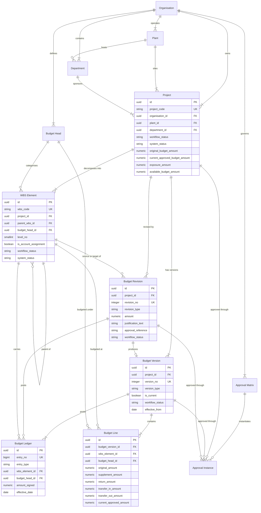
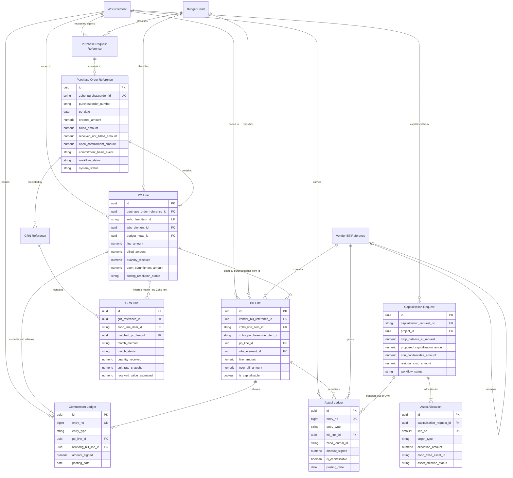
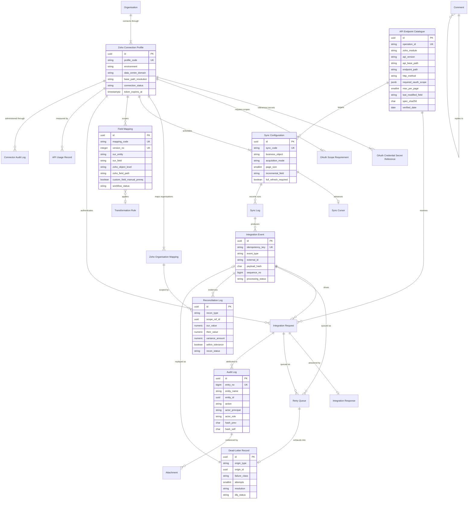

## 29. ER Diagram

The 44 entities defined in §28 Data Model are drawn as three domain-scoped diagrams. A single diagram of 44 entities is unreadable at any print or screen size, and the three domains have genuinely different change rates and owners: Project & Budget is authored by the business, Procurement & Actuals is fed by Zoho ERP, and Integration & Audit is operated by the System Administrator.

### 29.1 Reading the diagrams

| Notation | Meaning |
|---|---|
| `\|\|--o{` | One-to-many, identifying. The child cannot exist without the parent, and the parent key is part of the child's identity. |
| `\|\|--\|{` | One-to-many, identifying, with at least one mandatory child. |
| `\|\|--o\|` | One-to-zero-or-one. |
| `}o--o{` | Many-to-many, resolved by an intermediate entity where one exists. |
| `\|\|..o{` | **Non-identifying and inferred.** The link is reconstructed by this application because the source system does not supply it. Every such edge is a design risk and is listed in §29.5. |
| `PK` / `FK` / `UK` | Primary key, foreign key, unique business key. |

Entity names in the diagrams are the registry names from `C4_entities.json` verbatim. The corresponding physical table names are given in §28.3.

Attribute blocks are shown only for the hub entities of each domain, to keep the diagrams legible. The complete field list for every entity is in §28.

### 29.2 Diagram 1 — Project and Budget

Twelve entities. This is the control core: everything the business authors, approves and versions. Nothing in this diagram is written to Zoho ERP, because Zoho ERP Projects carry only scalar budget fields and no budget-by-head object (OAS-05).

Key points a coding agent must not lose:

| # | Point | Basis |
|---|---|---|
| 1 | `WBS Element` is self-referencing. Depth is capped at five levels and the ancestor path is materialised, so a sub-tree roll-up is one range scan. | §28.5.2 |
| 2 | The whole `WBS Element` branch is `provenance=MASTER-PROMPT`. The client document has no WBS hierarchy at all — its structure is exactly two levels, project code and budget head (CONF-02, REQ-BUD-003). A client-faithful configuration is a single account-assignment WBS element per budget head. | CONF-02 |
| 3 | `Budget Line` sits on the three-way key of version, WBS element and budget head. `current_approved_amount` is a generated column implementing the frozen formula `Current Approved Budget = Original Budget + Approved Supplements - Approved Returns +/- Approved Transfers`. | `C5_formulas.json` |
| 4 | `Budget Version` version 1 is the Original Budget and is immutable once released. Revisions never overwrite it. | REQ-SEC-003, REQ-REV-005 |
| 5 | `Budget Ledger` is append-only. Every figure in the diagram's snapshot columns is reproducible from it. | §28.7.3 |
| 6 | `Approval Instance` is polymorphic across project, budget version, budget revision, purchase request, exception and capitalisation request. The relationship is enforced in application code, not by a database foreign key, and the matrix version in force is pinned on every instance. | §28.5.6 |

### 29.3 Diagram 2 — Procurement and Actuals

Eleven entities plus two anchors carried forward from Diagram 1 so the coding dimensions are visible. This is where Zoho ERP is the source of truth and where the two boundary facts of §28.6 bite.

The two legs of line-level matching are deliberately drawn differently, and a coding agent must not treat them as the same problem:

| Leg | Edge | Status | Evidence |
|---|---|---|---|
| Purchase order line to **bill** line | `"PO Line" \|\|--o{ "Bill Line"` — solid, identifying | **Works.** Bill lines carry `purchaseorder_item_id`, so commitment-to-actual conversion and double-count prevention run against a documented field. | OAS-03 [source: Zoho ERP OpenAPI bundle openapi-all.zip, sha256 E95A0399… — verified 2026-08-05] |
| Purchase order line to **receipt** line | `"PO Line" \|\|..o{ "GRN Line"` — dotted, inferred | **Broken at source.** Receipt lines expose only `description`, `item_id`, `item_order`, `line_item_id`, `name`, `quantity`, `unit`: no purchase-order key, no project, tag or custom field, no rate, and the module has no list or search endpoint. Received-but-unbilled exposure is reconstructed by this application and labelled as reconstructed wherever it is shown. | OAS-03 |

Further points:

| # | Point | Basis |
|---|---|---|
| 1 | `Purchase Request Reference` has no edge to any Zoho object. Purchase Request does not exist anywhere in the official Zoho ERP API specification — a proven negative across 78 modules, 561 paths and 163 scopes. It is owned entirely by this application. | OAS-02, CONF-01 |
| 2 | Every coding edge — `WBS Element` and `Budget Head` to `PO Line` and `Bill Line` — attaches to the **line**, never the header. The bill header carries no `project_id`. | OAS-04, OAS-10 |
| 3 | `GRN Line` has **no** edge to `Commitment Ledger`. A goods receipt never relieves commitment; only a bill line does. This is the anti-under-count control from `C5_formulas.json` (`commitment_reduction_gates`) and it is the mirror of the anti-double-count control. | `C5_formulas.json` |
| 4 | `Asset Allocation` holds `zoho_fixed_asset_id`, but there is no reverse edge from the Zoho asset back to CWIP: fixed assets carry no link to a source project, purchase order or bill. `Capitalisation Request` is therefore the anchor of capitalisation traceability. | OAS-09 |
| 5 | `Capitalisation Request` splits into a capitalisable path (to `Asset Allocation` with `target_type = FIXED_ASSET`) and a non-capitalisable path (`target_type = COST_CENTRE`). Both must exist; modelling CWIP as a total-cost sink would erase the pre-operative-expense write-off path. | `C5_formulas.json` (`cwip_settlement_qualifier`) |
| 6 | `Vendor Bill Reference` self-references for credit notes, debit notes and reversals. Those document classes are `provenance=MASTER-PROMPT`: the client document defines only four commitment-to-actual positions. | CONF-12 |

### 29.4 Diagram 3 — Integration and Audit

Twenty-one entities: nine configuration, nine runtime and telemetry, three cross-cutting. This whole domain is `provenance=MASTER-PROMPT` — the client document's only integration statement is a single architecture line naming API, workflow and custom function as the coupling between Zoho ERP and the budget control layer (CONF-07).

Points that change implementation decisions:

| # | Point | Basis |
|---|---|---|
| 1 | `Zoho Connection Profile` has **no** single API base path. Sixty-four modules resolve to `https://www.zohoapis.in/erp/v3` and fourteen to `https://www.zohoapis.in/erp/v1`, so the base path is read per module from `API Endpoint Catalogue` on every call. | OAS-01 |
| 2 | `API Endpoint Catalogue` is seeded mechanically from the vendor bundle (869 operations, 561 paths, 163 scopes, sha256 `E95A0399…`) and never hand-authored. `Integration Request` cannot be created without a catalogue row, which makes a fabricated endpoint structurally impossible. | §28.8.5, §28.11 DM-10 |
| 3 | `Field Mapping` carries `custom_field_manual_prereq`, because there is **no API to create a custom field definition** — only to set values on a record. The CAPEX and WBS custom-field layout is a manual Zoho UI prerequisite per organisation, confirmed by an operator before activation. | OAS-06 |
| 4 | `Sync Configuration.acquisition_mode` defaults to `POLL`. A general webhook framework is not evidenced: `UNVERIFIED - REQUIRES ZOHO CONFIRMATION`. `PUSH` cannot be selected until that confirmation exists. | CONF-16 |
| 5 | `Sync Configuration.full_refresh_required` is permanently true for fixed assets, which expose no `created_time` or `last_modified_time`, and for purchase receives, which have no list endpoint. `Sync Cursor` therefore has no timestamp watermark for those objects. | OAS-09, OAS-03 |
| 6 | `OAuth Credential Secret Reference` holds vault paths and fingerprints only. No column in the model can hold a client secret, refresh token or access token. | §28.8.2 |
| 7 | `Audit Log` and `Connector Audit Log` are hash-chained and append-only. `Comment` and `Attachment` attach polymorphically to any entity; their `entity_name` and `entity_id` pair is validated in application code, which is why no fan of foreign keys is drawn from them. | §28.9.9, §28.9.10 |

### 29.5 Inferred and reconstructed edges

Every edge in the model that this application constructs rather than reads. Each one is a place where the picture can be wrong, and each is surfaced in the user interface rather than presented as fact.

| Edge | Diagram | Why it is inferred | Reconstruction method | Failure mode if wrong |
|---|---|---|---|---|
| `PO Line` → `GRN Line` | 2 | Receipt lines carry no `purchaseorder_item_id` and no coding fields (OAS-03). | Item identifier plus quantity, then item only, then description similarity, then manual match. Confidence recorded on every row. | Received-not-billed exposure is misstated, understating or overstating what is still to be billed. |
| `Purchase Order Reference` → `GRN Reference` | 2 | The purchase receives module has no list or search endpoint (OAS-03). | Traversal of known purchase orders, plus manual entry and CSV import as fallbacks. | Receipts are missed entirely, so ageing and pending-billing alerts under-report. |
| `Asset Allocation` → source CWIP | 2 | Fixed assets carry no link to a source project, purchase order or bill (OAS-09). | Anchored on `Capitalisation Request` in this application; asset comparison is a full-refresh value check, never an incremental poll. | Capitalised value cannot be traced back to what funded it. |
| `PO Line` → `WBS Element` | 2 | Zoho has no WBS object. The code travels as `project_id`, a reporting tag or an item custom field (OAS-04, OAS-05). | `Field Mapping` resolution at line level, with `coding_resolution_status` of `RESOLVED`, `UNRESOLVED` or `AMBIGUOUS`. | Commitment is posted to the wrong WBS element, or blocked with `MSG-BUD-004`. |
| `Purchase Request Reference` → `Purchase Order Reference` | 2 | Purchase Request has no API at all (OAS-02). | Matching on the purchase request number carried in a purchase order custom field, which is itself a manual field prerequisite (OAS-06). | Purchase request reservations are never released, silently consuming availability. |
| `Vendor Bill Reference` → advance payments | 2 | There is no `is_advance` flag; an advance is a vendor payment with an empty `bills[]` allocation array (OAS-11). | Derivation rule owned by this application, gated by the setting `capital_advance_is_actual`. | Capital advances are treated as actual CWIP when policy says they are not, or the reverse. |

### 29.6 Entity coverage check

| Diagram | Entities drawn | Registry entities covered |
|---|---|---|
| 1 — Project and Budget | 12 | Organisation, Plant, Department, Project, WBS Element, Budget Head, Budget Version, Budget Line, Budget Revision, Budget Ledger, Approval Matrix, Approval Instance |
| 2 — Procurement and Actuals | 11 plus 2 anchors | Purchase Request Reference, Purchase Order Reference, PO Line, GRN Reference, GRN Line, Vendor Bill Reference, Bill Line, Commitment Ledger, Actual Ledger, Capitalisation Request, Asset Allocation. WBS Element and Budget Head are repeated from Diagram 1 as coding anchors only. |
| 3 — Integration and Audit | 21 | Zoho Connection Profile, OAuth Credential Secret Reference, OAuth Scope Requirement, Zoho Organisation Mapping, API Endpoint Catalogue, Field Mapping, Transformation Rule, Sync Configuration, Sync Cursor, Integration Event, Integration Request, Integration Response, Sync Log, Retry Queue, Dead-Letter Record, API Usage Record, Reconciliation Log, Connector Audit Log, Audit Log, Attachment, Comment |
| **Total distinct** | **44** | Matches `C4_entities.json` exactly. |
