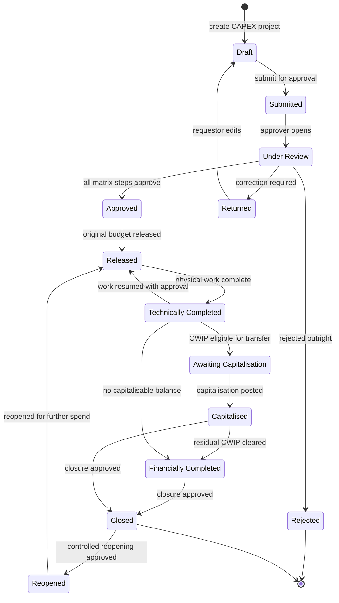
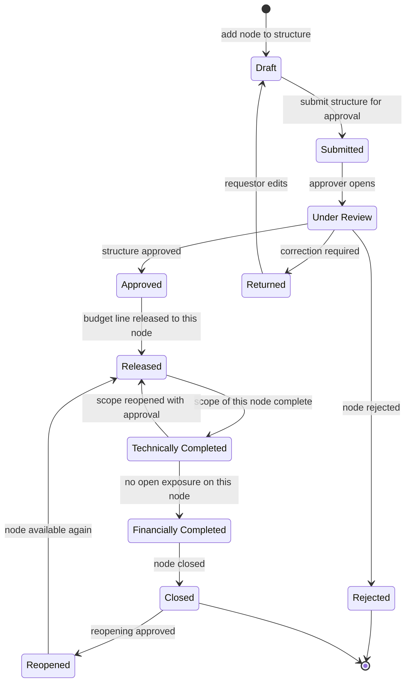
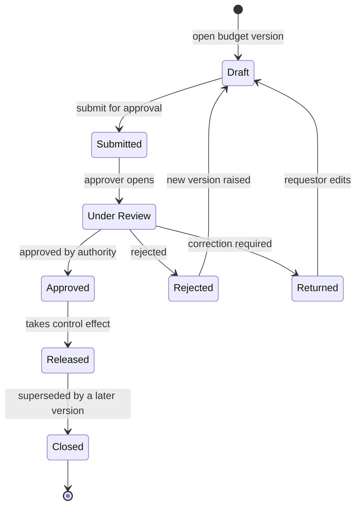
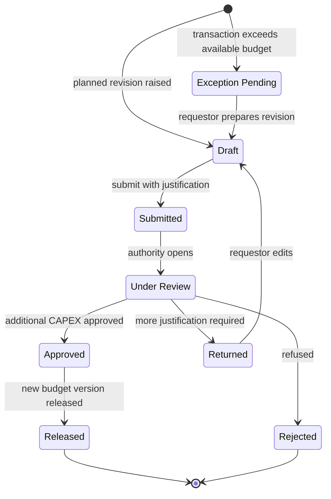
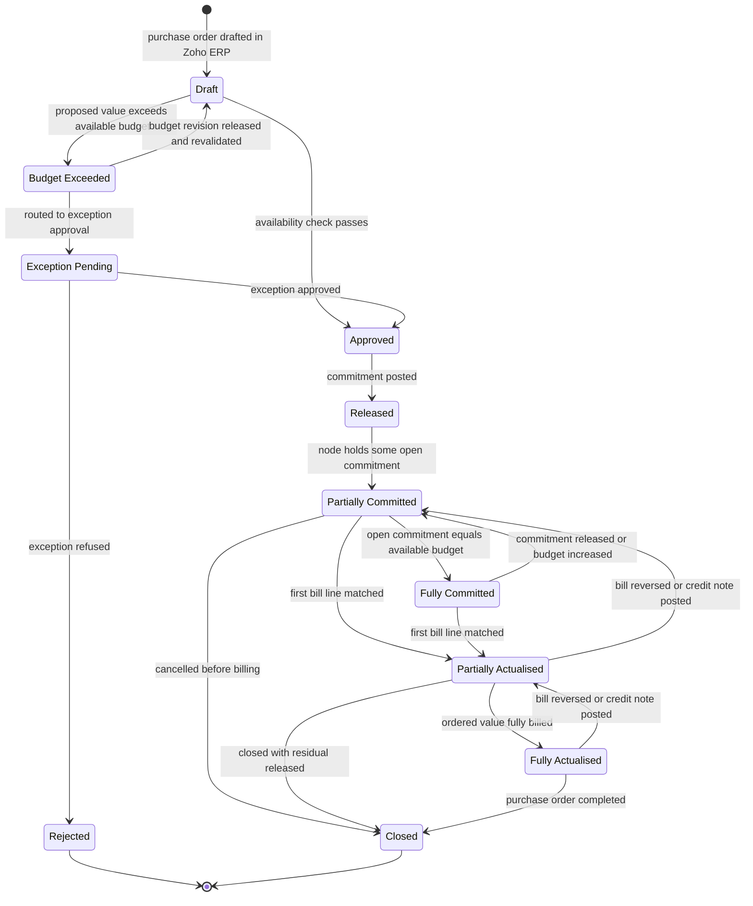
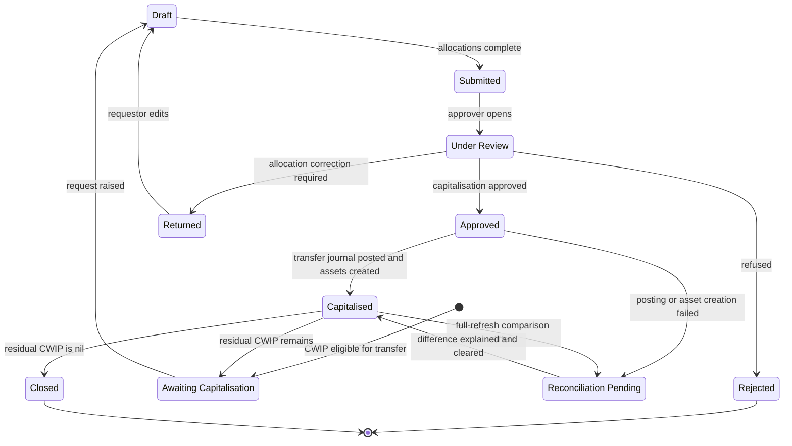
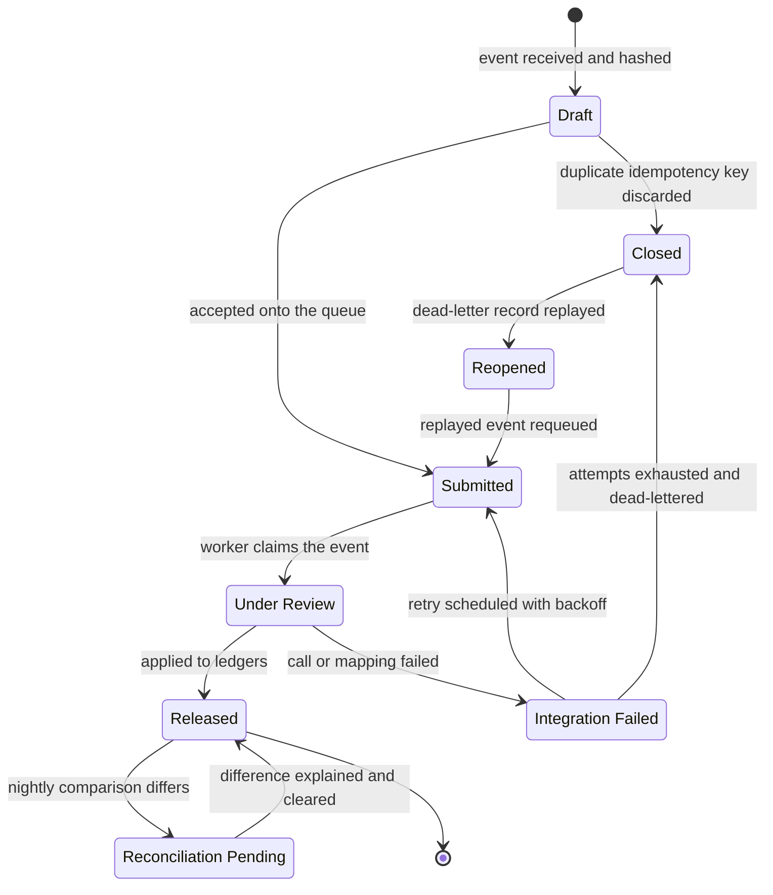

## 30. State Diagrams

Seven lifecycles are specified: CAPEX Project, WBS Element, Budget, Budget Revision, Purchase Commitment, Capitalisation and Integration Event. Together they use all 21 statuses in `C3_statuses.json` and no others.

### 30.1 Conventions binding on all seven diagrams

| Convention | Rule |
|---|---|
| State identity | Every state is declared as `state "<label>" as <CODE>`, where the label and the code are taken verbatim from `C3_statuses.json`. No lifecycle may introduce a state outside those 21. |
| Two status tracks | Following `C2_glossary.json`, each controlled object carries a **Workflow Status** set by users and a **System Status** derived by the system from what has actually happened. Diagrams 1, 2, 3, 4 and 6 are workflow tracks. Diagram 5 is the system track for commitment and actualisation. Diagram 7 is the technical processing track for integration events. |
| Non-colour indicator | Every status renders as an icon plus text, never colour alone. This is mandatory for all 21 statuses. |
| Guards | A transition fires only when its guard is satisfied. Guards are stated as conditions on named fields from §28 Data Model, so they can be implemented literally. |
| Actor | Every user-driven transition names a role from `C9_roles.json`. Transitions marked `System` are performed by the application or the connector service account. |
| Message | Every blocked or exceptional transition names the message identifier from `C10_messages.json` that the user sees. |
| Audit | Every transition writes an `audit_log` row with `action = 'STATUS_CHANGE'`. Transitions marked "reason mandatory" cannot be committed without `reason_text`, per `MSG-SEC-003`. |
| Reversibility | Any transition into `CLOSED`, `CAPITALISED` or `FINANCIALLY_COMPLETED` is a controlled terminal state: leaving it requires the `REOPENED` route with approval, and the audit trail records who and why. |

### 30.2 Lifecycle 1 — CAPEX Project

#### 30.2.1 State definitions

| State | Code | Semantic role | Entry condition | What is permitted | What is blocked |
|---|---|---|---|---|---|
| Draft | `DRAFT` | neutral | Project record created. | Edit every field; delete. | Budget release, purchase requests, purchase orders, any posting. |
| Submitted | `SUBMITTED` | in-progress | Mandatory fields complete: project code, name, plant, department, owner, CWIP general ledger account. | Withdraw to `DRAFT`. | Editing controlled fields. |
| Under Review | `UNDER_REVIEW` | in-progress | An approver from the matrix step has opened the record. | Approve, return, reject, comment. | Requestor edits. |
| Approved | `APPROVED` | positive | Every mandatory matrix step recorded a decision of `APPROVED`. | Release. | Procurement — approval alone does not permit spending. |
| Rejected | `REJECTED` | negative | Any mandatory step rejected. | Raise a new project. | Everything else. Terminal. |
| Returned | `RETURNED` | warning | An approver returned it with a mandatory comment. | Edit and resubmit as a new approval cycle. | Procurement. |
| Released | `RELEASED` | positive | A budget version is current and released. | Purchase requests, purchase orders, receipts, bills, revisions, transfers. | Capitalisation before technical completion. |
| Technically Completed | `TECHNICALLY_COMPLETED` | in-progress | Project Manager declares physical work complete. | Financial postings — bills against existing purchase orders, credit notes, journals. | New purchase requests and new purchase orders. |
| Financially Completed | `FINANCIALLY_COMPLETED` | positive | No open commitment and no unbilled receipt remains. | Reporting and audit only. | All postings. |
| Awaiting Capitalisation | `AWAITING_CAPITALISATION` | warning | CWIP balance is greater than zero and eligible for transfer. | Raise and approve a capitalisation request. | New procurement. |
| Capitalised | `CAPITALISED` | positive | The CWIP-to-asset transfer has posted and allocations are reconciled. | Reporting. | Procurement and posting, unless reopened. |
| Closed | `CLOSED` | neutral | Closure approved by the matrix route. | Reporting. | Procurement and posting. |
| Reopened | `REOPENED` | warning | Reopening approved; `reopen_count` incremented; reason recorded. | Immediate transition to `RELEASED`. | Remaining in `REOPENED` — it is a transitional state, not a resting state. |

#### 30.2.2 Transitions

| # | From | To | Trigger | Guard | Actor role | Message | Side effects |
|---|---|---|---|---|---|---|---|
| P-01 | — | `DRAFT` | Create project | Unique `project_code` within the organisation. | Project Manager | — | Audit insert. |
| P-02 | `DRAFT` | `SUBMITTED` | Submit | All mandatory master fields present. | Project Manager | — | Approval instances raised from `approval_matrix` for `document_type = 'PROJECT'`. |
| P-03 | `SUBMITTED` | `UNDER_REVIEW` | Approver opens | Approver holds the matrix role for the step. | Per matrix | `MSG-SEC-001` if role mismatch | — |
| P-04 | `UNDER_REVIEW` | `APPROVED` | Final approval | Every mandatory step decided `APPROVED`. | CAPEX Committee or CFO per band | — | `approved_by`, `approved_at`, `approval_reference` stamped. |
| P-05 | `UNDER_REVIEW` | `RETURNED` | Return | Comment mandatory. | Per matrix | — | New `cycle_no` opens on resubmission. |
| P-06 | `UNDER_REVIEW` | `REJECTED` | Reject | Comment mandatory. | Per matrix | — | Terminal for this project record. |
| P-07 | `APPROVED` | `RELEASED` | Release budget | A `budget_version` with `is_current = true` is in `RELEASED`. | Project Finance Controller | — | `budget_ledger` `ORIGINAL` entries posted; `original_budget_amount` set once and never overwritten (REQ-SEC-003). |
| P-08 | `RELEASED` | `TECHNICALLY_COMPLETED` | Declare technical completion | Confirmation dialogue lists open commitment and received-not-billed values. | Project Manager, countersigned by Plant Head | `MSG-CAP-001` | New purchase requests and purchase orders blocked from this point. |
| P-09 | `TECHNICALLY_COMPLETED` | `RELEASED` | Resume work | Approval on the `PROJECT_REOPEN` route; reason mandatory. | CAPEX Committee | `MSG-SEC-003` | Audit `action = 'REOPEN'`. |
| P-10 | `TECHNICALLY_COMPLETED` | `AWAITING_CAPITALISATION` | CWIP eligible | `actual_cwip_amount` greater than zero and `is_capitalisable` balance greater than zero. | System | — | Feeds the projects-awaiting-capitalisation alert (REQ-ALT-007). |
| P-11 | `AWAITING_CAPITALISATION` | `CAPITALISED` | Capitalisation posted | A `capitalisation_request` reached `CAPITALISED` and `allocation_variance_amount` equals zero. | System | `MSG-CAP-003` | `capitalisation_date` set. |
| P-12 | `CAPITALISED` or `TECHNICALLY_COMPLETED` | `FINANCIALLY_COMPLETED` | Financial close | `open_commitment_amount` equals zero **and** `received_not_billed_amount` equals zero. | Finance | `MSG-CAP-001` when either is non-zero | `financial_close_date` set; all postings blocked. |
| P-13 | `FINANCIALLY_COMPLETED` or `CAPITALISED` | `CLOSED` | Close | Closure approval recorded; `closure_reason` mandatory. | CFO | — | Procurement and posting blocked (REQ-CAP-002). |
| P-14 | `CLOSED` | `REOPENED` | Reopen | Approval on the `PROJECT_REOPEN` route; reason mandatory and stored. | CAPEX Committee then CFO | `MSG-PRC-006`, `MSG-SEC-003` | `reopen_count` incremented; audit records who and why. |
| P-15 | `REOPENED` | `RELEASED` | Resume | A current released budget version exists. | Project Finance Controller | — | Procurement permitted again. |

#### 30.2.3 Client status mapping

The client document defines exactly four project statuses — Active, Completed, Capitalized, Closed (REQ-PRJ-017) — and no reopened state, while REQ-CAP-002 requires closed or capitalised projects to be reopenable through approval. That internal inconsistency is CONF-11 and is surfaced, not resolved.

| Client label | This lifecycle | Note |
|---|---|---|
| Active | `RELEASED` | Procurement permitted. |
| Completed | `TECHNICALLY_COMPLETED` then `FINANCIALLY_COMPLETED` | The client's single label does not distinguish physical from financial completion. The split is `provenance=MASTER-PROMPT` and must be ratified. |
| Capitalized | `CAPITALISED` | Spelling normalised to the registry label. |
| Closed | `CLOSED` | Direct. |
| *(absent)* | `DRAFT`, `SUBMITTED`, `UNDER_REVIEW`, `APPROVED`, `REJECTED`, `RETURNED`, `AWAITING_CAPITALISATION`, `REOPENED` | Required by the workflow the client describes but absent from its status list. |

### 30.3 Lifecycle 2 — WBS Element

*Provenance: `MASTER-PROMPT`. The client document contains no WBS hierarchy (CONF-02). In a client-faithful configuration each project carries one account-assignment WBS element per budget head and this lifecycle runs on those single-level nodes.*

#### 30.3.1 Hierarchy rules

| # | Rule | Enforcement |
|---|---|---|
| W-01 | A child node may not reach `RELEASED` before its parent. | Guard on transition W-05. |
| W-02 | A parent may not reach `TECHNICALLY_COMPLETED` while any descendant is in `RELEASED` or `REOPENED`. | Guard on W-06; the blocked descendants are listed in the dialogue. |
| W-03 | A parent may not reach `FINANCIALLY_COMPLETED` unless every descendant is in `FINANCIALLY_COMPLETED` or `CLOSED`. | Guard on W-08. |
| W-04 | Only nodes with `is_account_assignment = true` may hold budget lines, commitment or actuals. Structural nodes aggregate and never post. | Check trigger DM-01. |
| W-05 | A node with any ledger entry cannot be soft-deleted. Closure is offered instead. | Service guard DM-12. |

#### 30.3.2 Transitions

| # | From | To | Trigger | Guard | Actor role | Message | Side effects |
|---|---|---|---|---|---|---|---|
| W-01 | — | `DRAFT` | Add node | Parent exists or the node is level 1; `level_no` at most 5. | Project Manager | — | `path` recalculated by trigger. |
| W-02 | `DRAFT` | `SUBMITTED` | Submit structure | `budget_head_id` present when `is_account_assignment` is true. | Project Manager | `MSG-BUD-004` when the budget head is missing | — |
| W-03 | `SUBMITTED` | `UNDER_REVIEW` | Approver opens | Matrix role held. | Per matrix | `MSG-SEC-001` | — |
| W-04 | `UNDER_REVIEW` | `APPROVED` / `RETURNED` / `REJECTED` | Decision | Comment mandatory for return and rejection. | Per matrix | — | Cycle recorded on `approval_instance`. |
| W-05 | `APPROVED` | `RELEASED` | Budget released | Parent is `RELEASED`; a released budget line exists for this node. | Project Finance Controller | — | Node becomes a valid coding target for purchase orders and bills. |
| W-06 | `RELEASED` | `TECHNICALLY_COMPLETED` | Scope complete | No descendant in `RELEASED` or `REOPENED`. | Project Manager | `MSG-CAP-001` | New commitment against this node blocked. |
| W-07 | `TECHNICALLY_COMPLETED` | `RELEASED` | Resume | Approval recorded; reason mandatory. | Plant Head | `MSG-SEC-003` | — |
| W-08 | `TECHNICALLY_COMPLETED` | `FINANCIALLY_COMPLETED` | Financial close | `open_commitment_amount` equals zero and `received_not_billed_amount` equals zero, for this node and all descendants. | Finance | `MSG-CAP-001` | All postings to this node blocked. |
| W-09 | `FINANCIALLY_COMPLETED` | `CLOSED` | Close node | Parent not yet closed, or closed in the same operation. | Project Finance Controller | — | Node removed from selection lists. |
| W-10 | `CLOSED` | `REOPENED` | Reopen | Project is `RELEASED` or `REOPENED`; reason mandatory. | CAPEX Committee | `MSG-PRC-006`, `MSG-SEC-003` | Audit `action = 'REOPEN'`. |
| W-11 | `REOPENED` | `RELEASED` | Resume | Released budget line still exists or a revision has restored one. | Project Finance Controller | — | — |

### 30.4 Lifecycle 3 — Budget

The lifecycle of a `budget_version`. Version 1 is the Original Budget and is never overwritten; every change opens a successor version (REQ-SEC-003, REQ-REV-005).

#### 30.4.1 Control effect by state

| State | `is_current` | Counted by the availability check | Editable |
|---|---|---|---|
| `DRAFT` | false | No | Yes, all budget lines |
| `SUBMITTED` | false | No | No |
| `UNDER_REVIEW` | false | No | No |
| `APPROVED` | false | No | No |
| `REJECTED` | false | No | No — a new version is raised instead |
| `RETURNED` | false | No | Yes, after transition back to `DRAFT` |
| `RELEASED` | **true** | **Yes** | No — `budget_line.is_locked` becomes true |
| `CLOSED` | false | No | No |

#### 30.4.2 Transitions

| # | From | To | Trigger | Guard | Actor role | Message | Side effects |
|---|---|---|---|---|---|---|---|
| B-01 | — | `DRAFT` | Open version | Project is `APPROVED`, `RELEASED` or `REOPENED`. Version 1 requires `version_type = 'ORIGINAL'`. | Project Finance Controller | — | Budget lines seeded from the current version where one exists. |
| B-02 | `DRAFT` | `SUBMITTED` | Submit | Every line has a WBS element, budget head and non-negative amount. When `budget_head_sum_must_equal_project` is true, head totals must equal the project total. | Project Finance Controller | `MSG-BUD-004` | Approval instances raised for `document_type = 'BUDGET_VERSION'`. |
| B-03 | `SUBMITTED` | `UNDER_REVIEW` | Approver opens | Matrix role held for the amount band. | Per matrix | `MSG-SEC-001` | — |
| B-04 | `UNDER_REVIEW` | `APPROVED` | Approve | All mandatory steps decided. | CAPEX Committee or CFO per band | — | `approved_by`, `approved_at`, `approval_reference` stamped (REQ-BUD-005). |
| B-05 | `UNDER_REVIEW` | `RETURNED` | Return | Comment mandatory. | Per matrix | — | — |
| B-06 | `UNDER_REVIEW` | `REJECTED` | Reject | Comment mandatory. | Per matrix | — | Terminal for this version; a new version may be raised. |
| B-07 | `APPROVED` | `RELEASED` | Release | `effective_from` is not in the future relative to the posting date. | Project Finance Controller | `MSG-BUD-005` | Predecessor moves to `CLOSED`; `budget_ledger` entries posted; `is_current` flips atomically; `budget_line.is_locked` set true. |
| B-08 | `RELEASED` | `CLOSED` | Superseded | A later version reached `RELEASED`. | System | — | `effective_to` set to the day before the successor's `effective_from`. |

Only one version per project may be `RELEASED` with `is_current = true` at any time; this is a partial unique index, not an application convention.

### 30.5 Lifecycle 4 — Budget Revision

REQ-REV-001 to REQ-REV-007. Note that the client document describes only additional budget; returns and transfers are `provenance=MASTER-PROMPT` (CONF-13) and are switched off by default.

#### 30.5.1 Transitions

| # | From | To | Trigger | Guard | Actor role | Message | Side effects |
|---|---|---|---|---|---|---|---|
| R-01 | — | `EXCEPTION_PENDING` | Availability check fails | Proposed value is greater than available budget at the checked level. | System | `MSG-BUD-001` | The triggering document identifier is stamped on `trigger_document_type` and `trigger_document_id` (REQ-REV-002). |
| R-02 | `EXCEPTION_PENDING` | `DRAFT` | Raise revision | Requestor elects revision rather than exception approval. | Requestor or Project Manager | — | Shortfall pre-filled as the proposed amount. |
| R-03 | — | `DRAFT` | Planned revision | Project is `RELEASED` or `REOPENED`. | Project Manager | — | — |
| R-04 | `DRAFT` | `SUBMITTED` | Submit | `justification_text` non-empty; amount greater than zero; for a transfer, both source and target nodes present. | Project Manager | `MSG-BUD-006` when a transfer would leave the source with negative availability | Approval instances raised for `document_type = 'BUDGET_REVISION'`. |
| R-05 | `SUBMITTED` | `UNDER_REVIEW` | Authority opens | Matrix role held for the amount band. | Per matrix | `MSG-SEC-001` | — |
| R-06 | `UNDER_REVIEW` | `APPROVED` | Approve | All mandatory steps decided (REQ-REV-004). | CAPEX Committee or CFO per band | — | `approved_by`, `approved_at`, `approval_reference` stamped (REQ-SEC-004). |
| R-07 | `UNDER_REVIEW` | `RETURNED` | Return | Comment mandatory. | Per matrix | — | — |
| R-08 | `UNDER_REVIEW` | `REJECTED` | Reject | `rejection_reason` mandatory. | Per matrix | — | The triggering transaction stays blocked. |
| R-09 | `APPROVED` | `RELEASED` | Apply revision | A successor `budget_version` was created and released. | System | `MSG-BUD-005` | `budget_ledger` entries posted as `SUPPLEMENT`, `RETURN`, `TRANSFER_IN` or `TRANSFER_OUT`; `resulting_budget_version_id` set; the original budget is untouched (REQ-REV-005). |
| R-10 | `RELEASED` | — | Revalidate trigger | REQ-REV-007 requires the triggering transaction to be rechecked against the revised available budget. | System | `MSG-BUD-001` when still exceeded | `revalidation_result` set to `PASSED` or `STILL_EXCEEDED`; a still-exceeded result returns the transaction to `EXCEPTION_PENDING`. |

The frozen formula applies unchanged at R-09: `Current Approved Budget = Original Budget + Approved Supplements - Approved Returns +/- Approved Transfers`.

### 30.6 Lifecycle 5 — Purchase Commitment

This is the system-status track. It governs a purchase order and its lines, and it is the lifecycle in which the anti-double-count and anti-under-count controls live.

#### 30.6.1 The controlling formulas

Applied at every guard in this lifecycle, quoted from `C5_formulas.json`:

- `Exposure = Open PO Commitment + Actual CWIP`
- `Available Budget = Current Approved Budget - Exposure`
- `Utilisation % = Exposure / Current Approved Budget`

The frozen worked example for the over-budget case, quoted verbatim:

> 80L Budget - 35L Actual CWIP - 30L Open PO Commitment = 15L Available. A new PO of 20L exceeds available budget by 5L and must route to exception approval or budget revision.

The frozen worked example for the part-billed position, quoted verbatim: po `20L`, actual_bill `12L`, open_commitment `8L`, budget_exposure `20L`.

That last row is the whole point of the lifecycle: **budget exposure for a purchase order is unchanged by billing progress — only its split between commitment and actual moves.**

#### 30.6.2 Transitions

| # | From | To | Trigger | Guard | Actor role | Message | Ledger effect |
|---|---|---|---|---|---|---|---|
| C-01 | — | `DRAFT` | Purchase order observed | Mirror row created from a Zoho poll or push. Every line must resolve a WBS element and budget head. | System | `MSG-BUD-004` when coding is missing | None. |
| C-02 | `DRAFT` | `APPROVED` | Availability check passes | Proposed line value is at most `available_budget_amount` at the checked level. | Procurement, validated by System | — | None yet. |
| C-03 | `DRAFT` | `BUDGET_EXCEEDED` | Availability check fails | Proposed value is greater than available budget. | System | `MSG-BUD-001` | None. |
| C-04 | `BUDGET_EXCEEDED` | `EXCEPTION_PENDING` | Route to exception | An `is_exception_route` matrix row matches the amount band. | Requestor | `MSG-BUD-001` | None. |
| C-05 | `BUDGET_EXCEEDED` | `DRAFT` | Revision applied | A budget revision reached `RELEASED` and `revalidation_result` is `PASSED`. | System | `MSG-BUD-005` | Budget ledger already posted by R-09. |
| C-06 | `EXCEPTION_PENDING` | `APPROVED` | Exception approved | Approval recorded on the exception route; reason mandatory. | CAPEX Committee or CFO per band | `MSG-SEC-003` | None yet. |
| C-07 | `EXCEPTION_PENDING` | `REJECTED` | Exception refused | Comment mandatory. | Per matrix | — | None. Terminal. |
| C-08 | `APPROVED` | `RELEASED` | Commitment posted | `commitment_basis_event` reached — `ON_APPROVAL` by default. | System | — | `commitment_ledger` `COMMIT`, positive, one entry per purchase order line. |
| C-09 | `RELEASED` | `PARTIALLY_COMMITTED` | Recompute | Open commitment on the node is greater than zero and less than available budget. | System | `MSG-BUD-002` at 80 percent, `MSG-BUD-003` at 90 percent | None. |
| C-10 | `PARTIALLY_COMMITTED` | `FULLY_COMMITTED` | Recompute | Open commitment equals available budget. | System | `MSG-BUD-003` | None. |
| C-11 | any committed state | same state | Purchase order amended upward | Incremental value revalidated against available budget (REQ-PO-008). | System | `MSG-PRC-001` | `commitment_ledger` `AMEND_UP` for the delta only. |
| C-12 | any committed state | same state | Purchase order amended downward | — | System | `MSG-PRC-001` | `commitment_ledger` `AMEND_DOWN` for the delta. |
| C-13 | `PARTIALLY_COMMITTED` or `FULLY_COMMITTED` | `PARTIALLY_ACTUALISED` | Bill line matched | Bill line carries `purchaseorder_item_id` resolving to a known purchase order line. | System | `MSG-PRC-004` when the bill line exceeds the remaining unbilled value | `commitment_ledger` `RELIEVE_ON_BILL` negative **and** `actual_ledger` `BILL` positive, in one transaction. Never both an add to commitment and to actual. |
| C-14 | `PARTIALLY_ACTUALISED` | `FULLY_ACTUALISED` | Fully billed | `billed_amount` equals `ordered_amount`; `open_commitment_amount` equals zero. | System | — | Final relief entry. |
| C-15 | `PARTIALLY_ACTUALISED` or `FULLY_ACTUALISED` | previous state | Credit note, debit note or bill reversal | Source document is void or reversing. | System | — | `actual_ledger` reversal entry and a matching `commitment_ledger` re-commit, restoring available budget. |
| C-16 | `PARTIALLY_COMMITTED` | `CLOSED` | Cancelled before billing | `billed_amount` equals zero. | Procurement | `MSG-PRC-002` | `commitment_ledger` `RELEASE_ON_CANCEL` for the whole commitment; exposure for this purchase order falls to zero (REQ-PO-007, REQ-PO-009). |
| C-17 | `PARTIALLY_ACTUALISED` | `CLOSED` | Closed with residual | Purchase order closed while `open_commitment_amount` is greater than zero. | Procurement | `MSG-PRC-003` | `commitment_ledger` `RELEASE_RESIDUAL_ON_CLOSE` for the unbilled residual **only**. |
| C-18 | `FULLY_ACTUALISED` | `CLOSED` | Completed | Nothing outstanding. | System | — | None. |

#### 30.6.3 Goods receipt does not appear as a state

A goods receipt is deliberately absent from the transition table above. It never relieves commitment and it never creates actual cost. It moves value into the `received_not_billed_amount` bucket and nothing else.

| Concern | Rule | Basis |
|---|---|---|
| Anti-under-count | Commitment is relieved **only** by the event that also creates actual cost, which is the vendor bill. | `C5_formulas.json` (`commitment_reduction_gates`) |
| The dangerous case | Where a goods-receipt indicator is set but the receipt is non-valuated, commitment would be relieved at receipt while cost arrives only at invoice, leaving the item in neither actual nor commitment and understating assigned value. The explicit received-not-billed bucket closes that hole. | `C5_formulas.json` |
| Reconstruction | Receipt lines carry no purchase-order key, no coding fields and no rate, and the module has no list endpoint, so this bucket is reconstructed by this application and labelled as reconstructed wherever shown. | OAS-03 |
| Alert | Received-not-billed value and its age drive `MSG-PRC-005` and the pending GRN and billing alert (REQ-ALT-005). | `C10_messages.json`, REQ-ALT-005 |

#### 30.6.4 Purchase Request and the reservation question

The client document requires a budget availability check at the purchase request stage, yet its core control formula counts only Actual CWIP and Open PO Commitment — so an approved purchase request reserves nothing and two requests of ₹10,00,000 each can both pass a check against ₹15,00,000 available (CONF-10). The optional reservation described in §28.6.1 closes this, is `provenance=DERIVED-RECOMMENDATION`, and is disabled by default. Whether the check is enforced at purchase request, at purchase order, or at both is `UNVERIFIED - REQUIRES CONFIRMATION`.

### 30.7 Lifecycle 6 — Capitalisation

REQ-CAP-001 to REQ-CAP-003. The lifecycle of a `capitalisation_request` and its allocations.

#### 30.7.1 Transitions

| # | From | To | Trigger | Guard | Actor role | Message | Side effects |
|---|---|---|---|---|---|---|---|
| K-01 | — | `AWAITING_CAPITALISATION` | Eligibility detected | Project or WBS element is `TECHNICALLY_COMPLETED` and capitalisable CWIP is greater than zero. | System | — | Feeds the projects-awaiting-capitalisation alert (REQ-ALT-007). |
| K-02 | `AWAITING_CAPITALISATION` | `DRAFT` | Raise request | `cwip_balance_at_request` snapshotted from `actual_ledger`. | Project Finance Controller | — | Snapshot frozen for the life of the request. |
| K-03 | `DRAFT` | `SUBMITTED` | Submit | Allocations total exactly `proposed_capitalisation_amount + non_capitalisable_amount`; percentage allocations total 100.000. | Project Finance Controller | `MSG-CAP-002` on any difference | Approval instances raised for `document_type = 'CAPITALISATION_REQUEST'`. |
| K-04 | `SUBMITTED` | `UNDER_REVIEW` | Approver opens | Matrix role held. | Per matrix | `MSG-SEC-001` | — |
| K-05 | `UNDER_REVIEW` | `APPROVED` | Approve | All mandatory steps decided. | Finance then CFO per band | — | — |
| K-06 | `UNDER_REVIEW` | `RETURNED` / `REJECTED` | Return or reject | Comment mandatory. | Per matrix | — | — |
| K-07 | `APPROVED` | `CAPITALISED` | Post transfer | The CWIP-to-asset journal posted and every `FIXED_ASSET` allocation has an asset identifier. The journal is WBS-coded at **line** level, which the journal line supports through `project_id` and `tags` (OAS-10). | System | `MSG-CAP-003` | `actual_ledger` `CAPITALISATION_TRANSFER` entries, negative against CWIP; `asset_allocation.zoho_fixed_asset_id` populated. |
| K-08 | `APPROVED` | `RECONCILIATION_PENDING` | Posting failure | Journal rejected, or asset creation failed on any allocation. | System | `MSG-INT-006` | Nothing posted; the request holds. Partial asset creation is recorded per allocation so a retry does not duplicate assets. |
| K-09 | `CAPITALISED` | `RECONCILIATION_PENDING` | Comparison differs | The full-refresh asset comparison finds a value difference beyond tolerance. | System | `MSG-INT-006` | `reconciliation_log` row written. Assets expose no last-modified field, so this comparison is a full refresh and never an incremental poll (OAS-09). |
| K-10 | `RECONCILIATION_PENDING` | `CAPITALISED` | Cleared | Difference explained; `resolution_note` mandatory. | Finance | `MSG-SEC-003` | — |
| K-11 | `CAPITALISED` | `AWAITING_CAPITALISATION` | Residual remains | `residual_cwip_amount` greater than zero. | System | — | A further request may be raised — partial capitalisation is supported. |
| K-12 | `CAPITALISED` | `CLOSED` | Complete | `residual_cwip_amount` equals zero. | Finance | — | Project may proceed to `FINANCIALLY_COMPLETED`. |

#### 30.7.2 The two settlement paths

Both must exist. Treating CWIP as a total-cost sink would erase the non-capitalisable write-off path.

| Path | Allocation `target_type` | Destination | Effect on the asset |
|---|---|---|---|
| Capitalisable debits | `FIXED_ASSET` | A fixed asset created in Zoho ERP | Increases asset cost. |
| Debits routed to receivers by a prior capitalisation rule | `COST_CENTRE` | The cost centre on `department.cost_centre_code` | Never reaches the asset under construction. |

The correct statement of the underlying rule is that, with no capitalisation key, the system settles all debits **not assigned to CO receivers** to the asset under construction during periodic settlement. Dropping that qualifier is the error this design explicitly avoids.

#### 30.7.3 Traceability constraint

Fixed assets in Zoho carry no link to a source project, purchase order or bill, and the asset list exposes no created or last-modified timestamp (OAS-09). Therefore:

1. The `capitalisation_request` record, not the asset, is the anchor of capitalisation traceability.
2. Asset verification is a **full-refresh** value comparison; incremental polling is not possible.
3. The client document itself has no solution-mapping row for fixed assets, project completion or settlement even though capitalisation is step 10 of its workflow (CONF-09). That gap is surfaced here rather than filled in silently.

### 30.8 Lifecycle 7 — Integration Event

The technical processing track for `integration_event`, `retry_queue` and `dead_letter_record`. It is never shown on a business screen.

#### 30.8.1 Transitions

| # | From | To | Trigger | Guard | Actor | Message | Side effects |
|---|---|---|---|---|---|---|---|
| I-01 | — | `DRAFT` | Event received | Payload hashed; `idempotency_key` computed as `sha256(source_org_id, business_object, external_id, payload_hash)`. | System | — | Row written before any processing. |
| I-02 | `DRAFT` | `CLOSED` | Duplicate | An event with the same `idempotency_key` already exists. | System | — | Discarded silently. No ledger entry is ever written twice. |
| I-03 | `DRAFT` | `SUBMITTED` | Accept | `sequence_no` is not lower than the last applied value for the same object; an out-of-order event is held, not applied. | System | — | Queued. |
| I-04 | `SUBMITTED` | `UNDER_REVIEW` | Worker claims | `lock_token` acquired; `locked_until` in the future. | System | — | Concurrency limit from `sync_configuration.concurrency_limit` respected. |
| I-05 | `UNDER_REVIEW` | `RELEASED` | Applied | Mapping resolved and the ledger transaction committed. | System | — | `applied_at` set; mirror rows and ledger entries written in one transaction. |
| I-06 | `UNDER_REVIEW` | `INTEGRATION_FAILED` | Failure | Any of authentication, scope, validation, mapping, rate limit or transport failed. | System | `MSG-INT-001` for a missing scope, `MSG-INT-002` for a token that cannot refresh, `MSG-INT-003` for rate limiting | `integration_response` recorded with `response_class` and `is_retryable`. |
| I-07 | `INTEGRATION_FAILED` | `SUBMITTED` | Retry | `attempt_count` is less than `max_attempts` and the response was retryable. `retry_after_seconds` is honoured when present. | System | — | Exponential backoff with jitter; `next_attempt_at` set. |
| I-08 | `INTEGRATION_FAILED` | `CLOSED` | Dead-letter | `attempt_count` reached `max_attempts`, or the failure class is not retryable. | System | `MSG-INT-004` | `dead_letter_record` written with the full redacted payload, so a replay needs nothing from Zoho. |
| I-09 | `CLOSED` | `REOPENED` | Replay | An administrator replays the dead-letter record; reason mandatory. | System Administrator | `MSG-SEC-003` | `connector_audit_log` entry `DLQ_REPLAYED`. |
| I-10 | `REOPENED` | `SUBMITTED` | Requeue | A new event row is created and linked through `replay_event_id`. | System | — | Attempt counter reset. |
| I-11 | `RELEASED` | `RECONCILIATION_PENDING` | Comparison differs | Nightly reconciliation finds a variance beyond tolerance. | System | `MSG-INT-006` | `reconciliation_log` row written; affected mirror rows flagged. |
| I-12 | `RECONCILIATION_PENDING` | `RELEASED` | Cleared | `resolution_note` mandatory. | Finance or System Administrator | `MSG-SEC-003` | `reconciliation_log.recon_status` set to `CLOSED`. |

#### 30.8.2 Acquisition constraints

| Constraint | Consequence for this lifecycle | Basis |
|---|---|---|
| A general webhook framework is not evidenced. | `acquisition_source` defaults to `ZOHO_POLL`. `ZOHO_PUSH` may not be enabled until confirmation exists: `UNVERIFIED - REQUIRES ZOHO CONFIRMATION`. The duplicate-webhook case in I-02 is designed for regardless, because a duplicate poll produces the same condition. | CONF-16 |
| Pagination is evidenced: `per_page` defaults to 200 with a documented maximum of 200, and `page` defaults to 1. | Batch sizing is specified, not probed. | OAS-08 |
| Purchase receives have no list endpoint. | Events for goods receipts arrive only from purchase-order traversal, manual entry or CSV import; there is no poll that can enumerate them. | OAS-03 |
| Fixed assets have no last-modified field. | Asset events are produced by full-refresh comparison, never incremental polling. | OAS-09 |
| Concrete rate limits are not in the specification. | Backoff at I-07 is driven by observed `429`-class responses and `retry_after_seconds`, not by a configured quota: `UNVERIFIED - REQUIRES ZOHO CONFIRMATION`. | §28.9.7 |

### 30.9 Status coverage check

All 21 statuses in `C3_statuses.json`, and the lifecycles that use them. No status is unused, and no lifecycle uses a state outside the registry.

| Status code | Label | Semantic role | Lifecycles |
|---|---|---|---|
| `DRAFT` | Draft | neutral | 1, 2, 3, 4, 5, 6, 7 |
| `SUBMITTED` | Submitted | in-progress | 1, 2, 3, 4, 6, 7 |
| `UNDER_REVIEW` | Under Review | in-progress | 1, 2, 3, 4, 6, 7 |
| `APPROVED` | Approved | positive | 1, 2, 3, 4, 5, 6 |
| `REJECTED` | Rejected | negative | 1, 2, 3, 4, 5, 6 |
| `RETURNED` | Returned | warning | 1, 2, 3, 4, 6 |
| `RELEASED` | Released | positive | 1, 2, 3, 4, 5, 7 |
| `PARTIALLY_COMMITTED` | Partially Committed | in-progress | 5 |
| `FULLY_COMMITTED` | Fully Committed | in-progress | 5 |
| `PARTIALLY_ACTUALISED` | Partially Actualised | in-progress | 5 |
| `FULLY_ACTUALISED` | Fully Actualised | positive | 5 |
| `BUDGET_EXCEEDED` | Budget Exceeded | negative | 5 |
| `EXCEPTION_PENDING` | Exception Pending | warning | 4, 5 |
| `TECHNICALLY_COMPLETED` | Technically Completed | in-progress | 1, 2 |
| `FINANCIALLY_COMPLETED` | Financially Completed | positive | 1, 2 |
| `AWAITING_CAPITALISATION` | Awaiting Capitalisation | warning | 1, 6 |
| `CAPITALISED` | Capitalised | positive | 1, 6 |
| `CLOSED` | Closed | neutral | 1, 2, 3, 5, 6, 7 |
| `REOPENED` | Reopened | warning | 1, 2, 7 |
| `INTEGRATION_FAILED` | Integration Failed | negative | 7 |
| `RECONCILIATION_PENDING` | Reconciliation Pending | warning | 6, 7 |

### 30.10 Implementation notes for the state machine

| # | Note |
|---|---|
| 1 | Transitions are data, not code branches. Each lifecycle is a table of `(entity, from_state, to_state, trigger, guard_expression, required_role, message_id, side_effect_handler)` loaded at start-up. A transition absent from that table cannot be executed, which makes an unauthorised status jump structurally impossible. |
| 2 | Every guard is evaluated inside the same database transaction as the state write and the ledger write. A guard that reads a snapshot column re-reads it with row locking first; snapshots are never trusted for a control decision without that re-read. |
| 3 | System-status transitions in Lifecycle 5 are recomputed on every ledger write, not on a schedule, so the status a user sees never lags the ledger. |
| 4 | Workflow status and system status are stored and displayed separately. A user may never edit a system status; the attempt returns `MSG-SEC-001`. |
| 5 | Every state renders as icon plus text. Colour alone is never the carrier of status, for all 21 statuses. |
| 6 | Terminal states are enforced at the database level by a check constraint on the transition table, not only by application logic. |
