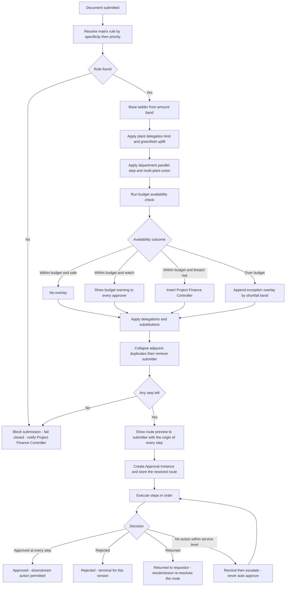

## 31. Role and Approval Matrix

### 31.1 Scope, provenance and what is actually frozen here

This section specifies **who may do what**, **who must approve what**, and **how the system decides which approval route a given transaction takes**. It is the design input for two screens — SCR-29 Approval Matrix Configuration and SCR-03 My Approval Inbox — and it supplies the `Permission requirements` attribute for all forty screens in §48 Screen Catalogue and Navigation Map.

Three provenance statements must be read before any table below is treated as a requirement.

| What | Provenance | Status |
|---|---|---|
| The **thirteen role names** | Frozen role registry | Fixed vocabulary. No role may be added, renamed or merged in the build. |
| The **existence** of an approval matrix, exception approval and revision approval | `CLIENT-PDF` — REQ-PRC-002, REQ-REV-004, REQ-BUD-005, REQ-SEC-004, REQ-CAP-002 | Confirmed client requirement. |
| The **content** of the matrix — amount bands, approver ladders, plant and entity rules, delegation policy | `DERIVED-RECOMMENDATION` | **UNVERIFIED - REQUIRES CONFIRMATION.** The client document names no amounts, no approver titles and no ladder. Its own Phase 1 defers this: REQ-INT-018 makes confirming "Atha Group CAPEX approval matrix" a Discovery deliverable. ASM-48 records the thirteen roles as working placeholders pending that matrix. |

Every numeric threshold in §31.6 to §31.10 is therefore a **configured default shipped so the POC is demonstrable end to end**, not a finding about Atha Group. The build must treat the whole matrix as data, never as code: §31.5 defines the rule record, §31.16 defines who may change it, and §31.11 defines how conflicting rules resolve. If Discovery returns a completely different ladder, nothing in the application changes except rows in the `Approval Matrix` table.

The client document states the requirement for approval governance in only two places with any specificity: "appropriate authority approves/rejects additional CAPEX" (REQ-REV-004) and "Every revision to retain requestor, approver, date, reason and approval reference" (REQ-SEC-004). Everything else is engineered from those two sentences plus the workflow in REQ-PRJ-005.

**Cross-references.** §10.6 Role-to-stage responsibility matrix maps roles onto the eighteen lifecycle stages and states five segregation-of-duties rules (SOD-1 to SOD-5); this section refines those into enforceable permissions and routes. §32 Security and Internal Controls carries the enforcement design, the segregation-of-duties matrix and the audit obligations. §26 Integration Security and Secret Management governs the connector's maker-checker, which this section reproduces only by reference. §21 Detailed Business Rules carries the validation rules the approval steps invoke. §22 Budget and Commitment Calculation Logic supplies the availability figure the exception route keys on.

---

### 31.2 The thirteen roles

Role definitions are written for the CAPEX and CWIP control cycle only. The "Organisational anchor" column is indicative and **UNVERIFIED - REQUIRES CONFIRMATION** — the client document names no job titles; it names one field, Project Owner, and REQ-PRJ-012 explicitly records that the document does not state that the Project Owner is an approver (ASM-08).

| Role | Purpose in the CAPEX cycle | Organisational anchor (indicative, unconfirmed) | Creates | Approves | Must never do | Primary screens |
|---|---|---|---|---|---|---|
| **Requestor** | Raises the demand that starts the control cycle | Any budget-holding employee at a plant or department | Purchase Request; Comment; Attachment | Nothing | Approve any document they raised; see any project outside their department scope; view budget for projects they hold no line on | SCR-14, SCR-03 (own items only), SCR-13 (read) |
| **Project Manager** | Owns delivery of one or more CAPEX projects; owns the WBS and the budget proposal | Project lead / engineering manager | CAPEX Project (draft); WBS Element; Budget Version (draft); Budget Revision request; Capitalisation Request (draft) | Nothing at the first level; may be configured as a first approver for Purchase Requests on their own project below the lowest amount band | Approve their own budget revision; post an actual; change the Approval Matrix | SCR-04, SCR-05, SCR-06, SCR-07, SCR-08, SCR-09, SCR-11, SCR-20 |
| **Plant Head** | Site authority for capital spend at one plant | Works manager / unit head | Nothing transactional | Purchase Request; PO amendment; budget supplement within plant delegation; technical completion | Approve for a plant they are not assigned to; approve anything above their amount band without escalation | SCR-03, SCR-05, SCR-14, SCR-25 |
| **Department Head** | Functional authority for spend originating in their department | Head of Civil, Electrical, Utilities, Instrumentation, Projects | Purchase Request on behalf of the department | Purchase Request at the first band; departmental budget line proposals | Approve across departments; approve a budget revision | SCR-03, SCR-09, SCR-14 |
| **Procurement** | Converts an approved Purchase Request into a Zoho ERP purchase order and manages the vendor-facing document | Purchase / materials management | Purchase order in Zoho ERP; goods-receipt entry in Zoho ERP | Nothing in the budget domain | Approve budget, a budget revision, or any Purchase Request; raise a purchase order without an approved Purchase Request | SCR-14 (read), SCR-15, SCR-16, SCR-18 |
| **Finance** | Books the vendor bill, executes the capitalisation posting, owns the ledger side | Accounts payable and fixed-assets accounting | Vendor bill in Zoho ERP; CWIP transfer journal in Zoho ERP | Capitalisation execution step | Approve a budget or a Purchase Request; change a budget version | SCR-17, SCR-19, SCR-21, SCR-22 |
| **Project Finance Controller** | The control owner. Guardian of the budget register, the ledgers and the availability check | CAPEX controller / business finance partner | Budget Version; Budget Line; Budget release; Capitalisation Request; reconciliation dispositions | Budget release; budget transfer within a project; received-not-billed write-off; financial completion; project closure | Approve their own budget revision request; edit a posted ledger row; approve an exception they raised | SCR-02, SCR-09, SCR-10, SCR-11, SCR-12, SCR-18, SCR-19, SCR-20, SCR-23, SCR-24, SCR-27 |
| **CAPEX Committee** | Collective authority for large commitments and for exception approvals | Standing capital committee | Nothing | Original budget above the committee band; budget supplement above the controller band; over-budget exception approval | Act as a single individual — the committee is a quorum role (§31.13) | SCR-03, SCR-09, SCR-11, SCR-25 |
| **CFO** | Final financial authority; the only role that can authorise a controlled reopening | Chief financial officer | Nothing | Top amount band on every transaction type; capitalisation; controlled reopening; approval-matrix changes | Bypass the committee where a committee step is configured; create any transaction | SCR-01, SCR-03, SCR-11, SCR-21, SCR-29 |
| **Management Approver** | A configurable additional approver slot for group or promoter-level sign-off | Managing director / group office | Nothing | Whatever the Approval Matrix assigns; ships disabled by default | Be inserted into a route silently — a Management Approver step is always visible on the route preview | SCR-01, SCR-03 |
| **System Administrator** | Operates the connector and the application configuration | IT / application support | Connection Profile; Field Mapping; Sync Configuration; master data | Connector maker-checker only (§26.11) | Approve any business transaction; alter a Budget Ledger, Commitment Ledger or Actual Ledger row; grant themselves a business role | SCR-29 (read), SCR-30, SCR-31 to SCR-40 |
| **Internal Auditor** | Independent read access across the whole control cycle | Internal audit | Nothing. May create Comments flagged `audit_note` on the audit trail | Nothing | Write anything financial; modify or delete an audit record; hold any other role concurrently | Read access to all forty screens; SCR-28 is their home |
| **Read-only Management User** | Non-approving management visibility | Board member, lender representative, promoter office | Nothing | Nothing | See vendor-level personal data; export at row level beyond their entity scope | SCR-01, SCR-23, SCR-24, SCR-25 (read) |

**Role assignment rules.**

| # | Rule | Reason |
|---|---|---|
| RA-1 | A role assignment is always scoped: `(user, role, entity[], plant[], department[], project[])`. An unscoped assignment is invalid and is rejected at save. | Without scope, "Plant Head" means "every plant", which is the commonest real-world privilege-escalation defect in this class of system. |
| RA-2 | A user may hold several roles, subject to the mutual-exclusion table in §32.4. `Internal Auditor` is exclusive with every other role. | SOD-5. |
| RA-3 | `System Administrator` may hold no business role in the same environment. | SOD-4. |
| RA-4 | `CAPEX Committee` is held by several users; it is the only role whose approval is satisfied by a quorum rather than by one person (§31.13). | Committees decide collectively; a single-signature committee is a committee in name only. |
| RA-5 | Every role assignment carries `valid_from` and `valid_to`. An expired assignment stops resolving into routes at midnight in the organisation timezone, and any in-flight approval step assigned to it escalates under §31.14. | Prevents leavers holding live approval authority. |
| RA-6 | Adding, changing or removing any role assignment is itself a maker-checker transaction (T30 in §31.4) and is written to the Audit Log with before and after. | REQ-SEC-005. |

---

### 31.3 Role-to-object permission matrix

`C` create, `R` read, `U` update, `D` soft-delete, `A` approve, `X` execute (a state transition that is not an approval), `—` no access. Read is always further constrained by the entity, plant and department scope on the role assignment (§31.8, §31.9). Where a cell shows a permission, §32.7 field-level access may still redact individual fields.

| Object group | Requestor | Project Manager | Plant Head | Department Head | Procurement | Finance | Project Finance Controller | CAPEX Committee | CFO | Management Approver | System Administrator | Internal Auditor | Read-only Mgmt |
|---|---|---|---|---|---|---|---|---|---|---|---|---|---|
| Organisation, Plant, Department | R | R | R | R | R | R | R | R | R | R | CRU | R | R |
| Budget Head master | R | R | R | R | R | R | CRU | R | R | R | R | R | R |
| CAPEX Project | R (own dept) | CRU | R | R | R | R | RU | R | R | R | R | R | R |
| WBS Element | R | CRUD | R | R | R | R | RU | R | R | R | R | R | R |
| Budget Version / Budget Line | R | CRU (draft) | R | R (own dept) | — | R | CRU + X release | A | A | A | — | R | R |
| Budget Revision | R | C | A | R | — | R | C + A (transfer) | A | A | A | — | R | R |
| Approval Matrix | — | R | R | R | — | R | R | R | A | R | R (config only) | R | — |
| Approval Instance | R (own) | R | A | A | — | A (cap) | A | A | A | A | — | R | — |
| Purchase Request | CRUD (own draft) | CRU | A | CRU + A | R | R | R + A | A | A | A | — | R | R |
| Purchase Order Reference / PO Line | R | R | R | R | CRU via Zoho | R | R | R | R | R | R | R | R |
| GRN Reference / GRN Line | R | R | R | R | CRU via Zoho | R | R | R | R | R | R | R | R |
| Vendor Bill Reference / Bill Line | — | R | R | R | R | CRU via Zoho | R | R | R | R | R | R | R |
| Commitment Ledger, Actual Ledger, Budget Ledger | R (derived views) | R | R | R | R | R | R | R | R | R | — | R | R |
| Capitalisation Request | — | R | R | — | — | R + X | CRU | R | A | R | — | R | R |
| Asset Allocation | — | R | R | — | — | CRU + X | CRU | R | A | R | — | R | R |
| Zoho Connection Profile, OAuth refs, Scope Requirement | — | — | — | — | — | — | R | — | R | — | CRU + A (checker) | R | — |
| Field Mapping, Transformation Rule, Sync Configuration | — | — | — | — | — | — | R | — | — | — | CRU + A (checker) | R | — |
| Integration Event / Request / Response, Sync Log, Retry Queue | — | — | — | — | R | R | R | — | — | — | CRU + X replay | R | — |
| Dead-Letter Record | — | — | — | — | R | R | R | — | — | — | RU + X replay | R | — |
| Reconciliation Log | — | R | R | — | R | R | RU + X disposition | R | R | — | R | R | R |
| Audit Log, Connector Audit Log | R (own actions) | R (own projects) | R (own plant) | R (own dept) | R (own docs) | R (own docs) | R | R | R | R | R | R (all) | R (summary) |
| Attachment | CRD (own) | CRUD | R | R | CRU | CRU | CRUD | R | R | R | R | R | R |
| Comment | CR | CRU (own) | CR | CR | CR | CR | CRU (own) | CR | CR | CR | CR | CR (`audit_note`) | — |

**Two absolute rules that the matrix encodes and that must be enforced in the data layer, not only in the UI.**

1. **No role has `U` or `D` on Commitment Ledger, Actual Ledger or Budget Ledger.** These are append-only. A correction is a new signed row with a reason and a reference to the row it corrects. This is the mechanical form of REQ-SEC-003 ("no silent overwrite of the original approved budget") extended to all three ledgers.
2. **No role has `D` on Audit Log or Connector Audit Log, including `System Administrator` and `Internal Auditor`.** Retention is enforced by an archival job under §32.19, never by a user action.

---

### 31.4 RACI by major transaction

Thirty-eight transactions. `A` accountable (single owner of the outcome), `R` responsible (does the work), `C` consulted before the outcome is committed, `I` informed after, blank means no part. Where a role appears as `A` in a row that also has an approval route, the accountable role is the **final** approver on the default route.

| # | Transaction | Lifecycle stage | Requestor | Project Manager | Plant Head | Department Head | Procurement | Finance | Project Finance Controller | CAPEX Committee | CFO | Management Approver | System Administrator | Internal Auditor | Read-only Mgmt |
|---|---|---|---|---|---|---|---|---|---|---|---|---|---|---|---|
| T01 | Create CAPEX project | L02 | | R | C | C | | | A | C | I | I | | I | I |
| T02 | Change CAPEX project master (owner, plant, dates, CWIP GL) | L02 | | R | C | | | C | A | | I | | | I | |
| T03 | Create or re-parent a WBS element | L03 | | A/R | I | | | | C | | | | | I | |
| T04 | Close or abandon a WBS element | L03 / L15 | | R | C | | | C | A | | I | | | I | I |
| T05 | Prepare original budget by budget head | L04 | | A/R | C | C | | C | C | | | | | I | |
| T06 | Approve original budget | L04 | | I | C | C | | | R | A | A | C | | I | I |
| T07 | Release approved budget | L05 | | I | I | I | I | I | A/R | | I | | | I | I |
| T08 | Request and approve a budget supplement | L14 | | R | C | C | | C | C | A | A | C | | I | I |
| T09 | Request and approve a budget return | L14 | | R | I | | | C | A | C | I | | | I | I |
| T10 | Budget transfer between heads or WBS elements | L14 | | R | C | C | | C | A | C | I | | | I | I |
| T11 | Raise a Purchase Request | L06 | A/R | C | | C | I | | | | | | | I | |
| T12 | Budget availability check | L07 | I | I | I | I | | | A (system-owned control) | | | | | I | |
| T13 | Approve a within-budget Purchase Request | L08 | I | C | A | R | I | | C | | | | | I | |
| T14 | Approve an over-budget Purchase Request (exception) | L08 | I | C | C | C | I | C | R | A | A | C | | I | I |
| T15 | Raise the purchase order in Zoho ERP | L09 | I | I | I | | A/R | | C | | | | | I | |
| T16 | Amend a purchase order upward | L13 | I | C | A | | R | | C | C | C | | | I | I |
| T17 | Cancel a purchase order before billing | L13 | I | C | C | | A/R | | C | | | | | I | I |
| T18 | Close a purchase order with residual | L13 | | C | | | R | | A | | | | | I | I |
| T19 | Record a goods receipt | L11 | I | I | | | A/R | | C | | | | | I | |
| T20 | Post a vendor bill | L12 | | I | | | C | A/R | C | | | | | I | |
| T21 | Write off received-not-billed exposure | L15 | | C | C | | C | C | A/R | C | I | | | C | I |
| T22 | Manual commitment adjustment (correction row) | L18 | | C | | | C | C | A/R | | I | | | C | |
| T23 | Technical completion | L15 | | R | A | | I | I | C | | I | | | I | I |
| T24 | Financial completion | L15 | | C | C | | I | C | A/R | | I | | | I | I |
| T25 | Raise a capitalisation request | L16 | | C | C | | | C | A/R | | I | | | I | I |
| T26 | Allocate CWIP to fixed assets and post the transfer | L16 | | C | I | | | R | C | C | A | | | C | I |
| T27 | Route non-capitalisable cost to a cost centre | L16 | | C | | | | R | A | C | C | | | C | I |
| T28 | Close a project | L17 | | C | C | | I | C | A/R | | I | I | | I | I |
| T29 | Controlled reopening of a closed or capitalised project | L17 | | R | C | | | C | C | C | A | I | | C | I |
| T30 | Change the Approval Matrix or a role assignment | — | | I | I | I | | I | R | C | A | I | C | C | I |
| T31 | Change master data (budget head, plant, department) | L01 | | C | C | C | C | C | A | | I | | R | I | |
| T32 | Change connection profile, OAuth grant or organisation mapping | L01 | | | | | | | C | | I | | A/R (maker-checker, §26.11) | C | |
| T33 | Change a field or dimension mapping | L01 | | | | | | C | C | | | | A/R (maker-checker) | C | |
| T34 | Change the sync schedule or polling interval | L18 | | | | | | | C | | | | A/R (maker-checker) | I | |
| T35 | Replay a dead-letter record | L18 | | I | | | I | I | C | | | | A/R | I | |
| T36 | Dispose of a reconciliation exception | L18 | | C | | | C | C | A/R | | I | | C | C | I |
| T37 | Export the audit trail | L18 | | | | | | | C | | I | | C | A/R | |
| T38 | Bulk data export (any list screen beyond the row cap) | — | | R | R | R | R | R | A | | I | | C | I | R |

**Reading the matrix against SOD-1 to SOD-5 from §10.6.** T11 and T13/T14 never share an `A` (SOD-1). T08/T09/T10 place `R` on Project Manager or Project Finance Controller and `A` on a different role (SOD-2). Procurement is `A` only on T15, T17 and T19 and holds no `A` on any budget row (SOD-3). System Administrator holds `A` only on T32 to T35, none of which touch a ledger (SOD-4). Internal Auditor is `I` or `C` everywhere and `A` only on T37, the export of records they may not alter (SOD-5).

---

### 31.5 The approval rule model

An approval rule is a **data record**, evaluated at submission time. Nothing in this section is expressed as branching code.

```jsonc
// Approval Matrix — one rule record
{
  "rule_id": "AM-0007",
  "rule_name": "Purchase Request, band 3, standard plant",
  "is_active": true,
  "effective_from": "2026-04-01",         // ISO-8601; rules are effective-dated, never edited in place
  "effective_to": null,
  "version": 3,
  "priority": 300,                         // lower number wins on a tie; see §31.11
  "selector": {
    "transaction_type": "PURCHASE_REQUEST",
    "entity_id":       ["ORG-ATHA-01"],    // null or [] = any
    "plant_id":        ["*"],
    "department_id":   ["*"],
    "project_id":      [],                 // empty = any
    "budget_head_id":  [],
    "capex_class":     ["CAPITAL"],        // CAPITAL | REVENUE_ON_CAPEX_PROJECT
    "amount_band":     {"min_minor": 1000000_00, "max_minor": 5000000_00},
    "availability_outcome": ["WITHIN_BUDGET"],   // WITHIN_BUDGET | OVER_BUDGET | WITHIN_TOLERANCE
    "utilisation_band": ["SAFE", "WATCH"]        // SAFE <80%, WATCH 80–90%, BREACH >90%
  },
  "route": [
    {"step": 1, "role": "Department Head", "scope": "REQUEST_DEPARTMENT", "mode": "SINGLE",
     "sla_hours": 24, "may_return": true, "may_delegate": true},
    {"step": 2, "role": "Plant Head",      "scope": "PROJECT_PLANT",      "mode": "SINGLE",
     "sla_hours": 24, "may_return": true, "may_delegate": true},
    {"step": 3, "role": "Project Finance Controller", "scope": "PROJECT_ENTITY", "mode": "SINGLE",
     "sla_hours": 48, "may_return": true, "may_delegate": false}
  ],
  "on_no_action_within_sla": "REMIND_THEN_ESCALATE",
  "escalate_to_role": "CFO",
  "requires_reason_on_approve": false,
  "requires_reason_on_reject": true,
  "requires_attachment": false,
  "created_by": "…", "created_at": "…", "approved_by": "…", "approved_at": "…"
}
```

**Evaluation algorithm.** Deterministic, side-effect free, and re-runnable — the same inputs must always produce the same route, because §31.15 requires the resolved route to be stored on the Approval Instance and shown to the submitter before they commit.

```
function resolveRoute(txn, asOfDate):
    candidates = ApprovalMatrix
        .where(is_active)
        .where(effective_from <= asOfDate and (effective_to is null or effective_to >= asOfDate))
        .where(selectorMatches(rule.selector, txn))

    if candidates is empty:
        raise NoRouteConfigured            # fail closed — see rule PR-6 below

    winner = candidates.sortBy(specificityScore desc, priority asc, rule_id asc).first()

    route = winner.route
    route = applyExceptionOverlay(route, txn)        # §31.10 — additive, never subtractive
    route = applyDelegations(route, asOfDate)        # §31.13
    route = collapseDuplicateSteps(route)            # same role + same resolved user, adjacent
    route = removeSelfApproval(route, txn.raised_by) # §31.11 rule PR-4

    if route is empty:
        raise NoEligibleApprover
    return route
```

`specificityScore` counts how many selector dimensions the rule constrains explicitly rather than with `*` or an empty list. A rule naming a plant beats a rule naming only the entity; a rule naming a project beats a rule naming only the plant.

**Determinism rules.**

| # | Rule | Consequence if broken |
|---|---|---|
| PR-1 | The resolved route is stored on the Approval Instance at submission and is **not** re-resolved when the matrix later changes. | An approver's authority could change mid-flight, and the audit trail would not reconstruct. |
| PR-2 | A route is re-resolved only on an explicit event: the document value changes, the availability outcome changes, or the submitter resubmits after a `Returned`. Each re-resolution writes a new route version on the instance with the reason. | Silent route drift. |
| PR-3 | A matrix rule may never be edited in place. A change closes the current version with `effective_to` and inserts a new version. | REQ-SEC-003's no-silent-overwrite principle applied to control configuration. |
| PR-4 | The submitter is removed from their own route at every step. If removal empties the route, resolution fails with `NoEligibleApprover` and the transaction cannot be submitted. | SOD-1. Silent self-approval is the single most damaging failure this section prevents. |
| PR-5 | Steps execute **sequentially** by default. A rule may mark two adjacent steps `mode: PARALLEL_ALL` or `PARALLEL_ANY`; the route preview labels them so the submitter sees the difference. | Hidden parallelism makes SLA and escalation behaviour unpredictable. |
| PR-6 | **Fail closed.** If no rule matches, the transaction cannot be submitted and the user sees an actionable message naming the transaction type, the amount, the plant and the entity, and directing them to the Project Finance Controller. A fallback "approve by anyone" route is never shipped. | A gap in configuration would become a gap in control. |
| PR-7 | Every step decision records approver identity, role, resolved scope, decision, reason, timestamp in ISO-8601 with timezone, the document value at decision time, and the available budget at decision time. | REQ-SEC-004 requires requestor, approver, date, reason and approval reference on every revision; this generalises it to every approval. |

---

### 31.6 Amount-based approval rules

Bands are on the **transaction value in INR, exclusive of recoverable tax** — the basis follows ASM-13, which is itself blocking and unconfirmed (OQ-15). If Atha Group states that budgets are tax-inclusive, every band boundary below is re-expressed on the gross value and the POC figures change.

**Band definitions (configured defaults, unconfirmed).**

| Band | Lower bound (exclusive) | Upper bound (inclusive) | Shorthand |
|---|---|---|---|
| B1 | ₹0 | ₹2,00,000 | Minor |
| B2 | ₹2,00,000 | ₹10,00,000 | Routine |
| B3 | ₹10,00,000 | ₹50,00,000 | Significant |
| B4 | ₹50,00,000 | ₹2,00,00,000 | Major |
| B5 | ₹2,00,00,000 | no upper bound | Strategic |

The bands are chosen to sit sensibly against the client's own illustrative magnitudes — a project of ₹1,50,00,000 with heads of ₹25,00,000, ₹80,00,000, ₹20,00,000, ₹15,00,000 and ₹10,00,000 — so that a single head budget lands in B4 and a typical work package lands in B2 or B3. They are not derived from any client statement.

**Decision table — approval ladder by transaction type and band.** Read left to right; each cell is the ordered sequence of approval steps. `—` means no approval step is required for that combination. `PFC` = Project Finance Controller.

| Transaction type | B1 Minor | B2 Routine | B3 Significant | B4 Major | B5 Strategic |
|---|---|---|---|---|---|
| Purchase Request, within budget | Department Head | Department Head → Plant Head | Department Head → Plant Head → PFC | Department Head → Plant Head → PFC → CAPEX Committee | Department Head → Plant Head → PFC → CAPEX Committee → CFO |
| Purchase Request, over budget | *see §31.10 — the exception overlay applies at every band* | | | | |
| PO amendment, upward increment | Plant Head | Plant Head | Plant Head → PFC | Plant Head → PFC → CAPEX Committee | Plant Head → PFC → CAPEX Committee → CFO |
| PO amendment, downward | — (release only, no approval) | — | — | — | — |
| PO cancellation before billing | Procurement records; PFC informed | same | same | Procurement → PFC | Procurement → PFC → CFO |
| PO closure with residual | PFC | PFC | PFC | PFC → CAPEX Committee | PFC → CAPEX Committee |
| Original budget (per project total) | — (below B2 a CAPEX project is not raised) | PFC | PFC → CAPEX Committee | PFC → CAPEX Committee → CFO | PFC → CAPEX Committee → CFO → Management Approver |
| Budget supplement (increment value) | PFC | PFC → Plant Head | PFC → CAPEX Committee | PFC → CAPEX Committee → CFO | PFC → CAPEX Committee → CFO → Management Approver |
| Budget return (release value) | PFC | PFC | PFC → CAPEX Committee | PFC → CAPEX Committee | PFC → CAPEX Committee → CFO |
| Budget transfer, within one project, net zero | PFC | PFC | PFC → Plant Head | PFC → Plant Head → CAPEX Committee | PFC → CAPEX Committee → CFO |
| Budget transfer, across projects or entities | Not permitted at any band — raise a return on the source and a supplement on the target, so both movements carry their own approval and their own reason | | | | |
| Received-not-billed write-off | PFC | PFC → Finance | PFC → Finance → CAPEX Committee | PFC → Finance → CAPEX Committee → CFO | same as B4 |
| Capitalisation request (CWIP balance transferred) | PFC → Finance | PFC → Finance | PFC → Finance → CFO | PFC → Finance → CFO | PFC → Finance → CFO → Management Approver |
| Non-capitalisable write-off to a cost centre | PFC → Finance | PFC → Finance | PFC → Finance → CAPEX Committee | PFC → Finance → CAPEX Committee → CFO | same as B4 |
| Controlled reopening | CFO at every band — amount is not the driver, the closed state is | | | | |
| Approval Matrix change | CFO at every band | | | | |

**Amount-basis rules.** These matter more than the bands themselves, because they decide which number the band is read against.

| # | Rule | Statement |
|---|---|---|
| AB-1 | Purchase Request banding uses the **total requested value across all lines**, not the largest line. | Prevents splitting one requirement across lines to stay inside a band. |
| AB-2 | A Purchase Request may not be split to avoid a band. The system flags any two Purchase Requests on the same project, budget head and vendor raised within a configurable window (default 30 days) whose combined value crosses a band boundary, and routes the second at the **combined** band with the split flag visible to the approver. | This is the standard structuring control and the client's document has no equivalent; `DERIVED-RECOMMENDATION`. |
| AB-3 | PO amendment banding uses the **increment**, not the amended total — REQ-PO-008 states that amendments trigger revalidation for the incremental value. | Client-stated. |
| AB-4 | Budget supplement banding uses the **increment**, not the resulting Current Approved Budget. | Consistent with AB-3 and with the client's revision model. |
| AB-5 | Budget transfer banding uses the **absolute value moved**, evaluated once, not twice for the two signed legs. | A net-zero transfer is one decision. |
| AB-6 | Capitalisation banding uses the **CWIP balance being transferred**, not the resulting asset count. | |
| AB-7 | Where a document spans several budget heads at different plants, the band is taken on the document total and the plant rule (§31.7) resolves to the **union** of the plants involved, so every affected Plant Head appears on the route as a `PARALLEL_ALL` step. | ASM-09 permits multi-head documents; the control must not lose a site authority because a document was mixed. |
| AB-8 | All bands are evaluated on integer minor units in the base currency (ASM-12). No rounding occurs at a band boundary; a value exactly equal to a band's upper bound falls in the lower band. | Removes boundary ambiguity. |

---

### 31.7 Plant-based approval rules

The client's project master carries a Plant/Location field (REQ-PRJ-010) and the POC dataset requires two plants. Plant is therefore a first-class routing dimension.

| # | Rule | Statement | Enforcement point |
|---|---|---|---|
| PL-1 | Every CAPEX project is anchored to exactly one plant. A WBS element inherits its project's plant and cannot override it. | Prevents a project's spend appearing under a site whose head never approved it. | Project creation (T01) |
| PL-2 | A `Plant Head` step resolves only to users whose role assignment includes the project's plant. If no such user exists and is active, the step escalates immediately to the `Plant Head` of the parent plant group, and if none, to `CFO`, with the substitution recorded on the instance. | Fail-closed with a visible substitution rather than a silent skip. | Route resolution |
| PL-3 | A plant may be configured `delegation_limit_minor` — the highest value the Plant Head may be the **final** approver for, regardless of the amount band. Default: top of B2 (₹10,00,000). Above it the route always continues upward even if the band table would have stopped. | Lets a group set site autonomy without rewriting the band table. | Route resolution, after band lookup |
| PL-4 | A greenfield plant may be flagged `is_greenfield = true`. While the flag is set, every Purchase Request routes one step higher than the band table specifies, and the extra step is labelled "Greenfield uplift" on the route preview. | Atha Group's stated context is a greenfield plant, where cost history does not yet exist to calibrate approvals. `DERIVED-RECOMMENDATION`. | Exception overlay |
| PL-5 | Cross-plant documents are prohibited on a Purchase Request. A Purchase Request carries exactly one plant, derived from its project. Cross-plant procurement is raised as separate Purchase Requests. | Removes the ambiguity of which Plant Head owns the decision, and keeps the commitment ledger's plant dimension unambiguous. | Validation, before submission |
| PL-6 | The plant on a purchase order line must equal the plant on the source Purchase Request. A mismatch detected on sync raises a reconciliation exception rather than being corrected silently. | The plant dimension is a control dimension, not a convenience field. | §27 reconciliation |

**Illustrative plant configuration (POC defaults, unconfirmed).**

| Plant | Entity | `delegation_limit_minor` | `is_greenfield` | Plant Head substitution chain |
|---|---|---|---|---|
| Plant 1 — existing manufacturing site | `ORG-ATHA-01` | ₹10,00,000 | false | Plant Head → PFC → CFO |
| Plant 2 — new greenfield plant | `ORG-ATHA-01` | ₹5,00,000 | true | Plant Head → PFC → CFO |

---

### 31.8 Entity-based approval rules

"Entity" means a legal entity mapped one-to-one onto a Zoho ERP organisation (§14 Zoho ERP Connector Setup Module). The POC dataset requires two entities. How many exist in reality is OQ-07 and ASM-41 — **UNVERIFIED - REQUIRES CONFIRMATION**.

| # | Rule | Statement |
|---|---|---|
| EN-1 | Every role assignment names one or more entities. A user with no entity on their assignment sees nothing. There is no "all entities" wildcard for business roles; a group-level user is granted each entity explicitly, so the grant is visible in an access review. | |
| EN-2 | An approval step never crosses an entity boundary. A `CAPEX Committee` step on an `ORG-ATHA-01` document resolves only to committee members assigned to `ORG-ATHA-01`. | |
| EN-3 | `CFO` and `Management Approver` may be assigned to several entities. Every other role is single-entity by default; a multi-entity assignment for `Project Finance Controller`, `Plant Head` or `Department Head` requires a T30 maker-checker change and is listed on the quarterly access review. | |
| EN-4 | Each entity carries its own band table version. Two entities may run different bands; the resolution algorithm never mixes rows from two entities' tables. | |
| EN-5 | Budgets, budget revisions and transfers never cross entities. See §31.6, transfer row. Inter-entity capital recharges are outside this application's scope and are **UNVERIFIED - REQUIRES CONFIRMATION**. | |
| EN-6 | Entity determines the CWIP general ledger account set, the accounting calendar and the statutory disclosure grouping used in §34. It is therefore a mandatory filter on every financial report and cannot be cleared to "all" by a user whose assignment names only one entity. | |
| EN-7 | Changing the entity on an existing project is prohibited once any commitment or actual exists against it. Before that point it is a T02 change requiring the receiving entity's Project Finance Controller as an additional approver. | |

---

### 31.9 Department-based approval rules

The client's project master carries a Department field (REQ-PRJ-011). Department drives who may raise, and who the first approver is.

| # | Rule | Statement |
|---|---|---|
| DP-1 | A `Requestor` may raise a Purchase Request only against projects and budget heads visible to their department scope. | |
| DP-2 | The `Department Head` step resolves to the head of the **requesting** department — the department on the Purchase Request — not the department on the project. Where they differ, both heads appear as a `PARALLEL_ALL` step and the difference is shown on the route preview. | A shared project consumed by several departments is normal in a plant build; both spending authorities must see it. |
| DP-3 | A department may be configured with a `budget_head_whitelist`. A Purchase Request naming a budget head outside its department's whitelist is blocked at validation with an actionable message, not routed for approval. | Stops a department consuming another's engineering budget through a routing accident. |
| DP-4 | A `Department Head` never approves their own department's budget **version**; they are `C` on T05 and `R` on T13 only. Budget approval is a finance and committee act. | SOD-2 and SOD-3 read together. |
| DP-5 | Where a department is vacant, the step escalates to the `Plant Head` of the project's plant, recorded as a substitution. | |
| DP-6 | Department is a reporting dimension on every screen in §34 that shows exposure. It is never a *control* ceiling of its own in the default configuration; departmental ceilings are available as an optional extension and ship disabled. | The client document defines ceilings at project and budget-head level only (CONF-20). Adding a third silent ceiling would change the control's meaning without being asked. |

---

### 31.10 Exception-based approval rules

This is the client's own requirement, stated plainly: REQ-PRC-002 requires that a within-budget Purchase Request follows normal approval while an excess requires exception approval, and REQ-REV-001 requires "controlled budget revision and exceptional approval for overruns". REQ-BUD-018 gives the worked case.

**The trigger.** The exception overlay is driven by the availability check in §22, evaluated at budget-head level as the binding check with a project-level check that becomes meaningful only where an unallocated reserve exists (ASM-05, CONF-20, OQ-19).

| Outcome | Definition | Utilisation band after the transaction | Overlay applied |
|---|---|---|---|
| `WITHIN_BUDGET`, safe | Available Budget after the transaction ≥ 0 and utilisation < 80.0% | SAFE | None. Band table route only. |
| `WITHIN_BUDGET`, watch | Available Budget after the transaction ≥ 0 and utilisation ≥ 80.0% and < 90.0% | WATCH | `MSG-BUD-002` displayed to every approver on the route. No extra step. |
| `WITHIN_BUDGET`, breach-risk | Available Budget after the transaction ≥ 0 and utilisation ≥ 90.0% | BREACH | `MSG-BUD-003` displayed. **One extra step**: Project Finance Controller inserted if not already on the route. |
| `OVER_BUDGET` | Available Budget after the transaction < 0 | BREACH | Full exception overlay — see below. The document takes status `Exception Pending`. |

The 80.0% and 90.0% thresholds are the client's own values, carried forward verbatim as configured defaults, with exposure defined as Open PO Commitment plus Actual CWIP over Current Approved Budget (CONF-18, CONF-19, ASM-10). On what basis the client intends them to fire is OQ-17.

**The exception overlay.** Additive only. It never removes a step the band table produced, so an over-budget transaction is always harder to approve than the same transaction within budget.

| Shortfall as a share of the affected budget head's Current Approved Budget | Extra steps appended after the band-table route | Mandatory artefacts |
|---|---|---|
| Up to 5.0% | Project Finance Controller (if absent) → CAPEX Committee | Reason (mandatory), shortfall figure, proposed source of cover |
| Above 5.0% up to 15.0% | Project Finance Controller (if absent) → CAPEX Committee → CFO | The above, plus a budget-revision draft attached, or an explicit statement that none will be raised |
| Above 15.0% | Project Finance Controller → CAPEX Committee → CFO → Management Approver | The above, plus a revised cost-to-complete for the whole project |
| Any shortfall on a project already at `Technically Completed` | CAPEX Committee → CFO, regardless of size | The above, plus justification for spending on a technically complete project |
| Any shortfall on a project at `Financially Completed`, `Capitalised` or `Closed` | **Not routed.** Blocked with `MSG-PRC-006`; the only path is a controlled reopening (T29, CFO) | Reopening request with reason |

**Exception rules.**

| # | Rule | Statement |
|---|---|---|
| EX-1 | Exception approval **authorises the transaction; it does not increase the budget**. Current Approved Budget is unchanged, and the WBS element carries `Budget Exceeded` until a budget revision is approved or the exposure falls back inside the budget. | This is the distinction the client's own revision model depends on (REQ-REV-005: the original budget remains unchanged and approved revisions are recorded separately). Conflating the two would let an exception silently re-baseline the budget. |
| EX-2 | The two remedies are presented side by side at the point of failure, exactly as the message template requires: `MSG-BUD-001` — *"The proposed {document_type} value of {amount} exceeds the available budget of {available} for {wbs_code} ({budget_head}) by {shortfall}. Submit a budget revision or request exception approval."* | Client-stated remedy pair (REQ-BUD-018). |
| EX-3 | An exception approver must acknowledge the shortfall figure explicitly. The approve control stays disabled until the shortfall amount is expanded on screen. | Prevents rubber-stamping the number that is the whole point of the decision. |
| EX-4 | A reason is mandatory on every exception approval and on every rejection, and `MSG-SEC-003` is shown: *"You are overriding {control} for {object}. A reason is mandatory and will be stored in the audit trail with your name and the current time."* | REQ-SEC-004 generalised. |
| EX-5 | If a budget revision is approved while an exception is pending, the transaction is **revalidated** against the revised available budget before it proceeds (REQ-REV-007). If it now fits, the pending exception steps are cancelled with reason `SUPERSEDED_BY_REVISION` and the route reverts to the within-budget ladder for its band. The cancelled steps remain visible on the instance. | Client-stated (REQ-REV-007). Cancelling rather than deleting keeps the trail intact. |
| EX-6 | An approved exception is bounded: it authorises **one** document at **one** value. Any subsequent upward amendment revalidates from scratch (REQ-PO-008) and cannot inherit the earlier exception. | Otherwise one exception becomes a standing waiver. |
| EX-7 | Exception approvals are counted and reported. The Exception and Overrun Monitor (SCR-25) shows exception count and value by project, budget head, plant and approver, for the period. An approver's own exception volume is visible to the CAPEX Committee. | Makes the control observable, which is what turns it from a gate into governance. REQ-ALT-003. |
| EX-8 | Exception approval authority may never be delegated below the role the overlay names. Delegation under §31.13 is permitted only to a user holding the **same** role. | |

---

### 31.11 Rule precedence and route composition

When several dimensions produce instructions at once — an amount band, a plant delegation limit, a greenfield uplift, a departmental parallel step and an exception overlay — the route is composed in a fixed order. The order is part of the specification because a different order produces a different route from the same data.

| Order | Step | Effect | Can it shorten the route? |
|---|---|---|---|
| 1 | Select the winning matrix rule by specificity, then priority, then rule id | Produces the base ladder | — |
| 2 | Apply the plant `delegation_limit_minor` (PL-3) | May **extend** the ladder upward | No |
| 3 | Apply the greenfield uplift (PL-4) | Appends one step | No |
| 4 | Apply the departmental parallel step (DP-2) | Widens an existing step | No |
| 5 | Apply the multi-plant union (AB-7) | Widens an existing step | No |
| 6 | Apply the exception overlay (§31.10) | Appends steps | No |
| 7 | Apply delegations and substitutions (§31.13) | Replaces the resolved user, never the role | No |
| 8 | Collapse adjacent duplicate steps where the same role **and** the same resolved user appear twice consecutively | Shortens | **Yes — the only shortening operation** |
| 9 | Remove the submitter from every step (PR-4) | Shortens; may fail resolution | Yes, and may fail closed |

**Precedence rules.**

| # | Rule |
|---|---|
| RP-1 | Only steps 8 and 9 may shorten a route. Every other operation is additive. A configuration that appears to shorten a route is a defect. |
| RP-2 | Step 8 collapses only *adjacent* duplicates. If the same person appears at step 1 and step 4 with two different roles in between, both approvals stand, and the person approves twice with two different role captions. The instance records both. |
| RP-3 | Where two rules tie on specificity and priority, the lower `rule_id` wins, and the tie is written to the Audit Log as a configuration warning visible on SCR-29. Ties are a configuration smell, not a feature. |
| RP-4 | The composed route is shown to the submitter **before** submission, with each step labelled with its origin — "band B3", "greenfield uplift", "exception, shortfall 7.2%". A route the submitter cannot see is a route they cannot challenge. |
| RP-5 | A route may not exceed a configurable maximum length (default 6 steps). Composition that would exceed it stops and raises a configuration error for the Project Finance Controller, rather than producing an unworkable route. |

---

### 31.12 Worked routing examples

The figures in W1 and W3 are quoted from the frozen formula registry and from the client's own document. They are not recomputed here.

**W1 — Over-budget purchase order, the client's own case.**

The frozen registry records the client's section 7 example verbatim: *"80L Budget - 35L Actual CWIP - 30L Open PO Commitment = 15L Available. A new PO of 20L exceeds available budget by 5L and must route to exception approval or budget revision."*

| Step in resolution | Result |
|---|---|
| Transaction | Purchase Request that would lead to a purchase order of ₹20,00,000 |
| Budget head | Plant & Machinery |
| Availability outcome | `OVER_BUDGET` — shortfall ₹5,00,000 |
| Amount band | B3 Significant (above ₹10,00,000, up to ₹50,00,000) |
| Base ladder from the band table | Department Head → Plant Head → Project Finance Controller |
| Shortfall as a share of the head's Current Approved Budget | ₹5,00,000 on ₹80,00,000 = 6.3% → the "above 5.0% up to 15.0%" row |
| Exception overlay appended | CAPEX Committee → CFO (Project Finance Controller already present) |
| Composed route | Department Head → Plant Head → Project Finance Controller → CAPEX Committee → CFO |
| Document status | `Exception Pending` |
| Message shown at the point of failure | `MSG-BUD-001` |
| Mandatory artefacts | Reason, proposed source of cover, and either an attached budget-revision draft or an explicit statement that none will be raised |
| If a supplement is approved first | `MSG-BUD-005`, then the transaction is revalidated (REQ-REV-007, EX-5); if it now fits, the CAPEX Committee and CFO steps cancel as `SUPERSEDED_BY_REVISION` and the route reverts to the three-step B3 ladder |

**W2 — Within-budget Purchase Request at the greenfield plant.**

| Input | Value |
|---|---|
| Value | ₹8,50,000, single line, Electrical head |
| Plant | Plant 2, `is_greenfield = true`, `delegation_limit_minor` ₹5,00,000 |
| Availability | `WITHIN_BUDGET`, utilisation after the transaction 62.4% → SAFE |
| Amount band | B2 Routine |
| Base ladder | Department Head → Plant Head |
| Plant delegation limit (PL-3) | ₹8,50,000 exceeds ₹5,00,000, so the Plant Head cannot be final; route extends → Project Finance Controller |
| Greenfield uplift (PL-4) | One further step → CAPEX Committee, labelled "Greenfield uplift" |
| Composed route | Department Head → Plant Head → Project Finance Controller → CAPEX Committee |

The example is deliberately unflattering: a ₹8,50,000 request drawing four approvals shows what the greenfield uplift costs in practice, and it is exactly the kind of parameter Discovery must set rather than the blueprint.

**W3 — Budget supplement using the frozen Civil figures.**

The frozen registry records the budget head Civil as budget ₹25,00,000, commitment ₹5,00,000, actual ₹12,00,000, available ₹8,00,000.

| Input | Value |
|---|---|
| Requested supplement | ₹12,00,000 on Civil |
| Band basis (AB-4) | The increment, ₹12,00,000 → B3 Significant |
| Base ladder | Project Finance Controller → CAPEX Committee |
| Requestor | Project Manager — so PR-4 removes nothing; the Project Manager is not on the route |
| Composed route | Project Finance Controller → CAPEX Committee |
| On approval | `MSG-BUD-005` states the new Current Approved Budget and confirms the original budget is unchanged (REQ-SEC-003, REQ-REV-005) |
| Recorded on the revision | Requestor, approver, date, reason and approval reference (REQ-SEC-004) |

**W4 — Split-request detection (AB-2).**

| Event | Effect |
|---|---|
| Day 1: Purchase Request ₹9,00,000, Plant & Machinery, vendor V-100 | Band B2 → Department Head → Plant Head. Approved. |
| Day 9: Purchase Request ₹4,00,000, same project, same head, same vendor | Combined ₹13,00,000 crosses into B3. Second request routes at B3 with the split flag visible, and the route preview names the earlier document. |
| Approver sees | Both documents, their combined value, and the band they would have attracted as one request |

**W5 — Route resolution failure, fail closed (PR-6).**

| Event | Effect |
|---|---|
| A Purchase Request is raised on a newly created entity for which no matrix rows have been loaded | `resolveRoute` returns `NoRouteConfigured`. Submission is blocked. The user sees a message naming the transaction type, the value, the plant and the entity, and directing them to the Project Finance Controller. Nothing is approved by default. |

---

### 31.13 Delegation, substitution and quorum

| # | Rule | Statement |
|---|---|---|
| DL-1 | Delegation is **role-preserving**. A delegate must hold the same role in the same scope. A Plant Head may not delegate to a Department Head. | Delegation must not become a way to lower the authority level of a decision. |
| DL-2 | Delegation is time-boxed with mandatory `valid_from` and `valid_to`, and a reason. Open-ended delegation is rejected at save. | |
| DL-3 | A delegation is visible on the route preview and on the Approval Instance: the caption reads "Approved by {delegate}, delegated by {principal}". | |
| DL-4 | Delegation may not be chained. A delegate cannot delegate onward. | Two hops make accountability untraceable. |
| DL-5 | Exception approvals under §31.10 and the `CFO` steps on T29 and T30 may not be delegated at all (EX-8). | |
| DL-6 | If no delegate exists and the SLA expires, the step **escalates** rather than auto-approving. Automatic approval on timeout is never configured, in any environment. | An auto-approving control is not a control. |
| DL-7 | Substitution is distinct from delegation: substitution is the system's fail-closed fallback when a step resolves to zero eligible users (PL-2, DP-5). It always moves *upward*, is always recorded with reason `NO_ELIGIBLE_APPROVER`, and always notifies the Project Finance Controller. | |
| DL-8 | **CAPEX Committee quorum.** A `CAPEX Committee` step is satisfied when `quorum_count` distinct committee members approve, default 3, minimum 2, configurable per entity. Any single rejection ends the step as `Rejected`; a rejection cannot be outvoted. Members' individual decisions and reasons are all recorded. | A committee that any one member can carry alone is not a committee; a committee that can outvote a documented objection loses the objection from the record. |
| DL-9 | Out-of-office is a user attribute, not a route attribute. Setting it activates any standing delegation immediately and adds the marker to the approval inbox of the principal. Setting out-of-office without a valid delegation triggers DL-6 escalation on any new step. | |

---

### 31.14 Escalation, reminders and service levels

Service levels are **defaults**, unconfirmed, and configurable per transaction type and per entity.

| Transaction class | First reminder | Second reminder | Escalation | Escalates to |
|---|---|---|---|---|
| Purchase Request, B1–B2 | 24 h | 48 h | 72 h | Next step's role, then Project Finance Controller |
| Purchase Request, B3–B5 | 24 h | 48 h | 96 h | Project Finance Controller, then CFO |
| Exception approval | 12 h | 24 h | 48 h | CFO. Never auto-approved (DL-6) |
| Budget revision | 48 h | 96 h | 120 h | CAPEX Committee chair, then CFO |
| PO amendment | 24 h | 48 h | 72 h | Plant Head, then Project Finance Controller |
| Capitalisation request | 72 h | 120 h | 168 h | CFO |
| Controlled reopening | 24 h | 48 h | 72 h | CFO — no further escalation exists |
| Connector maker-checker (§26.11) | 4 h | 8 h | 24 h | Second System Administrator, then Project Finance Controller notified |

| # | Rule |
|---|---|
| ES-1 | Escalation **adds** an approver; it never removes the original one. The escalated-to user may approve, but the original assignee's inaction is recorded on the instance and reported on SCR-25. |
| ES-2 | SLA clocks run on the organisation's working calendar, which is configurable master data. Weekend and holiday hours do not count unless the transaction class is marked `clock_runs_always` (exception approvals are, by default). |
| ES-3 | Ageing of pending approvals is a first-class report (§34, catalogue item OPS-04) with buckets 0–1, 2–3, 4–7 and over 7 days, and it is broken down by approver. |
| ES-4 | Reminder channels are configurable per user; the in-application approval inbox (SCR-03) is always populated regardless of channel configuration, so no approval depends on e-mail delivery. |

---

### 31.15 The Approval Instance contract

Every approval creates exactly one `Approval Instance` per document version, holding an ordered set of steps. This is the record REQ-SEC-004 demands, generalised beyond budget revisions.

```jsonc
{
  "approval_instance_id": "AI-2026-004182",
  "document_type": "PURCHASE_REQUEST",
  "document_id": "PR-2026-00317",
  "document_version": 2,
  "entity_id": "ORG-ATHA-01",
  "plant_id": "PLANT-02",
  "department_id": "DEPT-ELEC",
  "project_id": "CAPEX-2026-001",
  "wbs_code": "CAPEX-2026-001.03",
  "budget_head_id": "BH-PLANT-MACHINERY",
  "document_value_minor": 2000000_00,
  "availability_snapshot": {
    "current_approved_budget_minor": 8000000_00,
    "open_po_commitment_minor":      3000000_00,
    "actual_cwip_minor":             3500000_00,
    "available_budget_minor":        1500000_00,
    "shortfall_minor":                500000_00,
    "utilisation_pct": 81.3,
    "outcome": "OVER_BUDGET",
    "evaluated_at": "2026-08-06T09:14:22+05:30"
  },
  "resolved_route_version": 1,
  "resolved_by_rule_ids": ["AM-0007", "AM-0031"],
  "route_composition_log": [
    {"order": 1, "source": "band B3",                "steps_added": ["Department Head","Plant Head","Project Finance Controller"]},
    {"order": 6, "source": "exception 6.3 percent",  "steps_added": ["CAPEX Committee","CFO"]}
  ],
  "status": "EXCEPTION_PENDING",
  "steps": [
    {"step": 1, "role": "Department Head", "assigned_to": "u-4411",
     "decision": "APPROVED", "reason": null,
     "decided_at": "2026-08-06T11:02:10+05:30",
     "document_value_at_decision_minor": 2000000_00,
     "available_budget_at_decision_minor": 1500000_00,
     "approval_reference": "AI-2026-004182/1"},
    {"step": 2, "role": "Plant Head", "assigned_to": "u-2210",
     "decision": "PENDING", "sla_due_at": "2026-08-07T11:02:10+05:30"}
  ],
  "created_by": "u-8890", "created_at": "2026-08-06T09:14:22+05:30"
}
```

| Field group | Why it is mandatory |
|---|---|
| `availability_snapshot` | An approval is only meaningful against the numbers the approver saw. Storing the snapshot makes the decision reconstructable years later, and it is what §34's exception reporting reads. |
| `resolved_by_rule_ids` and `route_composition_log` | Answers "why did this document need five approvals?" without re-running a matrix that may since have changed (PR-1). |
| `approval_reference` on each step | REQ-SEC-004 requires an approval reference and does not define it (recorded ambiguity in the requirement register). This design defines it as `{approval_instance_id}/{step}`, unique, immutable and quotable in the audit trail. |
| `document_value_at_decision_minor` and `available_budget_at_decision_minor` | Detects the case where a document was amended between two approvals; PR-2 forces re-resolution, and these fields make the change visible on the instance. |

**Status mapping.** Approval Instance statuses use only permitted labels: `Draft` before submission, `Submitted` on submission, `Under Review` once an approver opens it, `Approved` when the final step approves, `Rejected` on any rejection, `Returned` when an approver sends it back for correction, `Exception Pending` while the exception overlay is unresolved.

---

### 31.16 Governance of the matrix itself (SCR-29)

The Approval Matrix Configuration screen is the most privileged business screen in the application, because whoever controls it controls every other control.

| # | Rule |
|---|---|
| GV-1 | `System Administrator` may read the matrix and may not change it. `Project Finance Controller` may propose a change. `CFO` approves it. No single role can both propose and approve. |
| GV-2 | Every change is effective-dated and versioned (PR-3). The screen shows a side-by-side diff of the rule before and after, including the resulting route for three sample transactions the proposer must supply. |
| GV-3 | A simulation mode is mandatory: the proposer enters a transaction type, value, entity, plant, department and availability outcome, and the screen shows the resolved route under both the current and the proposed matrix. A change cannot be submitted without at least one simulation run being recorded on the change. |
| GV-4 | A change that would leave any active transaction type with **no** matching rule for some in-scope combination is blocked, with the uncovered combinations listed. Coverage is checked, not assumed. |
| GV-5 | In-flight approvals are unaffected (PR-1). The screen states this explicitly so nobody expects a matrix change to fix a stuck document; the remedy for a stuck document is escalation (§31.14) or return and resubmission. |
| GV-6 | Every matrix change is written to the Audit Log with before, after, proposer, approver, reason and simulation results, and is included in the quarterly access review pack in §32.5. |
| GV-7 | The matrix is exportable to CSV and importable only through the same propose-and-approve flow. Direct database loading of matrix rows outside the flow is a control failure and is detected by the reconciliation check in §32.10 (row hash over the active rule set). |

---

### 31.17 Routing, end to end



---

### 31.18 What this section does not settle

| # | Open item | Why it is open | Where it is tracked |
|---|---|---|---|
| 1 | Every amount band, delegation limit, quorum count and service level | The client document names none of them; its own Phase 1 defers the approval matrix to Discovery | REQ-INT-018; ASM-48. **There is no `OQ-nn` in the open-question register dedicated to approval limits** — the item is carried under REQ-INT-018 as a Discovery deliverable and should be added to the §45 Client Clarification Questionnaire |
| 2 | Whether the Project Owner field carries approval authority | REQ-PRJ-012 records that the client document does not state it | ASM-08 |
| 3 | Whether an approved Purchase Request reserves budget, which changes what the availability snapshot on an Approval Instance means | Client document is internally inconsistent | CONF-10, OQ-10, ASM-14 |
| 4 | Whether the project-level ceiling is an independent control, which changes when the exception overlay fires | Client document is ambiguous | CONF-20, OQ-19, ASM-05 |
| 5 | On what basis the 80% and 90% thresholds fire, and who receives each alert | Client document states thresholds without a basis or a recipient | CONF-18, OQ-17; REQ-ALT-001, REQ-ALT-002 |
| 6 | Whether budgets are tax-inclusive, which re-expresses every band boundary | Client document is silent on tax entirely | CONF-15, OQ-15, ASM-13 — **blocking** |
| 7 | Whether Atha Group runs one legal entity or several, which decides whether §31.8 is real or theoretical | Client document names one Company/Unit | CONF-07, OQ-07, ASM-41 |
| 8 | Whether a Management Approver step is wanted at all | The role exists in the frozen registry; the client document names no such approver | ASM-48 |
