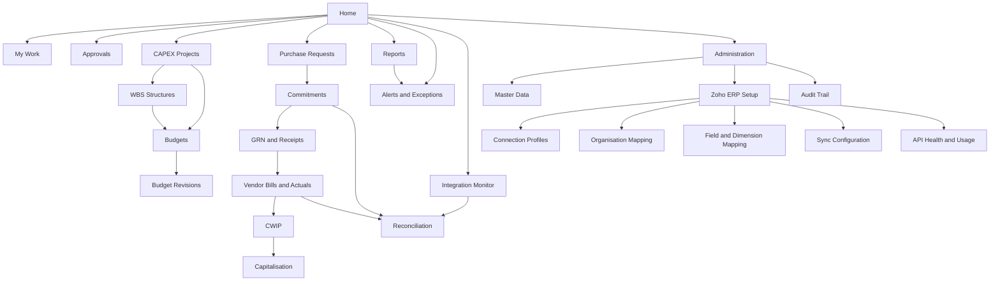

## 48. Screen Catalogue and Navigation Map

This section specifies all forty screens in `C8_screens.json`, each against the same twenty-four attributes, in screen-id order. Screens SCR-01 to SCR-14 are specified below; SCR-15 to SCR-40 continue in the same format without a repeated navigation map. Nothing here re-states the business arithmetic: the control formulas live in §22 Budget and Commitment Calculation Logic and the rules that bind fields live in §21 Detailed Business Rules. This section states what the user sees, what they may do, and what the system says back.

### Navigation Map

The application shell carries a single left-hand navigation tree of the twenty-six nodes registered in `C11_outline.json`. The tree is the only navigation structure; there is no second, competing menu. Nodes are containers, screens are leaves — a node is never itself a screen, so a click on a container expands it and lands the user on that container's default screen.

The edges from Purchase Requests through Commitments, GRN and Receipts, Vendor Bills and Actuals, CWIP and Capitalisation are the process chain of REQ-PRJ-005 and are also the drill-down path REQ-RPT-007 requires from a project down to its purchase request, purchase order, receipt and vendor bill. The edges into Reconciliation exist because a difference can be discovered from three directions — from a commitment, from an actual, or from an integration event.

#### Navigation node to screen index

| Node | Default screen | Other screens reachable | Roles that see the node |
|---|---|---|---|
| Home | SCR-01 Executive CAPEX Dashboard | — | All thirteen roles; tile set differs by role |
| My Work | SCR-02 Project Controller Workbench | — | Project Manager, Project Finance Controller, Plant Head, Department Head, Finance, Procurement |
| Approvals | SCR-03 My Approval Inbox | — | Plant Head, Department Head, Project Manager, Finance, Project Finance Controller, CAPEX Committee, CFO, Management Approver |
| CAPEX Projects | SCR-04 CAPEX Project List | SCR-05, SCR-20 | All except Requestor (list only for Read-only Management User) |
| WBS Structures | SCR-07 WBS Tree Table | SCR-06, SCR-08 | Project Manager, Project Finance Controller, Plant Head, Finance, Internal Auditor, Read-only Management User |
| Budgets | SCR-09 Budget Planning Grid | SCR-10, SCR-13 | Project Finance Controller, Finance, CFO, CAPEX Committee, Project Manager (read) |
| Budget Revisions | SCR-11 Budget Revision Request | SCR-12 | Project Manager, Project Finance Controller, Finance, CAPEX Committee, CFO |
| Purchase Requests | SCR-14 Purchase Request Control View | — | Requestor, Procurement, Project Manager, Department Head, Project Finance Controller |
| Commitments | SCR-15 Purchase Order Commitment View | SCR-23 | Procurement, Project Finance Controller, Finance, Project Manager |
| GRN and Receipts | SCR-16 GRN and Unbilled Receipt View | — | Procurement, Project Finance Controller, Finance |
| Vendor Bills and Actuals | SCR-17 Vendor Bill and Actual CWIP View | SCR-18 | Finance, Project Finance Controller |
| CWIP | SCR-19 CWIP Ledger | SCR-24 | Finance, Project Finance Controller, CFO, Internal Auditor |
| Capitalisation | SCR-21 Capitalisation Workbench | SCR-22 | Finance, Project Finance Controller, CFO |
| Reconciliation | SCR-27 Reconciliation Exception Queue | SCR-18 | Project Finance Controller, Finance, System Administrator, Internal Auditor |
| Reports | SCR-23 Open Commitment Ageing | SCR-24 | All; row-level scope applies |
| Alerts and Exceptions | SCR-25 Exception and Overrun Monitor | — | Project Finance Controller, Plant Head, Finance, CFO, Management Approver |
| Master Data | SCR-30 Master Data Configuration | SCR-29 | System Administrator, Finance |
| Integration Monitor | SCR-26 Integration Event Monitor | SCR-39 | System Administrator, Project Finance Controller (read) |
| Zoho ERP Setup | SCR-31 Zoho ERP Connection Setup Wizard | SCR-32, SCR-34 | System Administrator only |
| Connection Profiles | SCR-31 Zoho ERP Connection Setup Wizard | SCR-32 | System Administrator only |
| Organisation Mapping | SCR-33 Zoho Organisation Selection and Mapping | — | System Administrator only |
| Field and Dimension Mapping | SCR-35 Master Data Mapping Workbench | SCR-36 | System Administrator, Project Finance Controller |
| Sync Configuration | SCR-37 Sync Direction and Scheduling Configuration | — | System Administrator only |
| API Health and Usage | SCR-38 Integration Health and API Usage Dashboard | — | System Administrator, Project Finance Controller (read) |
| Audit Trail | SCR-28 Audit Trail Viewer | SCR-40 | Internal Auditor, System Administrator, CFO |
| Administration | SCR-29 Approval Matrix Configuration | SCR-30, SCR-40 | System Administrator |

Every one of the forty screens appears at least once in this index. Ten of them — SCR-31 to SCR-40 — sit under Administration and are `provenance=MASTER-PROMPT`; the client document's complete statement on integration mechanics is a single architecture line naming API, workflow and custom function (CONF-07). The three WBS nodes and screens SCR-06, SCR-07 and SCR-08 are likewise `provenance=MASTER-PROMPT`: the client document contains no work-breakdown hierarchy at all, and its budget structure is strictly project plus budget head (CONF-02).

### Screen Specification Conventions

These rules apply to every screen below and are not repeated inside each specification. A coding agent should treat them as the shell contract.

| Convention | Rule |
|---|---|
| Shell | Fixed shell bar (20px icons permitted here only), left navigation tree, page area with `spacing.page_padding` of 16px. Page background `neutral-50`, content surfaces `neutral-0`. |
| Density | `density.compact` is the default: 28px table rows, inputs and buttons. The density toggle lives in the shell bar and persists per user. Compact density is deliberate for a control application used by accountants and controllers. Density shrinking to raise information density is an established enterprise pattern for mouse-and-keyboard devices, where cosy is the usual component default [source: https://www.sap.com/design-system/fiori-design-web/v1-148/foundations/visual/cozy-compact — verified 2026-08-05] (SAP Fiori for Web design guidelines; a design-system reference, not a statement about any SAP product release). |
| Money | `typography.font_stack_numeric` with tabular numerals, right-aligned. Indian digit grouping, rupee symbol prefixed with no space, two decimals on transaction and detail screens, zero decimals on dashboard tiles, percentages to one decimal. Negatives in parentheses **and** in `financial.value-negative` — colour never carries the sign alone. Lakh and crore abbreviations are permitted only on dashboard tiles and chart axes. |
| Dates | `dd-MMM-yyyy` in the interface, ISO-8601 in every export, payload and audit record. Audit timestamps carry an explicit timezone label. |
| Status | Every status is rendered as a chip carrying an icon **and** the exact label from `C3_statuses.json`. Semantic colour maps: neutral to `neutral-500` on `neutral-100`, in-progress to `progress-600` on `progress-bg`, positive to `positive-600` on `positive-bg`, warning to `warning-600` on `warning-bg`, negative to `negative-600` on `negative-bg`. No status is ever indicated by colour alone. |
| Exposure bands | Utilisation is banded to `exposure-band-safe` below 80 percent, `exposure-band-watch` from 80 to 90 percent, `exposure-band-breach` above 90 percent or when exceeded. The band is always accompanied by the numeric percentage, so the band is decoration, not information. |
| Messages | Field-level validation sits beneath its field and moves focus there. Form-level errors appear as a summary at the top of the form, each entry a link to its field. Page-level conditions appear as a message strip below the page header. Toasts confirm completed actions only and are never used for anything the user must act on. Dialogs are reserved for destructive or irreversible actions and always state the consequence. Every message text comes from `C10_messages.json`. Signalling that a table holds rows with errors or warnings by a strip above the table is the established enterprise pattern [source: https://www.sap.com/design-system/fiori-design-web/v1-148/ui-elements/tree-table/usage — verified 2026-08-05]. |
| Filter bar | List screens carry a filter bar with saved views, a basic search, labelled filter inputs, a Go button and an adapt-filters entry; keyword search belongs in the filter bar and not in the table toolbar [source: https://www.sap.com/design-system/fiori-design-web/v1-136/ui-elements/filter-bar/usage — verified 2026-08-05] [source: https://www.sap.com/design-system/fiori-design-web/v1-148/ui-elements/filter-bar/usage — verified 2026-08-05]. When no filter is set, the collapsed header says so explicitly rather than showing an empty area [source: https://www.sap.com/design-system/fiori-design-web/v1-136/page-types/floorplans/list-report-floorplan-sap-fiori-element/usage — verified 2026-08-05]. |
| Table personalisation | Sorting, filtering and grouping in a view-settings dialog; column show, hide and reorder in a personalisation dialog; both opened from a settings control at the right of the table toolbar [source: https://www.sap.com/design-system/fiori-design-web/v1-148/foundations/best-practices/ui-elements/tables/overview-table-personalization — verified 2026-08-05]. |
| Keyboard | Every control is operable by keyboard; mouse, keyboard and touch are equal input channels [source: https://www.sap.com/design-system/fiori-design-web/v1-136/discover/sap-design-system/product-standards/accessibility-in-sap-fiori — verified 2026-08-05]. Column width responds to Shift plus arrow keys and column position to Ctrl plus arrow keys on a focused header [source: https://www.sap.com/design-system/fiori-design-web/v1-148/ui-elements/tree-table/usage — verified 2026-08-05]. |
| Contrast | Every pairing in `C6_tokens.json` meets WCAG 2.2 AA. Any new pairing must be measured before use. |
| Loading | No blocking busy dialog is used for page load. A skeleton placeholder matching the floorplan is shown, and busy state is set at control level so the rest of the page stays usable [source: https://www.sap.com/design-system/fiori-design-web/v1-148/foundations/best-practices/ui-elements/busy-handling — verified 2026-08-05] [source: https://www.sap.com/design-system/fiori-design-web/v1-148/ui-elements/placeholder-loading/usage — verified 2026-08-05]. |
| Empty state | Every empty state states what the area is for, why it is empty, and the next action [source: https://www.sap.com/design-system/fiori-design-web/v1-148/foundations/best-practices/global-patterns/designing-for-empty-states — verified 2026-08-05]. A filtered list with no matches uses MSG-GEN-002. Item counts disappear from a table title when the table is empty [source: https://www.sap.com/design-system/fiori-design-web/v1-148/ui-elements/tree-table/usage — verified 2026-08-05]. |
| Print | Every list and object page has a print and PDF view: white background, no shell chrome, repeated table headers, page numbers, and a footer carrying report name, filter criteria, generated-by and generated-at. |
| Export fidelity | Spreadsheet export takes stored values and does not inherit screen formatters, so every exported column must be configured to match its on-screen text, and large exports use the server-side exporter rather than the browser [source: https://www.sap.com/design-system/fiori-design-web/v1-148/ui-elements/export-to-spreadsheet/usage — verified 2026-08-05]. |
| Audit | Every screen that writes shows a Changed by and Changed at pair in its footer and links to SCR-28 Audit Trail Viewer filtered to that object. |
| Row scope | Row-level visibility is by organisation, plant and department. A user who can reach a screen still sees only rows within their scope; MSG-SEC-001 is raised when an out-of-scope object is addressed directly by URL. |

Field names quoted below are the physical names defined in §28 Data Model. Where a screen shows a value that is a snapshot of a ledger aggregate, the specification says so, because §27 Integration Reconciliation Design recomputes those snapshots nightly and a stale snapshot is a defect the user must be able to see.

#### SCR-01 — Executive CAPEX Dashboard

##### Screen purpose

A single page that answers one management question: across the capital portfolio, how much budget is approved, how much is already committed or spent, and how much is genuinely left. It carries REQ-RPT-001, REQ-RPT-002 and REQ-RPT-006, and it is the entry point to every drill-down REQ-RPT-007 requires. It is an overview page of cards, not a workbench: it never edits anything, and every number on it is a link into the screen that owns that number. A card-based overview is justified only when there are at least three cards of mixed type drawing on more than one data domain — below that a detail page is the correct answer [source: https://www.sap.com/design-system/fiori-design-web/v1-136/page-types/floorplans/overview-page/usage — verified 2026-08-05]; this page carries nine cards across five domains and clears that bar.

**Conflict to surface, never smooth over (CONF-03).** The client document's section 6 budget-head table and its section 12 dashboard row describe what appears to be the same project with mutually irreconcilable figures. The dashboard therefore renders from the application's own ledgers and never from a transcribed sample. Where the demonstration dataset is used, the two frozen dashboard rows are reproduced exactly as registered and are not recomputed.

##### Primary users

CFO, Management Approver, Read-only Management User, Plant Head. Project Finance Controller and Finance also land here but move immediately to SCR-02. Requestor and Procurement do not see this screen; their landing page is SCR-14.

##### Entry points

Application root after sign-in for the four primary roles. Node Home in the navigation tree. Deep link `/home?organisation={organisation_id}&period={yyyy-mm}`. Returned to by the browser back action from any drill-down, with filter state preserved.

##### Header fields

Dynamic page header, collapsible on scroll, carrying: Organisation (selector, default the user's home organisation), Plant (multi-select, default All), Department (multi-select, default All), As-at date (default today, `dd-MMM-yyyy`), Currency (display-only, from `organisation.currency_code`), and a Data as at stamp showing `control_snapshot_at` with its timezone label. The Data as at stamp is not decoration: it tells a CFO whether they are looking at figures computed before or after last night's reconciliation run.

##### Search and filter fields

Basic search over `project_code` and `project_name`. Filters: Plant, Department, Budget Head, Exposure band (Safe, Watch, Breach), Project workflow status, Project system status, Capitalisation due within (30, 60, 90 days). Saved views are shared or private, with an apply-automatically flag that is switched off for views whose selection is expensive to run [source: https://www.sap.com/design-system/fiori-design-web/v1-148/ui-elements/variant-management/usage — verified 2026-08-05].

##### Table columns

One table card, Portfolio by project, carrying the six columns REQ-RPT-002 names and nothing else:

| Column | Source | Format | Alignment |
|---|---|---|---|
| Project | `project.project_code` plus `project_name` | Code in `body-strong`, name in `body` beneath | Left |
| Current Budget | `project.current_approved_budget_amount` | Lakh or crore, 0 dp on the tile view, full grouping on hover and in export | Right, tabular |
| Open Commitment | `project.open_commitment_amount` | As above | Right, tabular |
| Actual CWIP | `project.actual_cwip_amount` | As above | Right, tabular |
| Available | `project.available_budget_amount` | As above; negative in parentheses and `value-negative` | Right, tabular |
| Utilisation / Exposure | `project.utilisation_pct` | 1 dp, with an extra-small bullet micro chart against the 100 percent track | Right, tabular |

Only extra-small bullet, comparison and stacked-bar micro charts are permitted inside dense table cells [source: https://www.sap.com/design-system/fiori-design-web/v1-148/ui-elements/micro-chart/usage — verified 2026-08-05], which is why the utilisation cell uses a bullet and not a gauge.

The two frozen dashboard rows in the demonstration dataset render as registered:

| Project | Current Budget | Open Commitment | Actual CWIP | Available | Utilisation / Exposure |
|---|---|---|---|---|---|
| Production Line | 1.50 Cr | 30L | 85L | 35L | 76.7% |
| Warehouse Expansion | 80L | 15L | 48L | 17L | 78.8% |

##### Form sections

None. This screen has no editable form. The nine cards are laid out in a three-column grid at desktop width, each card a self-contained unit with its own title, its own empty state and its own drill-down target:

1. **Portfolio totals** — four key figures: Current Approved Budget, Open PO Commitment, Actual CWIP, Available Budget.
2. **Exposure distribution** — count of projects in each of the three exposure bands.
3. **Portfolio by project** — the table above.
4. **Budget head consumption** — stacked bars of commitment and actual inside the approved-budget track, per budget head.
5. **Approvals waiting on me** — count by document type, linking to SCR-03.
6. **Threshold breaches** — projects and budget heads at or past 80 and 90 percent, linking to SCR-25.
7. **Open commitment ageing summary** — three age buckets, linking to SCR-23.
8. **Awaiting capitalisation** — projects at Awaiting Capitalisation with CWIP balance, linking to SCR-21.
9. **Integration health** — last successful sync per module and any Integration Failed count, linking to SCR-26.

Card 4 uses the token convention that budget is the reference track and commitment plus actual are stacked segments inside it, so exposure against budget is readable without reading numbers.

##### Tabs

No tabs. Card 3 offers an in-place view switch between Project, Plant, Department and Budget Head grouping, which preserves one page rather than fragmenting into tabs.

##### Actions

Refresh (recomputes snapshots for the visible scope and restamps Data as at), Export (see below), Print, Manage cards (show, hide, reorder, persisted per user), Set as my default view, Subscribe to threshold alerts (opens the alert-subscription dialog for REQ-ALT-001 to REQ-ALT-003). No create, edit or delete action exists on this screen.

##### Mass actions

None. Selecting rows in card 3 is single-select for navigation only. A dashboard that can mass-mutate objects is a control weakness, not a convenience.

##### Status indicators

Project workflow status and system status chips in card 3's expanded row; exposure band chip on the utilisation cell; Integration Failed and Reconciliation Pending badges on card 9. Statuses shown on this screen are drawn from Released, Partially Committed, Fully Committed, Partially Actualised, Fully Actualised, Budget Exceeded, Exception Pending, Technically Completed, Financially Completed, Awaiting Capitalisation, Capitalised, Closed, Reopened, Integration Failed and Reconciliation Pending.

##### Validations

Read-only screen; no input validation. Two data-integrity assertions run on load and are surfaced rather than hidden: (a) `control_snapshot_at` older than the configured freshness window raises the page-level warning strip described below; (b) any project where the snapshot totals disagree with a live recomputation is flagged with a Reconciliation Pending badge and linked to SCR-27.

##### Warning messages

- MSG-BUD-002 as a page-level strip listing every project or budget head that has crossed 80 percent, with the counts folded into one strip rather than one strip per object.
- MSG-BUD-003 for the 90 percent crossings, ranked above the 80 percent strip.
- MSG-CAP-001 as an inline warning inside card 8 for any project shown as Awaiting Capitalisation that still carries open commitment or received-but-unbilled value.
- MSG-INT-003 inside card 9 when a rate-limit response has paused a sync feeding these figures.

##### Error messages

- MSG-INT-002 as a page-level error strip when the connection feeding the actuals cannot refresh its token, because every figure on the page is then stale by an unknown amount.
- MSG-SEC-001 when a deep link addresses an organisation outside the user's scope.
- MSG-INT-006 is surfaced here only as a badge; its full text is shown on SCR-27.

##### Drill-down links

Project code to SCR-05. Current Budget to SCR-09. Open Commitment to SCR-15 filtered to the project. Actual CWIP to SCR-17 filtered to the project. Available and Utilisation to SCR-13 pre-loaded with the project. Card 5 to SCR-03. Card 6 to SCR-25. Card 7 to SCR-23. Card 8 to SCR-21. Card 9 to SCR-26. Every drill-down carries the current Plant, Department and As-at filters forward so the receiving screen shows the same population.

##### Attachments

None. The dashboard holds no documents. Attachments live on the objects, reachable through the drill-downs.

##### Comments

None on the dashboard itself. Comment counts appear as a badge on card 3 rows where the project carries unresolved comments, linking to the Comments tab of SCR-05.

##### Audit information

Read-only screens are not audited for content, but access is: each load writes an `audit_log` entry of type `VIEW` carrying user, role, organisation, filter state and timestamp, because REQ-SEC-001 requires an unbroken trail and management viewing of budget positions is an auditable event in a capital-control system. The footer shows Data as at with timezone and a link to SCR-28 filtered to dashboard access events.

##### Permission requirements

Visible to CFO, Management Approver, Read-only Management User, Plant Head, Project Finance Controller, Finance, Project Manager, Department Head, CAPEX Committee, Internal Auditor and System Administrator. Requestor and Procurement do not see it. Read-only Management User and Internal Auditor cannot use Refresh, Subscribe to threshold alerts or Manage cards. Row scope applies for every role except CFO, Internal Auditor and System Administrator, who see all organisations.

##### Empty state

No projects in scope: an illustrated empty state reading that no capital projects exist for the selected organisation and plant, with a Create CAPEX project action for Project Manager and Project Finance Controller and a Change filters action for everyone else. Filtered to nothing: MSG-GEN-002 with `{object_type}` = projects and `{primary_filter}` = Plant. Individual cards carry their own empty states — card 5 reads that nothing is waiting on this user rather than showing a zero.

##### Loading state

Skeleton grid of nine card placeholders rendered immediately; each card resolves independently so a slow integration-health query never blocks the portfolio table. Cards that exceed the two-second budget show an inline busy indicator inside their own boundary. No modal busy dialog.

##### Failure state

Per-card failure, never whole-page failure. A card that cannot load shows an inline error region stating which figures are unavailable, the time of the last successful value, and a Retry action. If the actuals feed is down, cards 1, 3 and 4 display the last successful snapshot with an explicit stale-data strip rather than showing nothing, because a controller reading a blank page will assume zero. If the user's session has expired, MSG-SEC-002 is shown before the page is discarded.

##### Mobile or tablet behaviour

Tablet at 768px and above: cards reflow to two columns; card 3 keeps all six columns; the header collapses to a filter summary line. Phone below 768px: cards stack to one column and card 3 switches to a card list showing Project, Available and Utilisation only, with the remaining three figures revealed on expand. Key-figure tiles are not naturally responsive and constrain layouts below desktop width [source: https://www.sap.com/design-system/fiori-design-web/v1-136/page-types/floorplans/analytical-list-page/usage — verified 2026-08-05], which is why the phone layout substitutes a list rather than shrinking the tiles.

##### Export and print behaviour

Export offers Spreadsheet (card 3 with full grouped figures, never lakh or crore abbreviations, and ISO-8601 dates) and PDF (the whole dashboard as rendered, including charts, at A3 landscape). Print uses the PDF renderer. Both carry the standard footer: report name, filter criteria including As-at date, generated-by and generated-at in the organisation timezone. Export is offered from a split menu on the card toolbar with an Export As dialog [source: https://www.sap.com/design-system/fiori-design-web/v1-148/ui-elements/export-to-spreadsheet/usage — verified 2026-08-05]. Card 3 exports at most the visible scope; a portfolio-wide extract is a report request handled in §34 Reporting and Dashboard Catalogue.

#### SCR-02 — Project Controller Workbench

##### Screen purpose

The daily working screen of the Project Finance Controller: one page that combines a filterable population of projects and WBS elements, the control figures for each, and the transactional actions the controller may take without leaving the page. It exists because the controller's job is stepwise — narrow the population, find the cause, act — and splitting that across three screens costs a working day a week. A page that combines stepwise analysis, root-cause drill-down and transactional action in one place is a recognised enterprise floorplan [source: https://www.sap.com/design-system/fiori-design-web/v1-136/page-types/floorplans/analytical-list-page/usage — verified 2026-08-05].

##### Primary users

Project Finance Controller (owner), Project Manager, Plant Head, Finance. Department Head has a read-only variant scoped to their department.

##### Entry points

Node My Work. Card 3 of SCR-01 when the user's role is Project Finance Controller or Project Manager. Alert emails for REQ-ALT-001 to REQ-ALT-007 deep-link here with the matching filter pre-applied. Deep link `/my-work?view={view_id}&project={project_code}`.

##### Header fields

Collapsible header carrying: a visual filter strip of three charts — exposure by budget head, commitment ageing by bucket, actual CWIP by month — and, on the alternate setting, a conventional field filter bar. The header offers an explicit switch between the chart-based and field-based filter presentations [source: https://www.sap.com/design-system/fiori-design-web/v1-136/page-types/floorplans/analytical-list-page/usage — verified 2026-08-05]. Also in the header: Organisation, Plant, Department, Controller (default the signed-in user), Period, and a Data as at stamp.

##### Search and filter fields

Basic search over `project_code`, `project_name`, `wbs_code`, `wbs_name`, `pr_number` and `purchaseorder_number`. Filters: Project, WBS element, Budget Head, Exposure band, Utilisation greater than (numeric), Available less than (amount), Workflow status, System status, Open commitment older than (days), Received not billed older than (days), Has open exception (yes or no), Reconciliation Pending (yes or no). Selected values and any range or exclusion conditions render as tokens, with inclusion and exclusion distinguished by operator rather than by colour [source: https://www.sap.com/design-system/fiori-design-web/v1-148/ui-elements/value-help-dialog/usage — verified 2026-08-05].

##### Table columns

| # | Column | Source | Format |
|---|---|---|---|
| 1 | Project | `project.project_code` | Left, link |
| 2 | WBS Element | `wbs_element.wbs_code` | Left, link, indented by `level_no` |
| 3 | Budget Head | `budget_head.budget_head_code` | Left |
| 4 | Current Approved Budget | `current_approved_amount` | Right, tabular, 2 dp |
| 5 | Open PO Commitment | `open_commitment_amount` | Right, tabular, 2 dp |
| 6 | Received Not Billed | `received_not_billed_amount` | Right, tabular, 2 dp |
| 7 | Actual CWIP | `actual_cwip_amount` | Right, tabular, 2 dp |
| 8 | Exposure | `exposure_amount` | Right, tabular, 2 dp |
| 9 | Available Budget | `available_budget_amount` | Right, tabular, 2 dp, parentheses when negative |
| 10 | Utilisation % | `utilisation_pct` | Right, tabular, 1 dp, banded |
| 11 | Other Assigned Value | `other_assigned_value_amount` | Right, tabular, 2 dp |
| 12 | Open PRs | count | Right |
| 13 | Open POs | count | Right |
| 14 | Oldest Open Commitment | days | Right |
| 15 | Workflow Status | chip | Left |
| 16 | System Status | chip | Left |
| 17 | Last Sync | timestamp | Left |

Columns 6 and 11 are the two anti-under-count columns and are not optional. Column 6 exists because commitment must only be relieved by the event that also creates actual cost, with a visible received-but-billed-not-yet bucket so nothing falls between the two gates. Column 11 exists because the client formula resembles the narrower of two non-equivalent definitions of assigned value, and building availability control on it alone would systematically understate consumption; the additional components are therefore reported on a separate, explicit line rather than being silently absorbed. Both rulings are registered in `C5_formulas.json` and are restated in §22 Budget and Commitment Calculation Logic.

With seventeen columns the table sits below the twenty-column threshold at which a heavyweight personalisation dialog becomes necessary, so the view-settings plus table-personalisation pair is the correct control pairing [source: https://www.sap.com/design-system/fiori-design-web/v1-148/foundations/best-practices/ui-elements/tables/overview-table-personalization — verified 2026-08-05]. Grouping with subtotals and a grand total is required, which is the selection criterion for an analytical table rather than a responsive one [source: https://www.sap.com/design-system/fiori-design-web/v1-148/foundations/best-practices/ui-elements/tables/table-overview — verified 2026-08-05].

##### Form sections

No persistent form. Three action dialogs open from the table: Raise budget revision (hands off to SCR-11 with context), Run availability check (opens SCR-13 in a modal with the row pre-loaded), and Add controller note (a comment against the project or WBS element with a mandatory 10-character minimum).

##### Tabs

Four content tabs beneath the filter header: **Control positions** (the table above), **Exceptions** (rows currently at Budget Exceeded or Exception Pending), **Ageing** (open commitment and received-not-billed buckets at 0-30, 31-60, 61-90 and over 90 days), **Reconciliation** (rows at Reconciliation Pending with our value, Zoho's value and the difference). Tab labels carry counts; a count of zero is shown as an empty tab with its own empty state, not hidden, so the controller can trust that zero means zero.

##### Actions

Run availability check, Raise budget revision, Raise budget transfer, Open project, Open WBS element, Add controller note, Assign follow-up (sets an owner and a due date on an exception row), Mark reviewed (stamps `reviewed_by` and `reviewed_at` on the control snapshot), Refresh snapshots, Manage view, Export, Print.

##### Mass actions

Multi-select with a select-all that includes rows not yet loaded into the browser, because a controller who selects all and gets only the first page has been misled [source: https://www.sap.com/design-system/fiori-design-web/v1-148/ui-elements/tree-table/usage — verified 2026-08-05]. Permitted mass actions: Mark reviewed, Assign follow-up, Export selected, Subscribe to alerts for selected. Mass raise of budget revisions is deliberately **not** offered — each revision requires its own justification under REQ-REV-003 and REQ-SEC-004, and a bulk path would produce a set of revisions sharing one reason. Range selection in dense tables is capped at a configurable default of 200 items [source: https://www.sap.com/design-system/fiori-design-web/v1-148/ui-elements/grid-table/usage — verified 2026-08-05]; this application sets the cap at 200 and states it in the selection tooltip. Mass action outcomes follow the fixed pattern: a toast when every item succeeded, and an in-dialog result list when some or none did [source: https://www.sap.com/design-system/fiori-design-web/v1-136/foundations/best-practices/global-patterns/messaging/processing-multiple-items — verified 2026-08-05].

##### Status indicators

Chips for Draft, Submitted, Under Review, Approved, Rejected, Returned, Released, Partially Committed, Fully Committed, Partially Actualised, Fully Actualised, Budget Exceeded, Exception Pending, Technically Completed, Financially Completed, Awaiting Capitalisation, Capitalised, Closed, Reopened, Integration Failed and Reconciliation Pending. Exposure band on column 10. A stale-snapshot marker on column 17 when `control_snapshot_at` is older than the freshness window.

##### Validations

Add controller note requires at least 10 characters. Assign follow-up requires an owner within the row's plant scope and a due date not in the past. Mark reviewed is rejected when the row is at Reconciliation Pending, because reviewing a figure known to disagree with its source is a control failure; the rejection message names the difference and links to SCR-27.

##### Warning messages

MSG-BUD-002 and MSG-BUD-003 as strips above the table, updated as the filter changes. MSG-PRC-005 in the Ageing tab for each WBS element carrying received-but-unbilled value, quoting the amount and the age of the oldest item. MSG-INT-006 in the Reconciliation tab. MSG-SEC-003 when a controller uses Mark reviewed on a row that carries an open exception, since that is an override of a control and a reason becomes mandatory.

##### Error messages

MSG-BUD-001 when Run availability check fails against the selected row. MSG-SEC-001 when an action exceeds the user's role. MSG-INT-002 as a page-level strip when actuals cannot be refreshed. Failures inside a mass action are listed per item in the result dialog with the object identifier, not summarised as a count.

##### Drill-down links

Project to SCR-05, WBS element to SCR-08, Budget Head to SCR-09 filtered, Open PO Commitment to SCR-15, Received Not Billed to SCR-16, Actual CWIP to SCR-17, Available to SCR-13, Open PRs to SCR-14, exception rows to SCR-25, reconciliation rows to SCR-27, Last Sync to SCR-26.

##### Attachments

Not held on this screen. The Add controller note dialog permits one attachment of up to 10 MB, stored against the `attachment` entity with the project or WBS element as owner and surfaced on SCR-05 and SCR-08.

##### Comments

Controller notes are `comment` records against a project or WBS element. They appear inline as an expandable row region showing the latest three, newest first, with author, role and timestamp. They are visible to every role that can see the row and are never deletable — a note may be superseded by another note, which is what an audit trail requires.

##### Audit information

Every Mark reviewed, Assign follow-up, controller note and mass action writes an `audit_log` entry with user, role, action, object, before and after values where applicable, and reason where one was required. Footer shows the signed-in user's last visit to this screen and links to SCR-28 filtered to the current population.

##### Permission requirements

Project Finance Controller: full. Project Manager: full within owned projects, no Mark reviewed. Plant Head: read plus Assign follow-up within plant. Finance: full except Raise budget transfer. Department Head: read-only within department. Internal Auditor and Read-only Management User: read-only, all actions hidden rather than disabled, except Export and Print. CFO: read-only across organisations. System Administrator: no functional access to control figures; the node is hidden.

##### Empty state

Nothing in scope: an illustrated state explaining that no project or WBS element matches the controller's scope and offering Change filters and Request access. Filtered to nothing: MSG-GEN-002 with `{object_type}` = control positions and `{primary_filter}` = Project. Each tab has its own: the Exceptions tab reads that no project or budget head is currently over budget or awaiting exception approval, which is a positive statement and not an error.

##### Loading state

Skeleton filter strip and skeleton table rows. The three header charts and the table load in parallel; the table is usable before the charts resolve. Grouping and subtotal computation happens server-side, so expanding a group triggers a scoped request with an inline busy state on that group only.

##### Failure state

If the control-position query fails, the table area shows an error region with the failing scope, the correlation identifier from §25 API and Event Architecture, a Retry action and a Reduce scope action that halves the date range. If only the ageing query fails, only that tab shows the failure. A failure never clears the filter state.

##### Mobile or tablet behaviour

Desktop-first. Tablet at 1024px and above is supported with columns 11, 13 and 17 hidden by default. Below 1024px the analytical table is replaced by a stacked card list showing Project, WBS Element, Available and Utilisation, with the full figure set on expand, because desktop-centric tables are not fully responsive and are unsupported at phone sizes [source: https://www.sap.com/design-system/fiori-design-web/v1-148/foundations/best-practices/ui-elements/tables/table-overview — verified 2026-08-05]. Mass actions are unavailable below 1024px.

##### Export and print behaviour

Spreadsheet export of the current tab with the current grouping, subtotals and grand total preserved as spreadsheet groups, full Indian grouping, two decimals, ISO-8601 dates, and one header row per group level. PDF export at A3 landscape with repeated headers. Both carry the standard footer plus the applied filter tokens rendered as text. Exports above 20,000 rows are queued server-side and delivered as a download notification, because browser-side export is bounded by available memory [source: https://www.sap.com/design-system/fiori-design-web/v1-148/ui-elements/export-to-spreadsheet/usage — verified 2026-08-05].

#### SCR-03 — My Approval Inbox

##### Screen purpose

One queue for every decision a user owes, across every document type that carries an approval: budget version, budget revision, budget transfer, purchase request, exception or overrun request, capitalisation request and controlled reopening. It carries REQ-PRC-002, REQ-REV-004, REQ-BUD-018, REQ-SEC-004 and REQ-CAP-002. The population is predefined — it is whatever is assigned to this user — so no filter bar is needed to reach it, which is the selection criterion for a worklist rather than a list report [source: https://www.sap.com/design-system/fiori-design-web/v1-136/page-types/floorplans/when-to-use-which-floorplan — verified 2026-08-05].

##### Primary users

Plant Head, Department Head, Project Manager, Finance, Project Finance Controller, CAPEX Committee, CFO, Management Approver. Requestor sees a personal variant listing only their own submissions and their current step.

##### Entry points

Node Approvals. Card 5 of SCR-01. Notification bell in the shell bar. Email and Zoho Cliq notification deep links of the form `/approvals/{document_type}/{document_id}?step={step_no}`. Submitting a document from SCR-11, SCR-12, SCR-14 or SCR-21 returns the submitter here with a confirmation toast.

##### Header fields

Approver (display-only, the signed-in user, with a Delegated from marker when acting under delegation), Queue scope (My steps, My role pool, Delegated to me, Everything I can see — the last visible only to System Administrator and Internal Auditor), Sort (Oldest first as default, Highest value, Nearest SLA), and a count-by-type summary line.

##### Search and filter fields

Basic search over document number, project code, WBS code and requestor name. Filters: Document type, Project, Plant, Budget Head, Value greater than, Route (Normal or Exception), SLA state (Within, Due today, Overdue), Requested date range. Predefined views: All open, Exception route only, Overdue, Over one crore, Awaiting my role pool.

##### Table columns

| # | Column | Source | Notes |
|---|---|---|---|
| 1 | Document | type plus number | Icon per type, link |
| 2 | Subject | project code, WBS code, budget head | Three lines in compact density |
| 3 | Requested by | `approval_instance` requestor | With role |
| 4 | Requested on | `requested_at` | `dd-MMM-yyyy` |
| 5 | Value | document amount | Right, tabular, 2 dp |
| 6 | Available at raise | `available_budget_at_raise` | Right, tabular; the figure the system saw |
| 7 | Shortfall | `shortfall_amount` | Right, tabular, parentheses, only populated on the exception route |
| 8 | Route | Normal or Exception | Chip |
| 9 | Step | `step_no` of total | e.g. 2 of 3 |
| 10 | SLA due | `sla_due_at` | Countdown, warning colour past due |
| 11 | Status | chip | Submitted, Under Review, Exception Pending |

Column 6 is not cosmetic. An approver must be able to see the availability figure that existed when the step was raised, because budget moves between raising and deciding, and an approval defended after the fact needs the figure the system presented at the time.

##### Form sections

A decision panel opens as a side content area, not a new page, so the queue stays visible. It carries four sections: **Document summary** (read-only, the fields that matter for the decision), **Budget position** (Current Approved Budget, Open PO Commitment, Received Not Billed, Actual CWIP, Exposure, Available, Utilisation, recomputed live and compared with the at-raise snapshot, with any movement shown as a delta), **Approval history** (every prior cycle and step, with decision, decider, timestamp and comment), and **Decision** (Approve, Reject, Return, Request information; a comment field that is mandatory for Reject and Return; and, on the exception route, a mandatory override reason).

##### Tabs

Three: **Open** (default), **Decided by me** (last 90 days, read-only), **Delegations** (delegations granted to and by this user, with validity dates). No tab for rejected items separately — a rejected item appears in Decided by me with its decision.

##### Actions

Approve, Reject, Return for correction, Request information (adds a comment and leaves the step open), Open source document, Run availability check (opens SCR-13 in a modal at the current instant), Delegate (System Administrator or the approver themselves within their own role), Print decision sheet, Export.

##### Mass actions

Mass Approve and mass Return are permitted **only** for documents on the Normal route whose value is below the mass-approval ceiling configured per role in SCR-29, and only when every selected row's live availability still passes. Any selected row on the Exception route is excluded from the selection with an explanatory row-level message; a bulk approval of budget overruns would defeat REQ-BUD-018. Mass Reject is not offered at all, because each rejection requires its own reason under REQ-SEC-004. Mass results follow the toast-on-full-success, dialog-on-partial-success pattern.

##### Status indicators

Submitted, Under Review, Approved, Rejected, Returned, Exception Pending. Under Review is set the moment the approver opens the decision panel, which is what the status means, and is visible to the requestor. SLA chips: Within, Due today, Overdue.

##### Validations

Decision comment mandatory for Reject and Return, minimum 10 characters. Override reason mandatory on every Exception route approval. An approver cannot decide their own submission — the row is present but the decision controls are disabled with the reason stated. An approval whose live availability check now fails, having passed at raise, cannot be approved on the Normal route; the system re-routes it to Exception Pending and tells the approver why. Concurrency: if another approver has already decided the step, the panel closes with an information message naming the decider and the decision.

##### Warning messages

MSG-BUD-002 and MSG-BUD-003 inside the Budget position section when this approval would take the object past 80 or 90 percent. MSG-SEC-003 when the approver proceeds on the exception route, stating that a reason is mandatory and will be stored with their name and the current time. MSG-PRC-001 when the document under review is a purchase order amendment. MSG-SEC-002 when the session is close to expiry with a decision panel open and unsaved.

##### Error messages

MSG-BUD-001 when the live check fails, quoting document type, value, available budget, WBS code, budget head and shortfall, and offering the two next actions the message names. MSG-PRC-006 when the subject project is Closed or Capitalised. MSG-SEC-001 when the user's role does not carry the decision. MSG-BUD-004 when the document reaching the queue lacks a budget head — such a document should never have been submitted, so the message is accompanied by a Return for correction pre-selected.

##### Drill-down links

Document number to its own screen (SCR-11, SCR-12, SCR-14, SCR-21 or SCR-05 for reopening). Project code to SCR-05. WBS code to SCR-08. Budget head to SCR-09. Available at raise to SCR-13 pre-loaded with the at-raise parameters. Approval history entries to SCR-28 filtered to that document.

##### Attachments

The decision panel lists the source document's attachments read-only, with preview for PDF and image types. An approver may attach one supporting document of up to 10 MB to their decision — a signed committee minute, for example — which becomes an `attachment` against the `approval_instance` and is immutable once the decision is recorded.

##### Comments

The decision comment is stored on `approval_instance.decision_comment` and is also written as a `comment` against the source document so the requestor sees it in context. Request information writes a comment without a decision and notifies the requestor. Comments cannot be edited or deleted after submission.

##### Audit information

Every decision writes an `audit_log` entry carrying user, role, delegation chain if any, document, cycle, step, decision, comment, override reason, the availability figures at raise and at decision, and the timestamp with timezone. This is the spine of REQ-SEC-001. The panel footer shows the audit reference generated for the decision and links to SCR-28.

##### Permission requirements

Visible to Plant Head, Department Head, Project Manager, Finance, Project Finance Controller, CAPEX Committee, CFO and Management Approver. Requestor sees the personal variant. Internal Auditor sees all queues read-only with no decision controls. System Administrator sees queue metadata and delegations but not the decision controls, so that platform administration cannot approve spending. Read-only Management User and Procurement do not see the node.

##### Empty state

Nothing waiting: an illustrated state reading that no approval is waiting on this user, with the count of items decided in the last seven days as reassurance that the queue is connected and working. Filtered to nothing: MSG-GEN-002 with `{object_type}` = approvals and `{primary_filter}` = Document type.

##### Loading state

Skeleton rows for the queue; the decision panel loads its budget position independently and shows an inline busy state in that section only, because the approver can read the document summary while the live figures resolve.

##### Failure state

If the live availability recomputation fails, the decision panel shows the at-raise figures with an explicit strip stating that live figures could not be retrieved, and the Approve control is disabled while Reject and Return stay enabled. Approving without a live check is not offered under any circumstance. If the queue query fails, the page shows a retry region and preserves the selected tab.

##### Mobile or tablet behaviour

This screen is fully supported on tablet and phone, because approvals are the one workflow that genuinely happens away from a desk. Below 768px the queue becomes a card list showing Document, Subject, Value and Shortfall; the decision panel becomes a full-screen sheet; mass actions are hidden; the budget position section shows six figures in a two-column layout. The decision controls sit in a footer toolbar that stays pinned and never scrolls away, which is exactly the case a floating footer exists for [source: https://www.sap.com/design-system/fiori-design-web/v1-136/ui-elements/footer-toolbar/usage — verified 2026-08-05].

##### Export and print behaviour

Export of the Open or Decided by me tab to spreadsheet with all eleven columns, ISO-8601 timestamps and the decision comment as a full text column. Print decision sheet produces a one-page PDF per selected item carrying document identity, budget position at raise and at decision, approval history, decision, reason and audit reference — the artefact an internal auditor asks for. Printing is available to Internal Auditor for any decided item.

<!-- CONTINUE -->
